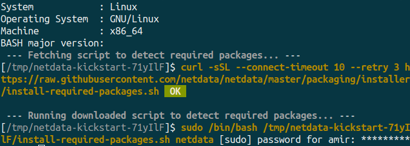
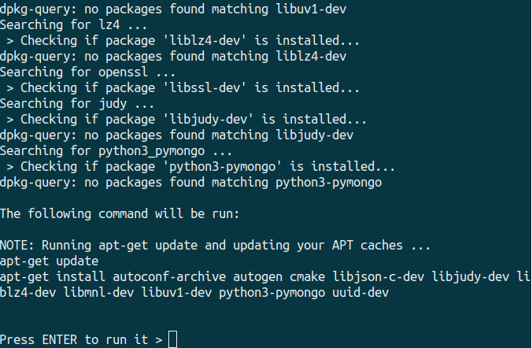
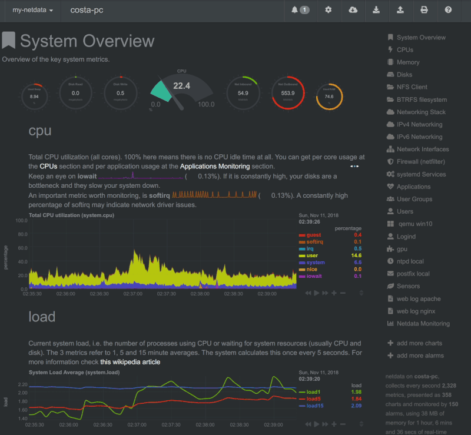

## Introduction

In this tutorial, we're going to install Netdata and learn how to prevent public access to its web interface since Netdata doesn't provide authentication by itself.

Netdata is a distributed, real-time performance and health monitoring tool for systems and applications. It is a highly-optimized monitoring agent that can be installed on Linux servers.

**Prerequisites**

* A fresh CentOS or Ubuntu installation (almost all mainstream distributions are supported though)
* Root access to the server

## Step 1 - Install and configure Netdata

### Step 1.1 - Installation

In order to install the latest version of Netdata, you can use a bash script provided by Netdata.

> There are alternative methods of installation which you can check out on [the Netdata website](https://learn.netdata.cloud/docs/agent/packaging/installer/#alternative-methods).

Simply run the following in your terminal:

```bash
bash <(curl -Ss https://my-netdata.io/kickstart.sh)
```



You should see something like the picture above. It'll ask you for your sudo password if you're not running the script as root.

After providing the sudo password, it'll let you know what necessary dependencies are missing so you can install them by pressing ENTER.



Once done, Netdata is automatically started and enabled on systemd. Check the status via systemctl:

```bash
systemctl status netdata
```

You can now access Netdata web interface via `<your_host>:19999`

### Step 1.2 - Configuration

Now we need to make sure Netdata only listens on `127.0.0.1` since we don't want the web interface to be accessible on the internet.

Open the `/etc/netdata/netdata.conf` file with an editor of your choice.

```bash
sudo nano /etc/netdata/netdata.conf
```

Find the `[web]` section and uncomment the `bind to` setting and replace it with the following:

```
bind to = 127.0.0.1
```

## Step 2 - Install and configure NGINX

In this step, we will install NGINX to set up a reverse proxy so we're able to access the Netdata web interface securely.

### Step 2.1 - Installation

You can install NGINX and apache2-utils by running the following commands:
(apache2-utils is needed for the second part of this step)

Debian/Ubuntu:

```bash
sudo apt install nginx apache2-utils
```

Redhat/CentOS/Fedora:

```bash
sudo yum install nginx apache2-utils
```

Your NGINX setup should be good to go.

### Step 2.2 - Setup Authentication

Run this command to create a username-password pair:

```bash
sudo htpasswd -c /etc/nginx/.htpasswd user1
```

Press Enter and type the password for user1 at the prompts.

Confirm that the username-password pair has been created by running:

```bash
cat /etc/nginx/.htpasswd
```

### Step 2.3 - Configuration

Open your NGINX configuration file (`nginx.conf`) and find the `http` block. (Your `nginx.conf` file usually is located in `/usr/local/nginx/conf`, `/etc/nginx`, or `/usr/local/etc/nginx`)

Add the following lines into your `http` block:

```
upstream backend {
   server 127.0.0.1:19999;
   keepalive 64;
}

server {
   listen <10.0.0.1>:80;
   server_name <example.com>;

   auth_basic "Protected";
   auth_basic_user_file /etc/nginx/.htpasswd;

   location / {
     proxy_set_header X-Forwarded-Host $host;
     proxy_set_header X-Forwarded-Server $host;
     proxy_set_header X-Forwarded-For $proxy_add_x_forwarded_for;
     proxy_pass http://backend;
     proxy_http_version 1.1;
     proxy_pass_request_headers on;
     proxy_set_header Connection "keep-alive";
     proxy_store off;
   }
}
```

* Replace `<10.0.0.1>` with your public IP Address.
* Replace `<example.com>` with your own domain.

Save the configuration file and close it. Then verify the configuration to check if everything is OK.

```bash
sudo nginx -t
```

Go ahead and reload NGINX if there was no error:

```bash
sudo systemctl reload nginx
```

Open your browser and navigate to `<10.0.0.1>` or `<example.com>`. Use your username-password pair to access the web interface.



## Conclusion

In this tutorial we installed Netdata and used NGINX to set up a reverse proxy so we're able to prevent public access to the Netdata web interface.

##### License: MIT

<!--

Contributor's Certificate of Origin

By making a contribution to this project, I certify that:

(a) The contribution was created in whole or in part by me and I have
    the right to submit it under the license indicated in the file; or

(b) The contribution is based upon previous work that, to the best of my
    knowledge, is covered under an appropriate license and I have the
    right under that license to submit that work with modifications,
    whether created in whole or in part by me, under the same license
    (unless I am permitted to submit under a different license), as
    indicated in the file; or

(c) The contribution was provided directly to me by some other person
    who certified (a), (b) or (c) and I have not modified it.

(d) I understand and agree that this project and the contribution are
    public and that a record of the contribution (including all personal
    information I submit with it, including my sign-off) is maintained
    indefinitely and may be redistributed consistent with this project
    or the license(s) involved.

Signed-off-by: [Amir Keshavarz amirkekh@gmail.com]

-->
