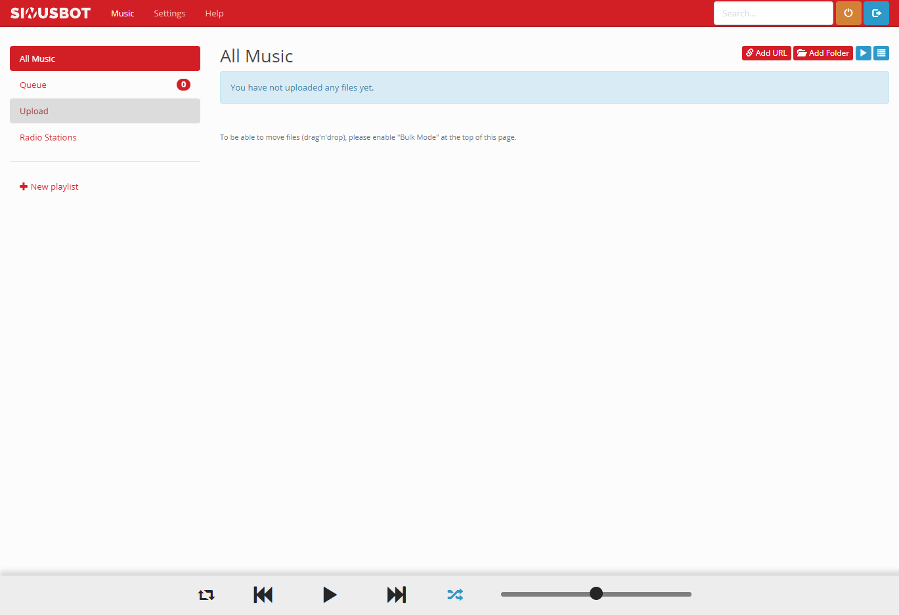
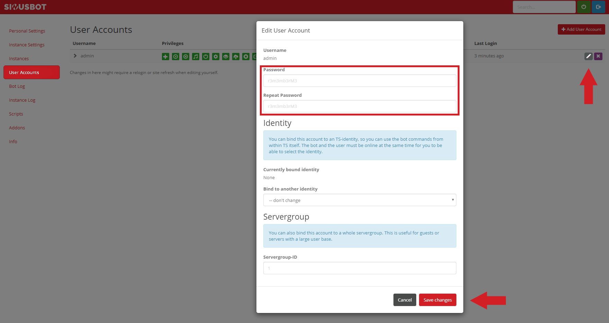
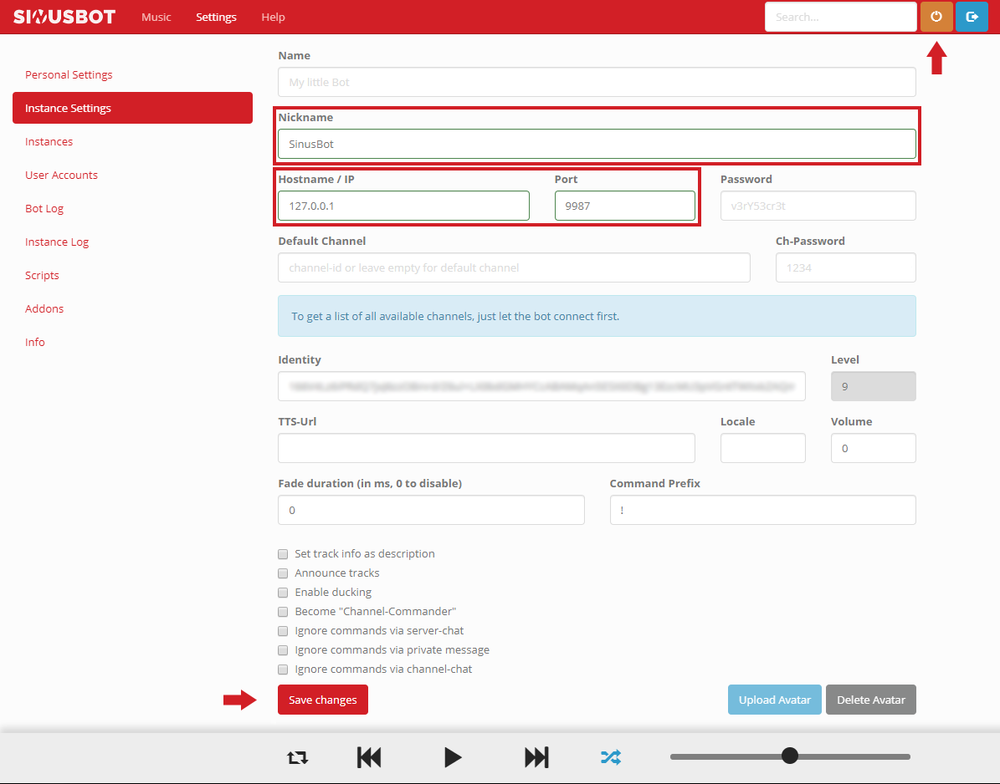
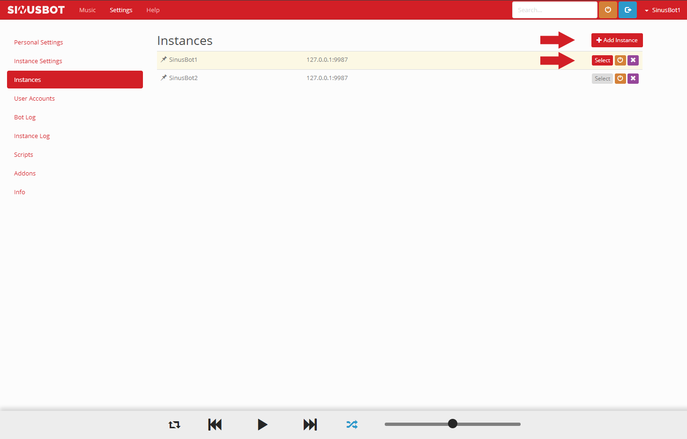

## Einleitung

In diesem Beitrag geht es um die Installation und Konfiguration eines SinusBot Programm mit zwei Instanzen, pro Instanz kann man ein SinusBot nutzen. Es ist außerdem möglich beliebig viele SinusBot Programme parallel zu betreiben, um mehrere SinusBots zu nutzen.

SinusBot ist ein Programm, das es dir ermöglicht deine Lieblings Musik zusammen mit deinen Freunden auf Teamspeak zu hören.

**Voraussetzung**

+ Ein 64-Bit kompatibles OS
+ Ubuntu 14.04+/ Debian 8+
+ Ein CX11 Hetzner CloudServer oder besser
+ Teamspeak

## Step 1 - Vorbereitungen

Bevor wir loslegen sollte dein CloudServer aktualisiert werden.

```bash
apt-get update && apt-get -y upgrade
```

SinusBot benötigt verschiedene Abhängigkeiten die dringend Installiert werden müssen!

```bash
apt-get install -y x11vnc xvfb libxcursor1 ca-certificates bzip2 libnss3 libegl1-mesa x11-xkb-utils libasound2 libglib2.0-0 libgl1 libnspr4 libfontconfig1 libxi6 libxcursor1 libxcomposite1 libasound2 libxtst6
```

Aktualisieren der Zertifikate durch `ca-certificates`.

```bash
update-ca-certificates
```

Für die Installation muss ein Benutzer `sinusbot` erstellt werden.

```bash
useradd -m -s /bin/false sinusbot
```

Nun muss das Installationsverzeichnis erstellt werden.

```bash
mkdir /opt/sinusbot && chown -R sinusbot:sinusbot /opt/sinusbot
```

## Step 2 - Installation

Für die Installation müssen wir zum erstellten `sinusbot` Benutzer wechseln.

```bash
su --shell /bin/bash sinusbot
```

Ins `sinusbot` Installationsverzeichnis wechseln.

```bash
cd /opt/sinusbot
```

Nun benötigen wir die neuste SinusBot Version die wir direkt Entpacken.

```bash
curl https://www.sinusbot.com/dl/sinusbot.current.tar.bz2 | tar xjf -
```

Damit SinusBot funktioniert muss im Installationsverzeichnis ein Teamspeak Client installiert und die Rechte angepasst werden.

```bash
wget http://dl.4players.de/ts/releases/3.2.3/TeamSpeak3-Client-linux_amd64-3.2.3.run && chmod 0755 TeamSpeak3-Client-linux_amd64-3.2.3.run
```

Jetzt muss der Teamspeak Client Entpackt werden.

```bash
./TeamSpeak3-Client-linux_amd64-3.2.3.run
```

Im Entpackprozess nacheinander `Enter` + `q` + `y` + `Enter` drücken!

## Step 3 - Konfiguration

Nach dem Teamspeak Entpackt wurde. Muss nun die `config.ini.dist` kopiert und Bearbeitet werden.

```bash
cp config.ini.dist config.ini && nano config.ini
```

In der `config.ini` muss folgendes Ersetzt werden:
`TS3Path = "/opt/ts3soundboard/TeamSpeak3-Client-linux_amd64/ts3client_linux_amd64"`

Ersetzen durch:
`TS3Path = "/opt/sinusbot/TeamSpeak3-Client-linux_amd64/ts3client_linux_amd64"`

Um zu speichern `Strg + O` + `Enter` und zum verlassen  `Strg + X` drücken!

Im Teamspeak Installationsverzeichnis empfehle ich eine nicht benötigte Library zu löschen, es könnte sonst zu Problemen mit Teamspeak kommen.

```bash
rm TeamSpeak3-Client-linux_amd64/xcbglintegrations/libqxcb-glx-integration.so
```

Nun muss die Ordnerstruktur im Teamspeak Installationsverzeichnis angepasst und ein wichtiges Plugin kopiert werden.

```bash
mkdir TeamSpeak3-Client-linux_amd64/plugins && cp plugin/libsoundbot_plugin.so TeamSpeak3-Client-linux_amd64/plugins/ && chmod 755 sinusbot
```

Nun muss SinusBot zum ersten Mal gestartet werden.

```bash
./sinusbot
```

In der CLI generiert SinusBot Zugangsdaten mit denen man sich unter deineserverip:8087 anmelden kann.


Nach dem Anmelden erscheint das Webinterface.



Ich empfehle direkt zu Beginn das von SinusBot generierte Passwort, durch ein eigenes sicheres Passwort zu ändern!

Settings > User Account > Edit (Stift)

Die Änderungen mit dem drücken auf `Save changes` speichern.



Wenn du dein Passwort geändert hast können wir dein SinusBot mit einen Teamspeak Server verbinden

Settings > Instance Settings

+ Nickname: Anzeige Name in Teamspeak
+ Hostname/IP: Adresse des Teamspeak Servers
+ Port: Ist standardgemäß auf 9987

Zum Speichern der Einstellungen auf `Save changes` drücken.

Nach dem speichern kann der SinusBot eingeschaltet werden dafür muss der Orangene Knopf (Neben der Suche) gedrückt werden.



Im SinusBot Webinterface kann eine zweite Instanz hinzugefügt werden.

Settings > Instances > Add Instance

Mit `select` kann eine der Instanzen ausgewählt werden und unter Settings > Instance Settings konfiguriert werden.

>***Hinweis:*** Wenn dir zwei SinusBot Instanzen nicht reichen hast du die Möglichkeit mehrere SinusBot Programme parallel zu betreiben, befolge dafür einfach die oberen Schritte für jede einzelne Installation.
>```bash
>mkdir /opt/sinusbot1 && chown -R sinusbot:sinusbot /opt/sinusbot1
>mkdir /opt/sinusbot2 && chown -R sinusbot:sinusbot /opt/sinusbot2
>mkdir /opt/sinusbot3 && chown -R sinusbot:sinusbot /opt/sinusbot3
>
>usw...
>```



Um SinusBot bequem zu starten kann ein `startscript` verwendet werden, dies muss als `root` Benutzer durchgeführt werden, daher einfach den Befehl ```exit``` verwenden um den `sinusbot` Benutzer zu verlassen.

```bash
curl -o /lib/systemd/system/sinusbot.service https://raw.githubusercontent.com/SinusBot/linux-startscript/master/sinusbot.service && nano /lib/systemd/system/sinusbot.service
```

Nun müssen in der `sinusbot.service` ein paar Einträge verändert werden.

```bash
User=sinusbot                      #Erstellter Benutzer
ExecStart=/opt/sinusbot/sinusbot   #Pfad zur SinusBot binary
WorkingDirectory=/opt/sinusbot     #Pfad zum SinusBot Verzeichnis
```

Um zu Speichern `Strg + O` + `Enter` und zum verlassen `Strg + X` drücken!

Um die Änderungen in der `sinusbot.service` zu übernehmen muss `systemctl` neu geladen werden.

```bash
systemctl daemon-reload
```

(Optional) SinusBot kann auch nach einem Neustart automatisch gestartet werden.

```bash
systemctl enable sinusbot
```

Unser SinusBot kann nun durch `systemctl` gestartet werden.

```bash
systemctl start sinusbot
```

> ***Hinweis:*** Wenn du mehrere SinusBot Installationen hast und das `startscript` verwenden möchtest bedenke auch mehrere startscripts anzulegen und den Pfad für jede Installation anzupassen.
>```bash
>/lib/systemd/system/sinusbot1.service https://...
>/lib/systemd/system/sinusbot2.service https://...
>/lib/systemd/system/sinusbot3.service https://...
>```
>```bash
>sinusbot1.service
>
>User=sinusbot                       #Erstellter Benutzer
>ExecStart=/opt/sinusbot1/sinusbot   #Pfad zur SinusBot binary
>WorkingDirectory=/opt/sinusbot1     #Pfad zum SinusBot Verzeichnis
>
>```
>```bash
>sinusbot2.service
>
>User=sinusbot                       #Erstellter Benutzer
>ExecStart=/opt/sinusbot2/sinusbot   #Pfad zur SinusBot binary
>WorkingDirectory=/opt/sinusbot2     #Pfad zum SinusBot Verzeichnis
>
>usw...
>```
>

## Fazit

Wenn du das Tutorial bis hierhin befolgt hast, besitzt du nun ein eigenes SinusBot Programm mit zwei Instanzen und kannst bis zu zwei SinusBots an zwei verschiedenen Teamspeak Servern benutzen. Optional kannst du SinusBot auch automatisch nach jedem Neustart starten lassen.

##### License: MIT

<!---

Contributors's Certificate of Origin

By making a contribution to this project, I certify that:

(a) The contribution was created in whole or in part by me and I have
    the right to submit it under the license indicated in the file; or

(b) The contribution is based upon previous work that, to the best of my
    knowledge, is covered under an appropriate license and I have the
    right under that license to submit that work with modifications,
    whether created in whole or in part by me, under the same license
    (unless I am permitted to submit under a different license), as
    indicated in the file; or

(c) The contribution was provided directly to me by some other person
    who certified (a), (b) or (c) and I have not modified it.

(d) I understand and agree that this project and the contribution are
    public and that a record of the contribution (including all personal
    information I submit with it, including my sign-off) is maintained
    indefinitely and may be redistributed consistent with this project
    or the license(s) involved.

Signed-off-by: c.akoutas@live.de

-->
