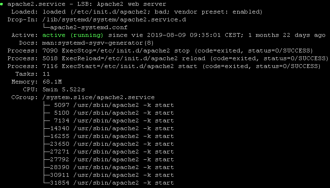
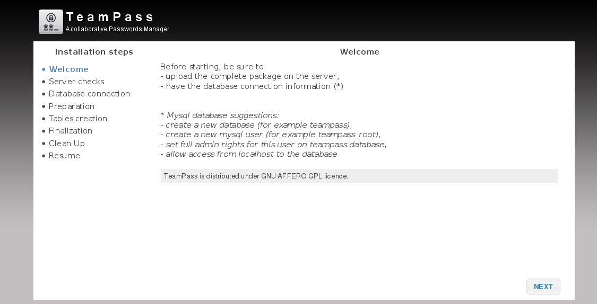
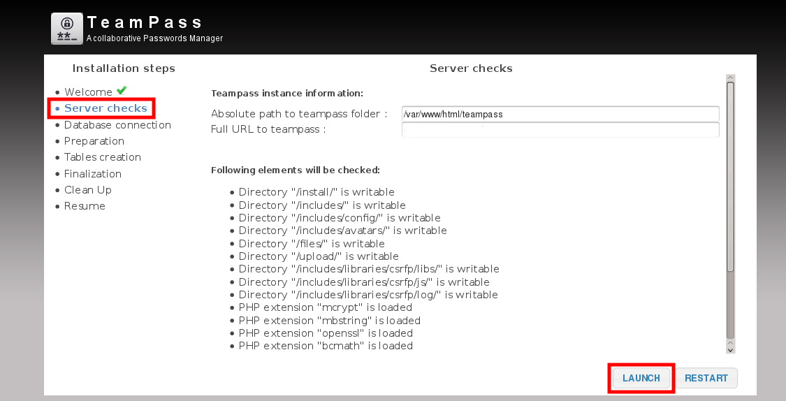
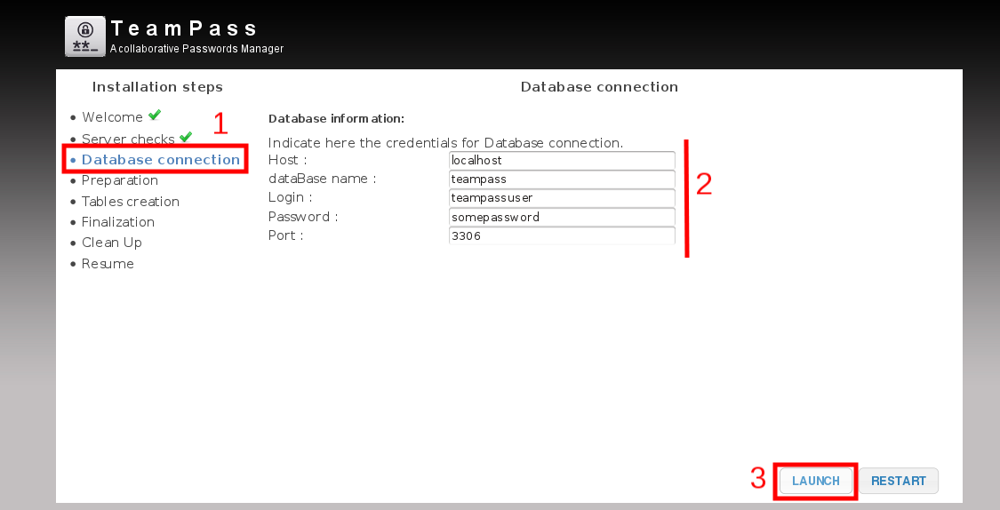
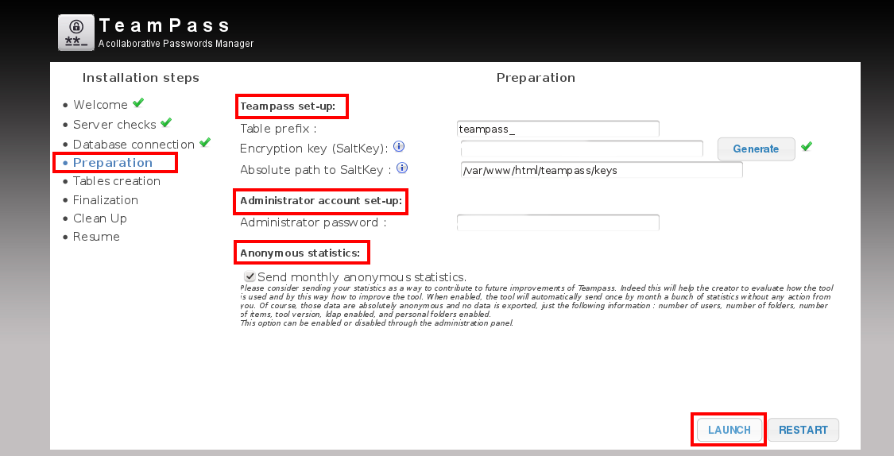
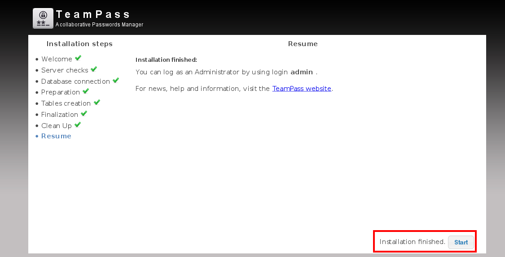
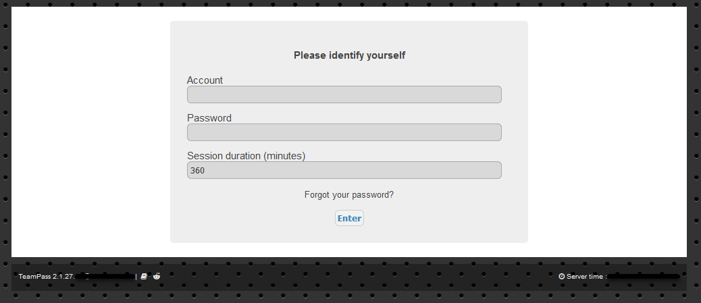

## Introduction

TeamPass is a password manager for sharing passwords among team members. It is accessible by web and the data base is encrypted. Teampass offers a large set of features permitting to manage your passwords and related data in an organized way in respect to the access rights defined for each user. Teampass is an Open-Source free to use product distributed in respect with OpenSource GNU GPL-3.0.

This tutorial explains how to install all the software needed in o server running Ubuntu.

**Prerequisites**

In order to run Teampass you will need:

* A server running Ubuntu 16.x/18.x
* Root access
* PHP 5.5.0 or higher
* MySQL or MariaDB 
* Apache
* PHP extensions: mcrypt, openssl, ldap (if used), mbstring, bcmath, iconv, xml, gd, openssl, mysqlnd, mysqli_fetch_all

It is recommended to have additional hardening tools on your cloud server:

* fail2ban
* Firewall

## Step 1 - Update the system

Firstly, after the server deployment, it is recommended to update the system.

```console
root@server# apt-get update
root@server# apt-get upgrade
```

Don't forgot to check the Teampass project page before updating your system in order to avoid upgrading php or mysql to unsupported versions. There is always an updating procedure.

## Step 2 - Install Apache and MySQL

Next step is to install Apache and MySQL. Remember that these services can be installed in other servers in order to split services in a scaled three layer architecture. In this tutorial it is going to be installed on a stand-alone server.

```console
root@server# apt-get install apache2
root@server# apt-get install mysql-server
```

This can take a while, but patience is a virtue.

### Step 2.1 - Configure MySQL database

Login to MySQL service.

```console
root@server# mysql -u root -p
Enter password:
```

Create a new and fresh database (the name can be different from the example given here).

```console
mysql> create database teampass;
Query OK, 1 row affected (0.00 sec)
```

Next commands will create an user and grant privileges for the database.

```console
mysql> grant all privileges on teampass.* to teampassuser@localhost identified by 'yourpassword';
Query OK, 0 rows affected, 1 warning (0.00 sec)
```

```console
mysql> flush privileges;
Query OK, 0 rows affected (0.00 sec)
```

```console
mysql> quit
Bye
```

## Step 3 - Install PHP and extensions

Now it is time to install PHP and the extensions.

```console
root@server# apt-get install php7.1-mysql php7.1-mcrypt php7.1-mbstring php7.1-fpm php7.1-common php7.1-xml php7.1-gd openssl php7.1-mysql php7.1-bcmath
```

It is good to check the version after the installation, it can be done like this:

```console
root@server# php -v
PHP 7.0.28-0ubuntu0.16.04.1 (cli) ( NTS )
Copyright (c) 1997-2017 The PHP Group
Zend Engine v3.0.0, Copyright (c) 1998-2017 Zend Technologies
    with Zend OPcache v7.0.28-0ubuntu0.16.04.1, Copyright (c) 1999-2017, by Zend Technologies
```

Many times it is not needed, but it is a good practice to increase execution time value. Edit PHP.ini to increase 'max_execution_time' parameter.

```console
root@server# nano /etc/php7/apache2/php.ini
```

Increase the value from 30 to 120:

`max_execution_time = 120`

## Step 4 - Configure Apache

Get teampass and decompress it.

```console
root@server:~# cd /var/www/html
root@server:/var/www/html# wget -q https://github.com/nilsteampassnet/TeamPass/archive/master.zip
root@server:/var/www/html# unzip master.zip
```

Now it's time to set some folder permissions in order to write files.

```console
chmod -R 0777 teampass/includes/config
chmod -R 0777 teampass/includes/avatars
chmod -R 0777 teampass/includes/libraries/csrfp/libs
chmod -R 0777 teampass/includes/libraries/csrfp/log
chmod -R 0777 teampass/includes/libraries/csrfp/js
chmod -R 0777 teampass/backups
chmod -R 0777 teampass/files
chmod -R 0777 teampass/install
chmod -R 0777 teampass/upload
```

And of course a restart of the service in order to apply all the parameters.

```console
root@server:/var/www/html# service apache2 restart
```

check if Apache is running by typing:

```console
root@server:/var/www/html# service apache2 status
```

You should see something like this:



## Step 5 - Install Teampass

Open a browser and type https://127.0.0.1/teampass in the address bar and follow the steps.



Click Next button.



This page is where the server checks run. All checks must be passed, it is mandatory, so click Launch button.



On this page is where the database settings are asked, enter them and click on Launch. The result message must be "Connection is successful".



Select a table prefix, generate an encryption key and choose an admin password. Then click Launch.



All the steps after that are informational so click Next until the page where "Installation complete" is shown and click Start button.



This is the login screen.

After login with admin user, some folders and users can be created and then the credentials that are wanted to store.

## Conclusion

To summarize, this simple tutorial has explained how to install a database engine, a web server, and the application Teampass in a few steps.

##### License: MIT

<!--

Contributor's Certificate of Origin

By making a contribution to this project, I certify that:

(a) The contribution was created in whole or in part by me and I have
    the right to submit it under the license indicated in the file; or

(b) The contribution is based upon previous work that, to the best of my
    knowledge, is covered under an appropriate license and I have the
    right under that license to submit that work with modifications,
    whether created in whole or in part by me, under the same license
    (unless I am permitted to submit under a different license), as
    indicated in the file; or

(c) The contribution was provided directly to me by some other person
    who certified (a), (b) or (c) and I have not modified it.

(d) I understand and agree that this project and the contribution are
    public and that a record of the contribution (including all personal
    information I submit with it, including my sign-off) is maintained
    indefinitely and may be redistributed consistent with this project
    or the license(s) involved.

Signed-off-by: [Raül Martínez raulma@gmail.com]

-->
