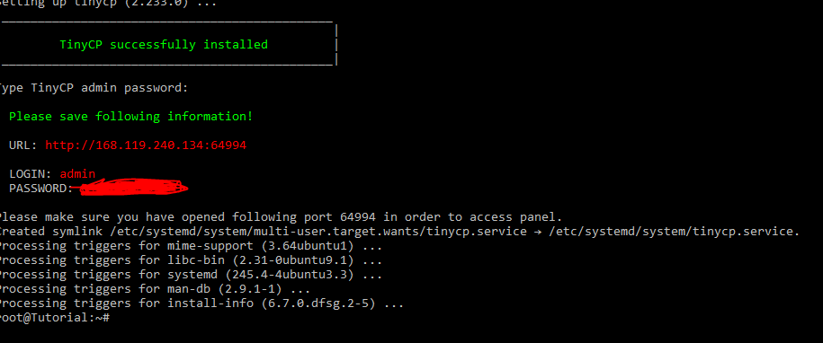

### Introduction
This tutorial aims to install TinyCP on a Hetzner Cloud Server.
 
What is TinyCP? is a project that manages your Linux system through a web-based control panel, it is a very light and active project. it is possible to monitor the server and create pages, virtualization, database and e-mails on the web, in addition to the facility to create user access to FTP (File Transfer Protocol).


### Steps 1 - Order Server
First you need to login or register in your Hetzner account through the website: https://accounts.hetzner.com.
 
  Right after, enter the Hetzner console through the link: https://console.hetzner.cloud, and create your first project on the button ```+ NEW PROJECT```, 
enter the project name and click the button ```ADD PROJECT```.
  
  Click on the project you created, and press the button ```ADD SERVER```.
  
 Steps to create a server:

  1º) First select the server location: ```Nuremberg, Falkenstein or Helsinki```.

  2º) Then select the server's operating system: ```Ubuntu(preferably in a stable version)```.

  3º) Select your server specifications: Standard or Dedicated, and inform the machine settings.
     ```*I'll be using the Standard: CX11```.

  4º) Then, in step 8, type the name of your server and press the button ```CREATE & BUY NOW```.

  
  The result should look like this:
  

  There, soon you will receive confirmation of the creation of your server on the Hetzner Cloud Server, with remote access credentials.
### Steps 2 - Accessing and preparing the server
 If you have never logged into a remote server, I recommend using the Putty program for windows, but if you do not want to use the program, run the following command in CMD on windows.
  
 1º Run the command
   ```Shell 
   ssh root@[Ipv4]
  ```
  Where "root" is the user and "Ipv4" is the server's ip.
  2ºAccept the conditions
  ```Shell 
   Are you sure you want to continue connecting (yes/no)? yes
  ```
  3º Enter the password sent to your email,
  ```Shell 
   root@[Ipv4]'s password:
  ```
  After logging in for the first time, the system asks you to create a new password.

  4º Enter the password you entered earlier.
  ```Shell 
   Current password:
  ```
  5º Create a new password.
  ```Shell 
   New password:
  ```
  6º Confirm your new password.
  ```Shell 
   Retype new password:
  ```
  You have done your remote access on a server on the Hetzner Cloud.

  Before installing TinyCP, it is recommended to update ubuntu packages.
  ```Shell 
   apt update && apt upgrade -y
  ```
  There, your environment will be ready to install TinyCP.
### Steps 3 - Installing TINYCP
  The stable version of the TinyCP project will be installed.

  1º You need to install some packages, run the command:
  ```Shell 
   sudo apt install gnupg ca-certificates
  ```
  2ºAdd the TinyCP package to your repository, run the commands
  ```Shell 
   sudo apt-key adv --fetch-keys http://repos.tinycp.com/ubuntu/conf/gpg.key
  ```
  ```Shell 
   sudo echo "deb http://repos.tinycp.com/ubuntu all main" | sudo tee /etc/apt/sources.list.d/tinycp.list
  ```
  3º After performing the previous steps, update your packages, run the command:
  ```Shell 
   sudo apt update
  ```
  4º Installing the TinyCP project, run the command:
  ```Shell
   sudo apt install tinycp
  ```
  5º When installing, ask if you want to continue with the installation.
  ```Shell 
   Do you want to continue? [Y/n] Y
  ```
  After presents the text ```TinyCP successfully installed```, you will create the panel access password.
  ```Shell 
   Type TinyCP admin password:
  ```
 The expected result is this:
        
### Steps 3 - Acessing Panel
  1º In the last step, the URL of access to the panel with the access credentials was informed, access the URL through your browser and enter the Login and Password, and press the "Sign In" button
	
  2º The expected result is this:
        
### Conclusion
  Following steps 1 to 4, it is concluded that the installation of TinyCP was successful, therefore, the use of the panel is very simple to use.

  If you want to assign the project developer, visit the website https://tinycp.com.


##### License: MIT

<!--

Contributor's Certificate of Origin

By making a contribution to this project, I certify that:

(a) The contribution was created in whole or in part by me and I have
    the right to submit it under the license indicated in the file; or

(b) The contribution is based upon previous work that, to the best of my
    knowledge, is covered under an appropriate license and I have the
    right under that license to submit that work with modifications,
    whether created in whole or in part by me, under the same license
    (unless I am permitted to submit under a different license), as
    indicated in the file; or

(c) The contribution was provided directly to me by some other person
    who certified (a), (b) or (c) and I have not modified it.

(d) I understand and agree that this project and the contribution are
    public and that a record of the contribution (including all personal
    information I submit with it, including my sign-off) is maintained
    indefinitely and may be redistributed consistent with this project
    or the license(s) involved.

Signed-off-by: [Luiz O. Melo Marques luizoseasmm@gmail.com]

-->
