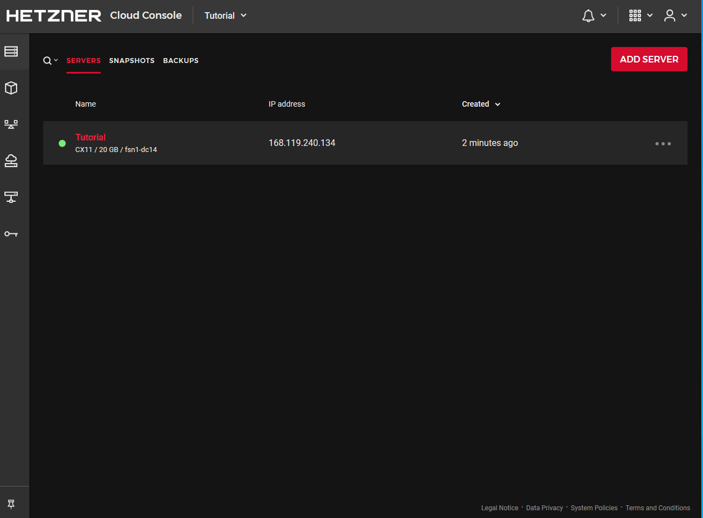
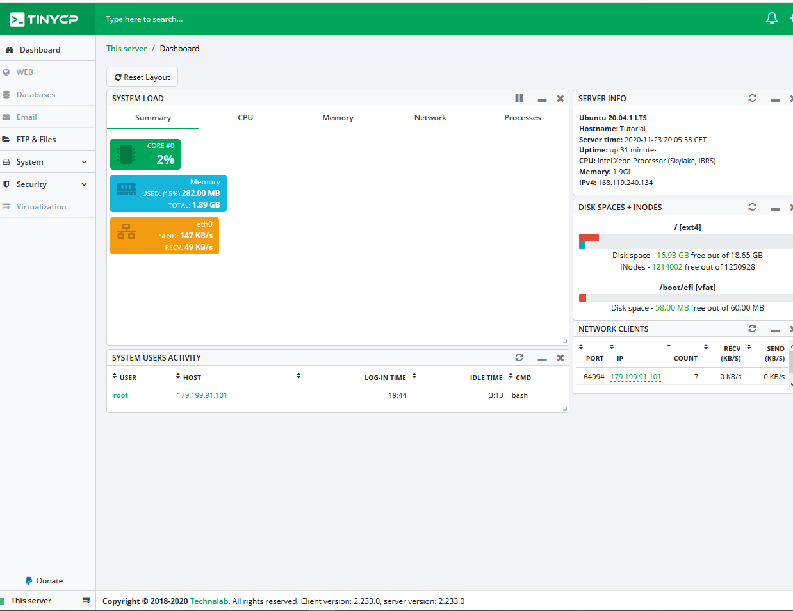

### Introdução
Este tutorial tem o objetivo de instalar TinyCP em um Hetzner Cloud Server.
 
O que é TinyCP? É um projeto que gerencia seu sistema Linux através de um painel de controle baseado na Web, é um projeto bem leve e ativo. É possível monitora o servidor e criar páginas, virtualização, banco de dados e e-mails na web, além da facilidade de criar usuário de acesso ao FTP(File Transfer Protocol).


### Etapa 1 - Servidor de Pedidos
Primeiramente é preciso fazer o Login ou Registro na sua conta Hetzner através do site: https://accounts.hetzner.com.
 
  Logo após, entre no console Hetzner através do link: https://console.hetzner.cloud, e crie seu primeiro projeto no botão ```+ NEW PROJECT```, 
insira o nome do projeto e clique no botão ```ADD PROJECT```.
  
  Clique no projeto criado por você, e aperte o botão ```ADD SERVER```.
  
  Passos para criar um servidor:

  1º) Primeiro selecione a localização do servidor: ```Nuremberg, Falkenstein ou Helsinki```.

  2º) Logo selecione o sistema operacional do servidor: ```Ubuntu(preferencialmente em uma versão estável)```.

  3º) Selecione as especificações do seu servidor: Standard ou Dedicated, e informe as configurações da máquina.
     ```*Estarei utilizando o Standard: CX11```.

  4º) Após, na etapa 8, escreva o nome do seu servidor e aperte o botão ```CREATE & BUY NOW```.

  
  O resultado deve ser parecido com este:
  

  Pronto, em breve você receberá a confirmação da criação do seu servidor na Hetzner Cloud Server, com as credenciais de acesso remoto.
### Steps 2 - Acessando e preparando o servidor
  Caso você nunca fez login remoto em um servidor, recomendo ultilizar o programa Putty para windows, mas caso você não queira usar programa, execute o seguinte comando no CMD no windows.
  
  1º Execute o comando 
   ```Shell 
   ssh root@[Ipv4]
  ```
  Onde "root" é o usuário e "Ipv4" é o ip do servidor.
  2º Aceite as condições
  ```Shell 
   Are you sure you want to continue connecting (yes/no)? yes
  ```
  3º Digite a senha enviada para o seu e-mail,
  ```Shell 
   root@[Ipv4]'s password:
  ```
  Após fazer o primeiro login, o sistema pedira para criar uma nova senha.

  4º Digite a senha informada anteriormente
  ```Shell 
   Current password:
  ```
  5º Crie uma nova senha.
  ```Shell 
   New password:
  ```
  6º Confirme sua nova senha.
  ```Shell 
   Retype new password:
  ```
  Pronto você fez acesso remoto em um servidor na Hetzner Cloud.

  Antes de instalar o TinyCP, é recomendado atualizar os pacotes do ubuntu.
  ```Shell 
   apt update && apt upgrade -y
  ```
  Pronto, seu ambiente estará pronto para instalar o tinycp. 
### Steps 3 - Instalando TINYCP
  Será instalado a versão estável do projeto TinyCP.

  1º É preciso fazer instalação de alguns pacotes, execute o comando: 
  ```Shell 
   sudo apt install gnupg ca-certificates
  ```
  2º Adicione o pacote Tinycp no seu repositório, execute os comandos
  ```Shell 
   sudo apt-key adv --fetch-keys http://repos.tinycp.com/ubuntu/conf/gpg.key
  ```
  ```Shell 
   sudo echo "deb http://repos.tinycp.com/ubuntu all main" | sudo tee /etc/apt/sources.list.d/tinycp.list
  ```
  3º Apos executar as etapas anteriores, atualize seus pacotes, execute o comando: 
  ```Shell 
   sudo apt update
  ```
  4º Instalando o projeto tinycp, execute o comando: 
  ```Shell
   sudo apt install tinycp
  ```
  5º Na instalação, pedira se deseja continuar com a instalação.
  ```Shell 
   Do you want to continue? [Y/n] Y
  ```
  Após apresenta o texto ```TinyCP successfully installed```, você criará a senha de acesso ao painel.
  ```Shell 
   Type TinyCP admin password:
  ```
  O resultado esperado é este:
        
### Steps 3 - Acessando Painel
  1º Na útima etapa, foi informado a URL de acesso ao painel com as credenciais de acesso, acesse a URL pelo seu navegado e informe o Login e Password, e aperte o botão "Sign In"
	
  2º O resultado esperado é este: 
        
### Conclusão
  Seguindo as etapas de 1 a 4, conclui-se que a instalação do TinyCP foi bem sucedida, logo, a utilização do painel é bem simples de usar.

  Caso queira retribuir o desenvolvedor do projeto, acesse o site https://tinycp.com.

##### License: MIT

<!--

Contributor's Certificate of Origin

By making a contribution to this project, I certify that:

(a) The contribution was created in whole or in part by me and I have
    the right to submit it under the license indicated in the file; or

(b) The contribution is based upon previous work that, to the best of my
    knowledge, is covered under an appropriate license and I have the
    right under that license to submit that work with modifications,
    whether created in whole or in part by me, under the same license
    (unless I am permitted to submit under a different license), as
    indicated in the file; or

(c) The contribution was provided directly to me by some other person
    who certified (a), (b) or (c) and I have not modified it.

(d) I understand and agree that this project and the contribution are
    public and that a record of the contribution (including all personal
    information I submit with it, including my sign-off) is maintained
    indefinitely and may be redistributed consistent with this project
    or the license(s) involved.

Signed-off-by: [Luiz O. Melo Marques luizoseasmm@gmail.com]

-->
