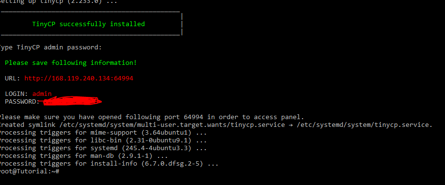
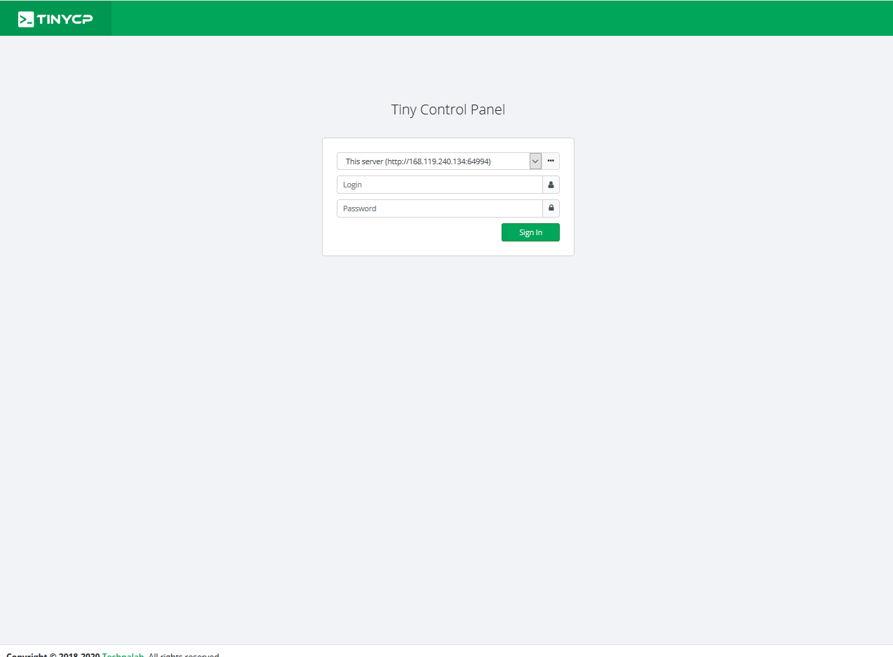

## Introduction

TinyCP is a project that manages your Linux system through a web-based control panel. It is a very light and active project. It is possible to monitor the server and create pages, virtualization, databases and e-mails on the web, in addition to the facility to create user access to FTP (File Transfer Protocol).

**Prerequisites**

A server with Ubuntu Server installed and root access.

## Step 1 - Preparing the server and Installing TinyCP

First, access the Ubuntu server with a user with root permission.

Before installing TinyCP, it is recommended to update ubuntu packages.

```Shell
sudo apt update && sudo apt upgrade -y
```

The stable version of the TinyCP project will now be installed.

1º You need to install some packages first, so run the command:

```Shell
sudo apt install gnupg ca-certificates
```

2º Add the TinyCP package to your repository, run the commands:

```Shell
sudo apt-key adv --fetch-keys http://repos.tinycp.com/ubuntu/conf/gpg.key
```

```Shell
echo "deb http://repos.tinycp.com/ubuntu all main" | sudo tee /etc/apt/sources.list.d/tinycp.list
```

3º After performing the previous steps, update your packages, run the command:

```Shell
sudo apt update
```

4º Installing the TinyCP project, run the command:

```Shell
sudo apt install tinycp
```

5º When installing, ask if you want to continue with the installation.

```Shell
Do you want to continue? [Y/n] Y
```

6° After this the text ```TinyCP successfully installed``` will be shown. You can then create the panel access password:

```Shell
Type TinyCP admin password:
```

The expected result is this:



## Step 2 - Accessing Panel

In the last step, the URL of access to the panel with the access credentials was shown. Access the URL through your browser and enter the Login and Password, and press the "Sign In" button.



The expected result is this:


## Conclusion

By Following steps 1 to 2, the installation of TinyCP was successful. Now you can use the simple control panel TinyCP.

For more information, visit the [TinyCP website](https://tinycp.com).

##### License: MIT

<!--

Contributor's Certificate of Origin

By making a contribution to this project, I certify that:

(a) The contribution was created in whole or in part by me and I have
    the right to submit it under the license indicated in the file; or

(b) The contribution is based upon previous work that, to the best of my
    knowledge, is covered under an appropriate license and I have the
    right under that license to submit that work with modifications,
    whether created in whole or in part by me, under the same license
    (unless I am permitted to submit under a different license), as
    indicated in the file; or

(c) The contribution was provided directly to me by some other person
    who certified (a), (b) or (c) and I have not modified it.

(d) I understand and agree that this project and the contribution are
    public and that a record of the contribution (including all personal
    information I submit with it, including my sign-off) is maintained
    indefinitely and may be redistributed consistent with this project
    or the license(s) involved.

Signed-off-by: [Luiz O. Melo Marques luizoseasmm@gmail.com]

-->
