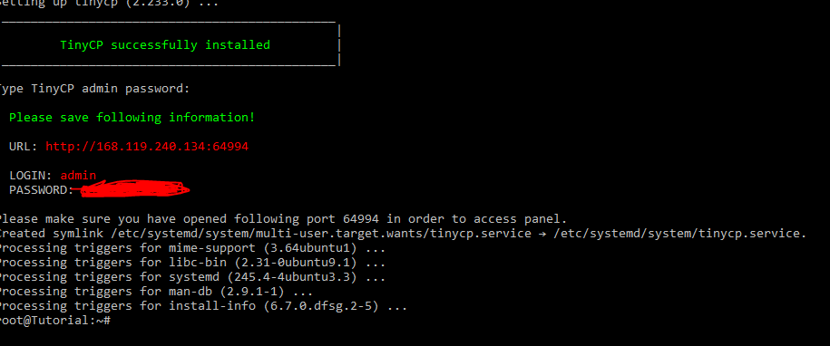
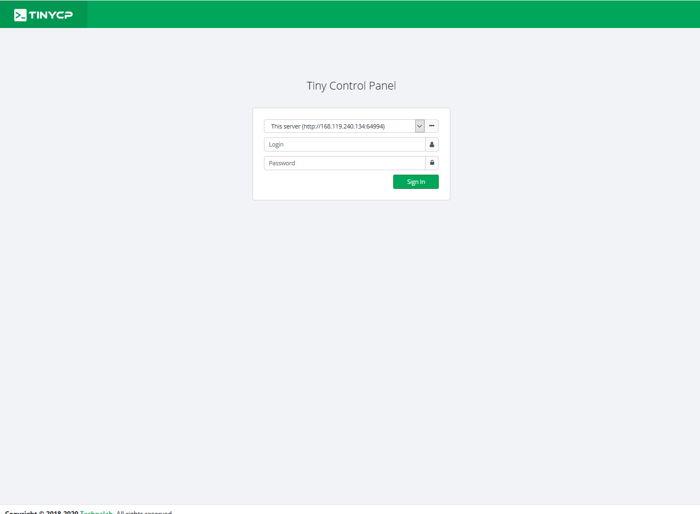
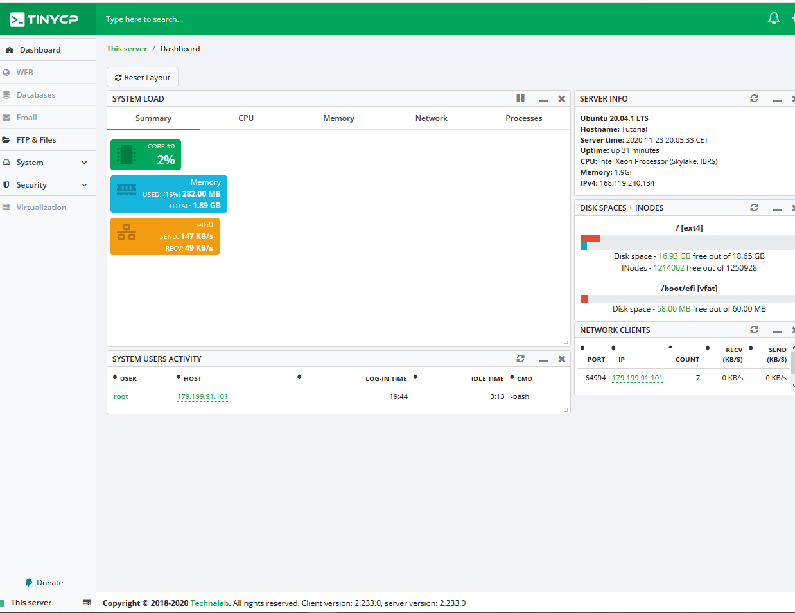

## Introdução

TinyCP é um projeto que gerencia seu sistema Linux através de um painel de controle baseado na Web, é um projeto bem leve e ativo. É possível monitora o servidor e criar páginas, virtualização, banco de dados e e-mails na web, além da facilidade de criar usuário de acesso ao FTP (File Transfer Protocol).

**Pré-requisitos**

Um servidor com sistema Ubuntu Server e acesso ao root.

## ETAPA 1 - Preparando o servidor e Instalado o projeto TinyCP

Primeiro, acesse o servidor Ubuntu com usuário que tenha permissão de super-usuário (root).

Antes de instalar o TinyCP, é recomendado atualizar os pacotes do ubuntu.

```Shell
sudo apt update && sudo apt upgrade -y
```

Será instalado a versão estável do projeto TinyCP.

1º É preciso fazer instalação de alguns pacotes, execute o comando:

```Shell
sudo apt install gnupg ca-certificates
```

2º Adicione o pacote Tinycp no seu repositório, execute os comandos

```Shell
sudo apt-key adv --fetch-keys http://repos.tinycp.com/ubuntu/conf/gpg.key
```

```Shell
echo "deb http://repos.tinycp.com/ubuntu all main" | sudo tee /etc/apt/sources.list.d/tinycp.list
```

3º Apos executar as etapas anteriores, atualize seus pacotes, execute o comando:

```Shell
sudo apt update
```

4º Instalando o projeto tinycp, execute o comando:

```Shell
sudo apt install tinycp
```

5º Na instalação, pedira se deseja continuar com a instalação.

```Shell
Do you want to continue? [Y/n] Y
```

6° Após apresenta o texto ```TinyCP successfully installed```, você criará a senha de acesso ao painel.

```Shell
Type TinyCP admin password:
```

O resultado esperado é este:



## ETAPA 2 - Acessando Painel

Na útima etapa, foi informado a URL de acesso ao painel com as credenciais de acesso, acesse a URL pelo seu navegado e informe o Login e Password, e aperte o botão "Sign In".



O resultado esperado é este:



## Conclusão

Seguindo as etapas de 1 a 2, conclui-se que a instalação do TinyCP foi bem sucedida, logo, a utilização do painel é bem simples de usar.

Caso queira retribuir o desenvolvedor do projeto, acesse [o site TinyCP](https://tinycp.com).

##### License: MIT

<!--

Contributor's Certificate of Origin

By making a contribution to this project, I certify that:

(a) The contribution was created in whole or in part by me and I have
    the right to submit it under the license indicated in the file; or

(b) The contribution is based upon previous work that, to the best of my
    knowledge, is covered under an appropriate license and I have the
    right under that license to submit that work with modifications,
    whether created in whole or in part by me, under the same license
    (unless I am permitted to submit under a different license), as
    indicated in the file; or

(c) The contribution was provided directly to me by some other person
    who certified (a), (b) or (c) and I have not modified it.

(d) I understand and agree that this project and the contribution are
    public and that a record of the contribution (including all personal
    information I submit with it, including my sign-off) is maintained
    indefinitely and may be redistributed consistent with this project
    or the license(s) involved.

Signed-off-by: [Luiz O. Melo Marques luizoseasmm@gmail.com]

-->
