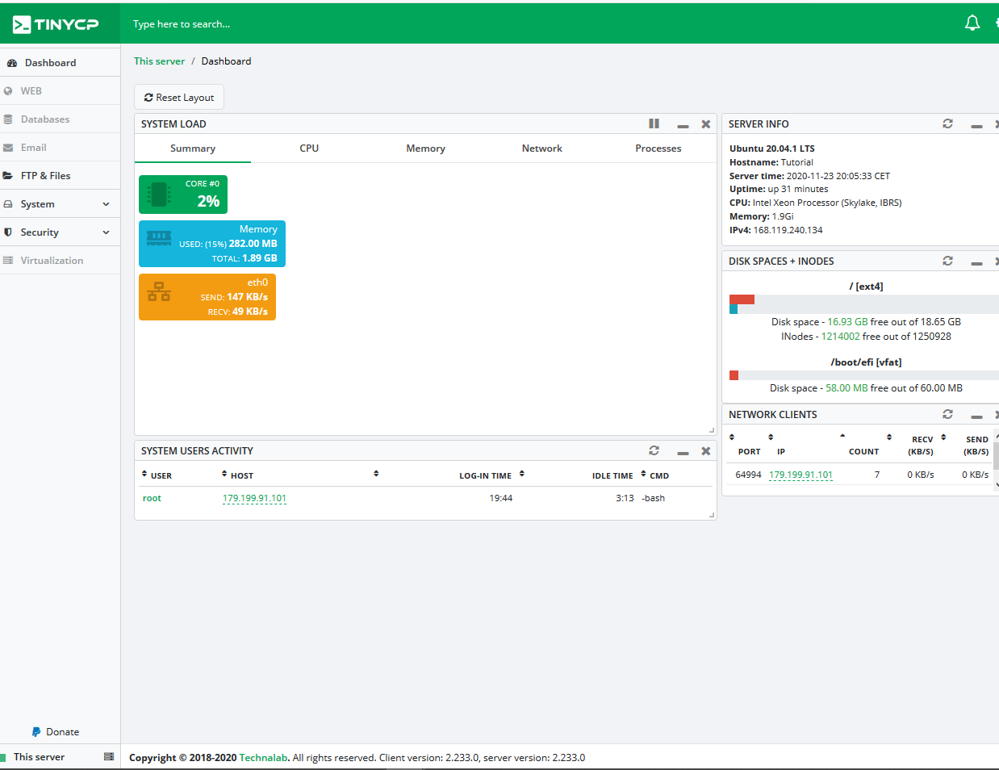

## Введение

Tiny CP - это проект, который управляет вашей системой Linux через веб-панель управления. Можно контролировать сервер и создавать страницы, виртуализацию, базы данных и электронные письма в Интернете, в дополнение к возможности создания пользовательского доступа к FTP.

**Требования к установке**

Сервер с Ubuntu и root доступ.

## Шаг 1 - Подготовка сервера и установка TinyCP

Сперва подключимся к Ubuntu серверу пользователем который имеет root права.

Перед установкой TinyCP, рекомендую обновить пакеты Ubuntu.

```Shell
sudo apt update && sudo apt upgrade -y
```
Теперь будет установлена стабильная версия проекта TinyCP.

1º Сначала вам нужно установить некоторые пакеты, поэтому запустите команду:

```Shell
sudo apt install gnupg ca-certificates
```

2º Добавьте пакет TinyCP к вашему репозиторию с помощью команды:

```Shell
sudo apt-key adv --fetch-keys http://repos.tinycp.com/ubuntu/conf/gpg.key
```

```Shell
echo "deb http://repos.tinycp.com/ubuntu all main" | sudo tee /etc/apt/sources.list.d/tinycp.list
```

3º После выполнения предыдущих шагов обновите пакеты, запустив команду:

```Shell
sudo apt update
```
4º Установите TinyCP с помощью команды:

```Shell
sudo apt install tinycp
```
5º Во время установки вам спросят о продолжении установки.

```Shell
Do you want to continue? [Y/n] Y
```
6° После текста ```TinyCP successfully installed``` вы можете создать пароль доступа к панели: 

```Shell
Type TinyCP admin password:
```

Ожидаемый результат следующий:


## Шаг 2 - Доступ к панели

На последнем шаге был показан URL-адрес доступа к панели с учетными данными доступа. Зайдите по URL-адресу через свой браузер, введите логин и пароль и нажмите кнопку "Logib".


Ожидаемый результат следующий:



## Заключение

Выполнив шаги с 1 по 2, установка TinyCP прошла успешно. Теперь вы можете использовать простую панель управления TinyCP.

Для получения дополнительной информации посетите [веб-сайт TinyCP](https://tinycp.com).

##### License: MIT

<!--

Contributor's Certificate of Origin

By making a contribution to this project, I certify that:

(a) The contribution was created in whole or in part by me and I have
    the right to submit it under the license indicated in the file; or

(b) The contribution is based upon previous work that, to the best of my
    knowledge, is covered under an appropriate license and I have the
    right under that license to submit that work with modifications,
    whether created in whole or in part by me, under the same license
    (unless I am permitted to submit under a different license), as
    indicated in the file; or

(c) The contribution was provided directly to me by some other person
    who certified (a), (b) or (c) and I have not modified it.

(d) I understand and agree that this project and the contribution are
    public and that a record of the contribution (including all personal
    information I submit with it, including my sign-off) is maintained
    indefinitely and may be redistributed consistent with this project
    or the license(s) involved.

Signed-off-by: [Luiz O. Melo Marques luizoseasmm@gmail.com]

-->
