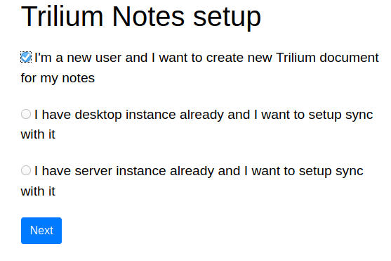

## Introduction

Trilium Notes is a hierarchical note taking application with focus on building large personal knowledge bases. See the [Trilium Github](https://github.com/zadam/trilium) page for more details. In this tutorial we will deploy a Trilium instance to install this open source and self-hosted alternative to Evernote on a fresh Debian server.

**Prerequisites**

To get this running you would need

+ A server with Docker and Docker-compose installed. There's [an easy step-by-step tutorial](https://community.hetzner.com/tutorials/debian-base-configuration-docker) that you could follow.
+ A domain pointing to the IP address of your server instance. The tutorial assumes you have pointed the domain `notes.example.com` to your server IP address.

## Step 1 - Setup Docker network and our work folder

For ease of deployment and maintenance, we will use Docker in [swarm mode](https://docs.docker.com/engine/swarm/). For security certificates and application mapping we will use [Traefik](https://docs.traefik.io/) as a reverse proxy. It's perfectly fine if you've not used these services before. All necessary steps to get them working are outlined in detail below.

+ Initialise the docker swarm: `sudo docker swarm init`
+ Setup a [network](https://docs.docker.com/engine/reference/commandline/network/) for the Traefik container: `sudo docker network create --driver=overlay traefik-net`
+ Create a directory where we will save all our stack yml files and navigate to that directory: `mkdir stacks && cd stacks`

## Step 2 - Create the yml files

### Step 2.1 - Create the yml file for Traefik

+ Create a yml file for traefik: `nano traefik-ssl.yml`
+ Copy over the following contents into the yml file:

```yml
version: "3.7"

services:
  traefik:
    image: traefik:${VERSION:-v1.7.24-alpine}
    ports:
      - { target: 80, published: 80, mode: host, protocol: tcp }
      - { target: 443, published: 443, mode: host, protocol: tcp }
    command:
      # - --debug
      # - --loglevel=INFO
      - --entryPoints=Name:http Address::80 Compress:true Redirect.EntryPoint:https
      - --entryPoints=Name:https Address::443 Compress:true TLS
      - --defaultEntryPoints=https,http
      - --providers.docker.endpoint=tcp://socket-proxy:2375
      - --docker.swarmmode=true
      - --docker.exposedbydefault=false
      - --docker.network=traefik-net
      - --metrics.prometheus=true
      - --consul
      - --consul.endpoint=consul:8500
      - --consul.prefix=traefik
      - --acme
      - --acme.onHostRule=true
      - --acme.storage=traefik/acme/account
      - --acme.acmeLogging=true
      - --acme.entryPoint=https
      - --acme.httpChallenge.entryPoint=http
      - --acme.email=${ACME_EMAIL:-noreply@example.com}
      - --api
    deploy:
      mode: ${MODE:-replicated}
      placement:
        constraints: [node.role==manager]
    networks:
      - internal
      - traefik

  socket-proxy:
    image: tecnativa/docker-socket-proxy
    volumes:
      - /var/run/docker.sock:/var/run/docker.sock:ro
    environment:
      CONTAINERS: 1
    networks:
      - internal
      - traefik

  consul:
    image: consul:1.7.2
    command: agent -server -bootstrap-expect=1 -client=0.0.0.0
    environment:
      CONSUL_BIND_INTERFACE: eth0
      CONSUL_CLIENT_INTERFACE: eth0
      CONSUL_LOCAL_CONFIG: '{ "limits": { "txn_max_req_len": 2048000, "kv_max_value_size": 2048000 } }'
    volumes:
      - ${VOLUME_PATH}consul:/consul/data
    networks:
      - traefik
      - internal

volumes:
  consul:

networks:
  internal:
    driver: overlay
    attachable: true
  traefik:
    external: true
    name: traefik-net
```

### Step 2.2 - Create the yml file for Trilium

+ Create a yml file for trilium: `nano trilium.yml`
+ Copy over the following contents into the yml file:

```yml
version: '3.7'
services:
  web:
    image: zadam/trilium:0.42.7
    volumes:
      - ${VOLUME_PATH}trilium-data:/root/trilium-data
    deploy:
      labels:
        - traefik.port=8080
        - traefik.enable=true
        - traefik.frontend.rule=Host:${DOMAIN:-notes.localhost}
    networks:
      - traefik
volumes:
  trilium-data:
networks:
  traefik:
    external: true
    name: traefik-net
```

## Step 3 - Deploy the stacks

+ Deploy the Traefik stack: `sudo docker stack deploy -c traefik-ssl.yml traefik`
+ Deploy the Trilium stack: `DOMAIN=notes.example.com SCHEME=https docker stack deploy -c trilium.yml trilium`

Give the system a few minutes to fetch the docker images and setup and run the containers in the background. To check the status of the containers you can run the command: `docker ps -a`

## Step 4 - Finish the setup in your browser

+ Navigate to `notes.example.com` in your browser. You should now be presented with the following options as shown in the image below:



+ Select the first option and click 'Next'
+ Create a user account for your Trilium Notes instance in the next screen and you should be all set now!

## Conclusion

With a few simple steps we were able to setup and run a good alternative to Evernote. You can even import your notes from Evernote if you'd like.

Go ahead and explore your new setup! The [Wiki](https://github.com/zadam/trilium/wiki) is also very informative for what you can do next.

##### License: MIT

<!--

Contributor's Certificate of Origin

By making a contribution to this project, I certify that:

(a) The contribution was created in whole or in part by me and I have
    the right to submit it under the license indicated in the file; or

(b) The contribution is based upon previous work that, to the best of my
    knowledge, is covered under an appropriate license and I have the
    right under that license to submit that work with modifications,
    whether created in whole or in part by me, under the same license
    (unless I am permitted to submit under a different license), as
    indicated in the file; or

(c) The contribution was provided directly to me by some other person
    who certified (a), (b) or (c) and I have not modified it.

(d) I understand and agree that this project and the contribution are
    public and that a record of the contribution (including all personal
    information I submit with it, including my sign-off) is maintained
    indefinitely and may be redistributed consistent with this project
    or the license(s) involved.

Signed-off-by: [Srikanth Perinkulam <srikanth.perinkulam@gmail.com>]

-->
