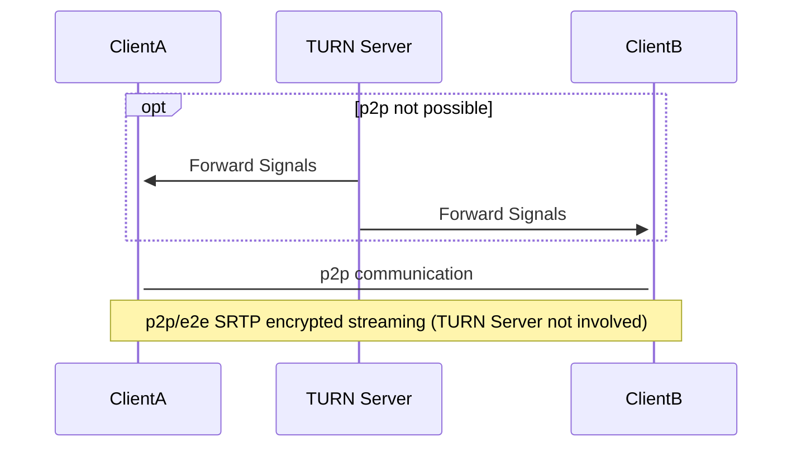

## Introduction

We will install a basic TURN/STUN server with [coturn](https://github.com/coturn/coturn). The TURN Server is a VoIP media traffic NAT traversal server and gateway. It can be used as a general-purpose network traffic TURN server and gateway, too.

**The basic concept of TURN**



Example projects which uses TURN/STUN:

- [Nextcloud Talk](https://nextcloud.com/talk/)
- [Jitsi Meet](https://jitsi.org/jitsi-meet/)
- [Matrix Server](https://matrix.org/)
- [ejabberd](https://www.ejabberd.im/)

If you self-host one of these applications you can, for example, use your own TURN/STUN server there.

**Prerequisites**

- At least a  small virtual server, e.g. [Cloud Server CX11](https://www.hetzner.com/cloud#pricing), with a root shell
- Basic knowledge about linux

**Assumptions**

- Domain: `example.com`
- Server IPv4: `10.0.0.1`
- Server IPv6: `2001:db8:1234::1`
- Client public IPv4: `78.47.166.55`
- Client private IPv4: `192.168.0.10`

## Step 1 - Setup DNS records

General DNS records:

```dns
turn.example.com. 14400 IN A    10.0.0.1
turn.example.com. 14400 IN AAAA 2001:db8:1234::1
stun.example.com. 14400 IN A    10.0.0.1
stun.example.com. 14400 IN AAAA 2001:db8:1234::1

@ IN NAPTR 10 0 "s" "RELAY:turn.udp" "" _turn._udp.example.com.
```

Following DNS records should be used if you only install **one** TURN/STUN server:

```dns
_stun._udp.example.com.  14400 IN SRV  5 0 3478 turn.example.com.
_stun._tcp.example.com.  14400 IN SRV  5 0 3478 turn.example.com.
_stuns._tcp.example.com. 14400 IN SRV  5 0 5349 turn.example.com.

_turn._udp.example.com.   14400 IN SRV  5 0 3478 turn.example.com.
_turn._tcp.example.com.   14400 IN SRV  5 0 3478 turn.example.com.
_turns._tcp.example.com.  14400 IN SRV  5 0 5349 turn.example.com.
```

For best performance and fail-safe you should have at least two TURN/STUN servers. We slightly need to change the DNS records for two:

```dns
_stun._udp.example.com.   14400 IN SRV  5  50 3478 turn1.example.com.
_stun._udp.example.com.   14400 IN SRV  10 50 3478 turn2.example.com.
_stun._tcp.example.com.   14400 IN SRV  5  50 3478 turn1.example.com.
_stun._tcp.example.com.   14400 IN SRV  10 50 3478 turn2.example.com.
_stuns._tcp.example.com.  14400 IN SRV  5  50 5349 turn1.example.com.
_stuns._tcp.example.com.  14400 IN SRV  10 50 5349 turn2.example.com.
_turn._udp.example.com.   14400 IN SRV  5  50 3478 turn1.example.com.
_turn._udp.example.com.   14400 IN SRV  10 50 3478 turn2.example.com.
_turn._tcp.example.com.   14400 IN SRV  5  50 3478 turn1.example.com.
_turn._tcp.example.com.   14400 IN SRV  10 50 3478 turn2.example.com.
_turns._tcp.example.com.  14400 IN SRV  5  50 5349 turn1.example.com.
_turns._tcp.example.com.  14400 IN SRV  10 50 5349 turn2.example.com.
```

Do not forget to setup DNS records (A and AAAA) for `turn1.example.com` and `turn2.example.com` as mentioned above.

Theoretically you could also deploy a second A and AAAA record for `turn.example.com` and `stun.example.com` but this is not the recommended way.

## Step 2 - Installation

First we will need to install `coturn` on our server.

```bash
apt-get install coturn
```

For the moment we will stop `coturn`

```bash
systemctl stop coturn
```

## Step 3 - Configuration

In order to enable the TURN server, open the file `/etc/default/coturn` and remove the `#` in front of `TURNSERVER_ENABLED=1`.

The configuration file is located at `/etc/turnserver.conf`. First we move the original version of this file using:

```bash
mv /etc/turnserver.conf /etc/turnserver.conf.orig
```

Then we open/create `/etc/turnserver.conf` in an editor of our choice and paste the following configuration:

```text
listening-port=3478
tls-listening-port=5349

fingerprint
lt-cred-mech

use-auth-secret
static-auth-secret=replace-this-secret

realm=turn.example.com

total-quota=100
stale-nonce=600

cert=/etc/letsencrypt/live/turn.example.com/cert.pem
pkey=/etc/letsencrypt/live/turn.example.com/privkey.pem
cipher-list="ECDHE-RSA-AES256-GCM-SHA512:DHE-RSA-AES256-GCM-SHA512:ECDHE-RSA-AES256-GCM-SHA384:DHE-RSA-AES256-GCM-SHA384:ECDHE-RSA-AES256-SHA384"

no-sslv3
no-tlsv1
no-tlsv1_1
#no-tlsv1_2

dh2066

no-stdout-log
log-file=/var/tmp/turn.log
#log-file=/dev/null

no-loopback-peers
no-multicast-peers

proc-user=turnserver
proc-group=turnserver
```

Generate the secret by using

```bash
sed -i "s/replace-this-secret/$(openssl rand -hex 32)/" /etc/turnserver.conf
```

## Step 4 - Register Let's Encrypt certificates

We will use [certbot](https://certbot.eff.org/) from [EFF](https://www.eff.org/) for the Let's Encrypt certificates.

```bash
wget https://dl.eff.org/certbot-auto
wget -N https://dl.eff.org/certbot-auto.asc
gpg2 --keyserver pool.sks-keyservers.net --recv-key A2CFB51FA275A7286234E7B24D17C995CD9775F2
gpg2 --trusted-key 4D17C995CD9775F2 --verify certbot-auto.asc certbot-auto
```

The last line should be the following: `gpg: Good signature from "Let's Encrypt Client Team <letsencrypt-client@eff.org>" [ultimate]`. If not, please check again if you have downloaded the correct key. Do *NOT* use the downloaded file if they key does not match.

```bash
chmod a+x ./certbot-auto
./certbot-auto certonly --standalone --rsa-key-size 4096 -m holu@example.com -d turn.example.com
```

You will get an email 30 (and 7) days before the certificates expire to holu@example.com.

## Step 5 - Start and test the TURN/STUN server

We will start coturn by executing `systemctl start coturn`. Using `systemctl status coturn` we can test if coturn is running.

We do not know yet if our configuration was successful but luckily there is a tester available: [WebRTC samples Trickle ICE](https://webrtc.github.io/samples/src/content/peerconnection/trickle-ice/)

Remove the default server from the list. The field for “STUN or TURN URI” should look like this:

```text
stun:stun.example.com
```

but you can also use the IP:

```text
stun:10.0.0.1:3478
```

To test SSL/TLS encryption, use port `5349`. You cannot test TURN here as the tester does not support.

Next click on `Add Server` and then on `Gather candidates`.

The output should look similar to this:

```text
Time    Component       Type    Foundation     Protocol Address         Port        Priority
0.019   1               host             0          UDP 192.168.0.10    41904   126 | 32512 | 255
0.024   1               host             2          TCP 192.168.0.10    9       125 | 32704 | 255
0.027   2               host             0          UDP 192.168.0.10    53438   126 | 32512 | 254
0.030   2               host             2          TCP 192.168.0.10    9       125 | 32704 | 254
0.134   1               srflx            1          UDP 78.47.166.55    41904   100 | 32543 | 255
0.152   2               srflx            1          UDP 78.47.166.55    53438   100 | 32543 | 254
0.153   Done
```

If you get a timeout with `Not reachable?` the connection is probably blocked by a firewall. Check again if the ports `3478` and `5349` for the TURN server are open. Also test if you can reach it from your computer or another server via `telnet` or `nmap`.

If everything works as expected, replace `log-file=/var/log/turn.log` with `log-file=/dev/null` in your configuration file. This disables IP address logging and is for best privacy.

## Conclusion

We now have a working TURN/STUN server. You can replace default TURN/STUN servers in other projects, some of them are mentioned above.
