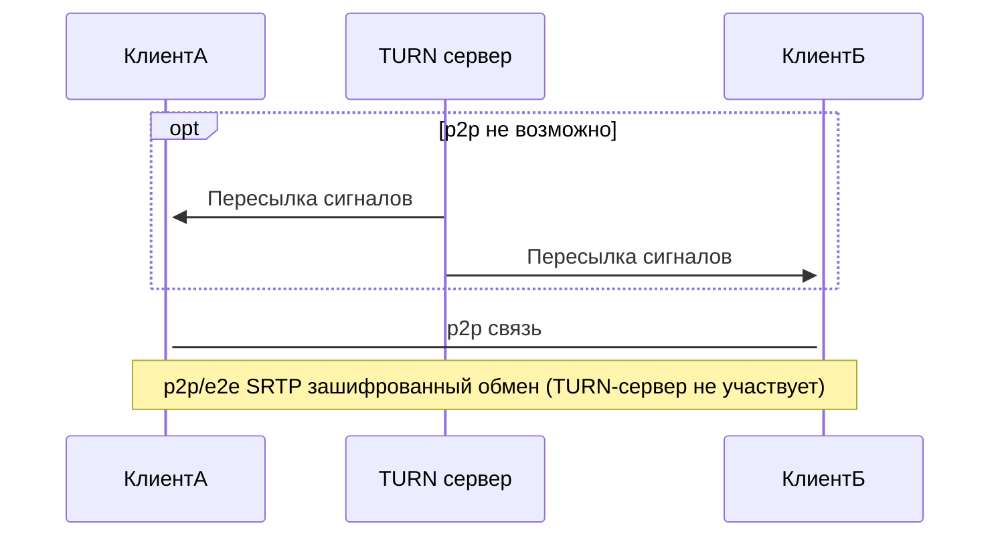

## Введение

Мы установим TURN/STUN-сервер [coturn](https://github.com/coturn/coturn). TURN-сервер позволяет установить прямое соединение (например для IP-телефонии) преодолев NAT. От также может использоваться в качестве TURN-сервера и шлюза для сетевого трафика общего назначения.

**Основная концепция TURN**



Пример проектов, использующих TURN/STUN:

- [Nextcloud Talk](https://nextcloud.com/talk/)
- [Jitsi Meet](https://jitsi.org/jitsi-meet/)
- [Matrix Server](https://matrix.org/)
- [ejabberd](https://www.ejabberd.im/)

Если вы самостоятельно размещаете одно из этих приложений, то вы можете использовать для них свой собственный TURN/STUN-сервер.

**Требования**

- Небольшой виртуальный сервер, например [Облачный сервер CX11](https://www.hetzner.com/cloud-ru#pricing) с root-доступом
- Базовые знания о Linux

**Предположения**

- Домен: `example.com`
- IPv4-адрес сервера: `10.0.0.1`
- IPv6-адрес сервера: `2001:db8:1234::1`
- Публичный IPv4-адрес клиента: `78.47.166.55`
- Частный IPv4-адрес клиента: `192.168.0.10`

## Шаг 1 — Настройка записей в DNS

Общие DNS-записи:

```dns
turn.example.com. 14400 IN A    10.0.0.1
turn.example.com. 14400 IN AAAA 2001:db8:1234::1
stun.example.com. 14400 IN A    10.0.0.1
stun.example.com. 14400 IN AAAA 2001:db8:1234::1

@ IN NAPTR 10 0 "s" "RELAY:turn.udp" "" _turn._udp.example.com.
```

Следующие DNS-записи должны использоваться, если вы устанавливаете только **один** TURN/STUN-сервер:

```dns
_stun._udp.example.com.  14400 IN SRV  5 0 3478 turn.example.com.
_stun._tcp.example.com.  14400 IN SRV  5 0 3478 turn.example.com.
_stuns._tcp.example.com. 14400 IN SRV  5 0 5349 turn.example.com.

_turn._udp.example.com.   14400 IN SRV  5 0 3478 turn.example.com.
_turn._tcp.example.com.   14400 IN SRV  5 0 3478 turn.example.com.
_turns._tcp.example.com.  14400 IN SRV  5 0 5349 turn.example.com.
```

Для лучшей производительности и отказоустойчивости вы должны иметь по крайней мере два TURN/STUN-сервера. Для двух нужно немного изменить DNS-записи:

```dns
_stun._udp.example.com.   14400 IN SRV  5  50 3478 turn1.example.com.
_stun._udp.example.com.   14400 IN SRV  10 50 3478 turn2.example.com.
_stun._tcp.example.com.   14400 IN SRV  5  50 3478 turn1.example.com.
_stun._tcp.example.com.   14400 IN SRV  10 50 3478 turn2.example.com.
_stuns._tcp.example.com.  14400 IN SRV  5  50 5349 turn1.example.com.
_stuns._tcp.example.com.  14400 IN SRV  10 50 5349 turn2.example.com.
_turn._udp.example.com.   14400 IN SRV  5  50 3478 turn1.example.com.
_turn._udp.example.com.   14400 IN SRV  10 50 3478 turn2.example.com.
_turn._tcp.example.com.   14400 IN SRV  5  50 3478 turn1.example.com.
_turn._tcp.example.com.   14400 IN SRV  10 50 3478 turn2.example.com.
_turns._tcp.example.com.  14400 IN SRV  5  50 5349 turn1.example.com.
_turns._tcp.example.com.  14400 IN SRV  10 50 5349 turn2.example.com.
```

Не забудьте настроить DNS-записи (A и AAAA) для `turn1.example.com` и `turn2.example.com` как упоминалось выше.

Теоретически, можно добавить вторую запись A и AAAA для `turn.example.com` и `stun.example.com`, но это не рекомендуемый способ.

## Шаг 2 — Установка

Сначала нужно установить `coturn` на сервере.

```bash
apt-get install coturn
```

Временно остановим `coturn`

```bash
systemctl stop coturn
```

## Шаг 3 — Настройка

Для того чтобы включить TURN-сервер, откройте файл `/etc/default/coturn` и уберите `#` перед `TURNSERVER_ENABLED=1`.

Настройки хранятся в файле `/etc/turnserver.conf`. В начале переместим исходную версию этого файла с помощью команды:

```bash
mv /etc/turnserver.conf /etc/turnserver.conf.orig
```

Затем мы откроем(создадим) файл `/etc/turnserver.conf` со следующим содержимым:

```text
listening-port=3478
tls-listening-port=5349

fingerprint
lt-cred-mech

use-auth-secret
static-auth-secret=replace-this-secret

realm=turn.example.com

total-quota=100
stale-nonce=600

cert=/etc/letsencrypt/live/turn.example.com/cert.pem
pkey=/etc/letsencrypt/live/turn.example.com/privkey.pem
cipher-list="ECDHE-RSA-AES256-GCM-SHA512:DHE-RSA-AES256-GCM-SHA512:ECDHE-RSA-AES256-GCM-SHA384:DHE-RSA-AES256-GCM-SHA384:ECDHE-RSA-AES256-SHA384"

no-sslv3
no-tlsv1
no-tlsv1_1
#no-tlsv1_2

dh2066

no-stdout-log
log-file=/var/tmp/turn.log
#log-file=/dev/null

no-loopback-peers
no-multicast-peers

proc-user=turnserver
proc-group=turnserver
```

Создайте секрет с помощью команды

```bash
sed -i "s/replace-this-secret/$(openssl rand -hex 32)/" /etc/turnserver.conf
```

## Шаг 4 — Регистрация Let's Encrypt сертификатов

Для Let's Encrypt сертификатов будем использовать [certbot](https://certbot.org/) от [EFF](https://www.eff.org/).

```bash
wget https://dl.eff.org/certbot-auto
wget -N https://dl.eff.org/certbot-auto.asc
gpg2 --keyserver pool.sks-keyservers.net --recv-key A2CFB51FA275A7286234E7B24D17C995CD9775F2
gpg2 --trusted-key 4D17C995CD9775F2 --verify certbot-auto.asc certbot-auto
```

Последняя строка должна быть такой: `gpg: Good signature from "Let's Encrypt Client Team <letsencrypt-client@eff.org>" [ultimate]`. Если это не так, пожалуйста, проверьте еще раз, загрузили ли вы правильный ключ. *Не* используйте загруженный файл, если ключ не совпадает.

```bash
chmod a+x ./certbot-auto
./certbot-auto certonly --standalone --rsa-key-size 4096 -m holu@example.com -d turn.example.com
```

За 30 (и 7) дней до истечения срока действия сертификатов вы получите электронное письмо на holu@example.com.

## Шаг 5 — Запуск и испытание TURN/STUN-сервера

Запустите coturn, выполнив `systemctl start coturn`. Проверить, работает ли cotrun можно при помощи команды `systemctl status coturn`.

Мы пока не знаем, все ли верно работает, но, к нашему счастью, есть тестер: [WebRTC samples Trickle ICE](https://webrtc.github.io/samples/src/content/peerconnection/trickle-ice/)

Удалите сервер по умолчанию из списка. Поле «STUN or TURN URI» должно выглядеть следующим образом:

```text
stun:stun.example.com
```

но можно использовать и IP-адрес:

```text
stun:10.0.0.1:3478
```

Для проверки шифрования SSL/TLS используйте порт `5349`. Тестер не поддерживает проверку работы TURN.

Затем нажмите на `Add Server`, а затем на `Gather candidates`.

Вывод должен выглядеть примерно так:

```text
Time    Component       Type    Foundation     Protocol Address         Port        Priority
0.019   1               host             0          UDP 192.168.0.10    41904   126 | 32512 | 255
0.024   1               host             2          TCP 192.168.0.10    9       125 | 32704 | 255
0.027   2               host             0          UDP 192.168.0.10    53438   126 | 32512 | 254
0.030   2               host             2          TCP 192.168.0.10    9       125 | 32704 | 254
0.134   1               srflx            1          UDP 78.47.166.55    41904   100 | 32543 | 255
0.152   2               srflx            1          UDP 78.47.166.55    53438   100 | 32543 | 254
0.153   Done
```

Если вы получаете тайм-аут `Not reachable?`, вероятно, соединение заблокировано межсетевым экраном. Проверьте еще раз, открыты ли порты `3478` и `5349` для TURN-сервера. Также проверьте, можете ли вы связаться с ним с Вашего компьютера или другого сервера через `telnet` или `nmap`.

Если все работает должным образом, в файле с настройками замените `log-file=/var/log/turn.log` на `log-file=/dev/null`. Это отключит ведение журнала IP-адресов и обеспечивает максимальную конфиденциальность.

## Вывод

Теперь у нас есть рабочий сервер TURN/STUN. Вы можете заменить TURN/STUN-серверы по умолчанию в других проектах, некоторые из них упомянуты выше.
