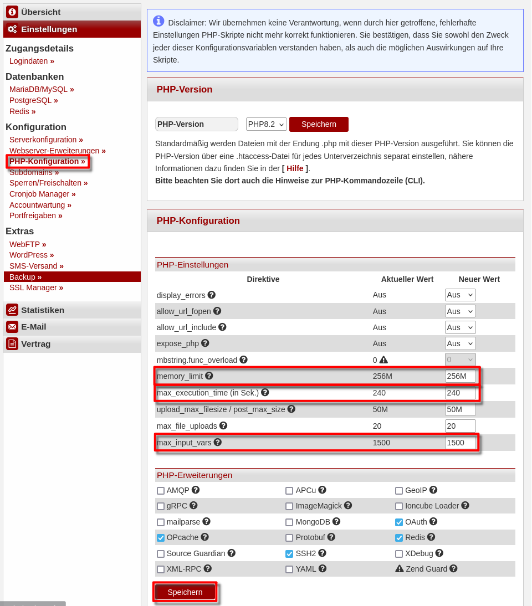

# Was ist TYPO3?
TYPO3 ist ein leistungsstarkes und vielseitiges Content-Management-System (CMS). Es eignet sich hervorragend für die Erstellung von Websites, Blogs, Online-Portalen oder Intranets – ganz ohne tiefgehende Programmierkenntnisse.
Mehr Informationen unter: https://typo3.org

**Beispiel-Benennungen**

* Benutzername: `typot`
* Hostname: `<wwwXXX>`
* Domain: `<example.com>`
* Subdomain: `<typo.example.com>`
    

# TYPO3 installieren

Um [TYPO3](https://typo3.org/) zu installieren muss eine SSH-Verbindung verwendet werden. Die Zugangsdaten können in [konsoleH](https://konsoleh.hetzner.com/) unter `Zugangsdetails` > `Logindaten` eingesehen werden.


## Schritt 1 - PHP-Einstellungen bearbeiten

* Öffne [konsoleH](https://konsoleh.hetzner.com/)
* Wähle `Konfiguration` > `PHP-Konfiguration »` aus
* Setze folgende Werte unter "PHP-Einstellungen":
  * `max_input_vars` auf 1500
  * `memory_limit` auf 256M
  * `max_execution_time` auf 240<br>
    240 ist der von TYPO3 empfohlene Wert, hierfür ist ein Webhosting-Level9 erforderlich.
* Scrollen Sie nach ganz unten und speichern Sie die Änderungen
  

## Schritt 2 - Datenbank erstellen

* Bleiben sie in der KonsoleH
* Wählen sie Einstellungen > Datenbanken > MariaDB/MySQL
* Erstellen sie eine neue Datenbank (hinzufügen)
* Bestätigen sie die Erstellung (hinzufügen)
* Browser-Tab offen halten, um die Zugangsdaten später einzugeben.

## Schritt 3 - TYPO3 Installieren

* **3.1** Datei herunterladen
  Nachdem eine SSH-Verbindung hergestellt wurde, kann die Datei heruntergeladen werden. Nutze dazu den Curl-Befehl unter https://get.typo3.org/version (Download über Wget/Curl) für die aktuellste Version. Hier ein Beispiel:
  ```bash
  typot@<wwwXXX>:~$ curl -L -o typo3_src.tgz https://get.typo3.org/<aktuelle version>
  ```
  
* **3.2** Datei entpacken
  Nachdem die `tar.gz`-Datei heruntergeladen wurde, kann diese entpackt werden.
  ```bash
  typot@<wwwXXX>:~$ tar -xf typo3_src.tgz
  ```
  Im aktuellen Ordner sollte jetzt der `typo_src`-Ordner sichtbar sein.

* **3.3** Dateien verschieben
  Der `typo_src`-Ordner kann jetzt in den `public_html`-Ordner verschoben werden.
  ```bash
  typot@<wwwXXX>:~$ mv typo3_src-* ~/public_html/typo
  ```
  Danach wird in das neue Verzeichnis gewechselt:
  ```bash
  typot@<wwwXXX>:~$ cd ~/public_html/typo
  ```
    
* **3.4** Um die Installation zu ermöglichen, muss jetzt noch das Paketverwaltungstool initzialisiert werden:
  ```bash
  typot@<wwwXXX>:~$ composer install
  ```
    
* **3.5** Danach kann das Setup-Tool ausgeführt werden:
  ```bash
  typot@<wwwXXX>:~$ ./bin/typo3 setup
  ```
  Hierbei müssen einige Fragen beantwortet werden:
  * Webserver: `apache`
  * Database Driver: `pdoMysql`
  * Database username: aus konsoleH (z.B. `typot_1`)
  * Database password: aus konsoleH (wird beim schreiben nicht angezeigt, einfach Enter nach dem kopieren)
  * Database port: default (einfach leer lassen, Enter)
  * Database host: aus konsoleH (z.B. `xxxx.your-database.de`)
  * Database to use: erste (einzige) Auswahlmöglichkeit; wie konsoleH
  * Admin-Nutzername: Selbst auswählen
  * Admin-Passwort: Sicheres Passwort auswählen
  * Admin-Email: Eigene E-Mail
  * Startseite Erstellen?: URL (z.B. `http://typo.example.com/`) oder leer lassen

## Schritt 4 - Startverzeichnis anpassen

* Öffne [konsoleH](https://konsoleh.hetzner.com/)
* Wähle `Konfiguration` > `Serverkonfiguration` aus
* Den Ordner `typo` unter `public_html` anklicken
* Gehe auf "Startverzeichnis setzen"
  

### Nächste Schritte

Wenn alles wie erwartet funktioniert hat, können Sie jetzt mit Typo3 loslegen! Unter `http://typo.example.com/typo3/` können sie sich mit ihren Admin-Zugangsdaten anmelden und ihre Seite einrichten.

##### License: MIT

<!--

Contributor's Certificate of Origin

By making a contribution to this project, I certify that:

(a) The contribution was created in whole or in part by me and I have
    the right to submit it under the license indicated in the file; or

(b) The contribution is based upon previous work that, to the best of my
    knowledge, is covered under an appropriate license and I have the
    right under that license to submit that work with modifications,
    whether created in whole or in part by me, under the same license
    (unless I am permitted to submit under a different license), as
    indicated in the file; or

(c) The contribution was provided directly to me by some other person
    who certified (a), (b) or (c) and I have not modified it.

(d) I understand and agree that this project and the contribution are
    public and that a record of the contribution (including all personal
    information I submit with it, including my sign-off) is maintained
    indefinitely and may be redistributed consistent with this project
    or the license(s) involved.

Signed-off-by: Adrian Struwe <github@eskaan.de>

-->
