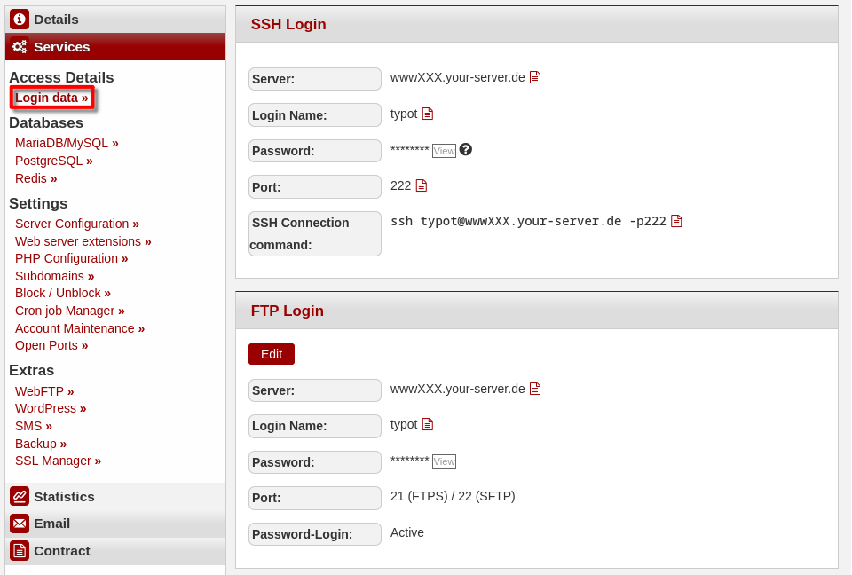
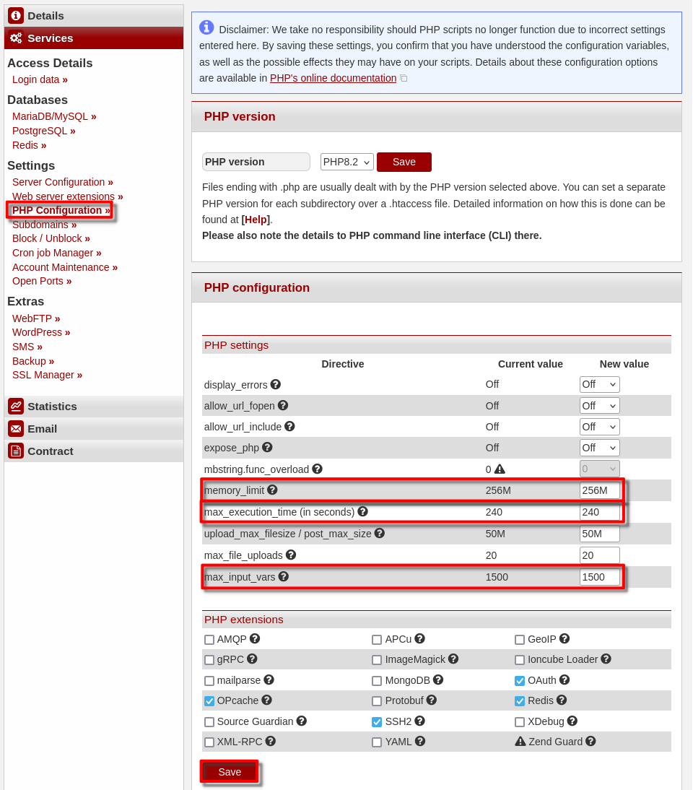
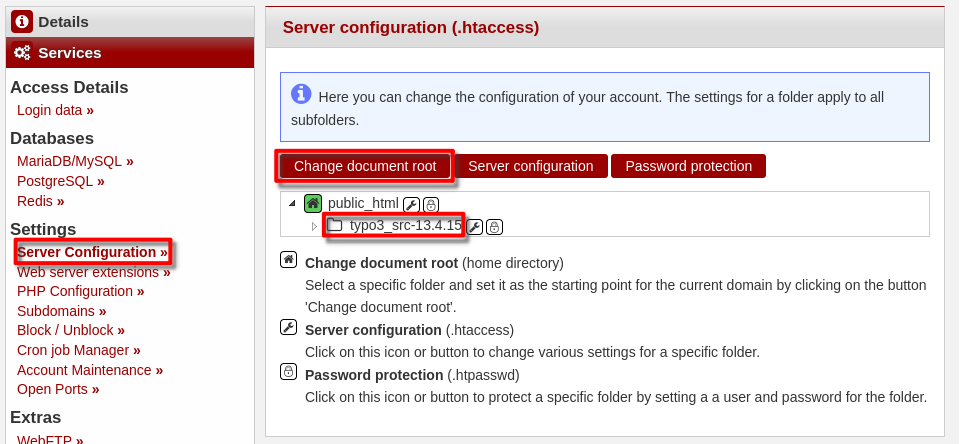

**What is TYPO3?**
TYPO3 is a performant and divers Content-Management-System (CMS). It specialises in The creation of websites like Blogs, online portals and intranets - all without deeper programming knowledge.
Get more information at: https://typo3.org 

**Example terminology**

* Benutzername: `typot`
* Hostname: `<wwwXXX>`
* Domain: `<example.com>`
* Subdomain: `<typo.example.com>`
    

#### TYPO3 installieren

To install [TYPO3](https://typo3.org/) you need a SSH connection to the server. The login details can be found in the  [konsoleH](https://konsoleh.hetzner.com/) under `Access details`→`Login data`.


##### Step 1 - Edit the PHP settings
* Open [konsoleH](https://konsoleh.hetzner.com/)
* Go to `Settings` > `PHP Configuration`
* Scroll down to "PHP settings" and set the folowing values:
  * `max_input_vars` to 1500
  * `memory_limit` to 256M
  * `max_execution_time` to 240<br>
    240 ist the recommended value from TYPO3. To set this, a Webhosting-Level9 is required.
 of  `may_input_vars` to 5000
* Scroll to the bottom and save the changes
  

##### Step 2 - Creating a database
* Stay in konsoleH.
* Select Services > MariaDB/MySQL
* Create a new Database (add)
* Confirm database creation (add)
* Keep the browser-tab open to enter the login credentials later.


##### Step 3 - Installing TYPO3
* **3.1** Downloading
  After the SSH connection hsa been established, the files can be downloaded. To do this, use the Curl-Command from https://get.typo3.org/version (Download via wget/curl) for the current version. Here's an example:
  ```bash
  typot@<wwwXXX>:~$ curl -L -o typo3_src.tgz https://get.typo3.org/<aktuelle version>
  ```
  
* **3.2** Unpacking
  After the `tar.gz`-Archive has been downloaded, it can be unpacked using this command:
  ```bash
  typot@<wwwXXX>:~$ tar -xf typo3_src.tgz
  ```
  There should now be a `typo_src`-Folder in your current directory.

* **3.3** Moving the files
  The `typo_src`-Folder can now be moved into the `public_html` directory.
  ```bash
  typot@<wwwXXX>:~$ mv typo3_src-* ~/public_html/typo
  ```
  After that, you can switch to the new directory:
  ```bash
  typot@<wwwXXX>:~$ cd ~/public_html/typo
  ```
    
* **3.4** To start the installation, you first have to initialize the package management tool:
  ```bash
  typot@<wwwXXX>:~$ composer install
  ```
    
* **3.5** After that, the setup-tool can be used as follows.
  ```bash
  typot@<wwwXXX>:~$ ./bin/typo3 setup
  ```
  You'll have to answer some questions for the setup:
  * Webserver: `apache`
  * Database Driver: `pdoMysql`
  * Database username: from konsoleH (e.g. `typot_1`)
  * Database password: from konsoleH (will not be displayed when writing, just press enter after pasting it)
  * Database port: default (just keep it empty, enter)
  * Database host: from konsoleH (e.g. `xxxx.your-database.de`)
  * Database to use: first (and only) Option; like konsoleH
  * Admin-Nutzername: Choose yourself
  * Admin-Passwort: Choose a safe password
  * Admin-Email: Your E-Mail
  * Create Basic Page?: URL (e.g. `http://typo.example.com/`) or keep empty

##### Step 4 - Changing the webroot
* Open [konsoleH](https://konsoleh.hetzner.com/) again
* Go to `Settings` > `Server Configuration`
* Select the directory `typo` beneath `public_html`.
* Click on "Change document root"
  

#### Next steps

If all works as expected, you can start using TYPO3! Under `http://typo.example.com/typo3/` you are able to administer your new CMS installation. There, type in your new admin access details and start configuring your site.

##### License: MIT

<!--

Contributor's Certificate of Origin

By making a contribution to this project, I certify that:

(a) The contribution was created in whole or in part by me and I have
    the right to submit it under the license indicated in the file; or

(b) The contribution is based upon previous work that, to the best of my
    knowledge, is covered under an appropriate license and I have the
    right under that license to submit that work with modifications,
    whether created in whole or in part by me, under the same license
    (unless I am permitted to submit under a different license), as
    indicated in the file; or

(c) The contribution was provided directly to me by some other person
    who certified (a), (b) or (c) and I have not modified it.

(d) I understand and agree that this project and the contribution are
    public and that a record of the contribution (including all personal
    information I submit with it, including my sign-off) is maintained
    indefinitely and may be redistributed consistent with this project
    or the license(s) involved.

Signed-off-by: Adrian Struwe <github@eskaan.de>

-->
