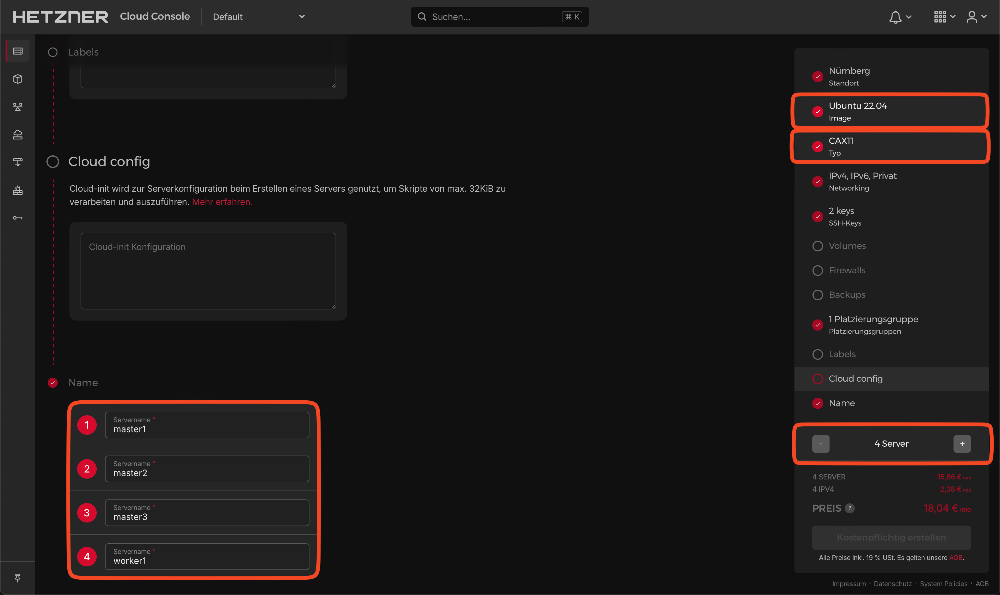
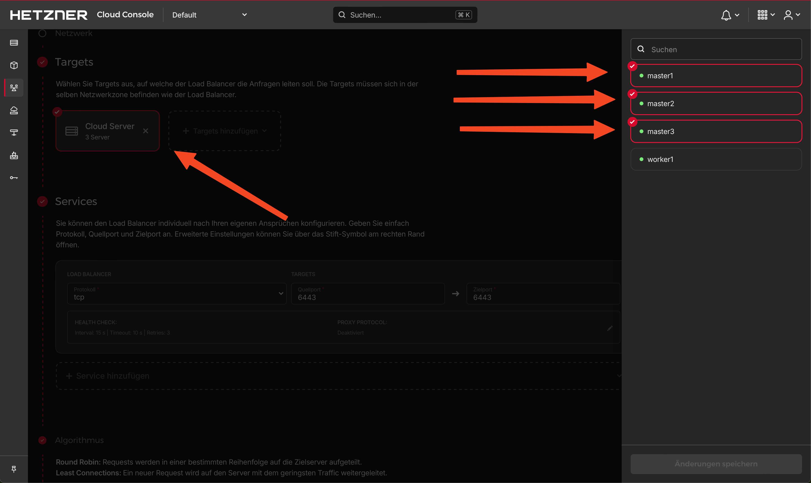
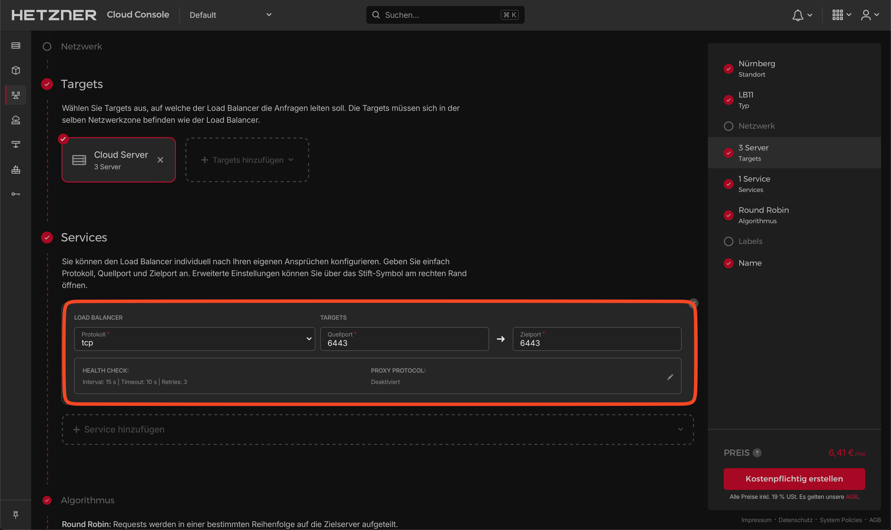

## Introduction

This tutorial guides you though the setup of a high-availability Kubernetes cluster with kubeadm.

We will create 4 cloud servers (3 control planes and 1 dedicated worker node). Furthermore we will use a Hetzner Cloud Load Balancer for the cluster API.

**Prerequisites**

* [Hetzner Cloud](https://console.hetzner.cloud) account
* Basic knowledge of the core concepts of [Kubernetes](https://kubernetes.io/docs/concepts/)

## Step 1 - Creation of Cloud Resources

First, we will set up the servers and the Load Balancer in the Hetzner Cloud Console.

* **Create the servers**
  
  We will use Ubuntu as our base OS and the CAX11 as the host type to meet the minimum requirements for Kubernetes (2 CPUs and 2GB RAM for the master nodes). If you depend on AMD64 architecture, you can also use those or mix and match them as you like.
  
  Please ensure you give your nodes unique names. To maximize availability, feel free to add the servers to the same [Placement Group](https://docs.hetzner.com/cloud/placement-groups/overview).

  

* **Create the Load Balancer**
  
  * Targets
    
    We specify that the Load Balancer will use our three control plane nodes as targets.
    
    
  
  * Service
    
    Use the following settings:

    **Protocol**: TCP<br>
    **Port**: 6443 ➔ 6443
    
    The server will listen on port `6443` for, e.g., new nodes. Thanks to the built-in health checks of the Load Balancer, we can be sure that the traffic will be forwarded to a ready server. This is especially useful when adding the remaining servers to the cluster later.
    
    

## Step 2 - Host preparation

Now, we will connect to the first node via SSH and go through the setup line by line. This process will be the same for every master and worker node. You are welcome to use the provided script in `Step 2.5` for the rest of the nodes.

### Step 2.1 - Load modules

In this step, we are loading two [necessary](https://kubernetes.io/docs/setup/production-environment/container-runtimes/#install-and-configure-prerequisites) kernel modules for Kubernetes: `overlay` and `br_netfilter`.

```bash
cat <<EOF | sudo tee /etc/modules-load.d/k8s.conf
overlay
br_netfilter
EOF

modprobe overlay
modprobe br_netfilter
```

> By adding these modules to `/etc/modules-load.d/k8s.conf`, we make sure that they are loaded at system startup. The `modprobe` commands load the modules immediately without requiring a reboot.

### Step 2.2 - Setup networking 

Following, we are setting up the networking for Kubernetes by creating a configuration file under `/etc/sysctl.d` . Finally, we apply these settings with the command `sysctl --system`.

```bash
cat <<EOF | sudo tee /etc/sysctl.d/k8s.conf
net.bridge.bridge-nf-call-iptables  = 1
net.bridge.bridge-nf-call-ip6tables = 1
net.ipv4.ip_forward                 = 1
EOF

sysctl --system
```

> These settings ensure that packet forwarding at the operating system level is enabled. They allow our network plugin to use iptables to route network traffic to and from Pods. IP forwarding allows an operating system to receive packets intended for other hosts and forward them to these.

### Step 2.3 - Container runtime

In this step, we are installing Docker as our container runtime for Kubernetes in order to run containers:

```bash
apt-get update && apt-get install -y docker.io
```

Next, we are configuring containerd, to manage container lifecycles. We create a new directory for its configuration files, generate a default configuration file, and modify it to use systemd for cgroup management:

```bash
mkdir /etc/containerd
containerd config default > /etc/containerd/config.toml
sed -i 's/ SystemdCgroup = false/ SystemdCgroup = true/' /etc/containerd/config.toml
```

> The `SystemdCgroup = true` setting ensures that containerd and Kubernetes use the same cgroup manager.

Finally, we restart containerd to apply the changes:

```bash
systemctl restart containerd
```

### Step 2.4 - Installation of kublet, kubectl and kubeadm

In this step, we are installing three key components of a Kubernetes cluster: `kubelet`, `kubectl`, and `kubeadm`.

- `kubelet` takes a set of PodSpecs and ensures that the containers described in them are running and healthy.

- `kubectl` is a command line interface for running commands against Kubernetes clusters.

- `kubeadm` is a tool built for creating Kubernetes clusters.

We follow the official [instructions](https://kubernetes.io/docs/setup/production-environment/tools/kubeadm/install-kubeadm/#installing-kubeadm-kubelet-and-kubectl):


```bash
apt-get update
apt-get install -y apt-transport-https ca-certificates curl gpg
mkdir -p -m 755 /etc/apt/keyrings
curl -fsSL https://pkgs.k8s.io/core:/stable:/v1.29/deb/Release.key | gpg --dearmor -o /etc/apt/keyrings/kubernetes-apt-keyring.gpg

echo 'deb [signed-by=/etc/apt/keyrings/kubernetes-apt-keyring.gpg] https://pkgs.k8s.io/core:/stable:/v1.29/deb/ /' | tee /etc/apt/sources.list.d/kubernetes.list

apt-get update
apt-get install -y kubelet kubeadm kubectl
apt-mark hold kubelet kubeadm kubectl
```

> The `apt-mark hold kubelet kubeadm kubectl` command is used to prevent the packages from being automatically updated, which could potentially disrupt the cluster.

Finally, we enable the kubelet service to start on boot:

```bash
systemctl enable --now kubelet
```

### Step 2.5 - Configuration of remaining nodes

You can use the following script to configure the rest of the nodes, as the setup process is identical. Simply save the script in a new file (e.g. `setup.sh`), give the file execution permissions (`chmod +x setup.sh`), and run the script (`./setup.sh`).

```bash
cat <<EOF | sudo tee /etc/modules-load.d/kubernetes.conf
overlay
br_netfilter
EOF

modprobe overlay
modprobe br_netfilter


cat <<EOF | sudo tee /etc/sysctl.d/kubernetes.conf
net.bridge.bridge-nf-call-ip6tables = 1
net.bridge.bridge-nf-call-iptables = 1
net.ipv4.ip_forward = 1
EOF

sysctl --system


apt-get update && apt-get install -y docker.io
mkdir /etc/containerd
containerd config default > /etc/containerd/config.toml
sed -i 's/ SystemdCgroup = false/ SystemdCgroup = true/' /etc/containerd/config.toml
systemctl restart containerd


apt-get update
apt-get install -y apt-transport-https ca-certificates curl gpg
mkdir -p -m 755 /etc/apt/keyrings
curl -fsSL https://pkgs.k8s.io/core:/stable:/v1.29/deb/Release.key | gpg --dearmor -o /etc/apt/keyrings/kubernetes-apt-keyring.gpg

echo 'deb [signed-by=/etc/apt/keyrings/kubernetes-apt-keyring.gpg] https://pkgs.k8s.io/core:/stable:/v1.29/deb/ /' | tee /etc/apt/sources.list.d/kubernetes.list

apt-get update
apt-get install -y kubelet kubeadm kubectl
apt-mark hold kubelet kubeadm kubectl
systemctl enable --now kubelet
```

## Step 3 - Kubernetes installation

We return to one of the master nodes and log in via SSH to start our cluster. For simplicity, we'll use the `CIDR` from the example Calico files.

> Calico is the network plugin we will be installing later. It uses the subnet `192.168.0.0/16`

The following command initializes the first [control plane](https://kubernetes.io/docs/setup/production-environment/tools/kubeadm/high-availability/#steps-for-the-first-control-plane-node)

```bash
kubeadm init --upload-certs \
  --pod-network-cidr=192.168.0.0/16 \
  --control-plane-endpoint=<ip_of_load_balancer>:6443
```

Now we have to copy the kubectl config to the right place:

```bash
mkdir -p $HOME/.kube
cp -i /etc/kubernetes/admin.conf $HOME/.kube/config
chown $(id -u):$(id -g) $HOME/.kube/config
```

## Step 4 - Install pod network add-on

We are going to use Calico as outlined in their [documentation](https://docs.tigera.io/calico/latest/getting-started/kubernetes/quickstart#install-calico). To do this, log into one of the master nodes via SSH and apply the example files.

```bash
kubectl create -f https://raw.githubusercontent.com/projectcalico/calico/v3.27.3/manifests/tigera-operator.yaml
kubectl create -f https://raw.githubusercontent.com/projectcalico/calico/v3.27.3/manifests/custom-resources.yaml
```

## Step 5 - Join the remaining nodes

As we move forward, we need the join token from the output of the initialization step or you can generate a new join token by running the following command on the master node:

```bash
kubeadm token create --print-join-command
kubeadm init phase upload-certs --upload-certs
```

The output will look something like this:

```bash
root@master1:~# kubeadm token create --print-join-command
kubeadm join <ip_of_load_balancer>:6443 --token cv4j9u.n3pc3qafv9tiba2l --discovery-token-ca-cert-hash sha256:4b256ee04455a8265ee6ef9597fcecc483dafec8c07fcff04dd10ee98c64164b

root@master1:~# kubeadm init phase upload-certs --upload-certs
[upload-certs] Storing the certificates in Secret "kubeadm-certs" in the "kube-system" Namespace
[upload-certs] Using certificate key:
a18bca2c94281986f070342c3400c81660cf36dfe8bc48383d43a32ae69deb7d
```

### Step 5.1 - Join the two master nodes

Now we copy the join command and add the flag `--control-plane` with the `--certificate-key` to the nodes we want to use as master nodes.

```bash
kubeadm join <ip_of_load_balancer>:6443 --token cv4j9u.n3pc3qafv9tiba2l \
--discovery-token-ca-cert-hash sha256:4b256ee04455a8265ee6ef9597fcecc483dafec8c07fcff04dd10ee98c64164b \
--control-plane --certificate-key a18bca2c94281986f070342c3400c81660cf36dfe8bc48383d43a32ae69deb7d
```

### Step 5.2 - Join the worker node(s)

The process is the same here, but WITHOUT the `--control-plane` flag.

```bash
kubeadm join <ip_of_load_balancer>:6443 --token cv4j9u.n3pc3qafv9tiba2l \
--discovery-token-ca-cert-hash sha256:4b256ee04455a8265ee6ef9597fcecc483dafec8c07fcff04dd10ee98c64164b
```

## Conclusion

At this point, you should have a functioning Kubernetes cluster running in the cloud.

```bash
root@master1:~# kubectl get nodes
NAME      STATUS   ROLES           AGE     VERSION
master1   Ready    control-plane   5m13s   v1.29.3
master2   Ready    control-plane   81s     v1.29.3
master3   Ready    control-plane   70s     v1.29.3
worker1   Ready    <none>          28s     v1.29.3
```

##### License: MIT

<!--

Contributor's Certificate of Origin

By making a contribution to this project, I certify that:

(a) The contribution was created in whole or in part by me and I have
    the right to submit it under the license indicated in the file; or

(b) The contribution is based upon previous work that, to the best of my
    knowledge, is covered under an appropriate license and I have the
    right under that license to submit that work with modifications,
    whether created in whole or in part by me, under the same license
    (unless I am permitted to submit under a different license), as
    indicated in the file; or

(c) The contribution was provided directly to me by some other person
    who certified (a), (b) or (c) and I have not modified it.

(d) I understand and agree that this project and the contribution are
    public and that a record of the contribution (including all personal
    information I submit with it, including my sign-off) is maintained
    indefinitely and may be redistributed consistent with this project
    or the license(s) involved.

Signed-off-by: [Sebastian sebastian@youngandhungry.org]

--> 
