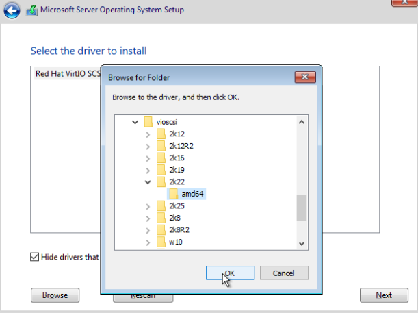
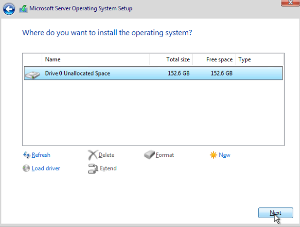

## Introduction

This tutorial explains how to install Windows Server on a Hetzner Cloud server using the Hetzner Cloud Console, ISO images, and VirtIO drivers. By following these steps, you will have a fully functional Windows Server instance ready for use, with all necessary drivers installed.

---

## Prerequisites

- Hetzner Cloud account and access to the [Cloud Console](https://console.hetzner.com)
- Windows Server ISO available in Hetzner's ISO library
- VirtIO drivers ISO available in Hetzner's ISO library
- SSH key for initial server setup

---

## Step 1: Create a New Server

1. Log in to the [Hetzner Cloud Console](https://console.hetzner.com).
2. Click **Create Server**.
3. Select your server location.
4. For the image, select **Ubuntu 24.04** (this is temporary, as you will install Windows later).
5. Choose your server type (Shared vCPU or Dedicated vCPU) and size.
6. Under Networking, ensure **Public IPv4** is selected (required). Public IPv6 and Private Networks are optional.
7. Upload your SSH key.
8. Name your server and click **Create & Buy Now**.

---

## Step 2: Mount the Windows Server ISO

1. Once the server is created and running, go to the **ISO Images** tab in the server page.
2. Search for "Windows" and select your desired Windows Server version (e.g., Windows Server 2022 English).
3. Click the red **Mount** button to attach the Windows installation ISO to the virtual CD/DVD-ROM.
4. Wait until the ISO is fully mounted.
5. Click the **Console** button (<kbd>>_</kbd> icon).

6. In the Console window, check **GUI-Mode**.
7. Restart the server by clicking the **Ctrl + Alt + Del** button in the Console window.

---

## Step 3: Start the Windows Installation

1. When you see the message "Press any key to boot from CD or DVD..." in the Console, press any key to start the Windows Server installation.
2. Click **Install Now**.
3. Select your desired operating system version (e.g., Windows Server 2022 Standard (Desktop Experience)).
4. Click **Next** and accept the license terms.
5. Click **Custom: Install Windows only (advanced)**.

---

## Step 4: Load VirtIO Storage Drivers

1. To load storage drivers, you need to mount the VirtIO drivers ISO:
   - Go to the **ISO Images** tab in the Hetzner Cloud Console.
   - Search for "virtio-win" and select the latest version (e.g., virtio-win-0.1.271.iso).
   - Click **Mount** to attach the VirtIO drivers ISO.

2. In the Windows installer, click Load Driver.

3. Click Browse.

4. Expand the **CD Drive** and select the driver from `vioscsi --> 2k22 --> amd64`.
5. Click **OK**.

Select Driver

6. Click Next.

---

## Step 5: Complete the Installation

1. Go back to the Hetzner Cloud Console and re-mount your Windows Server ISO.
2. In the Windows installer, delete all partitions until only one unallocated disk remains.

Click Next to start Windows Server Installation

4. Wait for the installation to complete and log in to your new Windows Server.

---

## Step 6: Install Missing Drivers

1. Mount the VirtIO drivers ISO again in the Hetzner Cloud Console.
2. In Windows, open **Server Manager** > **Tools** > **Computer Management** > **Device Manager**.
3. For each missing driver:
   - Right-click the missing device and select **Update driver**.
   - Choose **Browse my computer for drivers**.
   - Click **Browse** and select the **CD Drive** with the VirtIO drivers.
   - Click **OK** and repeat for all missing drivers.

Missing Drivers

Browse

Select CD Drive

---

## Step 7: Enable RDP

1. Enable Remote Desktop Protocol (RDP) in Windows Server to allow remote connections.
2. You can now connect to your server using Remote Desktop.

---

## Conclusion

You have successfully installed Windows Server on a Hetzner Cloud server, installed all necessary drivers, and enabled RDP for remote access. Your server is now ready for use.

---

##### License: MIT
