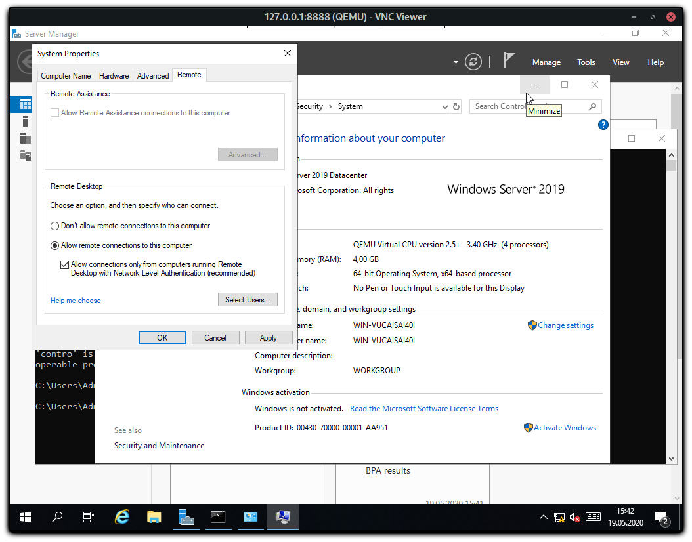

## Einführung

In diesem Tutorial geht es um die Installation eines Windows Betriebssystems auf dedizierter Hardware ohne den gebrauch einer KVM Konsole.

**Voraussetzungen**

+ Einen Dedizierten Server im Rescue System
+ Mehr als 8 GB RAM im Server

## Schritt 1 - Server Vorbereiten

Sobald sich der Server im Rescue System befindet (Linux x64), muss folgende Software installiert werden.

```bash
apt update && apt install qemu-kvm
```

Als nächstes muss eine Windows ISO auf den Server übertragen werden. Mögliche Optionen wären:

+ Hochladen per sFTP
+ Einbinden eines SMB / NFS Speichers (Storage Box)
+ Das Herunterladen der ISO von Microsoft / Hetzner

> Auf dem Hetzner Mirror befinden sich auch Windows ISOs (diese können nur vom Hetzner Netz aus heruntergeladen werden):
>
> Windows Server 2022 (ENG): https://mirror.hetzner.de/bootimages/windows/SW_DVD9_Win_Server_STD_CORE_2022_2108.15_64Bit_English_DC_STD_MLF_X23-31801.ISO
>
> Windows Server 2019 (ENG): https://mirror.hetzner.de/bootimages/windows/SW_DVD9_Win_Server_STD_CORE_2019_1809.11_64Bit_English_DC_STD_MLF_X22-51041.ISO
>
> Windows Server 2016 (ENG): https://mirror.hetzner.de/bootimages/windows/SW_DVD9_Win_Server_STD_CORE_2016_64Bit_English_-4_DC_STD_MLF_X21-70526.ISO

Sie können das Image mit wget oder curl herunterladen:

```bash
wget <image>
```

Anschließend muss die Systemfestplatte noch vorbereitet werden. Hier muss eine Partitionstabelle angelegt werden.
> **Achtung** bei folgenden Schritten werden alle Daten der Festplatte gelöscht.

Wenn der Server eine Nvme Festplatte verbaut hat, ändert sich der Name der Festplatte zum Beispiel zu: /dev/nvme0n1. Den Namen der Festplatte können Sie damit herrausfinden:

```bash
lsblk
```

Starten von `parted` auf der gewünschten Festplatte:

```bash
parted /dev/sda
```

Erstellen der Partitionstabelle bei Festplatten kleiner 2 TB:

```bash
mklabel msdos
```

Erstellen der Partitionstabelle bei Festplatten größer 2 TB:

```bash
mklabel gpt
```

Das ganze sollte dann in etwa so aussehen:

```shellsession
root@rescue ~ # parted /dev/sda
GNU Parted 3.2
Using /dev/sda
Welcome to GNU Parted! Type 'help' to view a list of commands.
(parted) [mklabel msdos]
Warning: The existing disk label on /dev/sda will be destroyed and all data on this disk will be
lost. Do you want to continue?
Yes/No? [yes]
(parted) [quit]
Information: You may need to update /etc/fstab.
```

> Alle Eingaben sind mit `[ ]` umrandet

## Schritt 2 - Herstellen eines SSH Tunnels

Um später die installation per VNC durchzuführen wird ein SSH Tunnel benötigt.
Andernfalls ist die installation frei im Internet aufrufbar.

Unter Linux und Windows mit installiertem OpenSSH genügt es den folgende Befehl lokal auszuführen und sich am Server anzumelden.

```bash
ssh -L 8888:127.0.0.1:5901 root@your_host
```

## Schritt 3 - Starten der Windows Installation

Jetzt kann mit der eigentlichen Windows Installation gestartet werden.
Dazu muss nun folgender Befehl (entsprechend abgeändert) auf dem Server ausgeführt werden.

```bash
qemu-system-x86_64 -enable-kvm -smp 4 -m 5000 -boot d -cdrom en_windows_server_2019_updated_sept_2019_x64_dvd_199664ce.iso -drive file=/dev/sda,format=raw,media=disk -vnc 127.0.0.1:1
```

| Optionen ||
|---|---|
| -smp   | Anzahl der CPU Kerne
| -m     | Große des verwendeten RAMs
| -cdrom | Pfad zum ISO Image
| -drive | Festplatte auf der das System installiert werden soll
| -vnc   | VNC Server Einstellungen

Als nächstes kann die Installation per VNC gestartet werden, dazu muss man sich mit einem VNC Viewer der wahl zur folgenden Adresse verbinden.

```
127.0.0.1:8888
```

## Schritt 4 - Automatische IP Konfiguration

Damit wenn der Server von der Windows installation Bootet auch die richtige Netzwerkkonfiguration bekommt, muss ein Scheduled Task angelegt werden der das folgende PowerShell Script ausführt.

```powershell
foreach($Adapter in Get-NetAdapter)
{
    New-NetIPAddress –IPAddress [IPAdresse] -DefaultGateway [Gateway] -PrefixLength [CIDR] -InterfaceIndex $Adapter.InterfaceIndex
}
```

Die Werte in den Klammern müssen entsprechend angepasst werden und das Script sollte dann unter `C:\script.ps1` abgelegt werden.

Die Einrichtung des Scheduled Tasks erfolgt anhand dieser Schritte:

1. Startoptionen festlegen.

    

2. Aktion Festlegen.

    

3. PowerShell optionen eintragen `-ExecutionPolicy Bypass -File C:\script.ps1`.

    

4. Task optionen Übersicht.

    

5. Sicherheitsoptionen hier sollte Eingestellt werden, dass das Script auch ohne eine Benutzeranmeldung startet.

    

## Schritt 5 - Netzwerk Treiber installieren
Es kann die möglichkeit bestehen das Windows nicht mit den erforderlichen Netzwerktreibern ausgeliefert wird. Sodass, nach dem Booten der Server nachwievor kein Internet haben kann.

1. Um dieses Problem zu umgehen, sollten Sie sich im Robot Panel einloggen und anschließend den Netzwerkadapter herausfinden:
    
      In diesem Fall heißt der Adapter 1 Gbit I219-LM von Intel. Anschließend laden Sie das komplette Treiberpaket für alle Netzwerkadapter für Ethernet von der offiziellen Internetseite von Intel herunter und entpacken Sie dieses Treiberpaket.
2. Öffnen Sie nun den Geräte-Manager. Unter dem Reiter Netzwerkadapter befindet sich der aktuell genutzte Netzwerkadapter. Dieser Name kann vom im Bild gezeigten abweichen
   Klicken Sie mit der rechten Maustaste auf diesen Adapter, um das Kontextmenü zu öffnen. Wählen Sie "Treiber aktualisieren" aus.
   
3. Wählen Sie nun "Auf dem Computer nach Treibersoftware suchen" aus.
   
4. Anschließend wählen Sie "Von einer Liste von Treibern auf dem Computer auswählen".
5. Klicken Sie auf "Datenträger" und wählen Sie "Durchsuchen" aus.
* 6. Navigieren Sie zu dem Treiberpaket, das Sie im Schritt 5.1 heruntergeladen und entpackt haben.
* 7. Für Intel und einen 1-GBit-Netzwerkadapter gehen Sie zum Ordner "Pro1000", dann zum Unterordner "Winx64". 
* 8. In dem Ordner "Winx64" finden Sie für die jeweiligen Windows-Versionen die einzelnen Treiber. 
9. Um den passenden Treiber für Ihre Windows-Version zu finden, öffnen Sie im Explorer die Readme.txt-Datei, um die Windows-Version herauszufinden, die Sie verwenden, und ob der Treiber für die Netzwerkadapter für diese Windows-Version vorhanden ist.
   
10. Gegenbenfalls nehmen Sie den Haken für "Kompatible Hardware anzeigen" heraus.
11. Finden Sie die passenden Treiber für die Netzwerkkarte des dedizierten Servers.
   
12. Drücken Sie auf "Weiter", auch wenn Windows sagt, dass es nicht kompatibel ist. Sie können diese Meldung ignorieren, da der aktuelle nur emuliert ist. 

## Schritt 6 - RDP Aktivieren & Firewall Deaktivieren

Um später per RDP auf den Server zu verbinden muss diese aktiviert werden:



Um weitere Fehlerquellen zu minimierern macht es sinn die Windows Firewall vor dem Neustart zu deaktivieren (dies ist aber optional).

Nun kann Windows heruntergefahren werden und im anschluss der Server neugestartet werden.
Nach ein paar minuten sollte es möglich sein sich per RDP zum Server zu verbinden.

## Schritt 7 - Script Deaktivierend

Nun sollte der Scheduled Task wieder Deaktiviert werden und die Firewall entsprechend überprüft und wieder eingeschlatet werden.
In den Netzwerkeinstellungen sollten auch noch DNS Server hinterlegt werden, da diese mit dem Script nicht gesetzt wurden.

## Fazit

In diesem Tutorial wurde die Installation eines Windows Betriebssystems ohne den einsatz einer KVM Konsole behandelt.

##### License: MIT

<!--

Contributor's Certificate of Origin

By making a contribution to this project, I certify that:

(a) The contribution was created in whole or in part by me and I have
    the right to submit it under the license indicated in the file; or

(b) The contribution is based upon previous work that, to the best of my
    knowledge, is covered under an appropriate license and I have the
    right under that license to submit that work with modifications,
    whether created in whole or in part by me, under the same license
    (unless I am permitted to submit under a different license), as
    indicated in the file; or

(c) The contribution was provided directly to me by some other person
    who certified (a), (b) or (c) and I have not modified it.

(d) I understand and agree that this project and the contribution are
    public and that a record of the contribution (including all personal
    information I submit with it, including my sign-off) is maintained
    indefinitely and may be redistributed consistent with this project
    or the license(s) involved.

Signed-off-by: markus@omg-network.de

-->
