## Introduction

This tutorial covers the installation of a Windows operating system on dedicated hardware without using a KVM console.

**Prerequisites**

+ A dedicated server running in a Rescue System
+ More than 8 GB RAM in the server

## Step 1 - Prepare Server

Once the server is in the Rescue System (Linux x64), the following software must be installed:

```bash
apt update && apt install qemu-kvm
```

Next, a Windows ISO must be transferred to the server. Possible options are:

+ Upload via sFTP
+ Mount an SMB / NFS storage (Storage Box)
+ Downloading the ISO from Microsoft / Hetzner

> Windows Server 2022 (ENG): https://mirror.hetzner.de/bootimages/windows/SW_DVD9_Win_Server_STD_CORE_2022_2108.15_64Bit_English_DC_STD_MLF_X23-31801.ISO
>
> Windows Server 2019 (ENG): https://mirror.hetzner.de/bootimages/windows/SW_DVD9_Win_Server_STD_CORE_2019_1809.11_64Bit_English_DC_STD_MLF_X22-51041.ISO
>
> Windows Server 2016 (ENG): https://mirror.hetzner.de/bootimages/windows/SW_DVD9_Win_Server_STD_CORE_2016_64Bit_English_-4_DC_STD_MLF_X21-70526.ISO

You can download the image with wget or curl for example:

```bash
wget <image>
```

The system drive still has to be prepared after connecting the ISO. A partition table must be created.

> **Attention** All data on the drive(s) will be deleted during the next steps.

If the server has an NVME drive installed, the name of the drive may be `/dev/nvme0n1` instead of `/dev/sda`.
To get the names of the drives, you can run `lsblk`.

Start `parted` on the desired drive:

```bash
parted /dev/sda
```

Creating the partition table for drives smaller than 2 TB:

```bash
mklabel msdos
```

Creating the partition table for drives larger than 2 TB:

```bash
mklabel gpt
```

The whole thing should look something like this:

```shellsession
root@rescue ~ # parted /dev/sda
GNU Parted 3.2
Using /dev/sda
Welcome to GNU Parted! Type 'help' to view a list of commands.
(parted) [mklabel msdos]
Warning: The existing disk label on /dev/sda will be destroyed and all data on this disk will be
lost. Do you want to continue?
Yes/No? [yes]
(parted) [quit]
Information: You may need to update /etc/fstab.
```

> All inputs are bordered with `[ ]`

## Step 2 - Creating an SSH tunnel

For later installation via VNC an SSH tunnel is required. Otherwise, the installation can be accessed openly over the Internet.

On Linux and Windows with OpenSSH installed, simply run the following command locally and log on to the server:

```bash
ssh -L 8888:127.0.0.1:5901 root@your_host
```

## Step 3 - Starting the Windows installation

Now you can start with the actual Windows installation. First, check if your machine uses UEFI or BIOS to boot:

```bash
[ -d "/sys/firmware/efi" ] && echo "UEFI" || echo "BIOS"
```

Now, execute one of the following commands (modified accordingly) on the server:

* With BIOS:
  ```bash
  qemu-system-x86_64 -enable-kvm -smp 4 -m 4096 -boot d -cdrom SW_DVD9_Win_Server_STD_CORE_2022_2108.15_64Bit_English_DC_STD_MLF_X23-31801.ISO -drive file=/dev/sda,format=raw,media=disk -vnc 127.0.0.1:1
  ```

* With UEFI:
  ```bash
  qemu-system-x86_64 -bios /usr/share/ovmf/OVMF.fd -enable-kvm -smp 48 -m 16g -boot d -cdrom SW_DVD9_Win_Server_STD_CORE_2022_2108.15_64Bit_English_DC_STD_MLF_X23-31801.ISO -drive file=/dev/sda,format=raw,media=disk -vnc 127.0.0.1:1
  ```

| Option | Meaning              |
| ------ | -------------------- |
| -smp   | Number of CPU cores  |
| -m     | Size of the used RAM |
| -cdrom | Path to ISO image    |
| -drive | hard disk on which the system is to be installed |
| -vnc   | VNC Server Settings  |

Next, you can start the installation via VNC. You can connect to a VNC viewer of your choice at the following address: `127.0.0.1:8888`.

## Step 4 - Automatic IP configuration

You have to create a scheduled task that executes the PowerShell script below. This script will add the correct network configuration to the server when it boots from the Windows installation.

```powershell
foreach($Adapter in Get-NetAdapter)
{
    New-NetIPAddress –IPAddress [IPAdresse] -DefaultGateway [Gateway] -PrefixLength [CIDR] -InterfaceIndex $Adapter.InterfaceIndex
}
```

The values in the brackets must be adjusted accordingly and the script should then be stored under 'C:\script.ps1'.

Use these steps to set up the scheduled task:

1. Set startup options

    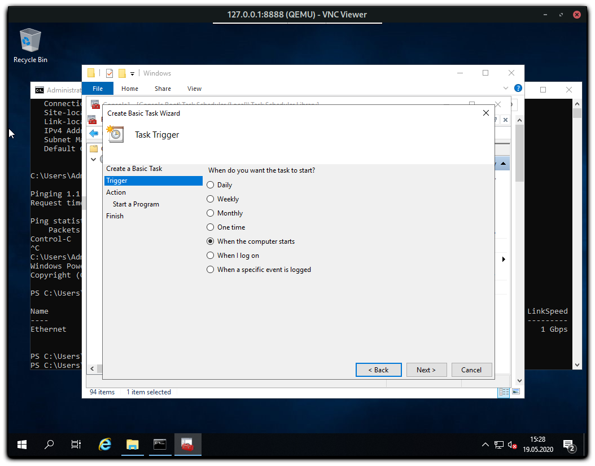

2. Define actions

    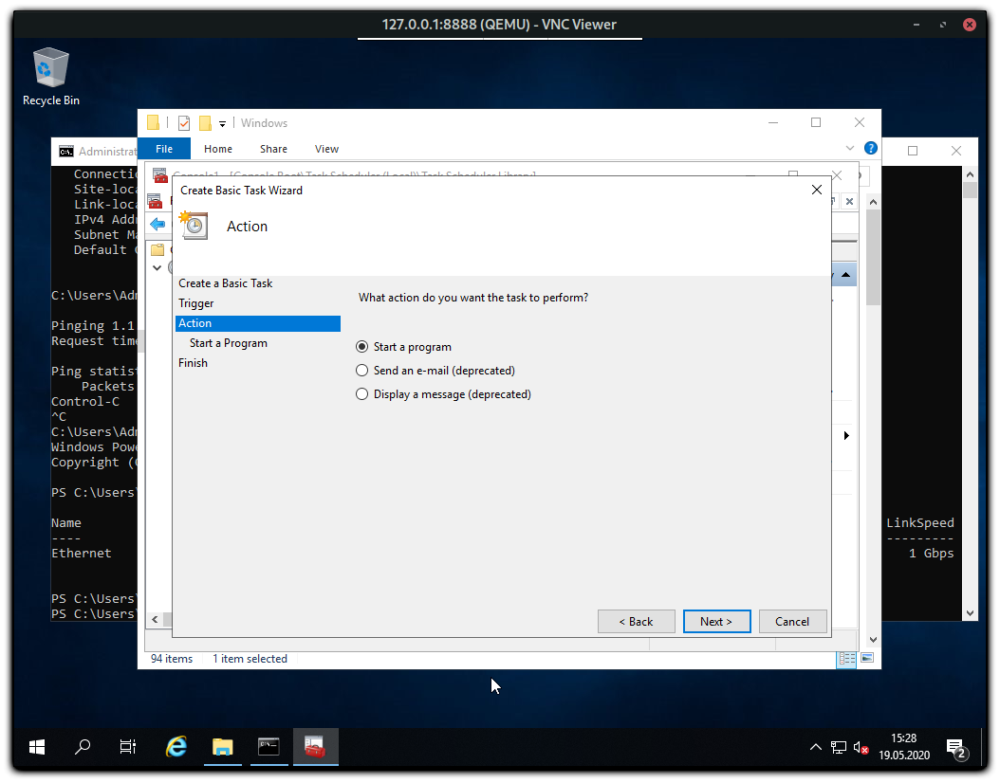

3. Enter PowerShell options `-ExecutionPolicy Bypass -File C:\script.ps1`

    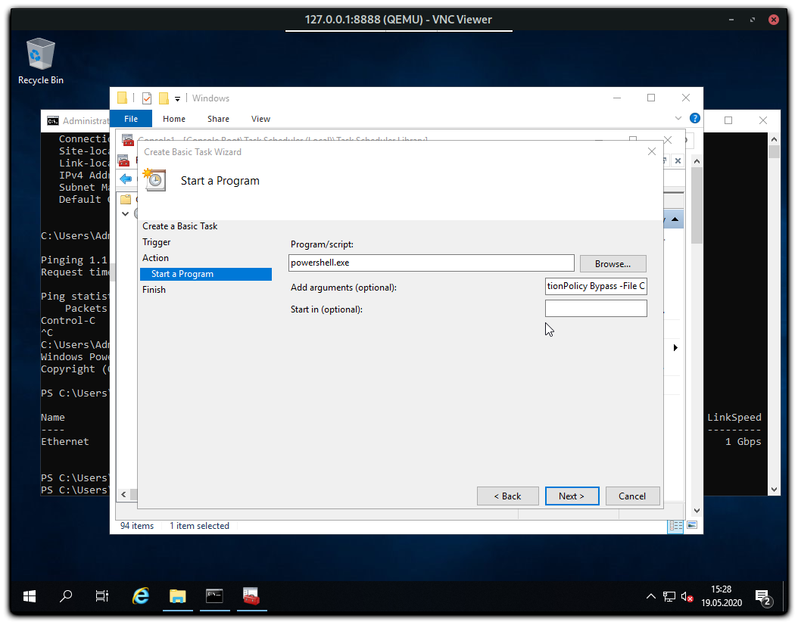

4. Task options overview

    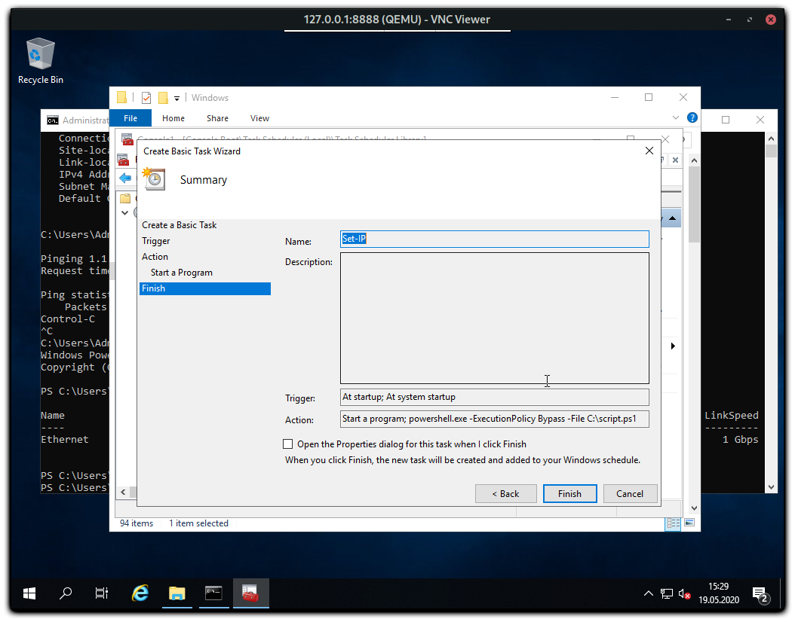

5. Security options should be set so that the script also starts without a user login.

    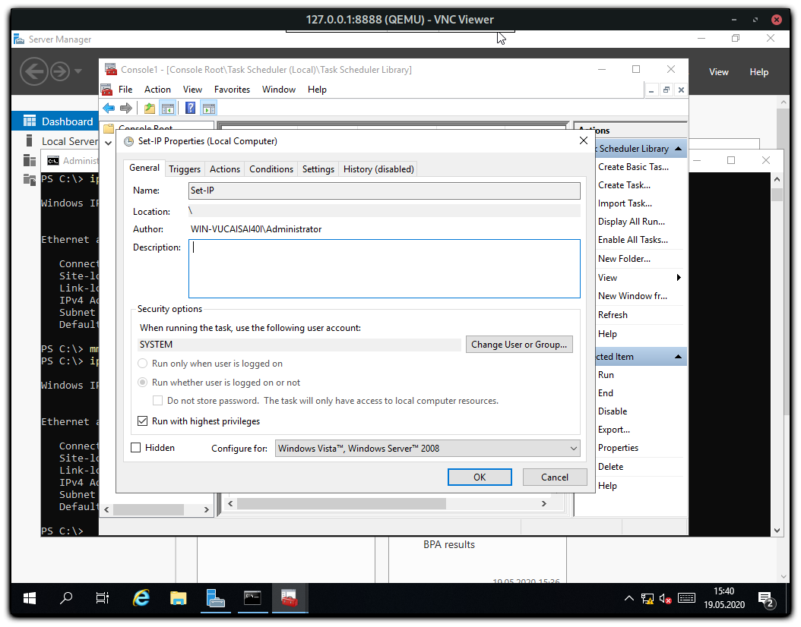

## Step 5 - Installing Network drivers

It is possible that Windows does not have the required network drivers installed. Therefore, if you reboot after Step 6 it is possible that the Server still has no Internet connection.

1. To mitigate this problem, you should first find out the name of the network adapter:
   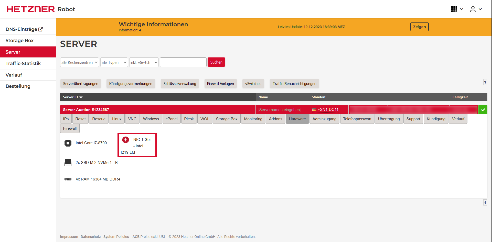
   In this case, the adapter is called 1 Gbit I219-LM made by Intel. Download the complete network ethernet drivers from the official Intel website and unzip the driver pack.
2. Open the Device Manager. You should find the currently used network driver under "Network adapters". The name can differ from the one shown in the picture. 
   Right click on that network adapter and choose "Update Driver". 
   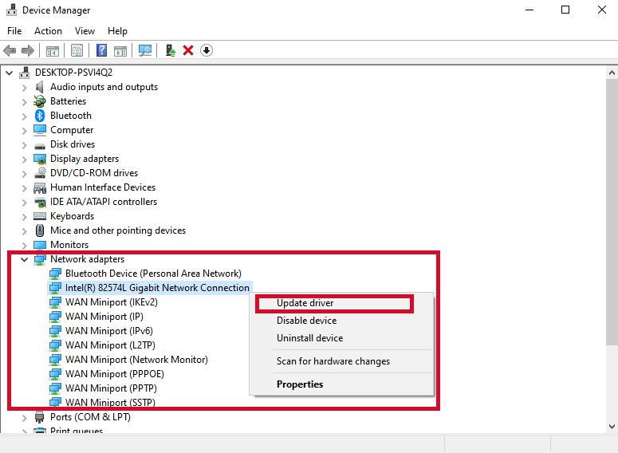
3. Now choose "Browse my computer for drivers"
4. Click on the option "Let me pick from a list of available drivers on my computer".
   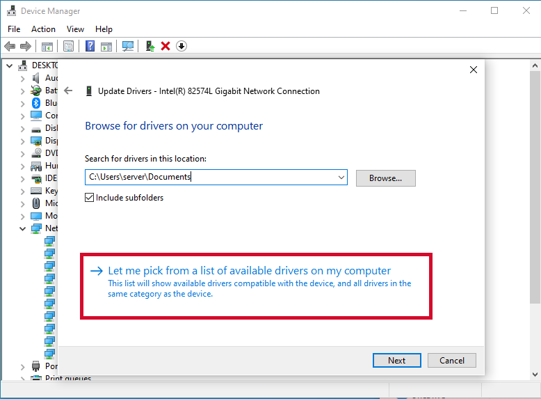
5. Press on the "Have Disk" button followed by "Browse".
   * Navigate to the driver pack that was downloaded and unzipped in Step 5.1.
   * For Intel and 1-Gbit Network Adapters, open the folder "Pro1000", and then the subfolder "Winx64".
   * In "Winx64", you should find the Windows versions for each driver.
6. In order to get the correct driver version, open the downloaded driver pack in a new window and look at Readme.txt. At the top of the file it says the windows version and if the driver for the network adapters is available for that Windows version.
   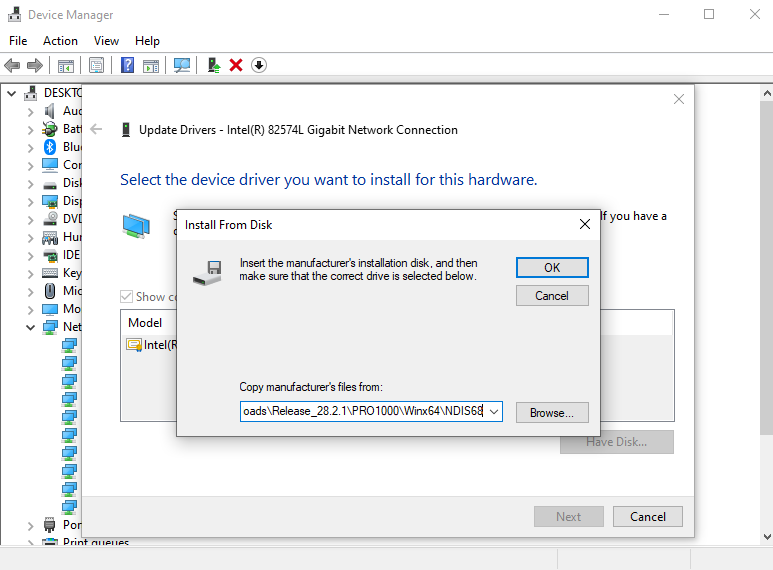
7. Click on one of the files and hit OK.
8. Find the correct driver for the network adapter of your dedicated server. Sometimes you have to uncheck "Show compatible hardware".
    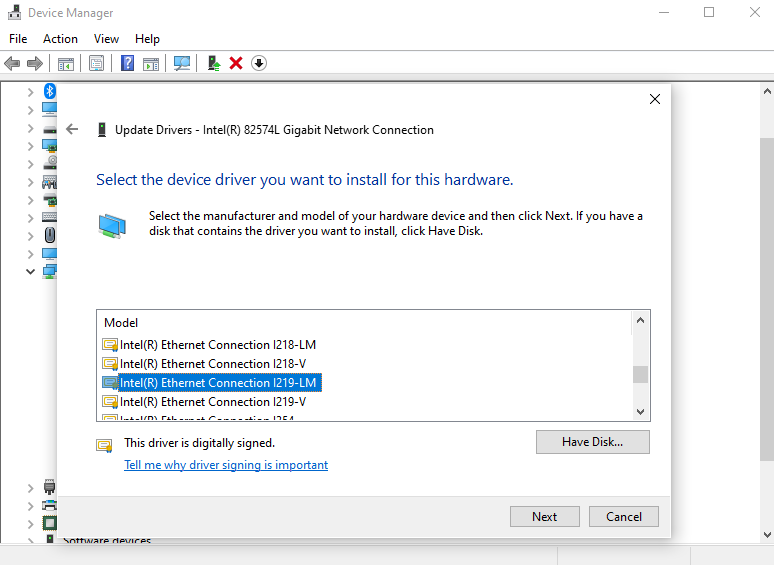
9.  Now press "next", even if Windows says that it might not be compatible. You can ignore the message as the current adapter is emulated.

## Step 6 - Enable RDP & Disable Firewall

To connect to the server via RDP later, you need to activate this:

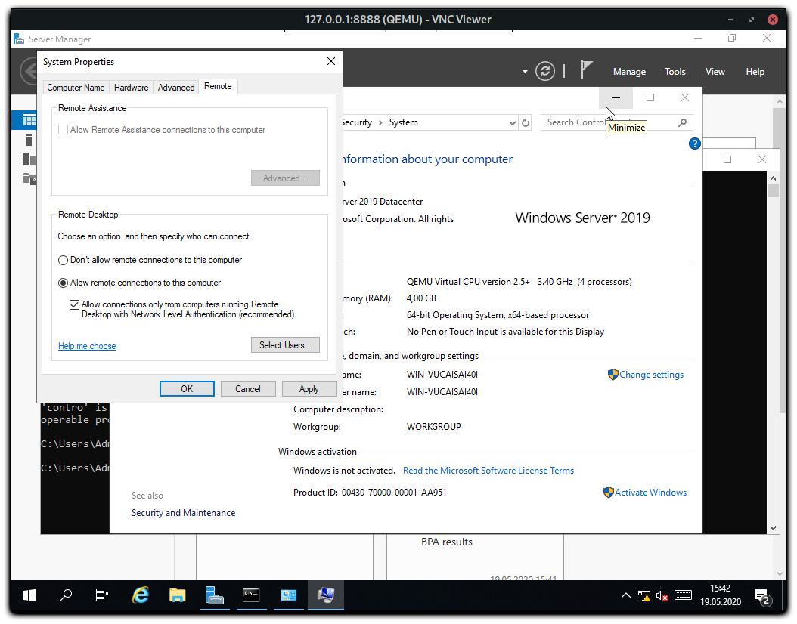

To minimize further sources of error it makes sense to deactivate the Windows Firewall before restarting (but this is optional).

Now you can shutdown Windows and restart the server. After a few minutes it should be possible to connect to the server via RDP.

## Step 7 - Disable script

You should now deactivate the scheduled task again and check the firewall accordingly and switch it on again.
In the network settings, you should define the DNS servers, as these were not set with the script.

## Conclusion

This tutorial covered the installation of a Windows operating system without the use of a KVM console.

##### License: MIT

<!--

Contributor's Certificate of Origin

By making a contribution to this project, I certify that:

(a) The contribution was created in whole or in part by me and I have
    the right to submit it under the license indicated in the file; or

(b) The contribution is based upon previous work that, to the best of my
    knowledge, is covered under an appropriate license and I have the
    right under that license to submit that work with modifications,
    whether created in whole or in part by me, under the same license
    (unless I am permitted to submit under a different license), as
    indicated in the file; or

(c) The contribution was provided directly to me by some other person
    who certified (a), (b) or (c) and I have not modified it.

(d) I understand and agree that this project and the contribution are
    public and that a record of the contribution (including all personal
    information I submit with it, including my sign-off) is maintained
    indefinitely and may be redistributed consistent with this project
    or the license(s) involved.

Signed-off-by: markus@omg-network.de

-->
