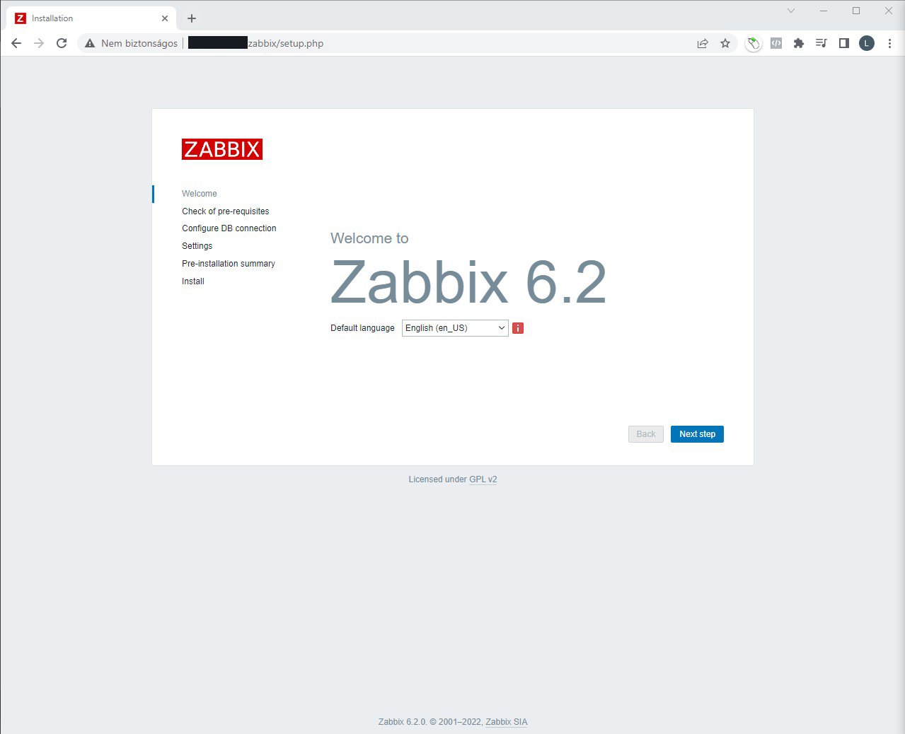
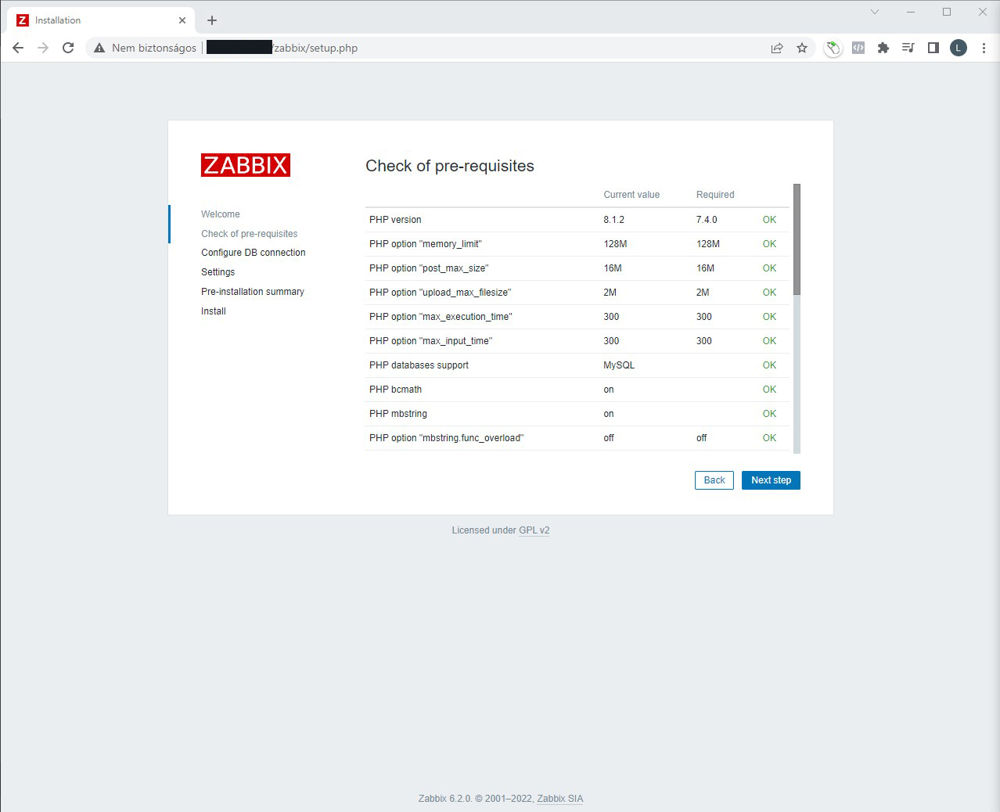
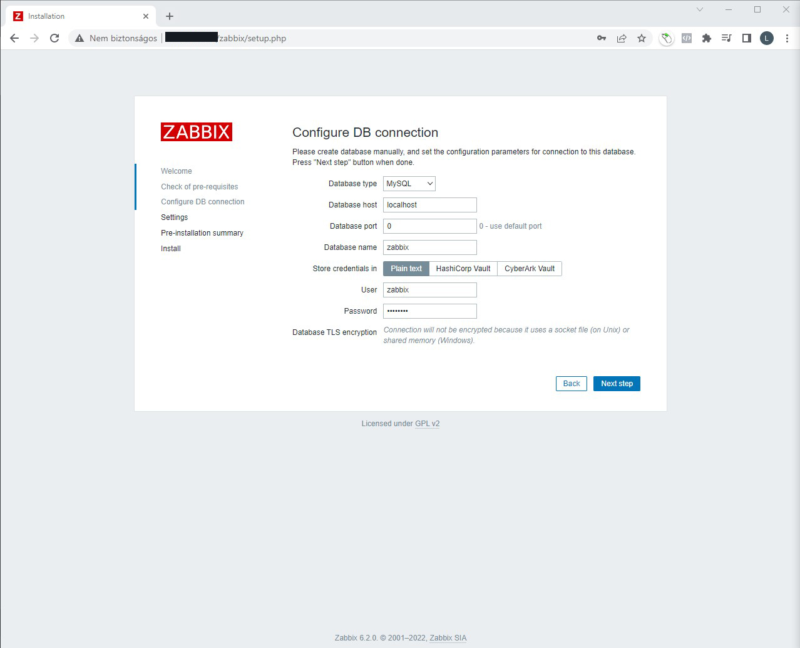
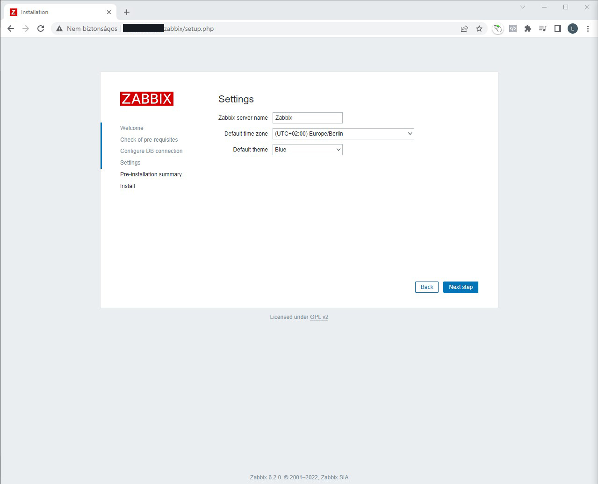
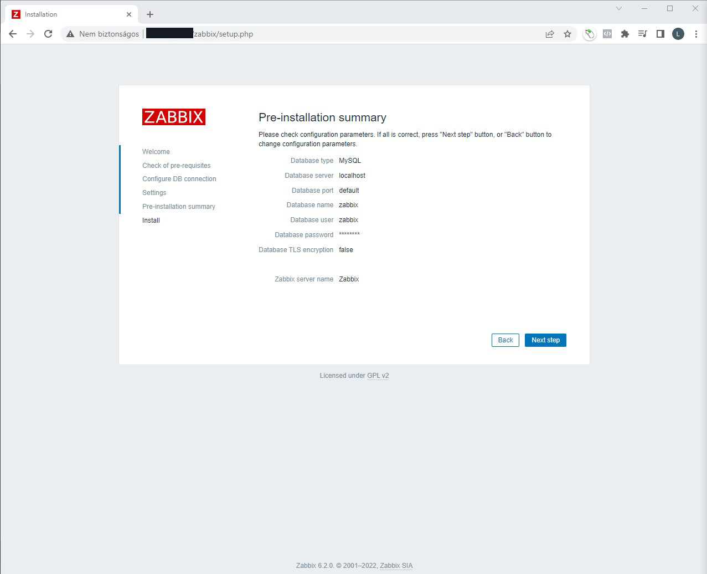
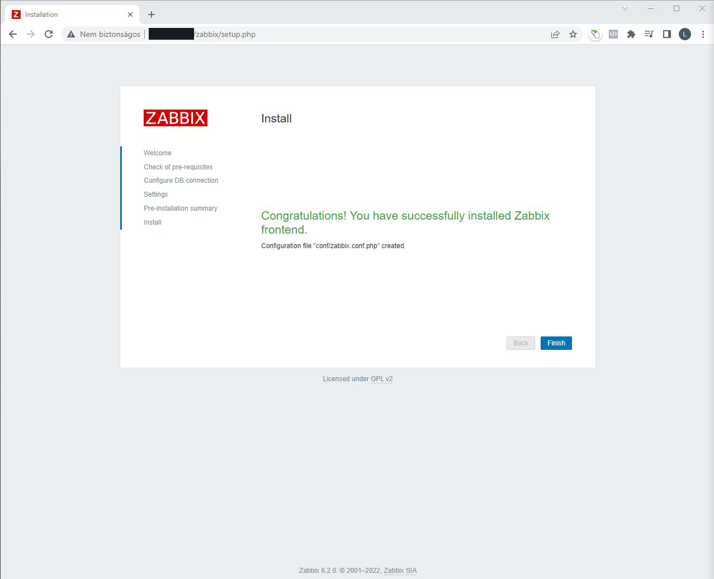
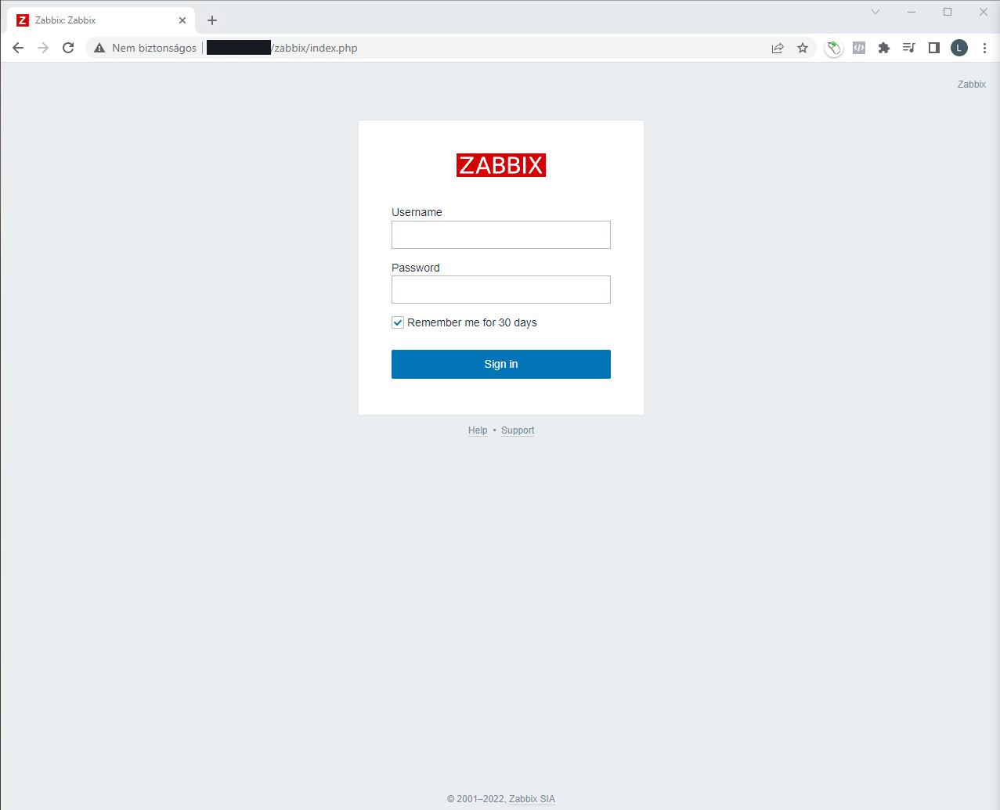
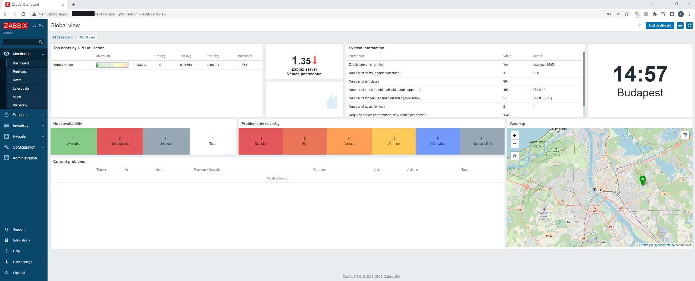

## Introduction

Zabbix is an open source monitoring software tool for diverse IT components, including networks, servers, virtual machines (VMs) and cloud services. Zabbix provides monitoring metrics, such as network utilization, CPU load and disk space consumption.

## Step 1 - Install MySQL server

Install MySQL 8.0 server with:

```bash
apt-get update
apt-get install -y mysql-server
```

Enable native password authentication by running:

```bash
echo "default-authentication-plugin=mysql_native_password" >> /etc/mysql/mysql.conf.d/mysqld.cnf
```

Restart MySQL server:

```bash
service mysql restart
```

Then change the empty password for MySQL root user to some secure password:
```bash
mysql -e "ALTER USER 'root'@'localhost' IDENTIFIED WITH mysql_native_password by 'securepassword';"
```

Then run a simple security script that will remove some dangerous defaults and lock down access to our database system a little bit. Start the interactive script by running:

```bash
mysql_secure_installation
```

Answer the questions as shown below:

```bash

Securing the MySQL server deployment.

Enter password for user root: 

VALIDATE PASSWORD COMPONENT can be used to test passwords
and improve security. It checks the strength of password
and allows the users to set only those passwords which are
secure enough. Would you like to setup VALIDATE PASSWORD component?

Press y|Y for Yes, any other key for No: 
Using existing password for root.
Change the password for root ? ((Press y|Y for Yes, any other key for No) : 

 ... skipping.
By default, a MySQL installation has an anonymous user,
allowing anyone to log into MySQL without having to have
a user account created for them. This is intended only for
testing, and to make the installation go a bit smoother.
You should remove them before moving into a production
environment.

Remove anonymous users? (Press y|Y for Yes, any other key for No) : yes
Success.


Normally, root should only be allowed to connect from
'localhost'. This ensures that someone cannot guess at
the root password from the network.

Disallow root login remotely? (Press y|Y for Yes, any other key for No) : yes
Success.

By default, MySQL comes with a database named 'test' that
anyone can access. This is also intended only for testing,
and should be removed before moving into a production
environment.


Remove test database and access to it? (Press y|Y for Yes, any other key for No) : yes
 - Dropping test database...
Success.

 - Removing privileges on test database...
Success.

Reloading the privilege tables will ensure that all changes
made so far will take effect immediately.

Reload privilege tables now? (Press y|Y for Yes, any other key for No) : yes
Success.

All done!
```

## Step 2 - Install Zabbix repository

Install a repository configuration package using the official Zabbix repository deb package from the [Official Zabbix Website](https://www.zabbix.com/download) for Ubuntu 22.04:

```bash
wget https://repo.zabbix.com/zabbix/6.2/ubuntu/pool/main/z/zabbix-release/zabbix-release_6.2-1+ubuntu22.04_all.deb
dpkg -i zabbix-release_6.2-1+ubuntu22.04_all.deb
apt-get update
```


## Step 3 - Install Zabbix server, frontend, agent

Install the Zabbix 6.2 backend server with MySQL 8.0 support and with Apache 2.4 + PHP 8.1 for Zabbix frontend, then the Zabbix Agent for monitoring.

```bash
apt-get install -y zabbix-server-mysql zabbix-frontend-php zabbix-apache-conf zabbix-sql-scripts zabbix-agent
```

Restart Apache to enable Zabbix vhost:

```bash
service apache2 restart
```

## Step 4 - Create initial database

Create database, user for Zabbix:

```bash
mysql -uroot -p
securepassword
mysql> create database zabbix character set utf8mb4 collate utf8mb4_bin;
mysql> create user zabbix@localhost identified by 'password';
mysql> grant all privileges on zabbix.* to zabbix@localhost;
mysql> SET GLOBAL log_bin_trust_function_creators = 1;
mysql> quit;
```

Import initial schema and data:

```bash
zcat /usr/share/doc/zabbix-sql-scripts/mysql/server.sql.gz | mysql -uroot -p zabbix
```

Disable log_bin_trust_function_creators option after importing database schema:

```bash
mysql -uroot -p
securepassword
mysql> SET GLOBAL log_bin_trust_function_creators = 0;
mysql> quit;
```

## Step 5 - Configure the database for Zabbix server

Edit the Zabbix server config and set the DBPassword to your zabbix db user password:

```bash
nano /etc/zabbix/zabbix_server.conf
```

```bash
DBPassword=password
```

Restart the Zabbix server and agent:

```bash
service zabbix-server restart
service zabbix-agent restart
```

## Step 6 - Complete Zabbix Web Installer Wizzard

The Zabbix web installer can be accessed on `/zabbix` subdirectory URL on your server's IP or domain. Now access the Zabbix using the following URL. You must change FQDN as per your setup.

```bash
http://host.example.com/zabbix/
```

### Zabbix Setup Welcome Screen

This is the welcome screen of Zabbix web installer. Go forward by click on **Next Step** button.



### Check for pre-requisities

Check if your system has all required packages, if everything is ok click **Next Step**.



### Configure DB Connection

Enter database details created in Step #4 and click **Next Step** to continue.



### Configure Zabbix settings

Enter the server name, set the default time zone and default theme.



### Pre-Installation Summary

This step show the summary you have entered previous steps, so simply click **Next Step**.



### Install Zabbix

If everything goes correctly, you will see a successful installation message on this page. This will also show you a message for created configuration file.



### Zabbix Login Screen

Login to Zabbix using default credentials.

```bash
Username: Admin
Password: zabbix
```



After successful login, you will get Zabbix dashboard like below.



## Conclusion

You have successfully installed the latest Zabbix 6.2 on your Ubuntu 22.04 system.

You can now check the [Zabbix Documentation](https://www.zabbix.com/documentation/current/) and learn more about how to configure and use Zabbix.

##### License: MIT

<!--

Contributor's Certificate of Origin

By making a contribution to this project, I certify that:

(a) The contribution was created in whole or in part by me and I have
    the right to submit it under the license indicated in the file; or

(b) The contribution is based upon previous work that, to the best of my
    knowledge, is covered under an appropriate license and I have the
    right under that license to submit that work with modifications,
    whether created in whole or in part by me, under the same license
    (unless I am permitted to submit under a different license), as
    indicated in the file; or

(c) The contribution was provided directly to me by some other person
    who certified (a), (b) or (c) and I have not modified it.

(d) I understand and agree that this project and the contribution are
    public and that a record of the contribution (including all personal
    information I submit with it, including my sign-off) is maintained
    indefinitely and may be redistributed consistent with this project
    or the license(s) involved.

Signed-off-by: [Laszlo Szlyuka spearox@spearox.live]

-->
