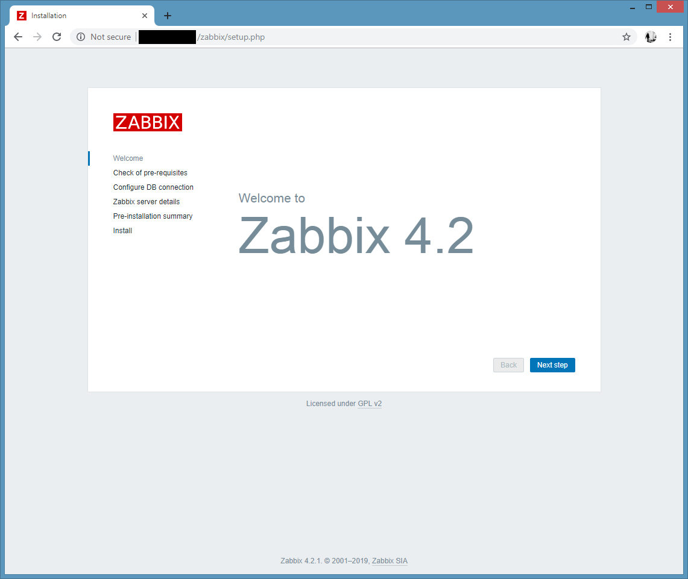
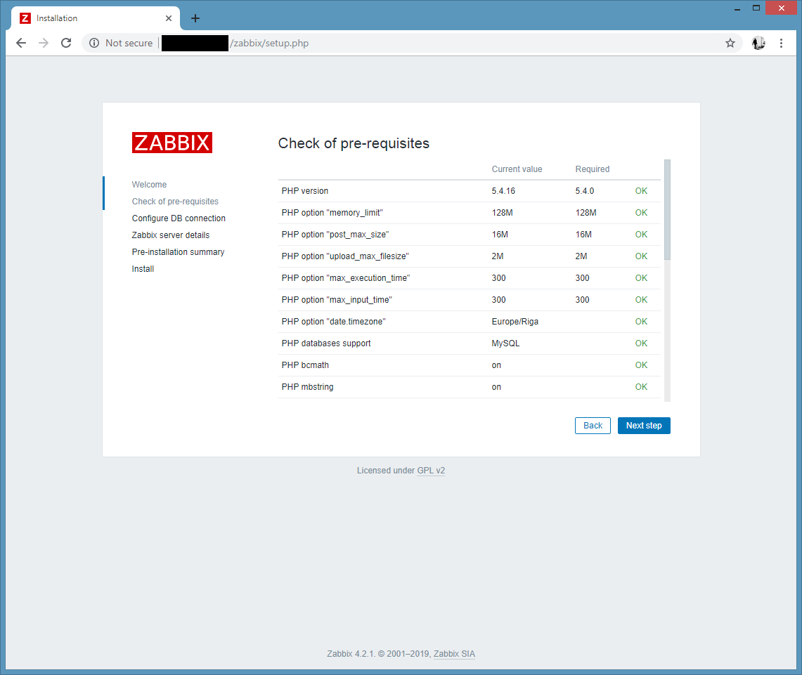
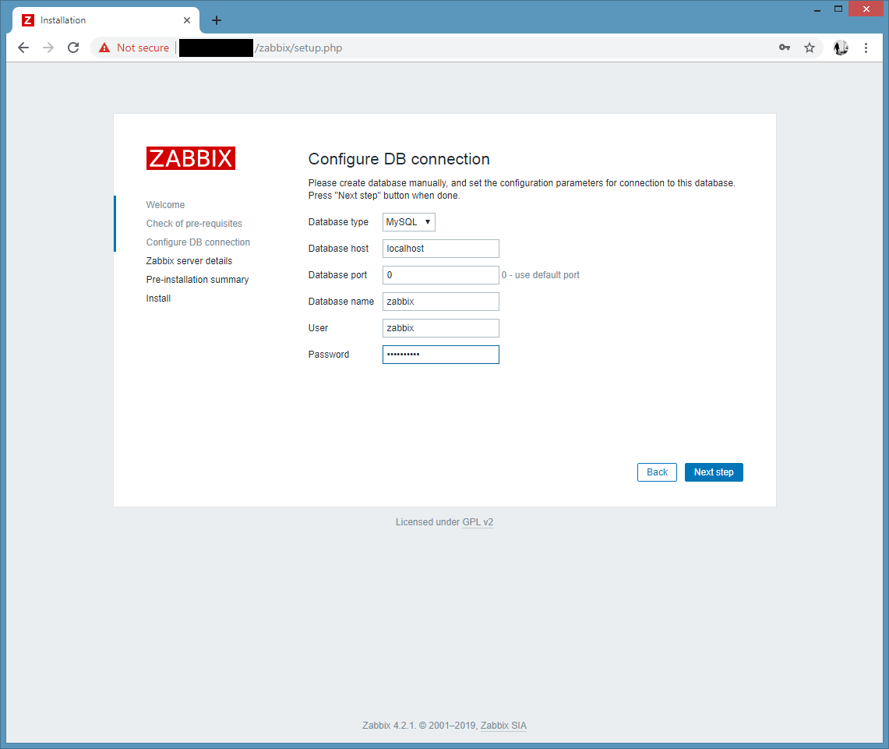
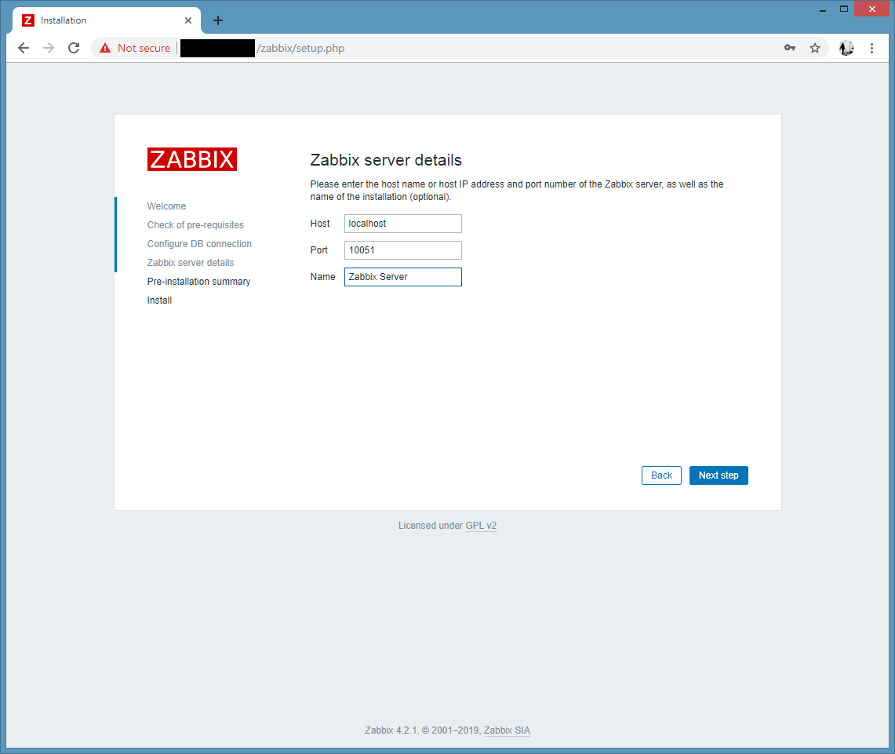
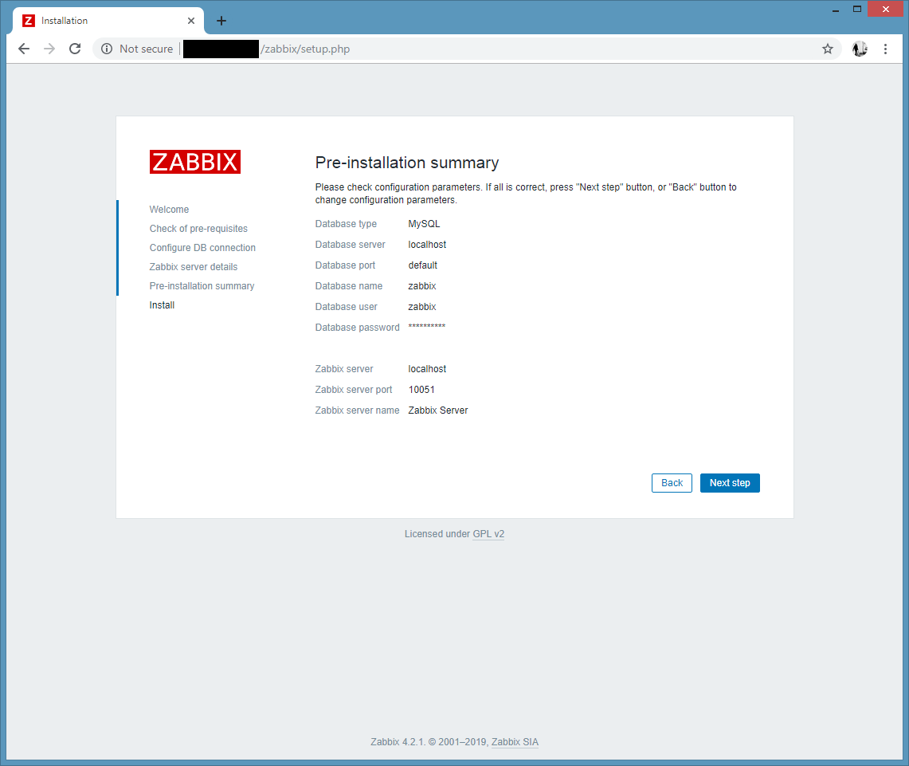
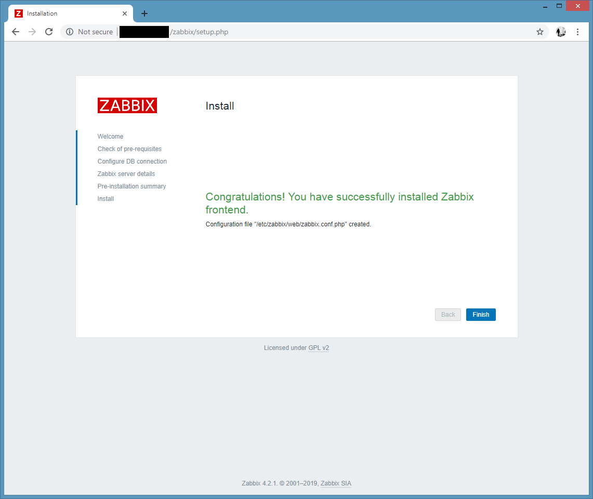
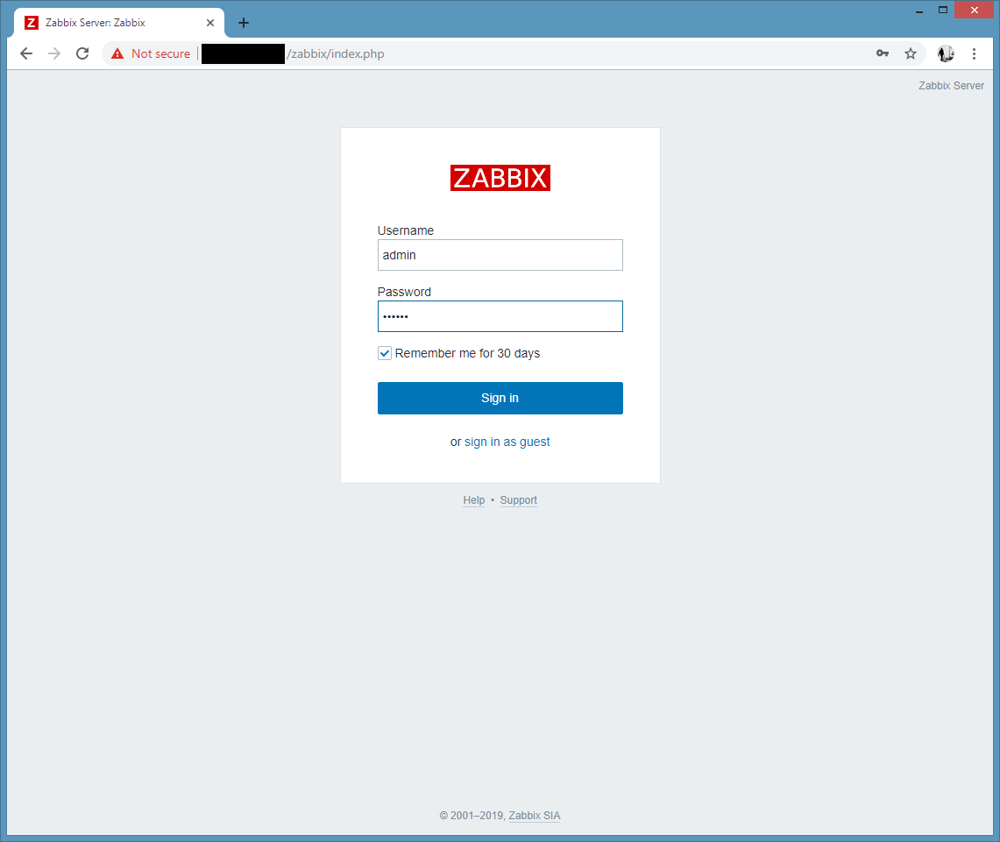
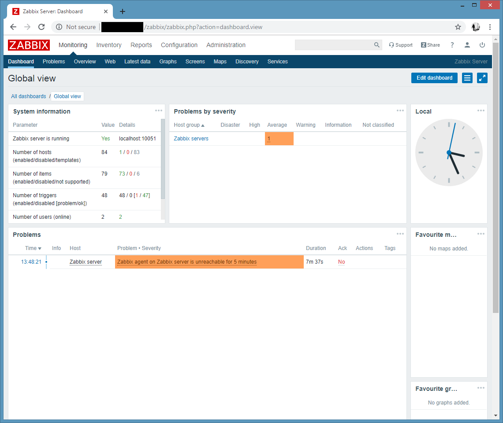

## Introduction

Zabbix is an open-source monitoring software tool for diverse IT components, including networks, servers, virtual machines (VMs) and cloud services. Zabbix provides monitoring metrics, among others network utilization, CPU load and disk space consumption. Zabbix monitoring configuration can be done using XML based templates which contain elements to monitor. The software monitors operations on Linux, Hewlett Packard Unix (HP-UX), Mac OS X, Solaris and other operating systems (OSes); however, Windows monitoring is only possible through agents. Zabbix can use MySQL, MariaDB, PostgreSQL, SQLite, Oracle or IBM DB2 to store data. Its backend is written in C and the web frontend is written in PHP. Zabbix offers several monitoring options:

**Prerequisites**

To install Zabbix on your server, make sure you are logged into your server with a sudo user.

This guide is based on SELinux being disabled or in permissive mode. To disable SELinux use the below command:

```bash
sed -i 's/SELINUX=.*/SELINUX=disabled/g' /etc/selinux/config
setenforce 0
```

## Step 1 - Install (Apache Web Server and PHP)

We need to install Apache Web Server and PHP. To do so, we can use the default package installer yum.

```bash
yum install epel-release
yum install httpd php php-mysql php-ldap php-bcmath php-mbstring php-gd php-xml php-mcrypt
```

Once this process is done, run the command below to start and then enable the Web Server:

```bash
systemctl restart httpd
systemctl enable httpd
```

## Step 2 - Install MySQL (MariaDB)

MariaDB is a community-developed, commercially supported fork of the MySQL relational database management system.

Install MariaDB with:

```bash
yum install mariadb-server mariadb
```

This will automatically install MariaDB on your server. Once this process is done, run the command below to start and then enable the database server:

```bash
systemctl start mariadb
systemctl enable mariadb
```

Now that our MySQL database is running, we want to run a simple security script that will remove some dangerous defaults and lock down access to our database system a little bit. Start the interactive script by running:

```bash
$ mysql_secure_installation
```

The prompt asks you for your current MYSQL root password. At this stage you won’t have one yet, so just leave it blank by hitting enter. When you are prompted to set a root password, just type `Y` and follow the instructions to set up your root password and make note of it.

```bash
NOTE: RUNNING ALL PARTS OF THIS SCRIPT IS RECOMMENDED FOR ALL MariaDB
      SERVERS IN PRODUCTION USE!  PLEASE READ EACH STEP CAREFULLY!

In order to log into MariaDB to secure it, we'll need the current
password for the root user.  If you've just installed MariaDB, and
you haven't set the root password yet, the password will be blank,
so you should just press enter here.

Enter current password for root (enter for none):
OK, successfully used password, moving on...

Setting the root password ensures that nobody can log into the MariaDB
root user without the proper authorisation.

Set root password? [Y/n] y
New password:
Re-enter new password:
Password updated successfully!
Reloading privilege tables..
 ... Success!
```

For the rest of the questions, you should simply hit the "ENTER" key through each prompt to accept the default values. This will remove some sample users and databases, disable remote root logins, and load these new rules so that MySQL immediately respects the changes we have made.

## Step 3 - Install Zabbix Repository

Zabbix isn't available in our package manager by default, so we will install a repository configuration package using the official Zabbix repository package on the [Official Zabbix Website](https://www.zabbix.com/download) for CentOS:

```bash
rpm -Uvh https://repo.zabbix.com/zabbix/4.2/rhel/7/x86_64/zabbix-release-4.2-1.el7.noarch.rpm
yum clean all
```

## Step 4 - Install Zabbix Server, Frontend, Agent

Use the following command to install Zabbix server along with MySQL database support package on your system.

```bash
yum install zabbix-server-mysql zabbix-web-mysql zabbix-agent
```

## Step 5 - Configure PHP For Zabbix

The Zabbix web interface is written in PHP and requires some special PHP server settings. The Zabbix installation process created an Apache configuration file that contains these settings. It is located in the directory `/etc/httpd/conf.d/` and is loaded automatically by Apache. We need to make a small change to this file, so open it up.

```bash
vi /etc/httpd/conf.d/zabbix.conf
```

The file contains PHP settings that meet the necessary requirements for the Zabbix web interface. The only change you need to make is to set the appropriate timezone, which is commented out by default.

```bash
<IfModule mod_php5.c>
    php_value max_execution_time 300
    php_value memory_limit 128M
    php_value post_max_size 16M
    php_value upload_max_filesize 2M
    php_value max_input_time 300
    php_value always_populate_raw_post_data -1
    # php_value date.timezone Europe/Riga
</IfModule>
```

Uncomment the timezone line and change it to your time zone. You can use this [list of supported time zones](https://php.net/manual/en/timezones.php) to find the right one for you. Then save and close the file.

Now restart Apache to apply these new settings.

```bash
systemctl restart httpd
```

## Step 6 - Create initial database

This installation is using MySQL as the backend of Zabbix, So we need to create a MySQL database and User for the Zabbix installation.

```bash
mysql -u root -p
```

```bash
MariaDB [(none)]> create database zabbix character set utf8 collate utf8_bin;
MariaDB [(none)]> grant all privileges on zabbix.* to zabbix@localhost identified by 'YOUR-ZABBIX-MYSQL-PASSWORD';
MariaDB [(none)]> FLUSH PRIVILEGES;
MariaDB [(none)]> quit;
```

## Step 7 - Import initial schema and data

After creating a database restore the default mysql database provided by zabbix. These files can be found at `/usr/share/doc/zabbix-server-mysql-<version>/` directory.

```bash
zcat /usr/share/doc/zabbix-server-mysql*/create.sql.gz | mysql -u zabbix -p zabbix
```

Edit zabbix_server.conf (and zabbix_proxy.conf) to use their respective databases.

```bash
vi /etc/zabbix/zabbix_server.conf
```

```bash
DBHost=localhost
DBName=zabbix
DBUser=zabbix
DBPassword=YOUR-ZABBIX-MYSQL-PASSWORD
```

In DBPassword use Zabbix database password for MySQL.

## Step 8 - Start Zabbix server process

It's time to start and enable the Zabbix server process:

```bash
systemctl start zabbix-server
systemctl enable zabbix-server
```

## Step 9 - Complete Zabbix Web Installer Wizzard

The Zabbix web installer can be accessed on `/zabbix` subdirectory URL on your server's IP or domain. Now access the Zabbix using the following URL. You must change FQDN as per your setup.

```bash
http://host.example.com/zabbix/
```

### Zabbix Setup Welcome Screen

This is the welcome screen of Zabbix web installer. Go forward by click on **Next Step** button.



### Check for pre-requisities

Check if your system has all required packages, if everything is ok click **Next Step**.



### Configure DB Connection

Enter database details created in Step #6 and click **Next Step** to continue.



### Zabbix Server Details

This is the host and port of running Zabbix server. As your Zabbix server is running on the same host, so keep the values unchanged. You can give a name for your instance.



### Pre-Installation Summary

In this step will show the summary you have entered previous steps, so simply click **Next Step**.



### Install Zabbix

If everything goes correctly, You will see a successful installation message on this page. This will also show you a message for created configuration file.



### Zabbix Login Screen

Login to Zabbix using default credentials.

```bash
Username: Admin
Password: zabbix
```



After successful login, You will get Zabbix dashboard like below.



## Conclusion

You have successfully installed the latest Zabbix on your CentOS system.

You can now check the [Zabbix Documentation](https://www.zabbix.com/documentation/current/) and learn more about how to configure and use Zabbix.

##### License: MIT

<!---

Contributors's Certificate of Origin

By making a contribution to this project, I certify that:

(a) The contribution was created in whole or in part by me and I have
    the right to submit it under the license indicated in the file; or

(b) The contribution is based upon previous work that, to the best of my
    knowledge, is covered under an appropriate license and I have the
    right under that license to submit that work with modifications,
    whether created in whole or in part by me, under the same license
    (unless I am permitted to submit under a different license), as
    indicated in the file; or

(c) The contribution was provided directly to me by some other person
    who certified (a), (b) or (c) and I have not modified it.

(d) I understand and agree that this project and the contribution are
    public and that a record of the contribution (including all personal
    information I submit with it, including my sign-off) is maintained
    indefinitely and may be redistributed consistent with this project
    or the license(s) involved.

Signed-off-by: [MohammadHossein Fakhraei eng.fakhraei@gmail.com]

-->
