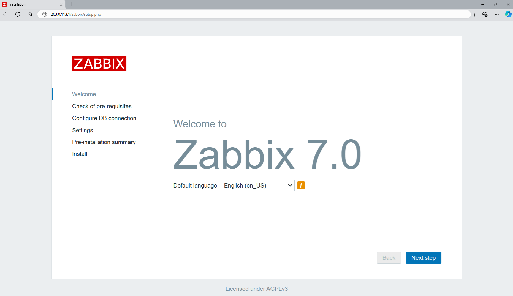
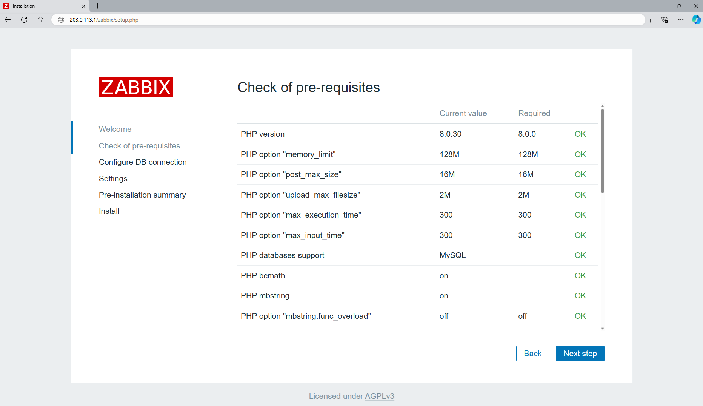
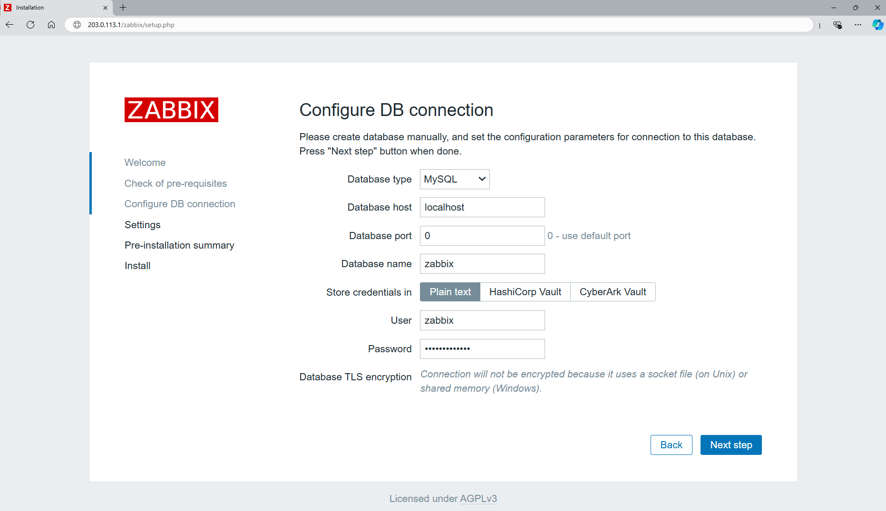
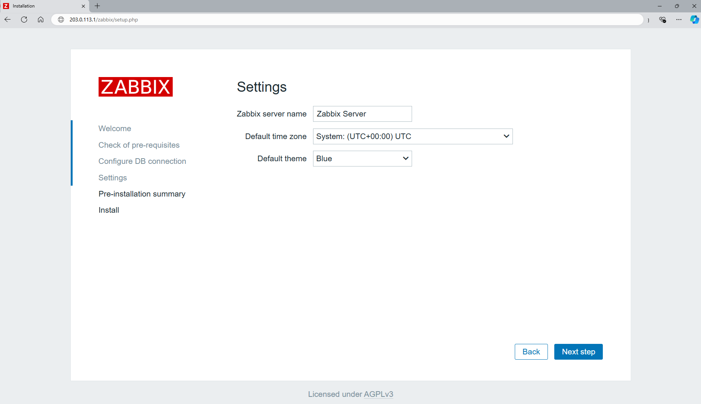
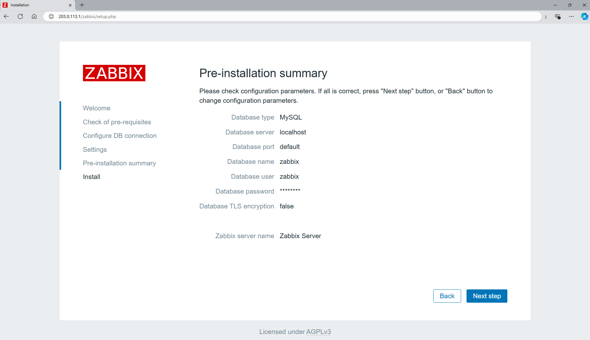
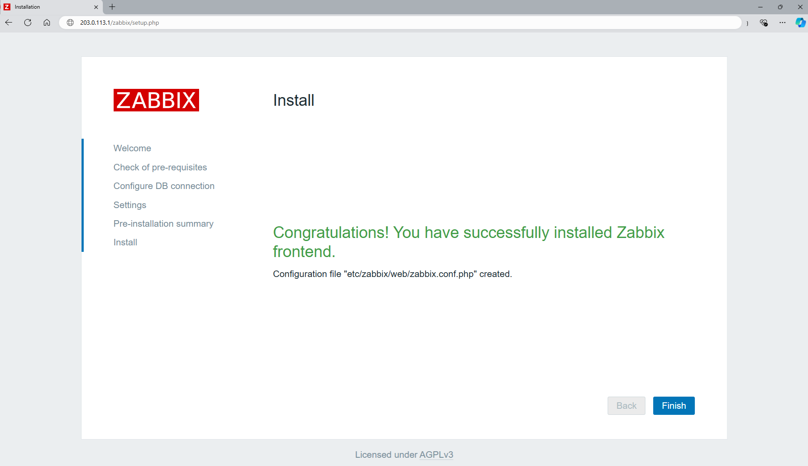
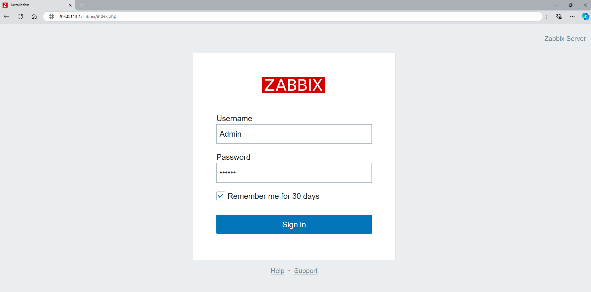
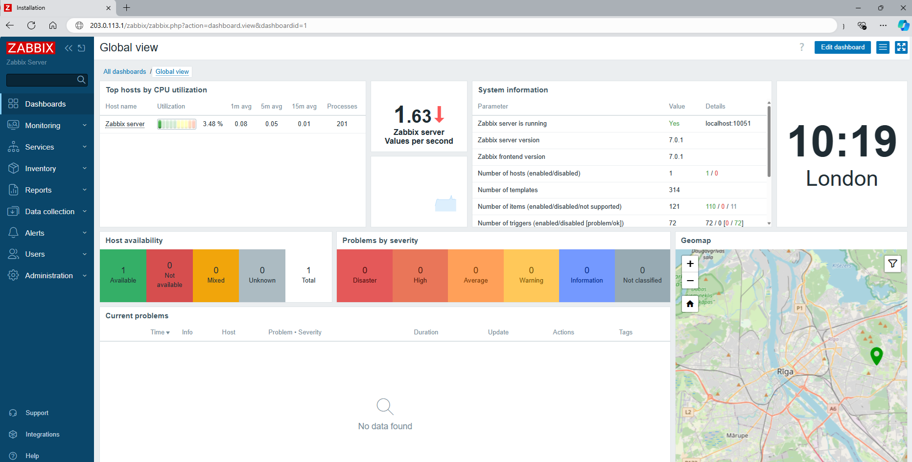

## Introduction

Zabbix is an open-source monitoring software tool for diverse IT components, including networks, servers, virtual machines (VMs) and cloud services. Zabbix provides monitoring metrics, such as network utilization, CPU load and disk space consumption. Zabbix monitoring configuration can be done using XML based templates which contain elements to monitor. The software monitors operations on Linux, Hewlett Packard Unix (HP-UX), Mac OS X, Solaris and other operating systems (OSes); however, Windows monitoring is only possible through agents. Zabbix can use MySQL, MariaDB, PostgreSQL or Oracle to store data. Its backend is written in C and the web frontend is written in PHP. Zabbix offers several monitoring options.

**Prerequisites**

* Server with CentOS Stream 9
  * Access to the root user or user with sudo permissions
  * SELinux is disabled or in permissive mode. To disable SELinux use the below command:
    ```bash
    sudo sed -i 's/SELINUX=.*/SELINUX=disabled/g' /etc/selinux/config
    sudo setenforce 0
    ```

## Step 1 - Install Apache Web Server and PHP

We need to install Apache Web Server and PHP. To do so, we can use the default package installer `dfn`.

```bash
sudo dnf update -y
sudo dnf install httpd php php-{gd,bcmath,ctype,mbstring,gettext,xml,xmlreader,xmlwriter,session}
```

Once this process is done, run the command below to start and enable the web server:

```bash
sudo systemctl restart httpd
sudo systemctl enable httpd
```

## Step 2 - Install MariaDB

MariaDB is a community-developed, commercially supported fork of the MySQL relational database management system.

Install MariaDB with:

```bash
sudo dnf install mariadb-server
```

This will automatically install MariaDB on your server. Once this process is done, run the command below to start and then enable the database server:

```bash
sudo systemctl start mariadb
sudo systemctl enable mariadb
systemctl status mariadb
```

Now that our MariaDB database is running, we want to run a simple security script that will remove some dangerous defaults and lock down access to our database system a little bit. Start the interactive script by running:

```bash
sudo mysql_secure_installation
```

| Settings                    | Description |
| --------------------------- | ----------- |
| Current MYSQL root password | At this stage you won’t have one yet, so just leave it blank by hitting enter. |
| Set a root password         | Type `Y` and follow the instructions to set up your root password and make note of it. |
| The rest of the questions   | You should simply hit the "ENTER" key through each prompt to accept the default values. This will remove some sample users and databases, disable remote root logins, and load these new rules so that MariaDB immediately respects the changes we have made. |

## Step 3 - Install Zabbix Repository

Zabbix isn't available in our package manager by default, so we will install a repository configuration package using the official Zabbix repository package on the [Official Zabbix Website](https://www.zabbix.com/download?zabbix=7.0&os_distribution=centos&os_version=9&components=server_frontend_agent&db=mysql&ws=apache) for CentOS:

> **Disable Zabbix packages provided by EPEL**<br>
> Run `dnf repolist`. If the output includes the `epel-release` package, edit the file `/etc/yum.repos.d/epel.repo` and add `excludepkgs=zabbix*` in a new line.

```bash
sudo rpm -Uvh https://repo.zabbix.com/zabbix/7.0/centos/9/x86_64/zabbix-release-7.0-4.el9.noarch.rpm
sudo dnf clean all
```

## Step 4 - Install Zabbix Server, Frontend, Agent

Use the following command to install Zabbix server along with MySQL database support package on your system.

```bash
sudo dnf install zabbix-{server-mysql,web-mysql,apache-conf,sql-scripts,selinux-policy,agent}
```

## Step 5 - Create initial database

This installation is using MySQL as the backend of Zabbix, So we need to create a MySQL database and User for the Zabbix installation.

```bash
mysql -u root -p
```

```bash
MariaDB [(none)]> create database zabbix character set utf8mb4 collate utf8mb4_bin;
MariaDB [(none)]> create user zabbix@localhost identified by 'your_password';
MariaDB [(none)]> grant all privileges on zabbix.* to zabbix@localhost;
MariaDB [(none)]> set global log_bin_trust_function_creators = 1;
MariaDB [(none)]> quit;
```

## Step 6 - Import initial schema and data

After creating a database, restore the default mysql database provided by zabbix. You can find these files in the `/usr/share/doc/zabbix-server-mysql-<version>/` directory.

```bash
zcat /usr/share/zabbix-sql-scripts/mysql/server.sql.gz | mysql --default-character-set=utf8mb4 -uzabbix -p zabbix
```

When it asks about a password, enter the MariaDB password you just set for `zabbix@localhost`.

Disable `log_bin_trust_function_creators`:

```bash
mysql -uroot -p
MariaDB [(none)]> set global log_bin_trust_function_creators = 0;
MariaDB [(none)]> quit;
```

Edit `zabbix_server.conf` to use their respective databases.

```bash
sudo vi /etc/zabbix/zabbix_server.conf
```

```bash
DBHost=localhost
DBName=zabbix
DBUser=zabbix
DBPassword=your_password
```

For `DBPassword`, enter the password you set in "Step 5" above.

## Step 7 - Start Zabbix server process

It's time to start and enable the Zabbix server process:

```bash
sudo systemctl restart zabbix-server zabbix-agent httpd php-fpm
sudo systemctl enable zabbix-server zabbix-agent httpd php-fpm
```

## Step 8 - Complete Zabbix Web Installer Wizzard

You can access the Zabbix webinstaller by adding `/zabbix` at the end of your server's IP address or domain. Change FQDN as per your setup and access Zabbix.

* IP address
  ```bash
  http://<your_ip>/zabbix/
  ```

* Domain
  ```bash
  http://example.com/zabbix/
  ```

### Zabbix Setup Welcome Screen

This is the welcome screen of Zabbix web installer. Select a language and continue by clicking on **Next Step**.



### Check for pre-requisities

Check if your system has all required packages. If everything is ok, click **Next Step**.



### Configure DB Connection

Enter the database details created in "Step 5" and click **Next Step** to continue.



### Zabbix Server Details

Give your instance a name, select a time zone and a theme, and click **Next Step**.



### Pre-Installation Summary

This step is a summary of everything you set in the previous steps. If everything is correct, click **Next Step**.



### Install Zabbix

If everything goes correctly, you will see a successful installation message on this page. This will also show you a message about the newly created configuration file.



### Zabbix Login Screen

Login to Zabbix using the default credentials.

```bash
Username: Admin
Password: zabbix
```



After successful login, you will get a Zabbix dashboard like below.



## Conclusion

You have successfully installed the latest Zabbix on your CentOS system.

You can now check the [Zabbix Documentation](https://www.zabbix.com/documentation/current/) and learn more about how to configure and use Zabbix.

##### License: MIT

<!---

Contributors's Certificate of Origin

By making a contribution to this project, I certify that:

(a) The contribution was created in whole or in part by me and I have
    the right to submit it under the license indicated in the file; or

(b) The contribution is based upon previous work that, to the best of my
    knowledge, is covered under an appropriate license and I have the
    right under that license to submit that work with modifications,
    whether created in whole or in part by me, under the same license
    (unless I am permitted to submit under a different license), as
    indicated in the file; or

(c) The contribution was provided directly to me by some other person
    who certified (a), (b) or (c) and I have not modified it.

(d) I understand and agree that this project and the contribution are
    public and that a record of the contribution (including all personal
    information I submit with it, including my sign-off) is maintained
    indefinitely and may be redistributed consistent with this project
    or the license(s) involved.

Signed-off-by: [MohammadHossein Fakhraei eng.fakhraei@gmail.com]

-->
