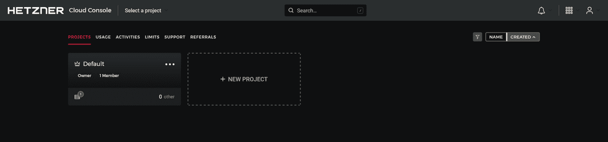
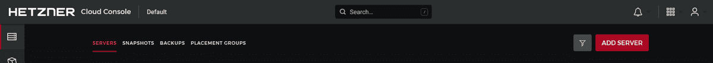
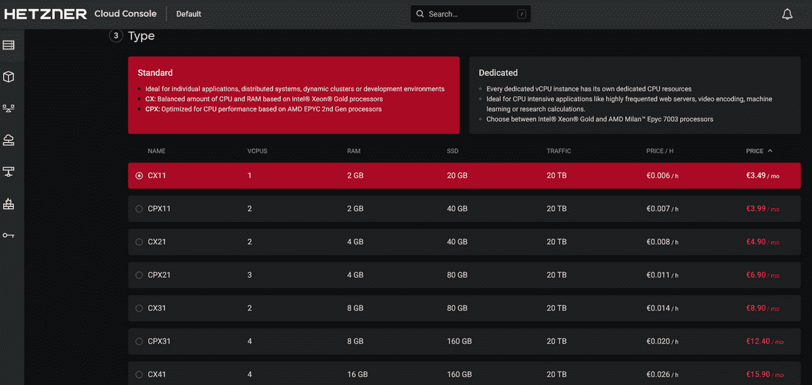
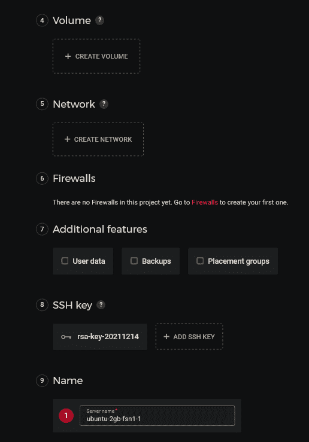
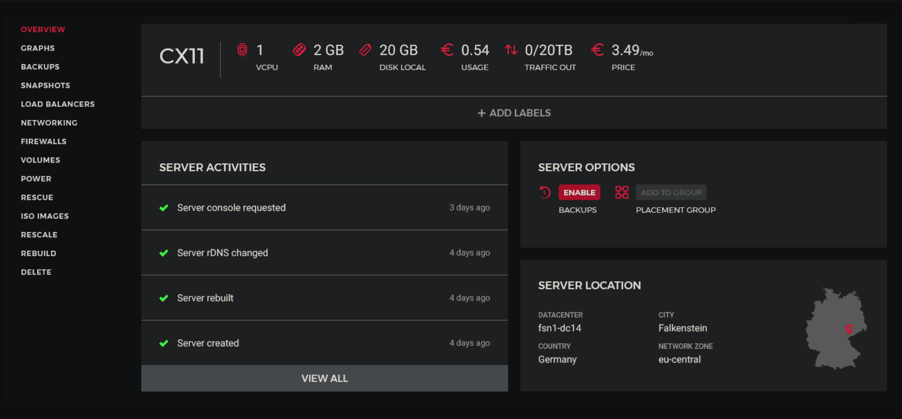
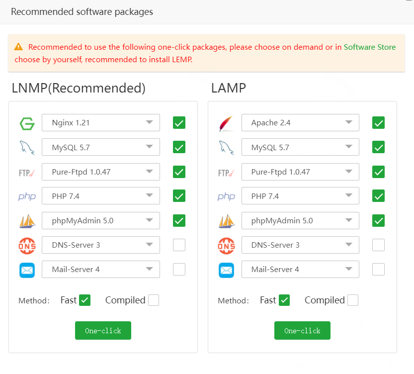
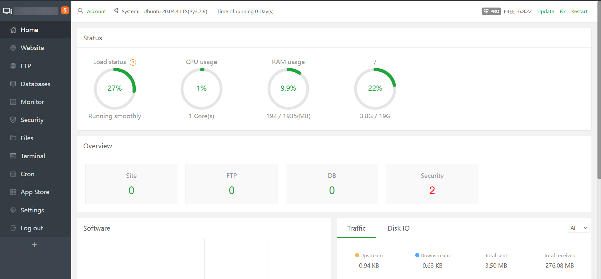
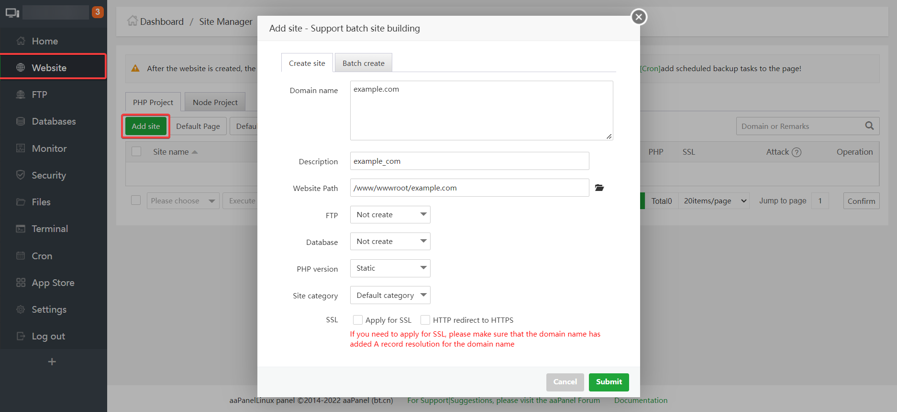

# Introduction

We will be installing [aaPanel](https://www.aapanel.com) which is an open-source web hosting control panel, it includes email along with it's own one-click software installer. 

## Prerequisites

- A Hetzner account with your preferred payment method added.
- A cloud server with a dedicated IPv4 address.
- Basic knowledge of Linux & the terminal
- Ports 21, 22, 25, 587, 465, 80, 443, 8080, 8888, 888, 7800, 3306, 11211, 110, 143, 993, 465 available

What you should know before we start:

- Username: `root` (Your SSH user, this is the default user)
- Hostname: `<your_hostname>` (e.g. sub.domain.tld)
- Domain: `<domain.tld>` (e.g. example.com)
- Subdomain: `<sub.domain.tld>` (e.g. sub.example.com)
- IPv4 Address: `192.0.2.1` (Standard IP Address)

## Step 1 - Renting your server from Hetzner

### Choosing a project

First off, log into Hetzner's [Cloud console](https://console.hetzner.com) and choose the project you want to deploy the VPS in.



### Creating the server

Now you'll need to create the server, click on "Add Server" in the top-right corner.



### Choosing the server location

Choose the location you'd like your VPS to be in, this doesn't have any affect on performance at all. Keep in mind that some locations don't have all plans available due to limitations there may be in that location.

### Choosing the server's operating system

Image is basically the operating system that will be installed on your server. In this tutorial, we'll be going for Ubuntu 20.04, however, you may choose whatever operating system you'd like that is supported by [aaPanel](https://www.aapanel.com)

### Selecting the type of the server

If you are a Hetzner user, you probably know what the difference is, if not, it is well explained under the title of the option. I will be setting up a VPS with the Standard plan, just because that is more than enough for a reverse proxy with not that much traffic. You also need to choose how much resources your server will have, for the reverse proxy, the lowest plan should be plenty of resources. If you ever use more than the resources allocated to the server, you can simply just upgrade your server through the [Hetzner Cloud Console](https://console.hetzner.com.).



### Other settings

These last options are usually fine left on the default options, however, if you for example want to add an SSH key, your options will obviously look different. If you're not sure what some options are, hover over the "?" button and you should see a short description about what it is for.



## Step 2 - Installation

### Connecting to your server

First off, you can start by connecting to your new VPS. If you're not sure how to do that, you can open the terminal on your device and run the following command after modifying the details.

`ssh root@<IP Address>`

* Replace `<IP Address>` with your server's IPv4 address.

You should be able to find your server's IPv4 address in the server's initial page.



### Installing aaPanel

Run the following commands mentioned below.

```
# Install, Update, Upgrade all packages
apt-get install -y && apt-get update -y && apt-get upgrade -y
apt-get install wget -y
wget -O install.sh https://www.aapanel.com/script/install-ubuntu_6.0_en.sh && sudo bash install.sh

```

You should see the details of the default admin user after the installation script finishes it's process. 

We should now be able to access the web hosting panel with the following details.

## Step 3 - Accessing the web hosting panel

Immediately after logging in with this default user, you will be asked to install recommended software packages - We'll be picking LNMP but, if you require the Apache web server, pick LAMP.

The software recommendations screen should look similar to the screenshot below.



Once you login and install all the recommended packages or close the screen, you should see a screen similar to the screenshot attached below.



Adding your first website is fairly simple, below there is a screenshot attached of a basic configuration to set up a website (Make sure the domain is pointing towards the server's public IPv4 address).



After that, you'll most likely need an SSL certificate so everything is secure. Below is a screenshot attached to a basic configuration on how the SSL options should look like.

## Conclusion

Thank you for following my tutorial. Whilst reading this, you should be satisfied with your aaPanel installation.

##### License: MIT

<!--

Contributor's Certificate of Origin

By making a contribution to this project, I certify that:

(a) The contribution was created in whole or in part by me and I have
    the right to submit it under the license indicated in the file; or

(b) The contribution is based upon previous work that, to the best of my
    knowledge, is covered under an appropriate license and I have the
    right under that license to submit that work with modifications,
    whether created in whole or in part by me, under the same license
    (unless I am permitted to submit under a different license), as
    indicated in the file; or

(c) The contribution was provided directly to me by some other person
    who certified (a), (b) or (c) and I have not modified it.

(d) I understand and agree that this project and the contribution are
    public and that a record of the contribution (including all personal
    information I submit with it, including my sign-off) is maintained
    indefinitely and may be redistributed consistent with this project
    or the license(s) involved.

Signed-off-by: Jean F. (root@techoutdev.com)

-->