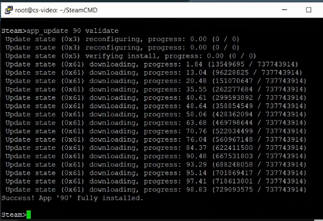

## Introduction

In this tutorial I will be showing you how to successfully run a Counter-Strike 1.6 dedicated server and also teach you how to set it up. You will end up with a fully working server you and your friends can connect to, and also any one playing the game. This tutorial will guide you through the whole process without any useless steps or inormation that might confuse you and is aimed torwards anyone, be it a beginner or professional who just never tried starting a CS server.

**Prerequisites**

* A Hetzner cloud server with a Linux installed on it. In this tutorial, I will be using Ubuntu.
* Knowledge about using your shell.
* A way to persistently run a command. I will be using `screen` on Linux Ubuntu.

Example terminology that you can use in the tutorial:

* Username: `user` or `root` (Your username which you will use to login into your remote shell, root is default)
* IPv4 of your server: `192.0.2.1` (This is the standard IP address for your VPS)
* Counter-Strike: `cs` (Short form) and `1.6` being the game version
* Operating system: `os` (Your operating system)
* Path: `/some/path` (Path to your cstrike server)

## Step 1 - `Download and install steamcmd`

[Steamcmd](https://developer.valvesoftware.com/wiki/SteamCMD) is a utility created by [Valve](https://www.valvesoftware.com/en/). Simply put, it is the shell only version of the steam client. Most of its use is for running dedicated servers.

Now, please SSH into your server and make sure everything is fine before proceeding.

Valve recommends running steamcmd from a newly created user for security purpouses. However, this step can be ignored. If you would like to create a new user called `steam`, please run these commands:

```
sudo useradd -m steam
sudo passwd steam
```
You will be prompted to create a password. You can then navigate via `cd` command into its `/home` directory.
```
sudo -u steam -s
cd /home/steam
```

As our OS is 64bit, we will need to add the multiverse repo.

```
sudo add-apt-repository multiverse
sudo apt install software-properties-common
sudo dpkg --add-architecture i386
sudo apt update
```
```
sudo apt install lib32gcc-s1 steamcmd 
```

After executing these commands into your shell, you will have installed SteamCMD.
Execute it by running `steamcmd`

## Step 2 - `<Log into SteamCMD and configure it>`

Now, login via `login anonymous`.

Choose a directory where you want to install your server, I decided to choose `/root/cs/`

```
force_install_dir /some/path/
app_update 90
app_set_config 90 mod cstrike
```

and finally,

`app_update 90 validate`

You might see an error on your screen. This bug is mentioned on official Valve dedicated server list, but remains unfixed to this day. Just run the command again and again, untill it install successfully.


Successful install should look like this.



## Step 3 - `<Launching the server>`

### Step 3.1 - `<Configuring the parameters>`

You can now try running the server via

`screen`
`/some/path/hlds_run -game cstrike -pingboost 2 +map de_dust2 +maxplayers 32`

Then if everything works, you can detach the screen by pressing `Ctrl+a` `d`. If you want to reatach to the screen (resume it), use `screen -r`

If you are wondering about all of the arguments and parameters, please check [this](https://developer.valvesoftware.com/wiki/Command_Line_Options#Half-Life_Dedicated_Server) link.

But the most useful ones, are these

* +hostname "Server Name" - Specifies the name of the server.
* +map <map> - Specifies which map to start with.
* +sv_lan <0/1> - If set to 1, server is only available in Local Area Network (LAN).
* +mapchangecfgfile <file> - Like Server.cfg, ran after every round change, before Plugins are started.
* -pingboost <1/2/3> - Selects between optimized HLDS network code stack. Set this on 2 usually reduces latency toward 1ms without loss of activity input packets.
(Credits to Valve)

## Step 3 - `<Port forwarding>`

Valve has a great [guide](https://help.steampowered.com/en/faqs/view/2EA8-4D75-DA21-31EB) for checking what ports you need to have forwarded. Default port is `27015` and since I did not change the parameter of it, I will forward those. Detach from the screen and run:

```
iptables -A INPUT -p tcp -m tcp --dport 27015 -j ACCEPT
iptables -A INPUT -p udp -m udp --dport 27015 -j ACCEPT
```

Now, restart your server with the port you forwarded. If you use the default one, you do not have to use any parameter or specify it in any other way.

## Conclusion

If everything went well, you now have a fully working Counter-Strike server anyone with a working internet connection can connect to. You can now browse all of the guides and documentations Valve created for running their servers and maybe learn a bit or two about modding or adding different plugins to your server, like Metamod, AMX mod X. Or download and run new maps.

##### License: MIT

<!--

Contributor's Certificate of Origin

By making a contribution to this project, I certify that:

(a) The contribution was created in whole or in part by me and I have
    the right to submit it under the license indicated in the file; or

(b) The contribution is based upon previous work that, to the best of my
    knowledge, is covered under an appropriate license and I have the
    right under that license to submit that work with modifications,
    whether created in whole or in part by me, under the same license
    (unless I am permitted to submit under a different license), as
    indicated in the file; or

(c) The contribution was provided directly to me by some other person
    who certified (a), (b) or (c) and I have not modified it.

(d) I understand and agree that this project and the contribution are
    public and that a record of the contribution (including all personal
    information I submit with it, including my sign-off) is maintained
    indefinitely and may be redistributed consistent with this project
    or the license(s) involved.

Signed-off-by: [submitter's name and email address here]

-->
