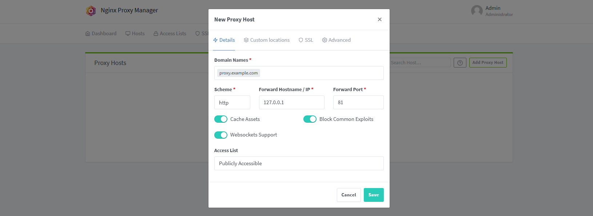

# Introduction

We will be installing [Nginx Proxy Manager](https://nginxproxymanager.com) which is an open-source software made for using the Nginx webserver easily via a user interface. With Nginx Proxy Manager, you'll be able to create proxy hosts, redirection hosts, streams, and 404 hosts.

**Prerequisites**

- A server with a dedicated IPv4 address
- Basic knowledge of Linux & the terminal
- Ports 80, 81, 443 available

<br>

**Example terminology**

- Server
  - Username: `holu` (user with sudo permissions)
  - Publis IPv4 address: `203.0.113.1`
- Domain: `example.com`

## Step 1 - Create a new server

Create a new server, e.g. with [Hetzner](https://docs.hetzner.com/cloud/servers/getting-started/creating-a-server).

When you create your server, make sure you select an operating system that is supported by [Docker](https://docs.docker.com/engine/install/). This tutorial will use Ubuntu 24.04. Also, a standard plan should be enough for a reverse proxy with not that much traffic. 

It is also recomended to add an SSH key.

For security reasons, is not recommended to use the root user. Instead, you should create a new user and add this user to the sudo group (see [Initial Server Setup with Ubuntu](https://community.hetzner.com/tutorials/howto-initial-setup-ubuntu)).

## Step 2 - Installing Docker and Nginx Proxy Manager

* **Connecting to your server**
  
  First off, you can start by connecting to your new server via SSH.
  
  > Replace `<server_ip>` with your server's IPv4 address.
  
  ```bash
  ssh holu@<server_ip>
  ```

* **Installing Docker**
  
  Run the following commands to install Docker on Ubuntu. If your server has a different OS, make sure you look up the correct commands (see [Docker installation - Supported platforms](https://docs.docker.com/engine/install/)).

  Add the GPG key and the Docker repository:

  ```bash
  # Uninstall old versions
  sudo apt-get purge docker-ce docker-ce-cli containerd.io docker-buildx-plugin docker-compose-plugin docker-ce-rootless-extras
  
  # Install prerequisites
  sudo apt-get update
  sudo apt-get install ca-certificates curl gnupg
  sudo install -m 0755 -d /etc/apt/keyrings
  
  # Add Docker’s official GPG key
  sudo curl -fsSL https://download.docker.com/linux/ubuntu/gpg -o /etc/apt/keyrings/docker.asc
  sudo chmod a+r /etc/apt/keyrings/docker.asc
  
  # Set up stable repository
  echo \
    "deb [arch=$(dpkg --print-architecture) signed-by=/etc/apt/keyrings/docker.asc] https://download.docker.com/linux/ubuntu \
    $(. /etc/os-release && echo "$VERSION_CODENAME") stable" | \
    sudo tee /etc/apt/sources.list.d/docker.list > /dev/null
  ```

  Install Docker Engine and Docker Compose:
  
  ```bash
  sudo apt-get update
  sudo apt-get install docker-ce docker-ce-cli containerd.io docker-compose-plugin

  # Test the installation
  docker --version
  docker compose version
  ```
  
  We've successfully installed Docker and Docker Compose.

  Add your user to the Docker group:
  ```bash
  sudo usermod -aG docker <user>
  ```
  Log out and back in to update the groups of your user.
  
  Now we'll need to install Nginx Proxy Manager itself.

* **Installing Nginx Proxy Manager**
  
  Create a new directory for nginx proxy manager:
  
  ```bash 
  mkdir -p npm
  cd npm
  ```

  Run the following commands mentioned below.

  ```bash
  # Create a docker-compose configuration file
  touch docker-compose.yml
  # Editing the file
  nano docker-compose.yml
  ```
  
  Paste the following contents in the file which are mentioned below.
  
  ```yml
  version: '3.8'
  services:
    app:
      image: 'jc21/nginx-proxy-manager:latest'
      restart: unless-stopped
      ports:
        - '80:80'
        - '81:81'
        - '443:443'
      volumes:
        - ./data:/data
        - ./letsencrypt:/etc/letsencrypt
  #    network_mode: 'host'
  ```

  > Note about `network_mode`:
  > * If you plan to proxy to external servers with public IPs, you don't need `network_mode`.
  > * If you plan to proxy to local Docker containers and you want to point to `127.0.0.1:<container-port>`, you DO need `network_mode` and you should remove the hash symbol at the beginning of the line.
  
  <br>

  Now, we'll need to bring the stack up by running the following command.
  
  ```bash
  docker compose up -d
  ```

We should now be able to access the admin UI with the following details.

> Replace 203.0.113.1 with your public IPv4 address

Admin UI: http://203.0.113.1:81

Default admin user:

```plaintext
Email: admin@example.com
Password: changeme
```

## Step 3 - Accessing the admin UI

Immediately after logging in with the default user, you will be required to modify your details and change your password.

The admin login screen should look similar to the screenshot below.


Once you login and modify all the default details, you can view the "Dashboard".


Creating your first proxy host is fairly simple. In the "Dashboard", click on "0 Proxy Hosts" » "Add Proxy Host". Below is a screenshot of a basic configuration to access the admin UI from a domain (`proxy.example.com`). Make sure the domain has a DNS record that points the domain to the server's public IPv4 address.



After that, you'll most likely need an SSL certificate so that everything is secure. Below is a screenshot of a basic configuration on how the SSL options could look like.


You can tick further options such as "Force SSL", etc as you wish. They are not ticked in the picture just so readers reading this tutorial do not get confused and think they are required to tick them.

After you saved the new entry, you can access the admin UI from the domain you set (in this example `proxy.example.com`).

The Nginx Proxy Manager is now ready and you can add your own proxy hosts.

If you added `network_mode` in the Docker Compose file above, you should be able to set "Forward Hostname / IP" to `127.0.0.1` for all local containers. For example, a local WordPress Docker container:

```shellsession
holu@tutorial:~/npm$ docker run -p 8080:80 -d wordpress
holu@tutorial:~/npm$ docker ps
CONTAINER ID   IMAGE                      COMMAND                  CREATED          STATUS          PORTS                                  NAMES
23bcbfe55c53   jc21/nginx-proxy-manager   "/init"                  31 minutes ago   Up 31 minutes                                          npm-app-1
e9853acea394   wordpress                  "docker-entrypoint.s…"   22 minutes ago   Up 22 minutes   0.0.0.0:8080->80/tcp, :::8080->80/tcp  thirsty_greider
```

You can set the destination to `http://127.0.0.1:8080`:


If you don't have `network_mode: 'host'` in your Docker Compose file, you have to set the destination to the public IP address, in this example `203.0.113.1:8080`.

## Conclusion

Thank you for following my tutorial. You should now have a working Nginx Proxy Manager installation.

##### License: MIT

<!--

Contributor's Certificate of Origin

By making a contribution to this project, I certify that:

(a) The contribution was created in whole or in part by me and I have
    the right to submit it under the license indicated in the file; or

(b) The contribution is based upon previous work that, to the best of my
    knowledge, is covered under an appropriate license and I have the
    right under that license to submit that work with modifications,
    whether created in whole or in part by me, under the same license
    (unless I am permitted to submit under a different license), as
    indicated in the file; or

(c) The contribution was provided directly to me by some other person
    who certified (a), (b) or (c) and I have not modified it.

(d) I understand and agree that this project and the contribution are
    public and that a record of the contribution (including all personal
    information I submit with it, including my sign-off) is maintained
    indefinitely and may be redistributed consistent with this project
    or the license(s) involved.

Signed-off-by: Jean F. (root@techoutdev.com)

-->
