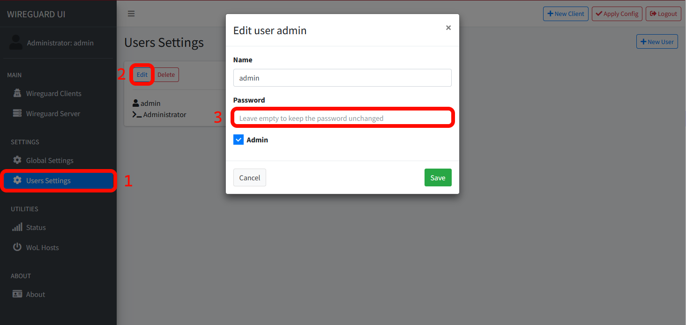
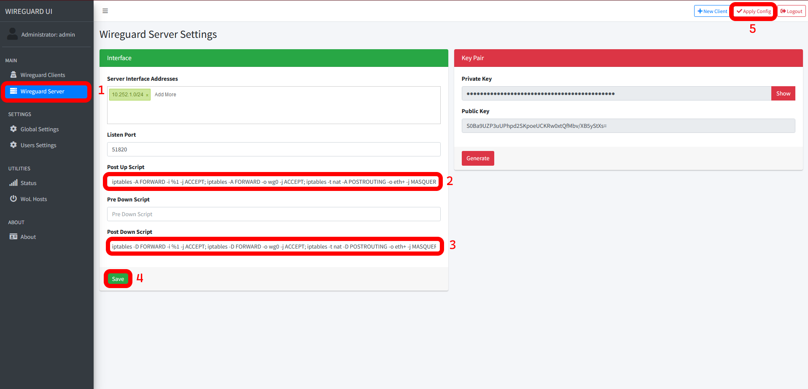

## Einleitung

In diesem Tutorial lernst du wie du WireGuard UI auf einem Linux Server mit Docker Compose installieren kannst.

WireGuard UI ist ein "web user interface to manage your WireGuard setup".

**Voraussetzungen**

- Linux Cloud Server (vorzugsweise Ubuntu 22.04 / 24.04)
- [Docker](https://docs.docker.com/engine/install/ubuntu/) und [Docker Compose](https://docs.docker.com/compose/install/linux/)
- Öffentliche IPv4 Adresse

Um sicher zu gehen das Docker Compose ordnungsgemäß installiert ist, nutze:

```bash
docker compose version
```


## Schritt 1 - Aktualisiere deinen Server

```bash
sudo apt update && sudo apt upgrade
```

## Schritt 2 - Vorbereitung der .YML

Die `.yml` Datei enthält alle erforderlichen Informationen, um WireGuard UIs Docker Container zu erstellen.

```bash
sudo mkdir /opt/wg-ui
sudo nano /opt/wg-ui/docker-compose.yml
```
Füge folgende Konfiguration ein:

```yaml
services:
  wireguard:
    image: linuxserver/wireguard:v1.0.20210914-ls7
    container_name: wireguard
    cap_add:
      - NET_ADMIN
    volumes:
      - ./config:/config
    ports:
      - "5000:5000"
      - "51820:51820/udp"
    restart: unless-stopped

  wireguard-ui:
    image: ngoduykhanh/wireguard-ui:latest
    container_name: wireguard-ui
    depends_on:
      - wireguard
    cap_add:
      - NET_ADMIN
    # use the network of the 'wireguard' service. this enables to show active clients in the status page
    network_mode: service:wireguard
    environment:
      - SENDGRID_API_KEY
      - EMAIL_FROM_ADDRESS
      - EMAIL_FROM_NAME
      - SESSION_SECRET
      - WGUI_USERNAME=admin
      - WGUI_PASSWORD=admin
      - WG_CONF_TEMPLATE
      - WGUI_MANAGE_START=true
      - WGUI_MANAGE_RESTART=true
    logging:
      driver: json-file
      options:
        max-size: 50m
    volumes:
      - ./db:/app/db
      - ./config:/etc/wireguard
    restart: unless-stopped
```

Ersetze das Standard-Kennwort `WGUI_PASSWORD` mit einem sicheren.

## Schritt 3 - Starten der Container und Zugriff auf das Webinterface

Um den Container zu starten, nutze:
```bash
sudo docker compose -f /opt/wg-ui/docker-compose.yml up -d
```

Das Ergebnis sollte so aussehen:

```bash
[+] Running 3/3
 ✔ Network wg-ui_default   Created          0.1s
 ✔ Container wireguard     Started          0.2s
 ✔ Container wireguard-ui  Started          0.3s
```

Öffne `http://<203.0.113.1>:5000` mit deinem Browser.

**Ersetze `<203.0.113.1>` mit der IP Adresse deines Servers.**

Ich empfehle ab jetzt die Verwendung eines Reverse Proxys (siehe [NGINX Proxy Manager](https://community.hetzner.com/tutorials/installing-nginx-proxy-manager)).

Wenn du erfolgreich warst, solltest du jetzt die Login Seite von WireGuard UI sehen. Die Standardanmeldedaten sind:

- U: admin
- PW: admin

Ändere dieses Kennwort sofort nach der ersten Anmeldung!



## Schritt 4 - Routing-Konfiguration

Füge folgende Skripte unter "WireGuard Server" ein und wähle "Apply Config" aus.

**Post Up Script**
```bash
iptables -A FORWARD -i %1 -j ACCEPT; iptables -A FORWARD -o wg0 -j ACCEPT; iptables -t nat -A POSTROUTING -o eth+ -j MASQUERADE
```

**Post Down Script**
```bash
iptables -D FORWARD -i %1 -j ACCEPT; iptables -D FORWARD -o wg0 -j ACCEPT; iptables -t nat -D POSTROUTING -o eth+ -j MASQUERADE
```



## Schritt 5 - Erstellen einer Client-Konfiguration

Erstelle jetzt eine Client Konfiguration mit einem beschreibenden Namen:


## Schritt 6 - Hinzufügen von Clients

### Schritt 6.1 - iOS / Android

Lade die WireGuard App aus dem [App Store](https://apps.apple.com/de/app/wireguard/id1441195209) / [Play Store](https://play.google.com/store/apps/details?id=com.wireguard.android&gl=DE).

Klicke in der WireGuard UI auf "QR Code" und scanne ihn mit dem iOS / Android Client wie in diesem [Tutorial](https://community.hetzner.com/tutorials/install-and-configure-wireguard-vpn#step-32---android-client) erklärt.

### Schritt 6.2 - Windows / Mac

Installiere den [Windows WireGuard Client](https://download.wireguard.com/windows-client/wireguard-installer.exe) / [Mac WireGuard Client](https://itunes.apple.com/us/app/wireguard/id1451685025?ls=1&mt=12).

Klicke in der WireGuard UI auf "Download" und importiere die `.conf`-Datei auf den Windows / Mac Client wie in diesem [Tutorial](https://community.hetzner.com/tutorials/install-and-configure-wireguard-vpn#step-33---windows-client) erklärt.

### Schritt 6.3 - Linux

Installiere WireGuard auf dem Linux Client:

```bash
sudo apt update && sudo apt install wireguard
```

Klicke in der WireGuard UI auf "Download" und lege die Datei auf dem Linux Client in:

```bash
/etc/wireguard/wg0.conf
```

Und starte (oder stoppe) WireGuard:

* Vorübergehend
  ```bash
  wg-quick up wg0
  wg-quick down wg0
  ```

* Dauerhaft
  ```bash
  sudo systemctl start wg-quick@wg0 && sudo systemctl enable wg-quick@wg0
  sudo systemctl stop wg-quick@wg0 && sudo systemctl disable wg-quick@wg0
  ```

### Schritt 6.4 - Prüfen der Verbindung

Um zu prüfen ob alles wie gewünscht funktioniert, rufe eine Seite wie [ip.hetzner.com](https://ip.hetzner.com/) auf und vergleiche die IP mit der deines Servers.

## Ergebnis

**Glückwunsch!** Du hast nun erfolgreich eine WireGuard Instanz installiert.

##### License: MIT

<!--

Contributor's Certificate of Origin

By making a contribution to this project, I certify that:

(a) The contribution was created in whole or in part by me and I have
    the right to submit it under the license indicated in the file; or

(b) The contribution is based upon previous work that, to the best of my
    knowledge, is covered under an appropriate license and I have the
    right under that license to submit that work with modifications,
    whether created in whole or in part by me, under the same license
    (unless I am permitted to submit under a different license), as
    indicated in the file; or

(c) The contribution was provided directly to me by some other person
    who certified (a), (b) or (c) and I have not modified it.

(d) I understand and agree that this project and the contribution are
    public and that a record of the contribution (including all personal
    information I submit with it, including my sign-off) is maintained
    indefinitely and may be redistributed consistent with this project
    or the license(s) involved.

Signed-off-by: Joshua Hoffmann benjoeman.jh@gmail.com

-->
