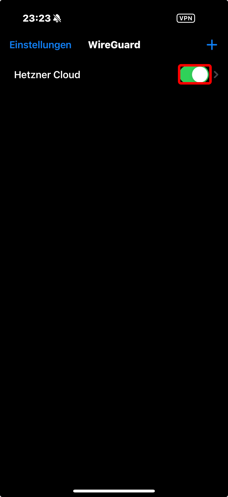

## Introduction

In this tutorial you will learn how to deploy WireGuard UI on a Linux machine using docker compose.

Wireguard UI is a "A web user interface to manage your WireGuard setup".

**Prerequisites**

- Linux Cloud Server (preferably Ubuntu 22.04)
- [Docker](https://docs.docker.com/engine/install/ubuntu/) and [Docker Compose](https://docs.docker.com/compose/install/linux/)
- Public IPv4 Address

To ensure Docker Compose is correctly installed use:

```bash
docker compose version
```

## Step 1 - Update your server

```bash
sudo apt update && sudo upgrade
```
## Step 2 - Setting up the .YML

The .yml file contains all information needed, 
to create Wireguard-UIs Docker Containers.


```bash
sudo mkdir /opt/wg-ui
sudo nano /opt/wg-ui/docker-compose.yml
```
Paste the following configuration:

```YAML
services:
  wireguard:
    image: linuxserver/wireguard:v1.0.20210914-ls7
    container_name: wireguard
    cap_add:
      - NET_ADMIN
    volumes:
      - ./config:/config
    ports:
      # port for wireguard-ui. this must be set here as the `wireguard-ui` container joins the network of this container and hasn't its own network over which it could publis>
      - "5000:5000"
      # port of the wireguard server
      - "51820:51820/udp"
    restart: unless-stopped

  wireguard-ui:
    image: ngoduykhanh/wireguard-ui:latest
    container_name: wireguard-ui
    depends_on:
      - wireguard
    cap_add:
      - NET_ADMIN
    # use the network of the 'wireguard' service. this enables to show active clients in the status page
    network_mode: service:wireguard
    environment:
      - SENDGRID_API_KEY
      - EMAIL_FROM_ADDRESS
      - EMAIL_FROM_NAME
      - SESSION_SECRET
      - WGUI_USERNAME=admin
      - WGUI_PASSWORD=admin
      - WG_CONF_TEMPLATE
      - WGUI_MANAGE_START=true
      - WGUI_MANAGE_RESTART=true
    logging:
      driver: json-file
      options:
        max-size: 50m
    volumes:
      - ./db:/app/db
      - ./config:/etc/wireguard
    restart: unless-stopped
```

## Step 3 - Starting the Container and accessing the GUI

To start the container enter:
```bash
sudo docker compose -f /opt/wg-ui/docker-compose.yml up -d
```

The output should look like:

```bash
[+] Running 3/3
 ✔ Network wg-ui_default   Created                                                                                                                                        0.1s
 ✔ Container wireguard     Started                                                                                                                                        0.2s
 ✔ Container wireguard-ui  Started
```

Using your browser enter http://<203.0.113.1>:5000

I recommend using a reverse proxy from now on.
[NGINX Proxy Manager](https://community.hetzner.com/tutorials/installing-nginx-proxy-manager)

If you were successful you should see the wireguard UI login page. The default credentials are:
 
- U: admin
- PW: admin

Change this password immediately after loging in the first time!


## Step 4 - Configure Routing

Under Wireguard Server enter:

**Post Up Script**
```bash
iptables -A FORWARD -i %1 -j ACCEPT; iptables -A FORWARD -o wg0 -j ACCEPT; iptables -t nat -A POSTROUTING -o eth+ -j MASQUERADE
```

**Post Down Script**
```bash
iptables -D FORWARD -i %1 -j ACCEPT; iptables -D FORWARD -o wg0 -j ACCEPT; iptables -t nat -D POSTROUTING -o eth+ -j MASQUERADE
```

Now click **Apply Config**


## Step 5 - Creating a new Client Configuration

Now create a new client with a descriptive name:

**später client bild einfügen**

Install a Wireguard Client on the device you want to connect from. In my example a smartphone. But there are many supported plattforms. [Download Wireguard](https://www.wireguard.com/install/)

Scan the **QR-Code** and connect:


To check if everything works as intended, access a Website like [wieistmeineIP.de](https://wieistmeineip.de) and compare it to your servers IP Address.


## Conclusion

**Congratulations**! You have Successfully deployed a Wireguard-UI Instance.


##### License: MIT

<!--

Contributor's Certificate of Origin

By making a contribution to this project, I certify that:

(a) The contribution was created in whole or in part by me and I have
    the right to submit it under the license indicated in the file; or

(b) The contribution is based upon previous work that, to the best of my
    knowledge, is covered under an appropriate license and I have the
    right under that license to submit that work with modifications,
    whether created in whole or in part by me, under the same license
    (unless I am permitted to submit under a different license), as
    indicated in the file; or

(c) The contribution was provided directly to me by some other person
    who certified (a), (b) or (c) and I have not modified it.

(d) I understand and agree that this project and the contribution are
    public and that a record of the contribution (including all personal
    information I submit with it, including my sign-off) is maintained
    indefinitely and may be redistributed consistent with this project
    or the license(s) involved.

Signed-off-by: [submitter's name and email address here]

-->
