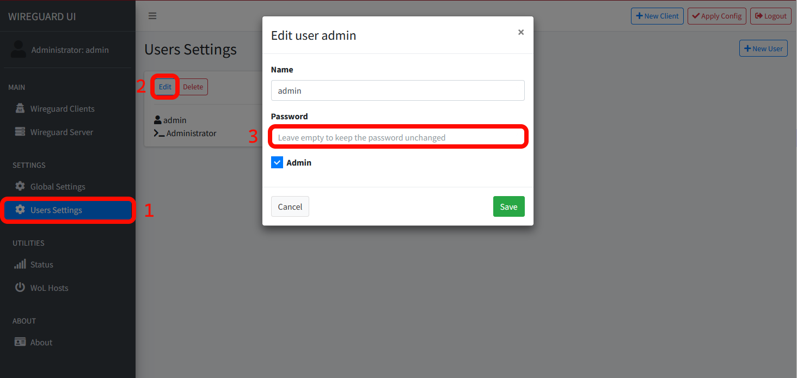
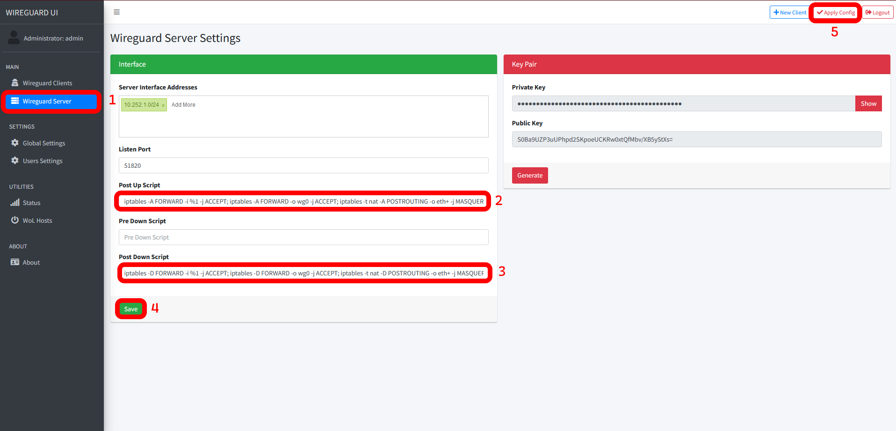
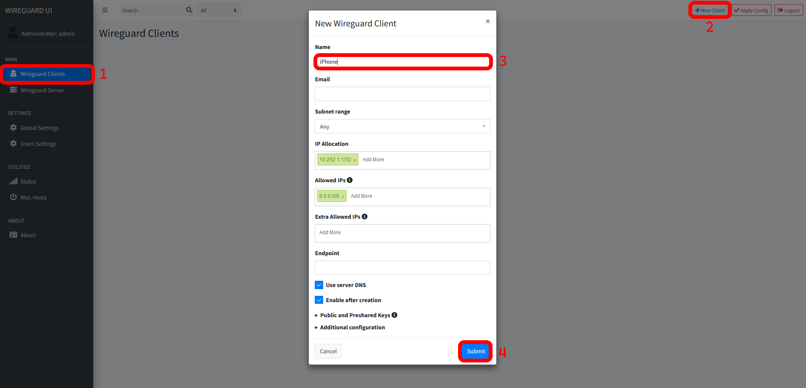

## Introduction

In this tutorial you will learn how to deploy WireGuard UI on a Linux machine using Docker Compose.

WireGuard UI is a "web user interface to manage your WireGuard setup".

**Prerequisites**

- Linux Cloud Server (preferably Ubuntu 22.04 / 24.04)
- [Docker](https://docs.docker.com/engine/install/ubuntu/) and [Docker Compose](https://docs.docker.com/compose/install/linux/) installed
- Public IPv4 Address

To ensure Docker Compose is correctly installed use:

```bash
docker compose version
```

## Step 1 - Update your server

```bash
sudo apt update && sudo apt upgrade
```

## Step 2 - Setting up the .YML

The `.yml` file contains all information needed,
to create Docker containers for the WireGuard UI.

```bash
sudo mkdir /opt/wg-ui
sudo nano /opt/wg-ui/docker-compose.yml
```

Paste the following configuration:

```yaml
services:
  wireguard:
    image: linuxserver/wireguard:v1.0.20210914-ls7
    container_name: wireguard
    cap_add:
      - NET_ADMIN
    volumes:
      - ./config:/config
    ports:
      - "5000:5000"
      - "51820:51820/udp"
    restart: unless-stopped

  wireguard-ui:
    image: ngoduykhanh/wireguard-ui:latest
    container_name: wireguard-ui
    depends_on:
      - wireguard
    cap_add:
      - NET_ADMIN
    # use the network of the 'wireguard' service. this enables to show active clients in the status page
    network_mode: service:wireguard
    environment:
      - SENDGRID_API_KEY
      - EMAIL_FROM_ADDRESS
      - EMAIL_FROM_NAME
      - SESSION_SECRET
      - WGUI_USERNAME=admin
      - WGUI_PASSWORD=admin
      - WG_CONF_TEMPLATE
      - WGUI_MANAGE_START=true
      - WGUI_MANAGE_RESTART=true
    logging:
      driver: json-file
      options:
        max-size: 50m
    volumes:
      - ./db:/app/db
      - ./config:/etc/wireguard
    restart: unless-stopped
```

Change the default password `WGUI_PASSWORD` to a secure one.

## Step 3 - Starting the Container and accessing the GUI

To start the container enter:

```bash
sudo docker compose -f /opt/wg-ui/docker-compose.yml up -d
```

The output should look like:

```bash
[+] Running 3/3
 ✔ Network wg-ui_default   Created          0.1s
 ✔ Container wireguard     Started          0.2s
 ✔ Container wireguard-ui  Started          0.3s
```

Using your browser enter `http://<203.0.113.1>:5000`

**Replace `<203.0.113.1>` with your servers IP Address.**

I recommend using a reverse proxy from now on (see [NGINX Proxy Manager](https://community.hetzner.com/tutorials/installing-nginx-proxy-manager)).

If you were successful you should see the WireGuard UI login page. The default credentials are:

- Username: admin
- Password: admin

Change this password immediately after logging in for the first time!



## Step 4 - Configure Routing

Under "WireGuard Server", enter the scripts below and hit "Apply Config".

**Post Up Script**
```bash
iptables -A FORWARD -i %1 -j ACCEPT; iptables -A FORWARD -o wg0 -j ACCEPT; iptables -t nat -A POSTROUTING -o eth+ -j MASQUERADE
```

**Post Down Script**
```bash
iptables -D FORWARD -i %1 -j ACCEPT; iptables -D FORWARD -o wg0 -j ACCEPT; iptables -t nat -D POSTROUTING -o eth+ -j MASQUERADE
```



## Step 5 - Creating a new Client Configuration

Now create a new client with a descriptive name:



## Step 6 - Adding clients

### Step 6.1 - iOS / Android

Download the WireGuard App from the [App Store](https://apps.apple.com/de/app/wireguard/id1441195209) / [Play Store](https://play.google.com/store/apps/details?id=com.wireguard.android&gl=DE).

In the WireGuard UI, click on "QR code" and scan it with the iOS / Android client like shown in this [tutorial](https://community.hetzner.com/tutorials/install-and-configure-wireguard-vpn#step-32---android-client).

### Step 6.2 - Windows / Mac

Install the [Windows WireGuard Client](https://download.wireguard.com/windows-client/wireguard-installer.exe) / [Mac WireGuard Client](https://itunes.apple.com/us/app/wireguard/id1451685025?ls=1&mt=12).

In the WireGuard UI, click on "Download" and import the `.conf` to the Windows / Mac client like shown in this [tutorial](https://community.hetzner.com/tutorials/install-and-configure-wireguard-vpn#step-33---windows-client).

### Step 6.3 - Linux

Install WireGuard on the Linux client:

```bash
sudo apt update && sudo apt install wireguard
```

In the WireGuard UI, click on "Download" and put the `.conf` into the following file on the Linux client:

```bash
/etc/wireguard/wg0.conf
```

And start (or stop) WireGuard:

* Temporarily
  ```bash
  wg-quick up wg0
  wg-quick down wg0
  ```

* Permanently
  ```bash
  sudo systemctl start wg-quick@wg0 && sudo systemctl enable wg-quick@wg0
  sudo systemctl stop wg-quick@wg0 && sudo systemctl disable wg-quick@wg0
  ```

### Step 6.4 - Verifying the Connection

To check if everything works as intended, access a website like [ip.hetzner.com](https://ip.hetzner.com/) and compare it to your servers IP Address.

## Conclusion

**Congratulations**! You have successfully deployed a WireGuard UI instance.

##### License: MIT

<!--

Contributor's Certificate of Origin

By making a contribution to this project, I certify that:

(a) The contribution was created in whole or in part by me and I have
    the right to submit it under the license indicated in the file; or

(b) The contribution is based upon previous work that, to the best of my
    knowledge, is covered under an appropriate license and I have the
    right under that license to submit that work with modifications,
    whether created in whole or in part by me, under the same license
    (unless I am permitted to submit under a different license), as
    indicated in the file; or

(c) The contribution was provided directly to me by some other person
    who certified (a), (b) or (c) and I have not modified it.

(d) I understand and agree that this project and the contribution are
    public and that a record of the contribution (including all personal
    information I submit with it, including my sign-off) is maintained
    indefinitely and may be redistributed consistent with this project
    or the license(s) involved.

Signed-off-by: Joshua Hoffmann benjoeman.jh@gmail.com

-->
