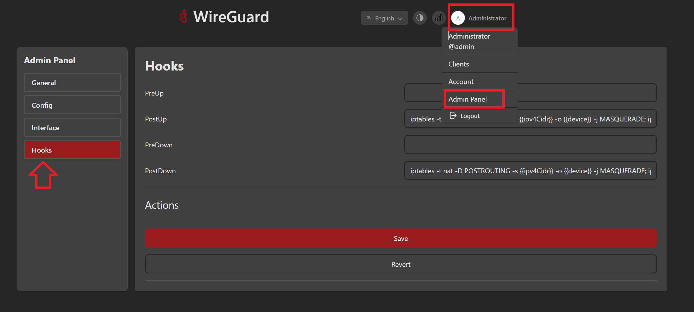
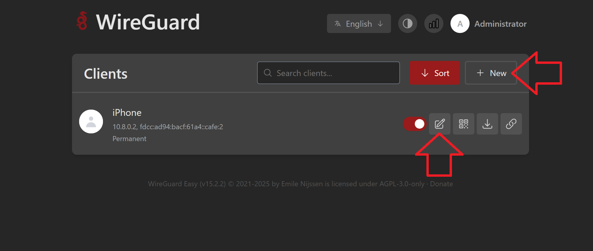

## Introduction

In this tutorial you will learn how to deploy the WireGuard UI [wg-easy](https://github.com/wg-easy/wg-easy) on a Linux machine using Docker Compose.

WireGuard Easy is a web-based admin UI.

**Prerequisites**

- Linux Cloud Server (preferably Ubuntu 22.04 / 24.04)
- [Docker and Docker Compose](https://docs.docker.com/engine/install/ubuntu/) installed
- Public IPv4 Address
- A domain

## Step 1 - Update your server

```bash
sudo apt update && sudo apt upgrade
```

To ensure Docker Compose is correctly installed use:

```bash
docker compose version
```

Also, make sure the `A` record of your domain points to the IPv4 of your server.

## Step 2 - Setting up the .YML

The `.yml` file contains all information needed,
to create Docker containers for the WireGuard UI.

You can find a [basic `docker-compose.yml`](https://github.com/wg-easy/wg-easy/blob/master/docker-compose.yml) in the wg-easy repository on GitHub. However, you would need to set [INSECURE to "true"](https://github.com/wg-easy/wg-easy/blob/master/docs/content/examples/tutorials/reverse-proxyless.md#setup) to be able to login in the UI.

The `wg-easy` wiki covers a few alternatives. In this tutorial, we will use [WireGuard Easy with nginx SSL](https://github.com/wg-easy/wg-easy/wiki/Using-WireGuard-Easy-with-nginx-SSL).

Set a variable and create a new directory:

```bash
DOMAIN="wg-easy.example.com"
sudo mkdir /opt/wg-easy
```

Now run these two commands to create `docker-compose.yml` and `~/.nginx/servers/wg-easy.conf`:

```bash
sudo tee /opt/wg-easy/wg-easy.conf <<EOF
server {
    server_name $DOMAIN;

    location / {
        proxy_pass http://wg-easy:51821/;
        proxy_http_version 1.1;
        proxy_set_header Upgrade \$http_upgrade;
        proxy_set_header Connection "Upgrade";
        proxy_set_header Host \$host;
        proxy_set_header X-Forwarded-Proto \$scheme;
    }
}
EOF
```

```bash
sudo tee /opt/wg-easy/docker-compose.yml <<EOF
volumes:
  etc_wireguard:

services:
  wg-easy:
    image: ghcr.io/wg-easy/wg-easy:15
    container_name: wg-easy
    hostname: wg-easy
    volumes:
      - etc_wireguard:/etc/wireguard
      - /lib/modules:/lib/modules:ro
    ports:
      - "51820:51820/udp"
    restart: unless-stopped
    cap_add:
      - NET_ADMIN
      - SYS_MODULE
    sysctls:
      - net.ipv4.ip_forward=1
      - net.ipv4.conf.all.src_valid_mark=1
      - net.ipv6.conf.all.disable_ipv6=0
      - net.ipv6.conf.all.forwarding=1
      - net.ipv6.conf.default.forwarding=1

  nginx:
    image: weejewel/nginx-with-certbot
    container_name: nginx
    hostname: nginx
    volumes:
      - /opt/wg-easy/:/etc/nginx/servers/
      - ./.nginx/letsencrypt/:/etc/letsencrypt/
    ports:
      - "80:80/tcp"
      - "443:443/tcp"
    restart: unless-stopped
EOF
```

## Step 3 - Starting the Container and accessing the GUI

To start the container enter:

```bash
sudo docker compose -f /opt/wg-easy/docker-compose.yml up -d
```

The output should look like:

```bash
 [+] up 35/35
 ✔ Image ghcr.io/wg-easy/wg-easy:15      Pulled         11.3s
 ✔ Image weejewel/nginx-with-certbot     Pulled         5.1ss
 ✔ Network wg-easy_default               Created        0.0s
 ✔ Volume wg-easy_etc_wireguard          Created        0.0s
 ✔ Container wg-easy                     Started        0.6s
 ✔ Container nginx                       Started        0.6s
```

Make sure the status of both containers is "Up ## seconds":

```bash
docker ps
```

Once they are ready, run these commands to create a Let's Encrypt certificate:

```bash
docker exec -it nginx /bin/sh
cp /etc/nginx/servers/wg-easy.conf /etc/nginx/conf.d/.
DOMAIN="wg-easy.example.com"
certbot --nginx --non-interactive --agree-tos -m webmaster@google.com -d $DOMAIN
nginx -s reload
exit
```

Using your browser enter `https://wg-easy.example.com`

**Replace `wg-easy.example.com` with your own domain.**

If you were successful, you should see the WireGuard Easy welcome page.  
Click "Continue" and create an admin account.
After the account is created, it will ask if you have an existing setup. If not, click on "No".
On the next page, provide your domain (e.g. `wg-easy.example.com`) as "Host" and click "Continue".

Now sign in with the account you just created.

## Step 4 - Configure Routing

In the top right, click on "Administrator" » "Admin Panel".

In the left menu bar, select "Hooks".

For PostUp and PostDown, there should already be rules. You can add or remove rules as needed.



## Step 5 - Creating a new Client Configuration

Now create a new client:

* In the top right of the dashboard, click on `+ New`
* Add a descriptive name
* If needed, set an expiration date

After the client was added, click on the pencil symbol. There, you can view the configuration, customize the settings, or delete the client.



## Step 6 - Adding clients

### Step 6.1 - iOS / Android

Download the WireGuard App from the [App Store](https://apps.apple.com/de/app/wireguard/id1441195209) / [Play Store](https://play.google.com/store/apps/details?id=com.wireguard.android&gl=DE).

In the WireGuard UI, click on the QR code symbol and scan it with the iOS / Android client like shown in this [tutorial](https://community.hetzner.com/tutorials/install-and-configure-wireguard-vpn#step-32---android-client).

### Step 6.2 - Windows / Mac

Install the [Windows WireGuard Client](https://download.wireguard.com/windows-client/wireguard-installer.exe) / [Mac WireGuard Client](https://itunes.apple.com/us/app/wireguard/id1451685025?ls=1&mt=12).

In the WireGuard UI, click on the download symbol and import the `.conf` to the Windows / Mac client like shown in this [tutorial](https://community.hetzner.com/tutorials/install-and-configure-wireguard-vpn#step-33---windows-client).

### Step 6.3 - Linux

Install WireGuard on the Linux client:

```bash
sudo apt update && sudo apt install wireguard
```

In the WireGuard UI, click on the download symbol and put the `.conf` into the following file on the Linux client:

```bash
/etc/wireguard/wg0.conf
```

And start (or stop) WireGuard:

* Temporarily
  ```bash
  wg-quick up wg0
  wg-quick down wg0
  ```

* Permanently
  ```bash
  sudo systemctl start wg-quick@wg0 && sudo systemctl enable wg-quick@wg0
  sudo systemctl stop wg-quick@wg0 && sudo systemctl disable wg-quick@wg0
  ```

### Step 6.4 - Verifying the Connection

To check if everything works as intended, access a website like [ip.hetzner.com](https://ip.hetzner.com/) and compare it to your servers IP Address.

## Conclusion

**Congratulations**! You have successfully deployed a WireGuard UI instance.

##### License: MIT

<!--

Contributor's Certificate of Origin

By making a contribution to this project, I certify that:

(a) The contribution was created in whole or in part by me and I have
    the right to submit it under the license indicated in the file; or

(b) The contribution is based upon previous work that, to the best of my
    knowledge, is covered under an appropriate license and I have the
    right under that license to submit that work with modifications,
    whether created in whole or in part by me, under the same license
    (unless I am permitted to submit under a different license), as
    indicated in the file; or

(c) The contribution was provided directly to me by some other person
    who certified (a), (b) or (c) and I have not modified it.

(d) I understand and agree that this project and the contribution are
    public and that a record of the contribution (including all personal
    information I submit with it, including my sign-off) is maintained
    indefinitely and may be redistributed consistent with this project
    or the license(s) involved.

Signed-off-by: Joshua Hoffmann benjoeman.jh@gmail.com

-->
