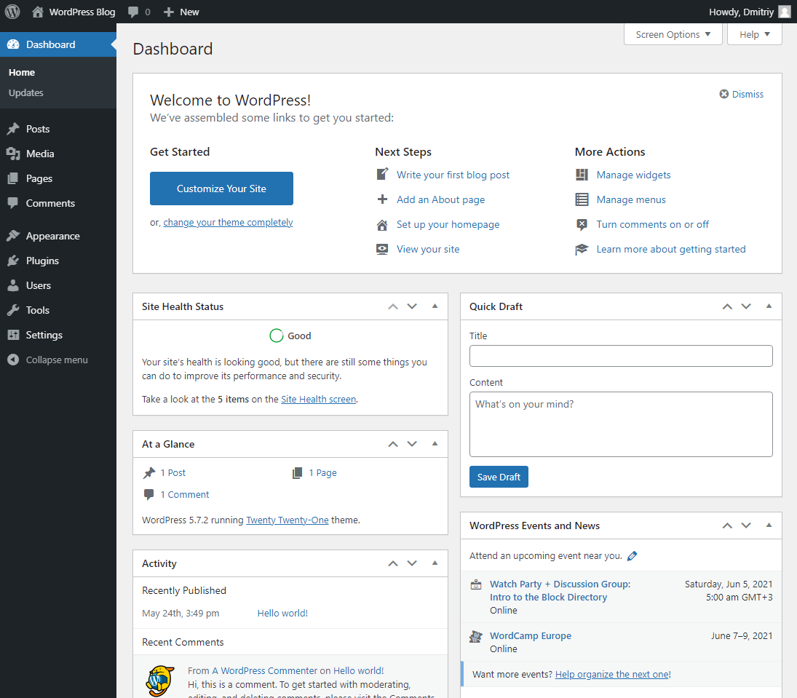

## Introduction

This tutorial will guide you to a self-hosted WordPress instance on Ubuntu.

No complicated prerequisites are necessary, information presented in self-contained manner.

Basic Linux knowledge is assumed.

**Prerequisites**

* a new Ubuntu Server with root access

* a domain pointing to your server (`A` DNS record created with an IP address of your server)
  * your DNS hosting provider should have a guide how to do that

## Step 1 - Configuring the server

### Step 1.1 - Checking DNS

To proceed you need to check that your domain points to the server. We will do it by using ping command.

Execute the following command on your **local computer** (replace `example.com` with your domain).

```bash
ping example.com
```

You will get the output similar to this:

```
PING example.com (10.0.0.1) 56(84) bytes of data.
64 bytes from 10.0.0.1: icmp_seq=1 ttl=64 time=0.017 ms
64 bytes from 10.0.0.1: icmp_seq=2 ttl=64 time=0.035 ms
64 bytes from 10.0.0.1: icmp_seq=3 ttl=64 time=0.065 ms

--- example.com ping statistics ---
3 packets transmitted, 3 received, 0% packet loss, time 2049ms
rtt min/avg/max/mdev = 0.017/0.039/0.065/0.019 ms
```

In place of `10.0.0.1` you should see an IP address of your server.

If it's not the case, you will need to wait some time until DNS records will be updated.

In the meantime you can follow the tutorial up to the **Step 3.4**.

### Step 1.2 - Updating the system

You should update your system.

1. Check for updates:

    ```bash
    apt update
    ```

2. Perform the update, press **y** to agree with updates if necessary.

    ```bash
    apt upgrade
    ```

### Step 1.3 - Creating a user

You should create a regular system user to use with your WordPress instance.
Replace `holu` with a desired username.

```bash
adduser holu
```

You will be prompted for a password. Everything else can be skipped by pressing **Enter**.

### Step 1.4 - Configuring a timezone

You need to change the server timezone to your timezone.
To do that use the command:

```bash
dpkg-reconfigure tzdata
```

Use **Up** and **Down** arrows to navigate and **Enter** to make a choice.

### Step 1.5 - Creating a directory for WordPress

1. We need to create the directory where WordPress website will be installed, for example:

    ```bash
    mkdir /var/www/wordpress
    ```

2. Permissions must be given to the user created in the **Step 1.3**.

    ```bash
    chown holu:holu /var/www/wordpress
    ```

## Step 2 - Installing required software

### Step 2.1 - Using a package manager

Before we can proceed to WordPress installation we need to install required software packages.

```bash
apt install nginx mariadb-server mariadb-client php-fpm php-cli php-zip php-xml php-mysql php-json php-curl php-imagick certbot python3-certbot-nginx
```

Here is a short description of each package and why it's required.

* `nginx`

 web server that accepts http requests from a browser

* `mariadb-server`

 database server, used for creating WordPress databases

* `mariadb-client`

 used to connect to the database server from the command line

* `php-fpm`

 used to run WordPress core, themes and plugins

* `php-cli`

 used to run WP-CLI (more later on)

* `zip, xml, mysql, json, curl, imagick`

 required PHP extensions

* `certbot, python3-certbot-nginx`

 required for HTTPS support

### Step 2.2 - Checking the PHP version installed

We will need the PHP version in the future steps. Run the command:

```bash
php -v
```

You should see output similar to this:

```
PHP 7.4.3 (cli) (built: Oct  6 2020 15:47:56) ( NTS )
Copyright (c) The PHP Group
Zend Engine v3.4.0, Copyright (c) Zend Technologies
    with Zend OPcache v7.4.3, Copyright (c), by Zend Technologies
```

only the first two numbers relevant here, `7.4` in my case.

### Step 2.3 - Installing WP-CLI

WP-CLI provides many useful functions to work with WordPress from command line.

1. You need to execute the following commands to install WP-CLI:

    ```bash
    curl -O https://raw.githubusercontent.com/wp-cli/builds/gh-pages/phar/wp-cli.phar
    chmod +x wp-cli.phar
    mv wp-cli.phar /usr/local/bin/wp
    ```

2. The `wp` command is now available in the shell.

3. WP-CLI can be updated by repeating the step 1 if necessary.

## Step 3 - Configuring required software

### Step 3.1 - Configuring PHP

1. Open the configuration file with a text editor, replace `7.4` with your PHP version from the **Step 2.2**:

    ```bash
    nano /etc/php/7.4/fpm/pool.d/www.conf
    ```

2. Find these lines:

    ```ini
    user = www-data
    group = www-data
    ```

3. Replace `www-data` with the username from the **Step 1.3**:

    ```ini
    user = holu
    group = holu 
    ```

4. Press **Ctrl+S** to save and **Ctrl+X** to exit

5. We need to reload the configuration file to apply our changes, replace `7.4` with your PHP version.

    ```bash
    systemctl stop php7.4-fpm
    systemctl start php7.4-fpm
    ```

### Step 3.2 - Configuring nginx

1. Create the configuration file:

    ```bash
    nano /etc/nginx/sites-available/wordpress
    ```

2. Paste this content:

    ```nginx
    server {
        listen 80;
        server_name example.com;
        root /var/www/wordpress;
        index index.php;

        location / {
            try_files $uri $uri/ /index.php?$args;
        }

        location ~ \.php$ {
            include snippets/fastcgi-php.conf;
            fastcgi_pass unix:/run/php/php7.4-fpm.sock;
        }
    }
    ```

3. Edit the content:

    * replace `example.com` with your domain
    * replace `/var/www/wordpress` with the directory created in the **Step 1.5**
    * on a line `fastcgi_pass unix:/run/php/php7.4-fpm.sock;` replace `7.4` with your PHP version

4. Save the file and close it

5. Enable the configuration file:

    ```bash
    ln -s /etc/nginx/sites-available/wordpress /etc/nginx/sites-enabled/wordpress
    ```

6. Reload:

    ```bash
    systemctl reload nginx
    ```

### Step 3.3 - Configuring MariaDB

1. Type `mysql` to open the database shell

2. Create the database account for the system user, replace `holu` with your username from the **Step 1.3**.

    ```sql
    CREATE USER 'holu'@'localhost' IDENTIFIED VIA unix_socket;
    ```

3. We will use the database `wordpress_db` for WordPress.
    The user needs permissions to work with a database, the database `wordpress_db` will be created later on with WP-CLI:

    ```sql
    GRANT ALL ON wordpress_db.* TO 'holu'@'localhost';
    ```

4. Type `\q` to close the shell.

### Step 3.4 - Configuring HTTPS support

1. Execute the following command, replace `example.com` with your domain:

    ```bash
    certbot -d example.com
    ```

2. Provide your email and agree with terms of service

3. When prompted to redirect requests or not you should type **2** to redirect them and press **Enter**.

## Step 4 - Installing WordPress

1. Log in as regular system user, created in the **Step 1.3**:

    ```bash
    ssh holu@10.0.0.1
    ```

2. Change the current working directory to the WordPress directory, created in the **Step 1.5**:

    ```bash
    cd /var/www/wordpress
    ```

3. Download WordPress:

    ```bash
    wp core download
    ```

4. Create the `wp-config.php` file, replace `holu` with the user created in the **Step 1.3**:

    ```bash
    wp config create --dbname=wordpress_db --dbuser=holu --prompt=
    ```

5. Create the `wordpress_db` database:

    ```bash
    wp db create
    ```

6. Install WordPress:

    * replace `example.com` with your domain
    * replace `holu` with a desired **WordPress user**
    * replace `holu@example.com` with your email

    ```bash
    wp core install --url=https://example.com --title="WordPress Blog" --admin_user=holu --admin_email=holu@example.com
    ```

7. WP-CLI will generate and output your WordPress password to the terminal

8. Go to `https://example.com/wp-admin` to log in to the WordPress Admin Dashboard.

9. Finally 😀:



## Conclusion

Congratulations! You should have a working WordPress website.

I hope that information presented was useful to you.

##### License: MIT

<!--

Contributor's Certificate of Origin

By making a contribution to this project, I certify that:

(a) The contribution was created in whole or in part by me and I have
    the right to submit it under the license indicated in the file; or

(b) The contribution is based upon previous work that, to the best of my
    knowledge, is covered under an appropriate license and I have the
    right under that license to submit that work with modifications,
    whether created in whole or in part by me, under the same license
    (unless I am permitted to submit under a different license), as
    indicated in the file; or

(c) The contribution was provided directly to me by some other person
    who certified (a), (b) or (c) and I have not modified it.

(d) I understand and agree that this project and the contribution are
    public and that a record of the contribution (including all personal
    information I submit with it, including my sign-off) is maintained
    indefinitely and may be redistributed consistent with this project
    or the license(s) involved.

Signed-off-by: wpdevelopment11 wpdevelopment11@gmail.com

-->
