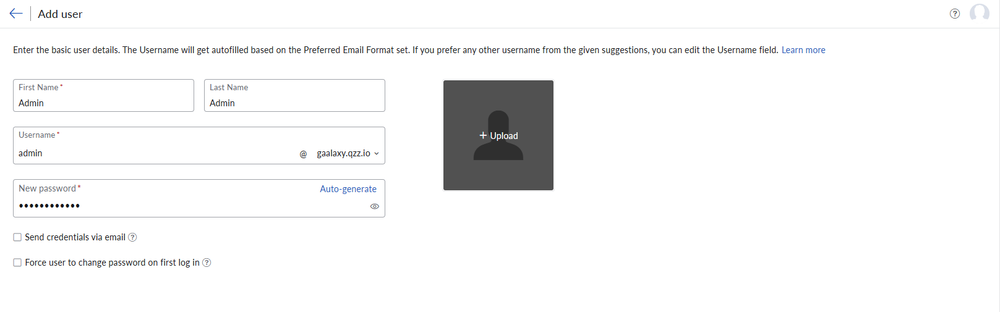
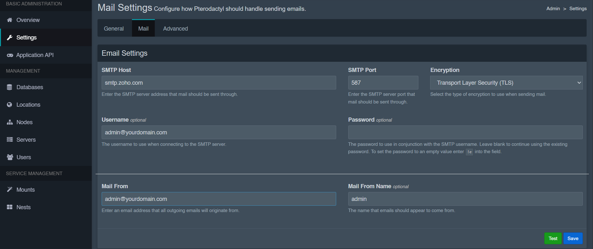

# Integrating a Mail Server into Your Pterodactyl Infrastructure

### Introduction

Email integration plays a vital role in your user experience. Setting up alerts, verification emails, password resets wouldn't have been possible if not for mail servers.

For this, you can use a public SMTP provider (Gmail, Zoho, Outlook, Mailgun, etc.) or your own mail server (Postfix + Dovecot). If you want a simple setup, it is recommended to go with Gmail and other similar providers. But if you want full control and use your own domain mail setup like mail@yourdomain.com, you will have to consider other options such as Zoho.

In this guide, I’ll walk through how I configured **Zoho Mail** as the SMTP provider for my Pterodactyl panel hosted on Hetzner. Zoho works great for custom domains and is far easier to manage than self-hosted mail servers or Gmail’s limited SMTP access.

#

### Prerequisites

- A Pterodactyl panel installation (any version)
- A registered domain name
- Access to your domain's DNS settings
- A Zoho Mail account (or can be made during the tutorial)

### Why Zoho Mail?

- Free and affordable plans
- Clean Web UI
- Easy SMTP integration

#

### Step 1: Getting Started

Create your Zoho Mail account through [their website](https://www.zoho.com/mail/). After creating your account, you must follow some steps to connect your domain with the mail server.

### Step 1.1: Setting Up Domain Mail Server

⚠️ Before proceeding further, make sure you have a domain name registered, if not opt for gmail or any such SMTP providers.

After signing up, head over to this link: https://mailadmin.zoho.com/hosting?plan=free . Open the DNS manager of your domain and follow the instructions as promted. First, it'll ask you to verify your domain. On completing the verification, add an user that you are going to use for the pterodactyl panel. I'm going to skip the groups part since it's not mandatory for this setup.


Now comes the most important part, you'll need to add records provided by Zoho Mail to your domain as it is. After all the records are added, click on "Verify all records". After all this you can procced to setup completion and open the mail admin panel.

### Step 2: Configuring the Pterodactyl Email Settings

In your pterodactyl panel, open up your admin page. Head over to Settings and then Mail. Fill in the details as provided:

```
SMTP Host: smtp.zoho.com
SMTP Port: 587
Encryption: TLS
Username: user@yourdomain.com (the user you created)
Password: (Password of the user you created)
Mail from: (Same as username)
Maie From Name: (whatever you want it to have)
```

_The SMTP details can also be found in mailadmin of Zoho Mail under Mail Settings → Tools & Configration → Configurations → Outgoing/SMTP or [this link](https://mailadmin.zoho.com/cpanel/home.do#mailSettings/toolsAndConfiguration/configurations)_


After this, you can click on the "Test" button which wlll send you a mail linked with your initial pterodactyl admin account. If everything went right, you'll recieve a test email.

### Step 3: Troubleshooting Common Zoho SMTP Errors

`❌ Connection timed out`: Make sure outbound rules allow those ports: 465,587/tcp

### Conclusion

Integrating Mail with Pterodactyl makes your setup more reliable, polished and professional. This ensures password resets and alerts to work flawlessly.

##### License: MIT

<!--

Contributor's Certificate of Origin

By making a contribution to this project, I certify that:

(a) The contribution was created in whole or in part by me and I have
    the right to submit it under the license indicated in the file; or

(b) The contribution is based upon previous work that, to the best of my
    knowledge, is covered under an appropriate license and I have the
    right under that license to submit that work with modifications,
    whether created in whole or in part by me, under the same license
    (unless I am permitted to submit under a different license), as
    indicated in the file; or

(c) The contribution was provided directly to me by some other person
    who certified (a), (b) or (c) and I have not modified it.

(d) I understand and agree that this project and the contribution are
    public and that a record of the contribution (including all personal
    information I submit with it, including my sign-off) is maintained
    indefinitely and may be redistributed consistent with this project
    or the license(s) involved.

Signed-off-by: zSuyog Maharjan suyogmaharjan38@gmail.com

-->
