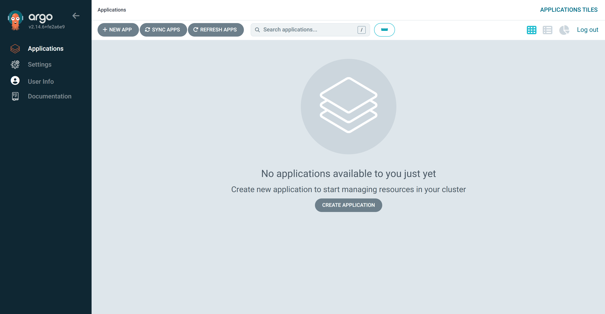
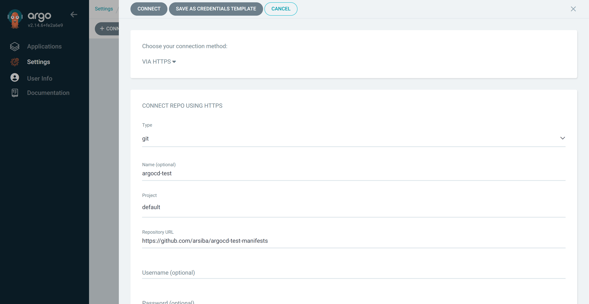
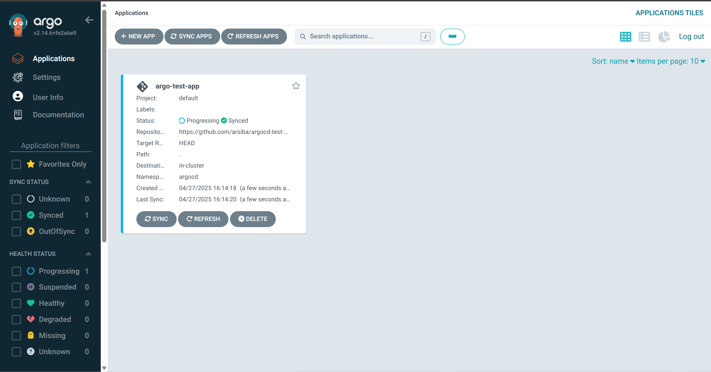
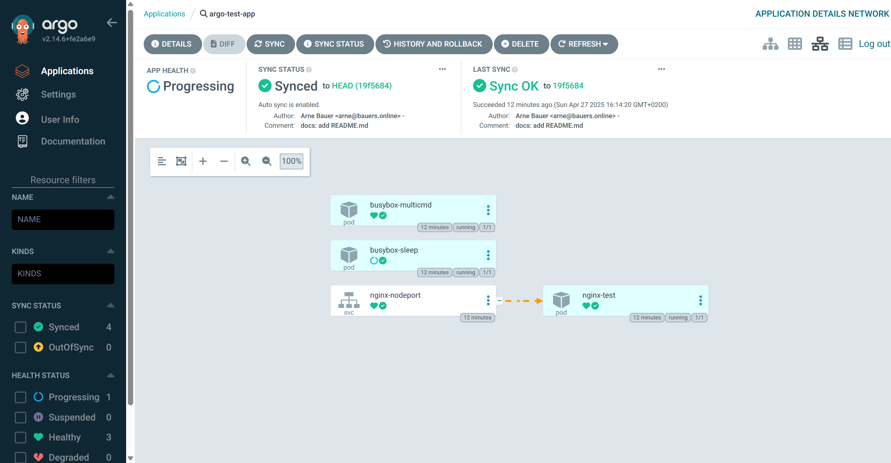

## Einführung

Dieses Tutorial führt dich durch die Installation, das Setup und den Betrieb von ArgoCD in einem Kubernetes Cluster bei Hetzner (sog. in-cluster deployment) . Die Anzahl der Knoten im Cluster spielt hierbei keine Rolle. 

**Voraussetzungen**
Für dieses Tutorial werden zwei Voraussetzungen benötigt:

1. [Kubernetes](https://kubernetes.io/)-Cluster: Mit der Installation und den verschiedenen Deployment-Arten beschäftigen sich schon einige andere Hetzner-Tutorials. Aus diesem Grund werden wir es als Grundvoraussetzung sehen und uns nicht genauer mit dem Setup beschäftigen. Wir werden für dieses Tutorial einen Hetzner Dedicated Server mit installiertem Kubernetes nutzen – und ihn als einzigen Knoten im Cluster betreiben. Die Installation haben wir mittels kurl.sh-Script durchgeführt.
   
2. Ein Repository, in dem später eure Manifeste liegen werden. Ob das Repository auf GitLab/GitHub/privat gehostet und öffentlich/privat zugänglich ist, spielt keine Rolle.

## Teil 1: Einführung und Installation

### Was ist Argo CD überhaupt?
Doch was ist Argo CD überhaupt? Wenn wir auf die [Projekt Website](https://argo-cd.readthedocs.io/en/stable/) schauen, steht hier folgendes: "Argo CD is a declarative, GitOps continuous delivery tool for Kubernetes."
 Super, das hilft ja mal so gar nicht weiter. Fangen wir also bei der notwendigen Grundlage an: Continuous Delivery.
 
Continuous Delivery (CD) ist eine Methode in der Softwareentwicklung, die darauf abzielt, Softwareänderungen – seien es neue Features, Konfigurationsänderungen, Bugfixes oder Experimente – schnell, sicher und nachhaltig in die Produktionsumgebung zu überführen. Im Kern geht es bei Continuous Delivery darum, einen **verlässlichen und wiederholbaren Prozess** zu schaffen, um Softwareänderungen vom Entwicklungssystem bis in die Hände der Endnutzer zu bringen. Stell dir eine Art Pipeline vor, durch die deine Software fließt. Jede Phase dieser Pipeline – vom Code-Commit über automatisierte Tests bis hin zur eigentlichen Bereitstellung in einer Test- oder Produktionsumgebung – ist darauf ausgelegt, Fehler frühzeitig zu erkennen und den Prozess so reibungslos wie möglich zu gestalten.

Ein wichtiger Aspekt von CD ist die **enge Verzahnung mit Continuous Integration (CI)**. Während CI sich darauf konzentriert, Codeänderungen von verschiedenen Entwicklern regelmäßig in einem gemeinsamen Repository zusammenzuführen und automatisiert zu testen, baut CD auf dieser Basis auf und erweitert sie um die Automatisierung der Bereitstellung in verschiedenen Umgebungen. Man könnte sagen, CI bereitet das Softwarepaket vor, und CD liefert es aus - Im Falle von Argo CD an ein Kubernetes Cluster.

Ein weiteres zentrales Element für eine erfolgreiche Continuous Delivery in Kubernetes mit Argo CD ist die Idee, alle Kubernetes Manifeste in einem oder mehreren dedizierten Git-Repositories zu verwalten. Diese Manifeste beschreiben den gewünschten Zustand deiner gesamten Kubernetes-Anwendungen und Infrastruktur – von Deployments und Services bis hin zu Namespaces und Custom Resource Definitions. Das macht Argo CD "deklarativ".

### Installation von Argo CD
Als erstes beginnen wir damit, zu überprüfen, ob unser die Knoten unseres Kubernetes Cluster richtig laufen.

```bash
kubectl get nodes
```

Du solltest eine ähnliche Ausgabe wie diese erhalten:

```
NAME               STATUS   ROLES                  AGE     VERSION
hetzner-tutorial   Ready    control-plane,master   3m30s   v1.29.15
```

Als nächstes erstellen wir einen separaten Namespace für Argo CD `argocd`:

```bash
kubectl create namespace argocd
```

Danach können wir auch schon das Installationsskript von Argo CD laufen lassen. Auch dieses wird auf ihrer Seite zur Verfügung gestellt (https://argo-cd.readthedocs.io/en/stable/getting_started/) 

```bash
kubectl apply -n argocd -f https://raw.githubusercontent.com/argoproj/argo-cd/stable/manifests/install.yaml
```

Und das war's auch schon – zumindest fast. Nun sollte Argo CD auf eurem Cluster laufen. Um dies zu überprüfen, lassen wir uns alle Pods aus dem neu erstellten Namespace `argocd` anzeigen, denn hier wurde Argo installiert:

```bash
kubectl get pods -n argocd
```

Du solltest eine Ausgabe wie diese erhalten:

```bash
NAME                                                READY   STATUS    RESTARTS   AGE
argocd-application-controller-0                     1/1     Running   0          3m11s
argocd-applicationset-controller-555cf564b4-jl4k7   1/1     Running   0          3m12s
argocd-dex-server-66876985d9-nwbzr                  1/1     Running   0          3m12s
argocd-notifications-controller-8f5c7f7ff-7kxzj     1/1     Running   0          3m12s
argocd-redis-6d85ddf67d-zlksg                       1/1     Running   0          3m12s
argocd-repo-server-85f97ff79c-lggpr                 1/1     Running   0          3m11s
argocd-server-84db496456-mf92w                      1/1     Running   0          3m11s
```

Um nun auch auf die Weboberfläche von Argo zu kommen, müssen wir den Service `argocd-server` über die IP-Adresse zugänglich machen. Gebt hierfür folgenden Befehl ein:

```bash
kubectl get svc -n argocd
```

```bash
NAME                                      TYPE        CLUSTER-IP    EXTERNAL-IP   PORT(S)                      AGE
argocd-applicationset-controller          ClusterIP   10.96.0.203   <none>        7000/TCP,8080/TCP            7m19s
argocd-dex-server                         ClusterIP   10.96.3.228   <none>        5556/TCP,5557/TCP,5558/TCP   7m19s
argocd-metrics                            ClusterIP   10.96.2.72    <none>        8082/TCP                     7m19s
argocd-notifications-controller-metrics   ClusterIP   10.96.2.141   <none>        9001/TCP                     7m19s
argocd-redis                              ClusterIP   10.96.3.184   <none>        6379/TCP                     7m19s
argocd-repo-server                        ClusterIP   10.96.0.167   <none>        8081/TCP,8084/TCP            7m19s
argocd-server                             ClusterIP   10.96.0.80    <none>        80/TCP,443/TCP               7m19s
argocd-server-metrics                     ClusterIP   10.96.0.131   <none>        8083/TCP                     7m19s
```

In der Ausgabe erkennen wir, dass der Service `argocd-server` eine ClusterIP zugewiesen hat. Diese reicht zwar für die Kommunikation innerhalb des Clusters, allerdings ist er nicht von außen erreichbar. Dafür werden wir dem Service einen `NodePort` zuweisen. Da der Service schon existiert, patchen wir seine Konfiguration wie folgt:

```bash
kubectl patch svc argocd-server -n argocd -p '{"spec": {"type": "NodePort"}}'
```

Folgende Ausgabe bestätigt, dass alles geklappt hat:

```bash
service/argocd-server patched
```

Lassen wir uns nun erneut alle Services ausgeben, sollten wir sehen, dass `argocd-server` einen NodePort zugewiesen bekommen hat:

```bash
kubectl get svc -n argocd
```

```bash
NAME                                      TYPE        CLUSTER-IP    EXTERNAL-IP   PORT(S)                      AGE
[...]
argocd-server                             NodePort    10.96.0.80    <none>        80:32867/TCP,443:26835/TCP   16m
[...]
```

Über die beiden Ports `32867` und `26835` ist die Anwendung nun zu erreichen.  
Ruft testweise die Anwendung in eurem Browser auf:

```
https://<IP-Adresse>:26835
```

Wenn ihr die Login Seite von Argo seht, hat alles geklappt!


## Teil 2: Deployen eines Test-Projektes

>In diesem Schritt werden wir ein Repository verbinden und ein Test-Deployment durchführen.

Um euch bei Argo anzumelden, verwendet ihr den Username `admin` und lasst euch das Passwort durch folgenden Befehl ausgeben:

```bash
kubectl -n argocd get secret argocd-initial-admin-secret -o jsonpath="{.data.password}" | base64 -d
```

Das Passwort könnt ihr natürlich auch jederzeit ändern. Ihr werdet von folgendem Bildschirm begrüßt:



Nun ist der Zeitpunkt gekommen, um ein Repository mit euren Manifesten anzulegen. In diesem Repository werden wir ein öffentliches Test-Repository auf GitHub verwenden. Erstellt hierfür ein neues Repository, dass eine Datei mit dem Namen `busybox-shell-loop.yaml` enthält. Diese Datei enthält folgenden Code:

```yaml
apiVersion: v1
kind: Pod
metadata:
  name: busybox-multicmd
spec:
  containers:
    - name: busybox
      image: busybox:latest
      command: ["/bin/sh"]
      args: ["-c", "while true; do echo hello; sleep 10; done"]
      imagePullPolicy: IfNotPresent
  restartPolicy: Always
```

Es ist ein Manifest für eine sog. Busybox. Sie führt den unter `spec.containers.args` genannten Code aus. Was genau hier passiert, werden wir später noch sehen. Speichert die Datei und ladet sie hoch, bzw. pusht den Code!

Nun geht es wieder weiter in Argo CD. Um das Repo in Argo CD hinzuzufügen, navigiert zu dem Menüpunkt `Settings`. 


Wählt hier den Menüpunkt Repository und klickt auf `Connect Repo`


Wir wählen für unser Repository `HTTPS` aus und als Type wählen wir `git`. Gebt dem Projekt einen entsprechenden Namen wie `argocd-test`. In dem `Project`-Feld gebt ihr `default` an. Nun kopiert die URL zu eurem Repo in das `Repository URL`-Feld. Ist es ein privates Repository, könnt ihr darunter noch entsprechende Zugangsdaten angeben, dies ist in unserem Fall jedoch nicht notwendig. Alle weiteren Felder können wir für dieses Tutorial überspringen. Die Konfiguration sollte also wie folgt aussehen:



Mit einem Klick auf `Connect` bestätigen wir das Hinzufügen des Repos.


Ist der Connection Status `success`, hat alles geklappt. Falls nicht, überprüfe, ob das richtige Repo ausgewählt wurde und – ist es ein privates Repo – ob die richtigen Zugangsdaten verwendet wurden.

Im nächsten Schritt erstellen wir eine Application. In Argo CD ist eine Application eine Organisationseinheit für mehrere Ressourcen. Wechselt dafür wieder über das seitliche Menü zu `Applications`


Ihr könnt sowohl auf `CREATE APPLICATION` als auch `NEW APP` klicken. Konfiguriert nun eure Application. In unserem Fall:

- Application Name: `argo-test-app`
- Project Name: `default`
- SYNC POLICY: `Automatic` 
	(Ob Manual oder Automatic spielt keine Rolle. Argo CD kann automatisch das Repo abfragen und Änderungen deployen)
- Diverse Checkboxen: können leergelassen werden
- Repository URL: `<Link zu eurem Repo>`
- Revision: `HEAD`
- Path: `.`
- Cluster URL: `https://kubernetes.default.svc`
- Namespace: `argocd`

Alle weiteren Optionen spielen für dieses Tutorial keine Rolle. Klickt nun auf `CREATE`. Ihr solltet nun die erstellte Application sehen.



Navigiert durch einen Klick auf die Application in die Details. Hier werden alle Ressourcen angezeigt, die in dieser Application enthalten sind. Der grüne Haken bestätigt, dass alle Ressourcen healthy sind. Ihr könnt auch hier wieder durch einen Klick auf die verschiedenen Ressourcen Details wie das Manifest einsehen.


Klickt man auf einen Pod, bekommt man zusätzlich die Logs angezeigt. Dies schaut dann z.B. im Falle der `busybox-multicmd` folgendermaßen aus:


Sie gibt regelmäßig ein 'hello' aus. Um herauszufinden warum, könnt ihr im `SUMMARY`-Tab nachsehen:

```yaml
apiVersion: v1
kind: Pod
metadata:
	[...]
spec:
  containers:
    - args:
        - '-c'
        - while true; do echo hello; sleep 10; done
      command:
        - /bin/sh
```
 
Das Argument `while true; do echo hello; sleep 10; done` führt dazu, dass alle 10 Sekunden der Text ausgegeben wird.

Zurück in der Application-Ansicht, können wir außerdem noch weitere Dashboards nutzen. Dafür findet ihr in der oberen rechten Bildschirmecke folgende Symbole:


Das erste ist die Standardansicht. Danach kommt die Node-Ansicht, hier erhaltet ihr Einsichten in Statistiken der Knoten in eurem Cluster. Die dritte Ansicht zeigt die Netzwerk-Topologie. Sie gibt uns Einsichten in die Netzwerkverbindungen der verschiedenen Ressourcen. In unserem Fall wird ersichtlich, dass der Pod `nginx-test` dem Service `nginx-nodeport` zugewiesen ist.




Die vierte und letzte Ansicht zeigt alle Ressourcen in einer Tabellen Ansicht.

## Fazit

Dieses zweiteilige Tutorial hat gezeigt, wie einfach und effektiv Argo CD den Deployment-Prozess in Kubernetes automatisieren kann. Nach Installation, Ersteinrichtung und ersten Deployments könnt nun eure Projekte vollkommen automatisiert deployen. Ihr schreibt die Manifeste, legt sie im Repo ab und den Rest übernimmt Argo. Natürlich ist die Anwendung noch deutlich mächtiger als die reinen Basics, die wir in diesem Tutorial gezeigt haben - sie reichen aber als gute Grundlage und Start in der Welt der Continuous Delivery vollkommen aus!
<!--

Contributor's Certificate of Origin

By making a contribution to this project, I certify that:

(a) The contribution was created in whole or in part by me and I have
    the right to submit it under the license indicated in the file; or

(b) The contribution is based upon previous work that, to the best of my
    knowledge, is covered under an appropriate license and I have the
    right under that license to submit that work with modifications,
    whether created in whole or in part by me, under the same license
    (unless I am permitted to submit under a different license), as
    indicated in the file; or

(c) The contribution was provided directly to me by some other person
    who certified (a), (b) or (c) and I have not modified it.

(d) I understand and agree that this project and the contribution are
    public and that a record of the contribution (including all personal
    information I submit with it, including my sign-off) is maintained
    indefinitely and may be redistributed consistent with this project
    or the license(s) involved.

Signed-off-by: [Arne B., hetzner@arnesimon.com]

-->
