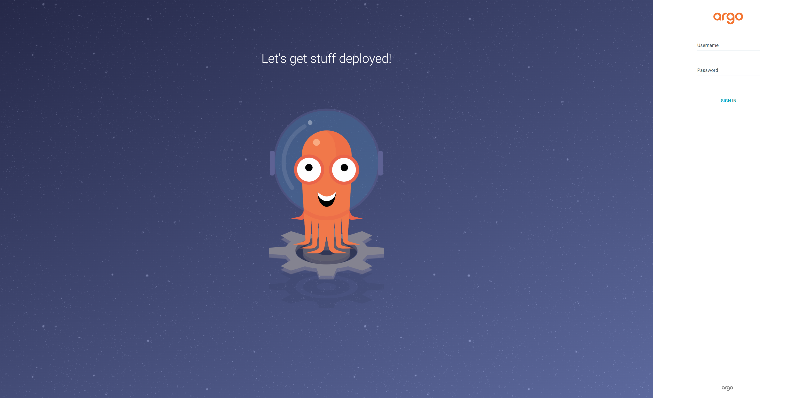
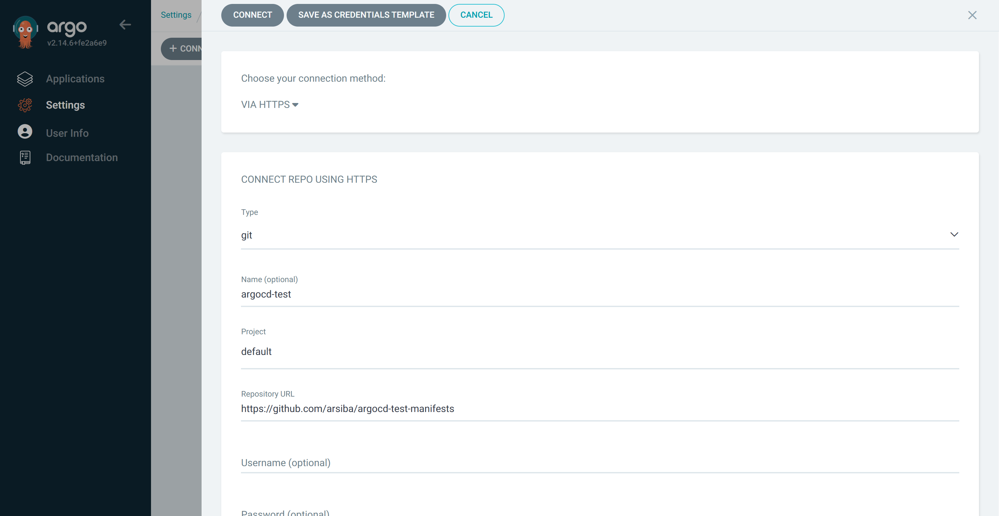
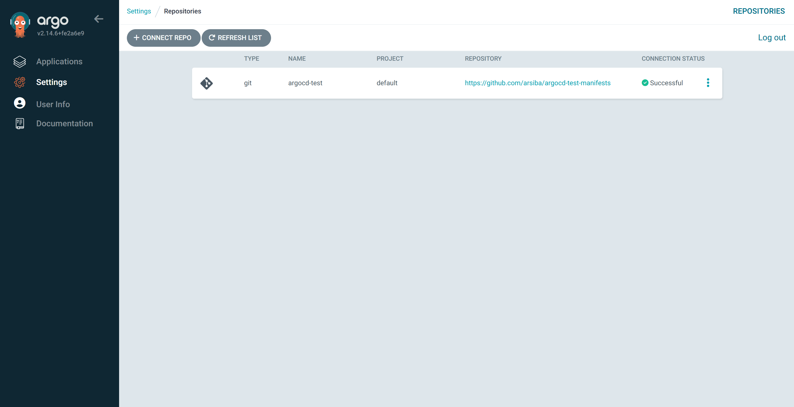
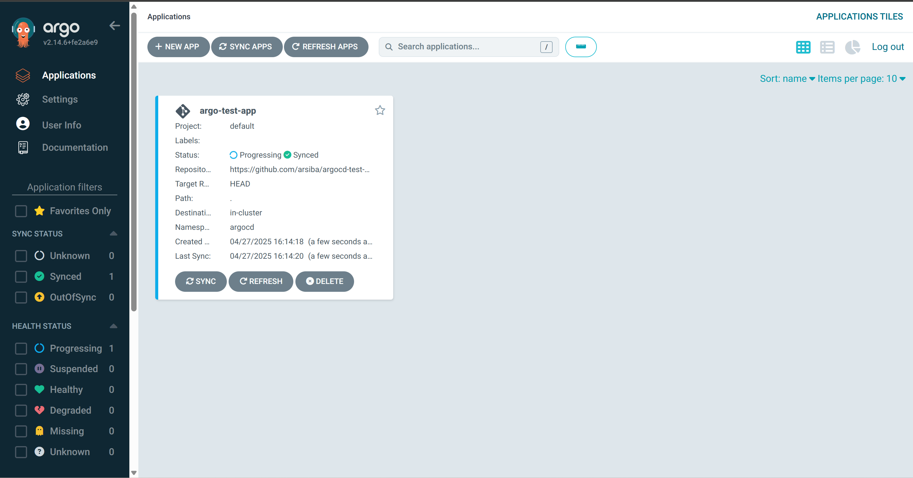
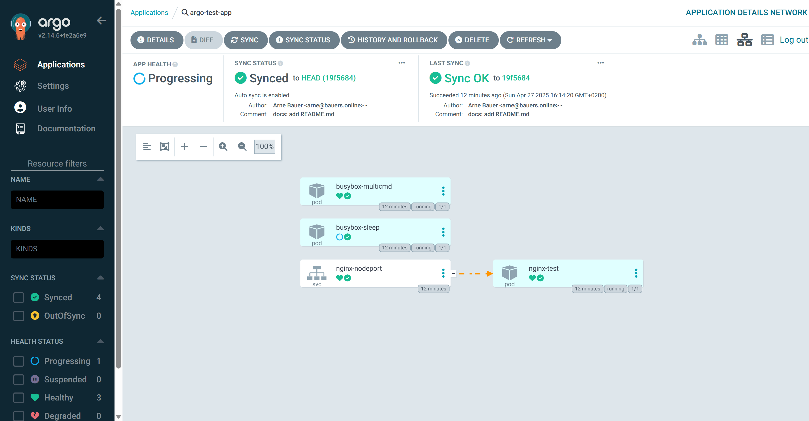

## Introduction

This tutorial will guide you through the installation, setup, and operation of [ArgoCD](https://argo-cd.readthedocs.io/) in a Kubernetes cluster (so-called in-cluster deployment). The number of nodes in the cluster does not matter.

**What is Argo CD anyway?**

But what is Argo CD anyway? If we look at the [project website](https://argo-cd.readthedocs.io/en/stable/), it says: "Argo CD is a declarative, GitOps continuous delivery tool for Kubernetes."
Great, that's not helpful at all. So let's start with the necessary basics: Continuous Delivery.
 
Continuous Delivery (CD) is a software development practice aimed at moving software changes – whether new features, configuration changes, bug fixes, or experiments – quickly, safely, and sustainably into the production environment. At its core, Continuous Delivery is about creating a reliable and repeatable process to move software changes from the development system to end-users. Think of it as a pipeline through which your software flows. Each phase of this pipeline – from code commit, through automated tests, to actual deployment in a test or production environment – is designed to detect errors early and make the process as smooth as possible.

An important aspect of CD is its close integration with Continuous Integration (CI). While CI focuses on regularly merging code changes from different developers into a shared repository and testing them automatically, CD builds upon this foundation by automating deployment across different environments. You could say that CI prepares the software package, and CD delivers it – in the case of Argo CD, to a Kubernetes cluster.

Another key element for successful Continuous Delivery in Kubernetes with Argo CD is the idea of managing all Kubernetes manifests in one or more dedicated Git repositories. These manifests describe the desired state of your entire Kubernetes applications and infrastructure – from deployments and services to namespaces and custom resource definitions. This makes Argo CD "declarative."

**Prerequisites**

Two prerequisites are needed for this tutorial:

1. [Kubernetes](https://kubernetes.io/) Cluster: Several other Hetzner tutorials already cover installation and various deployment types. Therefore, we will treat it as a basic requirement and not go into setup details. We will use a Hetzner Dedicated Server with Kubernetes installed – operating it as the sole node in the cluster. We installed Kubernetes using a [`kurl.sh`](https://kurl.sh/docs/install-with-kurl/#online-usage) script.
   
2. A repository where your manifests will be stored later. It does not matter whether the repository is hosted on GitLab/GitHub/private and whether it is public or private.

## Step 1 - Installing Argo CD

First, let's check if the nodes of our Kubernetes cluster are running properly.

```bash
kubectl get nodes
```

You should get an output similar to this:

```
NAME               STATUS   ROLES                  AGE     VERSION
hetzner-tutorial   Ready    control-plane,master   3m30s   v1.29.15
```

Next, we create a separate namespace for Argo CD `argocd`:

```bash
kubectl create namespace argocd
```

Then we can run the installation script for Argo CD, provided on their [website](https://argo-cd.readthedocs.io/en/stable/getting_started/):

```bash
kubectl apply -n argocd -f https://raw.githubusercontent.com/argoproj/argo-cd/stable/manifests/install.yaml
```

And that's it – almost. Argo CD should now be running on your cluster. To verify, we display all pods from the newly created `argocd` namespace where Argo CD was installed:

```bash
kubectl get pods -n argocd
```

You should get an output like this:

```bash
NAME                                                READY   STATUS    RESTARTS   AGE
argocd-application-controller-0                     1/1     Running   0          3m11s
argocd-applicationset-controller-555cf564b4-jl4k7   1/1     Running   0          3m12s
argocd-dex-server-66876985d9-nwbzr                  1/1     Running   0          3m12s
argocd-notifications-controller-8f5c7f7ff-7kxzj     1/1     Running   0          3m12s
argocd-redis-6d85ddf67d-zlksg                       1/1     Running   0          3m12s
argocd-repo-server-85f97ff79c-lggpr                 1/1     Running   0          3m11s
argocd-server-84db496456-mf92w                      1/1     Running   0          3m11s
```

## Step 2 - Setting up public access

To access the Argo web interface, we need to make the `argocd-server` service accessible via IP address. Enter the following command:

```bash
kubectl get svc -n argocd
```

```bash
NAME                                      TYPE        CLUSTER-IP    EXTERNAL-IP   PORT(S)                      AGE
argocd-applicationset-controller          ClusterIP   10.96.0.203   <none>        7000/TCP,8080/TCP            7m19s
argocd-dex-server                         ClusterIP   10.96.3.228   <none>        5556/TCP,5557/TCP,5558/TCP   7m19s
argocd-metrics                            ClusterIP   10.96.2.72    <none>        8082/TCP                     7m19s
argocd-notifications-controller-metrics   ClusterIP   10.96.2.141   <none>        9001/TCP                     7m19s
argocd-redis                              ClusterIP   10.96.3.184   <none>        6379/TCP                     7m19s
argocd-repo-server                        ClusterIP   10.96.0.167   <none>        8081/TCP,8084/TCP            7m19s
argocd-server                             ClusterIP   10.96.0.80    <none>        80/TCP,443/TCP               7m19s
argocd-server-metrics                     ClusterIP   10.96.0.131   <none>        8083/TCP                     7m19s
```

We see that the `argocd-server` service has been assigned a ClusterIP. This suffices for communication within the cluster, but not for external access. Therefore, we will assign a `NodePort` to the service. Since the service already exists, we patch its configuration as follows:

```bash
kubectl patch svc argocd-server -n argocd -p '{"spec": {"type": "NodePort"}}'
```

The following output confirms success:

```bash
service/argocd-server patched
```

If we list all services again, we should see that `argocd-server` has been assigned a NodePort:

```bash
kubectl get svc -n argocd
```

```bash
NAME                                      TYPE        CLUSTER-IP    EXTERNAL-IP   PORT(S)                      AGE
[...]
argocd-server                             NodePort    10.96.0.80    <none>        80:32867/TCP,443:26835/TCP   16m
[...]
```

In the example above, the application is now accessible via ports `32867` and `26835`.  
Test it by opening the application in your browser:

```
https://<IP-Address>:26835
```

If you see the Argo login page, everything worked!



## Step 3 - Logging in as admin

To log into Argo, use the username `admin` and retrieve the password using the following command:

```bash
kubectl -n argocd get secret argocd-initial-admin-secret -o jsonpath="{.data.password}" | base64 -d
```

You can of course change the password anytime. You will be greeted by the following screen:


## Step 4 - Deploying a Test Project

> In this step, we will connect a repository and perform a test deployment.

Now it is time to create a repository with your manifests. We will use a [public test repository](https://github.com/new) on GitHub. Create a new repository containing a file named `busybox-shell-loop.yaml`. This file contains the following code:

```yaml
apiVersion: v1
kind: Pod
metadata:
  name: busybox-multicmd
spec:
  containers:
    - name: busybox
      image: busybox:latest
      command: ["/bin/sh"]
      args: ["-c", "while true; do echo hello; sleep 10; done"]
      imagePullPolicy: IfNotPresent
  restartPolicy: Always
```

It is a manifest for a so-called Busybox, which executes the code defined under `spec.containers.args`. What exactly happens will become clear later. Save and upload or push the file to the public test repository you just created!

Now back to Argo CD. To add the repo, navigate to `Settings`.


Select `Repository` and click `Connect Repo`.


Choose `HTTPS` for the repository type and select `git` as type. Name the project, e.g., `argocd-test`. Set `Project` to `default`. Paste the URL of your repo into the `Repository URL` field. If it is private, provide credentials, otherwise leave empty. We can skip all other fields for this tutorial. The configuration should look like this:



Click `Connect` to confirm.



If the connection status is `success`, everything is fine. Otherwise, check the repo URL and, if necessary, credentials.

Next, we create an Application. In Argo CD, an Application organizes multiple resources. Navigate to `Applications` via the sidebar.


Click either `CREATE APPLICATION` or `NEW APP`. Configure your application as follows:

- Application Name: `argo-test-app`
- Project Name: `default`
- SYNC POLICY: `Automatic` 
- Repository URL: `<Your Repo URL>`
- Revision: `HEAD`
- Path: `.`
- Cluster URL: `https://kubernetes.default.svc`
- Namespace: `argocd`

Click `CREATE`. You should now see the created application.



Click on the application to see details. All resources contained are shown, and a green checkmark confirms everything is healthy. Click resources for more details, including manifests.


Clicking on a pod shows the logs, e.g., for `busybox-multicmd`:


It outputs `hello` regularly. In the `SUMMARY` tab you can see:

```yaml
apiVersion: v1
kind: Pod
metadata:
	[...]
spec:
  containers:
    - args:
        - '-c'
        - while true; do echo hello; sleep 10; done
      command:
        - /bin/sh
```
 
The argument `while true; do echo hello; sleep 10; done` causes a message to be output every 10 seconds.

Back in the Application view, there are also additional dashboards. In the top-right corner you find:


The first is the standard view. The second is the node view for cluster node statistics. The third shows network topology, indicating how resources are connected. For example, the pod `nginx-test` is assigned to the service `nginx-nodeport`.



The fourth and last view presents all resources in a table format.

## Conclusion

This tutorial showed how easy and effective Argo CD can automate the deployment process in Kubernetes. After installation, initial setup, and first deployments, you can now fully automate your projects: write manifests, push them to the repo, and Argo will do the rest. Of course, the application is much more powerful than what we have shown here – but these basics form a solid foundation and a good start into the world of Continuous Delivery!

##### License: MIT

<!--

Contributor's Certificate of Origin

By making a contribution to this project, I certify that:

(a) The contribution was created in whole or in part by me and I have
    the right to submit it under the license indicated in the file; or

(b) The contribution is based upon previous work that, to the best of my
    knowledge, is covered under an appropriate license and I have the
    right under that license to submit that work with modifications,
    whether created in whole or in part, under the same license
    (unless I am permitted to submit under a different license), as
    indicated in the file; or

(c) The contribution was provided directly to me by some other person
    who certified (a), (b) or (c) and I have not modified it.

(d) I understand and agree that this project and the contribution are
    public and that a record of the contribution (including all personal
    information I submit with it, including my sign-off) is maintained
    indefinitely and may be redistributed consistent with this project
    or the license(s) involved.

Signed-off-by: [Arne B., hetzner@arnesimon.com]

-->