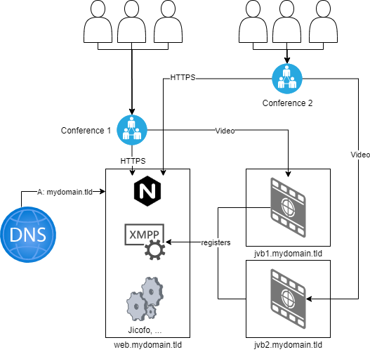

## Introduction

Jitsi Meet utilizes the so called Jitsi Videobridge (jvb) to transcode / route / apply black magic to video streams sent to individual meeting participants.

Unlike the XMPP or Web components this is quite resource hungry, so 4 CPU cores and 8GB RAM is recommended. Bandwidth / throughput capacity can also be a limiting factor if a lot of attendees stream their video.

The JVBs can be scaled horizontally, meaning hosting multiple JVBs on different servers. Hetzner Cloud servers allow for great flexibility and scale fast with the own demand.
This tutorial will create a Jitsi environment capable of hosting up to 200 clients simultaneously. You learn how to easily increase the number of JVBs to push this limit even further, however the scaling of Jicofo and Prosody is not within the scope of this tutorial, but should be non-problematic for around 1.000 users.

**Prerequisites**

* Hetzner Cloud Account
* Public Domain with access to DNS records
* Own project for the Jitsi environment (optional, but nice)

## Step 1 - Plan

After the completion of this tutorial you will have created three hcloud servers.

* web.mydomain.tld (Debian 10)
* jvb1.mydomain.tld (Debian 10)
* jvb2.mydomain.tld (Debian 10)



### Host web.mydomain.tld

Services:

* Nginx (Servers users with Web-UI)
* Prosody (XMPP Server)
* Jicofo (Jitsis Focus component)

### Host jvb1/2.mydomain.tld

Services:

* jitsi-videobridge2

### SSH keys (optional, but really recommended)

`ssh-keygen -t rsa -b 4096`

On up-to-date Windows 10 versions ssh-keygen is available within PowerShell, SSH itself too)

Import the SSH key to your project (Windows %userprofile%\.ssh\id_rsa.pub)

## Step 2 - Setup servers / DNS

Hetzner utilizes something called cloud-init. Basically it provisions a server based on a config file. This is quite neat and saves us a lot of work.

Whether you provision the servers through hcloud-cli or the web UI, use the user data (cloud-config) from below.

Provision three servers with the following configuration:

* web.mydomain.tld
  * Datacenter: closest to you
  * Image: Debian 10
  * Size: CX21
  * User data: see below
  * SSH-Key: select yours
* jvb1.mydomain.tld
  * Datacenter: closest to you
  * Image: Debian 10
  * Size: CPX41
  * User data: see below
  * SSH-Key: select yours
* jvb2.mydomain.tld
  * Datacenter: closest to you
  * Image: Debian 10
  * Size: CPX41
  * User data: see below
  * SSH-Key: select yours

```bash
#cloud-config
package_upgrade: true
runcmd:
  - curl https://download.jitsi.org/jitsi-key.gpg.key | sudo sh -c 'gpg --dearmor > /usr/share/keyrings/jitsi-keyring.gpg'
  - echo 'deb [signed-by=/usr/share/keyrings/jitsi-keyring.gpg] https://download.jitsi.org stable/' | sudo tee /etc/apt/sources.list.d/jitsi-stable.list > /dev/null
  - apt-get update
```

This updates the server's packages through apt, and the `runcmd:` part also adds the offical jitsi source to apt, so we don't have to later on :+1:.

**IMPORTANT**

This tutorial assumes you will run your Jitsi server under mydomain.tld.

If you wish to run it under a third-level domain like meet.mydomain.tld then replace occurrences of mydomain.tld throughout this guide with your desired domain.

Create an A Record (either at root level or for e.g.: meet) pointing to the IP of web.mydomain.tld. You may also create a CNAME record for the domain web.mydomain.tld pointing to mydomain.tld.

Not required but nice: Create A records for the jvb servers. You may also set rDNS for the IPs through the Cloud Console.

### Step 2.1 - Provision Jitsi on web.mydomain.tld

Make sure that cloud-init worked.

```bash
cat /var/log/cloud-init-output.log

#Result:
#[snip]
#Cloud-init v. 20.2 finished at [snip]
```

If your result is not looking like this **wait**. Cloud-init takes some time and runs in the background.

After we verified the host is up and running we can start the installation process itself.

```bash
apt-get install -y jitsi-meet
```

1. Enter your hostname (e.g.: mydomain.tld *or* meet.mydomain.tld)
2. Generate self-signed certificate

The server now is setup and runs Jitsi in a standalone configuration.

You may verify the Jitsi installation by browsing to your domain or IP address.

However this setup installed a videobridge onto the webserver. We want to stop and disable the videobridge:

```bash
systemctl stop jitsi-videobridge2.service
systemctl disable jitsi-videobridge2.service
```

The diagram above explains that the JVBs register with the XMPP component. This is "secured" by a username and password.

The user defaults to jvb and will not be changed in this tutorial (although this might be a good idea). The password is stored in the now disabled videobridge configuration.

```bash
cat /etc/jitsi/videobridge/sip-communicator.properties
```

You will need the value of JVB_SECRET later on!

### Step 2.2 - Configuration of jvb1/2.mydomain.tld

This step has to be applied to both jvb1 and jvb2 server. Nothing changes for either of them!

These servers have also been installed with the cloud-init that adds the Jitsi repository, so we can install the videobridge with:

```bash
apt-get install -y jitsi-videobridge2
```

1. Enter the hostname you entered during the installation of web.mydomain.tld (e.g.: mydomain.tld or meet.mydomain.tld)

After the installation succeeded you need to change the configuration to tell the videobridge to register with the XMPP server running on web.mydomain.tld

`nano /etc/jitsi/videobridge/config`

```yml
# Jitsi Videobridge settings

# sets the XMPP domain (default: none)
JVB_HOSTNAME=mydomain.tld

# sets the hostname of the XMPP server (default: domain if set, localhost otherwise)
JVB_HOST=

# sets the port of the XMPP server (default: 5275)
JVB_PORT=5347

# sets the shared secret used to authenticate to the XMPP server
JVB_SECRET=2G0irStJ

# extra options to pass to the JVB daemon
JVB_OPTS="--apis=,"


# adds java system props that are passed to jvb (default are for home and logging config file)
JAVA_SYS_PROPS="-Dconfig.file=/etc/jitsi/videobridge/jvb.conf -Dnet.java.sip.communicator.SC_HOME_DIR_LOCATION=/etc/jitsi -Dnet.java.sip.communicator.SC_HOME_DIR_NAME=videobridge -Dnet.java.sip.communicator.SC_LOG_DIR_LOCATION=/var/log/>
```

Do not copy this block to the server. It has generated its own default values that are okay. Replace the value of JVB_SECRET to whatever you got for JVB_SECRET on web.mydomain.tld

Next we have to change the file sip-communicator.properties

`nano /etc/jitsi/videobridge/sip-communicator.properties`

```yml
org.ice4j.ice.harvest.DISABLE_AWS_HARVESTER=true
org.ice4j.ice.harvest.STUN_MAPPING_HARVESTER_ADDRESSES=meet-jit-si-turnrelay.jitsi.net:443
org.jitsi.videobridge.ENABLE_STATISTICS=true
org.jitsi.videobridge.STATISTICS_TRANSPORT=muc
org.jitsi.videobridge.xmpp.user.shard.HOSTNAME=localhost
org.jitsi.videobridge.xmpp.user.shard.DOMAIN=auth.mydomain.tld
org.jitsi.videobridge.xmpp.user.shard.USERNAME=jvb
org.jitsi.videobridge.xmpp.user.shard.PASSWORD=2G0irStJ
org.jitsi.videobridge.xmpp.user.shard.MUC_JIDS=JvbBrewery@internal.auth.mydomain.tld
org.jitsi.videobridge.xmpp.user.shard.MUC_NICKNAME=3186e863-4ae4-4d98-aa94-b1a8a0c68791
```

Do not copy this block to the server. It has generated its own default values that are okay. You only have to follow these steps:

1. Replace the value of `org.jitsi.videobridge.xmpp.user.shard.PASSWORD` to whatever you got for JVB_SECRET on web.mydomain.tld
2. Replace the value of `org.jitsi.videobridge.xmpp.user.shard.HOSTNAME` to whatever you chose as domain on web.mydomain.tld (e.g.: mydomain.tld or meet.mydomain.tld)
3. Add the following line at the end of the file

```yml
org.jitsi.videobridge.xmpp.user.shard.DISABLE_CERTIFICATE_VERIFICATION=true
```

After you completed these procedures you can restart the videobridge service

```bash
systemctl restart jitsi-videobridge2.service
```

In order to verify that the videobridge successfully connected to web.mydomain.tld check the following log **on web.mydomain.tld**

`cat /var/log/prosody/prosody.log`

This should yield a result like:

```bash
timestamp c2s563869755370 info    Stream encrypted (TLSv1.3 with TLS_AES_256_GCM_SHA384)
timestamp c2s563869755370 info    Authenticated as jvb@auth.mydomain.tl
```

## Step 3 - Certificates

Until now the webservice is not encrypted and therefore will not work on mobile devices.

To fix this you need to run the following script (installed by default) on **web.mydomain.tld**

```bash
/usr/share/jitsi-meet/scripts/install-letsencrypt-cert.sh
```

Simply enter an email address you monitor and the script will install certbot in order to automatically issue and renew a cert for your Jitsi instance.

The script creates a cronjob that renews the certificate automatically.

## Step 4 - Firewall

Let's make it safe*ish

For host web.mydomain.tld

```bash
ufw default deny incoming
ufw allow proto tcp from any to any port 22,80,443,5222,5347 
ufw --force enable
```

For both jvb hosts

```bash
ufw default deny incoming
ufw allow proto tcp from any to any port 22,443
ufw allow proto udp from any to any port 10000
ufw --force enable
```

## Conclusion

By following this tutorial you should have three cloud servers running Jitsi, with the option of scaling up by creating additional cloud servers with videobridge.

##### License: MIT

<!--

Contributor's Certificate of Origin

By making a contribution to this project, I certify that:

(a) The contribution was created in whole or in part by me and I have
    the right to submit it under the license indicated in the file; or

(b) The contribution is based upon previous work that, to the best of my
    knowledge, is covered under an appropriate license and I have the
    right under that license to submit that work with modifications,
    whether created in whole or in part by me, under the same license
    (unless I am permitted to submit under a different license), as
    indicated in the file; or

(c) The contribution was provided directly to me by some other person
    who certified (a), (b) or (c) and I have not modified it.

(d) I understand and agree that this project and the contribution are
    public and that a record of the contribution (including all personal
    information I submit with it, including my sign-off) is maintained
    indefinitely and may be redistributed consistent with this project
    or the license(s) involved.

Signed-off-by: Markus Hupfauer <markus@hupfauer.one>

-->
