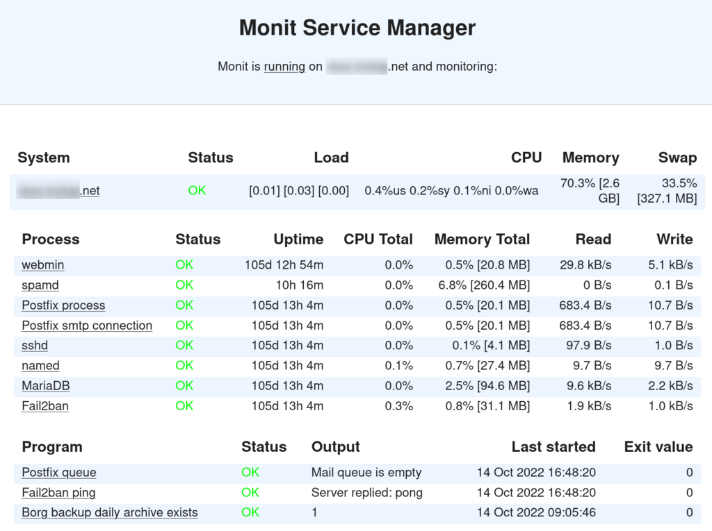
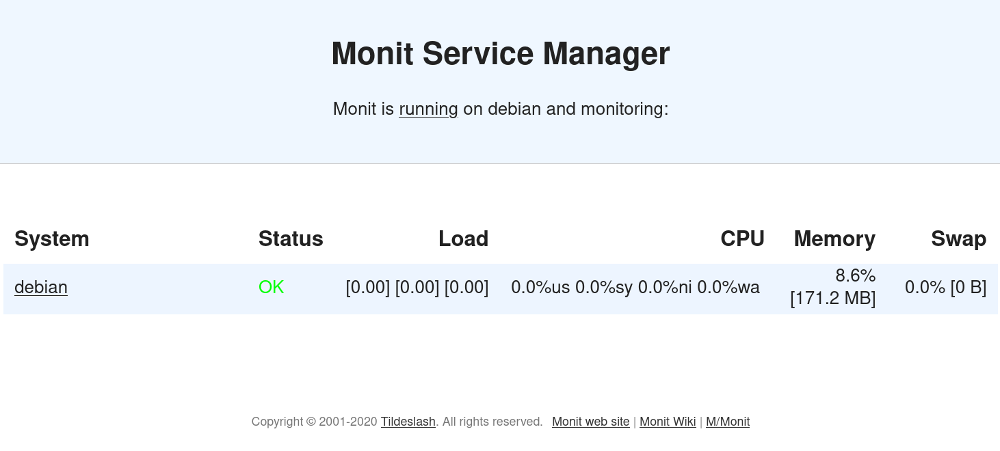
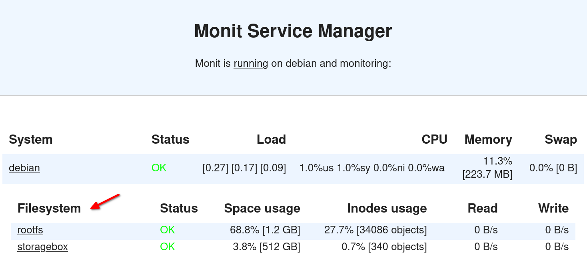
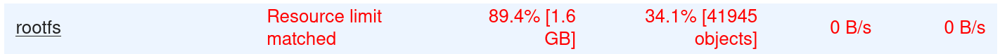
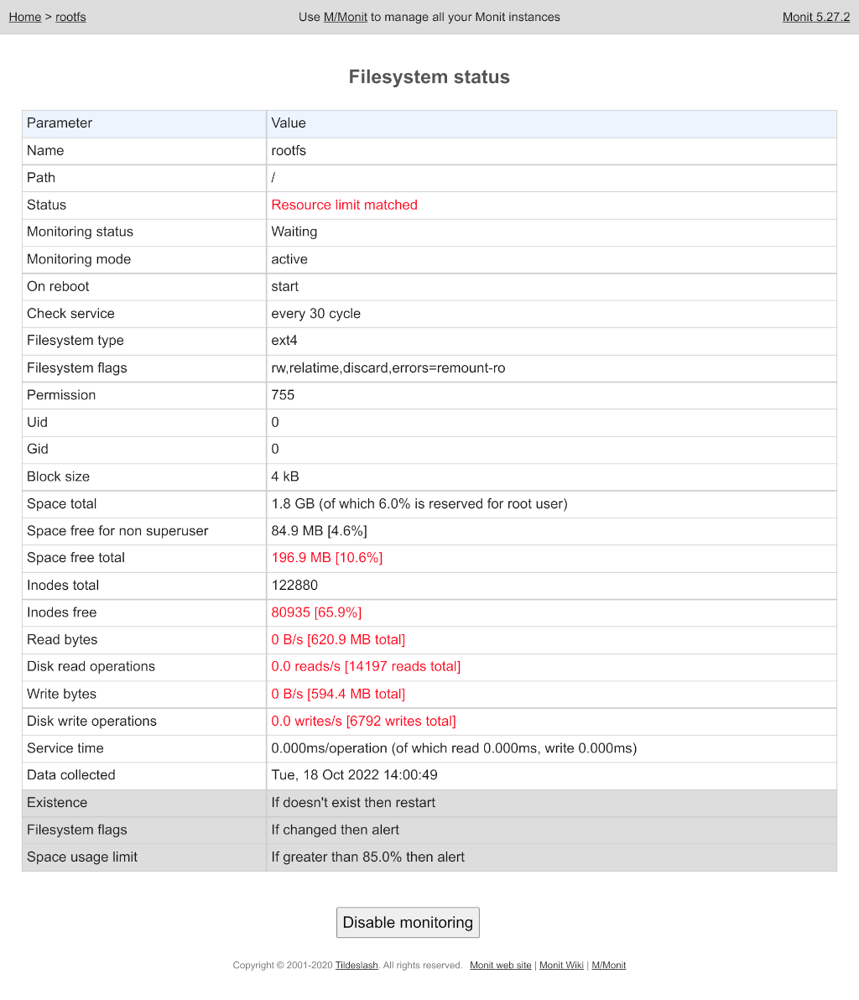

## Introduction

This tutorial will help you to setup [Monit](https://mmonit.com/monit/) for simple but efficient monitoring on your cloud server or dedicated server. Monit is an open-source software, running on Linux, Mac OS, *BSD, Solaris. It can send email notifications when a service is down and/or up, and it provides a web GUI that summarizes the current server state. Monit uses a [specific language](https://mmonit.com/monit/documentation/monit.html#THE-MONIT-CONTROL-FILE) for custom monitoring scripts.



New monitoring programs are easy to create or customize from existing ones, according to your needs. In this tutorial, we will set up common monitors, and as an example we will create a custom script to check that the daily server backup occurred well.

Below is a real example of Monit code to monitor common system resources:

```
check system $HOST
  if loadavg (1min) per core > 2 for 5 cycles then alert
  if loadavg (5min) per core > 1.5 for 10 cycles then alert
  if cpu usage > 95% for 10 cycles then alert
  if memory usage > 75% then alert
  if swap usage > 25% then alert
```

In addition, Monit's authors provide an online service to monitor several Monit instances. This service is called [M/Monit](https://mmonit.com/monit/#mmonit). Do not confuse _Monit_, which is a simple monitoring client, with _M/Monit_, which is an optional paid service.

**Prerequisites**

To follow this tutorial, you need a running server with root access. Here, I use a Debian-like system but it's easy to adapt for different operating systems.

## Step 1 - Install Monit client package

First, install Monit with the package manager of your system:

```bash
sudo apt update
sudo apt install monit
```

Look at the result:

```
holu@debian:~$ sudo apt install monit
[sudo] password for holu:
Reading package lists... Done
Building dependency tree... Done
Reading state information... Done
Suggested packages:
  default-mta | postfix | mail-transport-agent sysvinit-core
The following NEW packages will be installed:
  monit
0 upgraded, 1 newly installed, 0 to remove and 0 not upgraded.
Need to get 347 kB of archives.
After this operation, 1023 kB of additional disk space will be used.
Get:1 http://deb.debian.org/debian bullseye/main amd64 monit amd64 1:5.27.2-1 [347 kB]
Fetched 347 kB in 1s (663 kB/s)
Selecting previously unselected package monit.
(Reading database ... 28311 files and directories currently installed.)
Preparing to unpack .../monit_1%3a5.27.2-1_amd64.deb ...
Unpacking monit (1:5.27.2-1) ...
Setting up monit (1:5.27.2-1) ...
Processing triggers for man-db (2.9.4-2) ...
```

There are some suggested dependencies concerning a mail transport agent. This is required by Monit to send email notifications. Install it if needed.

The main files of Monit are:

* `/usr/bin/monit`: The executable of the Monit command line and the monitoring daemon. Launched as service in `/etc/init.d/monit`, but should be managed by systemd if your system uses it.
* `/etc/monit/monitrc`: The main config file.

On Debian-like systems you also have:

* `/etc/default/monit`: The default command line arguments.
* `/etc/logrotate.d/monit`: A log file rotation configuration.
* `/etc/monit/conf.d/...`: Like Apache, you can configure Monit in the main config file or split your configuration into different sub-files so that each service has a dedicated configuration file in this directory. These files are concatenated to the main file.
* `/etc/monit/conf-available/...` and `/etc/monit/conf-enabled/...`: Like Apache, it's possible to have a configuration in the first directory, and symlinks in the second directory to enable or disable some monitor settings.

## Step 2 - Check if Monit is running

If everything is going well, Monit daemon should already be running in the background. There are two ways to check the status.

- **Option 1**
  
  Check it with `/etc/init.d/monit status`:

  ```
  holu@debian:~$ /etc/init.d/monit status
  ● monit.service - LSB: service and resource monitoring daemon
       Loaded: loaded (/etc/init.d/monit; generated)
       Active: active (running) since Mon 2022-10-17 12:15:00 UTC; 29s ago
         Docs: man:systemd-sysv-generator(8)
      Process: 333 ExecStart=/etc/init.d/monit start (code=exited, status=0/SUCCESS)
        Tasks: 1 (limit: 2338)
       Memory: 3.3M
          CPU: 28ms
       CGroup: /system.slice/monit.service
               └─435 /usr/bin/monit -c /etc/monit/monitrc
  ```
  
  Here, the output says Monit is active and running.

<br>

- **Option 2**

  Use the command line as root:

  ```
  root@debian:/home/holu# monit
  Monit daemon with PID 435 awakened
  ```

## Step 3 - Basic configuration

Monit configuration is very flexible. Advanced users should [read the manual](https://mmonit.com/monit/documentation/monit.html) to get a better overview of possibilities.

For now, edit the main config file `/etc/monit/monitrc` and add or modify the following lines:

```
# Wake up the daemon every 120 seconds.
set daemon 120

# This is called a 'cycle' in Monit. Later monitoring frequency is defined in number of cycles. The more frequent the checks, the more CPU they consume but the faster they report problems.
# E.g.: If a service is monitored every 3 cycles, it means that the daemon checks the service status every 6 minutes.

# Remove front # comment and set your sender email
set mail-format { from: holu@example.com }

# To receive all email alerts (customizable per monitor)
set alert holu@example.com

# Configure Monit GUI web server
set httpd port 2812 and
    use address localhost  # only accept connection from localhost (drop if you use M/Monit)
    allow localhost        # allow localhost to connect to the server and
    allow admin:monit      # require user 'admin' with password 'monit'

```

You should change the default username/password of the web GUI in the line `allow <username>:<password>`. If you want to access the GUI from outside the local machine, remove or adapt the lines `use address localhost` and `allow localhost`.

Check the other options available and save the file. As the configuration was changed, you need to reload Monit daemon (as root):

```
monit reload
```

## Step 4 - Check configuration

Use `monit status` to check if the Monit configuration is valid and running:

```
root@debian:/home/holu# monit status
Monit 5.27.2 uptime: 58m

System 'debian'
  status                       OK
  monitoring status            Monitored
  monitoring mode              active
  on reboot                    start
  load average                 [0.04] [0.06] [0.02]
  cpu                          1.0%usr 1.0%sys 0.0%nice 0.0%iowait 0.0%hardirq 0.1%softirq 0.0%steal 0.0%guest 0.0%guestnice
  memory usage                 224.2 MB [11.3%]
  swap usage                   0 B [0.0%]
  uptime                       58m
  boot time                    Tue, 18 Oct 2022 13:28:39
  filedescriptors              800 [0.0% of 9223372036854775807 limit]
  data collected               Tue, 18 Oct 2022 13:37:24
```

Test the web GUI with a web browser via the address http://example.com:2812



Great, you have a running monitoring system. Now, we have to customize what to monitor to get alerts in case of failure.

## Step 5 - Add basic monitors

To configure new monitors, you can modify the main config file (`/etc/monit/monitrc`) or add each monitor config as single files in `/etc/monit/conf.d`.

### Add a filesystem usage monitor

Add a monitor to check the filesystem usage (every hour for `/`, and every day for the storage share):

```
check filesystem rootfs with path /
  every 30 cycles
  if space usage > 85% then alert

check filesystem storagebox with path /mnt/storagebox
  every 720 cycles
  if space usage > 85% then alert
```

Don't forget to reload Monit (`monit reload`) after the configuration was changed.

You should see:



If the space usage of the root file system is higher than 85%, it should turn red:



Click on `rootfs` to get detailed information or to disable/re-enable this monitor:



You can get the same information via the command line:

```
root@debian:~# monit status
Monit 5.27.2 uptime: 1h41m

Filesystem 'rootfs'
  status                       Resource limit matched
  monitoring status            Monitored
  monitoring mode              active
  on reboot                    start
  filesystem type              ext4
  filesystem flags             rw,relatime,discard,errors=remount-ro
  permission                   755
  uid                          0
  gid                          0
  block size                   4 kB
  space total                  1.8 GB (of which 6.0% is reserved for root user)
  space free for non superuser 84.9 MB [4.6%]
  space free total             196.9 MB [10.6%]
  .../...
```

If your host is well configured to send emails, you should receive an email each time a monitor status changes:

```
From: monit@example.com
To: holu@example.com
Subject: monit alert --  Resource limit matched rootfs
Date: Wed, 19 Oct 2022 08:45:18 GMT

Resource limit matched Service rootfs

        Date:        Wed, 18 Oct 2022 08:45:18
        Action:      alert
        Host:        debian
        Description: space usage 89.4% matches resource limit [space usage > 85.0%]

Your faithful employee,
Monit
```

The template of the email can be modified in the configuration file (search for `mail-format`)

And finally, all events are logged in `/var/log/monit.log`:

```
[2022-10-18T08:45:18+0000] error    : 'rootfs' space usage 89.4% matches resource limit [space usage > 85.0%]
```

### Add a monitor to check a local or remote website

Now we want to add a new custom monitor to check if a website is well working. Add this code in your Monit config file:

```
check host "My website" with address example.com
# Change example.com hostname according to your needs
  every 5 cycles
  if failed
    port 443
    protocol https
    with ssl options {verify: enable}
    content = "Welcome on my running website"
  then alert
```

Don't forget to reload Monit (`monit reload`) after the configuration was changed.

This monitor checks every 10 minutes (5 cycles of 120s) if the connection to `example.com` is possible with https protocol, if the certificate is valid, and if the string `Welcome on my running website` appears in the response.

## Step 6 - Add a monitor to check daily backups

Here is a more advanced example. We want to check that every day a Borg backup occurred well. If the daily backup does not exist, the backup monitor will turn red and an email will warn the administrator. Borg can report itself any failure during backup operations, but it is still better to have a second eye on backups.

Start to create a script that returns "1" if a backup exists for the current day, or "0" if none exists. Paste the script below in the file `/usr/local/sbin/check-backup.sh` (or anywhere you prefer) and `chmod u+x` it:

```
#!/bin/bash

borgmatic info --archive latest --json | grep --count "\"last_modified\": \"`date +%Y-%m-%d`"
```

You need a valid [Borgmatic](https://torsion.org/borgmatic/) configuration. Otherwise, you have to slightly adapt the script above to get the latest archive date from the `borg` command itself.

If you launch this script the same day a backup occurred, it should return `1`:

```
root@debian:~# /usr/local/sbin/check-backup.sh
1
```

Now we just have to configure a monitor to check the result of this script every day (after the backup is created). Add this in the Monit configuration file:

```
check program "Borg backup daily archive exists" path /usr/local/sbin/check-backup.sh
  every "0-5 9 * * *"
  if content != "^1$" then alert
```

Don't forget to reload Monit (`monit reload`) after the configuration was changed.

The statement `every "0-5 9 * * *"` makes sure that the check occurs at 9 am. In our example, the backup is supposed to occur at 3 am. Change it according to your setup.

## Step 7 - Going further

You can now look at the config file for more monitoring examples (commented out by default), and explore the official [Monit documentation](https://mmonit.com/monit/documentation/monit.html).

Monit can be controlled by command line:

```
root@debian:~# monit -h
Usage: monit [options]+ [command]
.../...
Optional commands are as follows:
 start all             - Start all services
 start <name>          - Only start the named service
 stop all              - Stop all services
 stop <name>           - Stop the named service
 restart all           - Stop and start all services
 restart <name>        - Only restart the named service
 monitor all           - Enable monitoring of all services
 monitor <name>        - Only enable monitoring of the named service
 unmonitor all         - Disable monitoring of all services
 unmonitor <name>      - Only disable monitoring of the named service
 reload                - Reinitialize monit
 status [name]         - Print full status information for service(s)
 summary [name]        - Print short status information for service(s)
 report [up|down|..]   - Report state of services. See manual for options
 quit                  - Kill the monit daemon process
 validate              - Check all services and start if not running
 procmatch <pattern>   - Test process matching pattern
```

Monit itself can be monitored by an external tool, to ensure that monitoring is working well. For example, [Webmin's System and Server Status module](https://doxfer.webmin.com/Webmin/System_and_Server_Status) can inspect the output of the `monit report` command to check if everything is going well:

```
root@debian:~# /usr/bin/monit report
up:             2 (66.6%)
down:           1 (33.3%)
initialising:   0 (0.0%)
unmonitored:    0 (0.0%)
total:          3 services
```

Finally, the web GUI should be reverse proxied for security reasons (Apache or nginx may help).

## Conclusion

In this tutorial you learned how to setup a simple monitoring system to check the health of a server or of remote services like a website. You may want to learn more about the Monit language and its possibilities through [the documentation and the wiki](https://mmonit.com/wiki/) (FAQ/HowTo).

Hope it helps.

J.

##### License: MIT

<!--

Contributor's Certificate of Origin

By making a contribution to this project, I certify that:

(a) The contribution was created in whole or in part by me and I have
    the right to submit it under the license indicated in the file; or

(b) The contribution is based upon previous work that, to the best of my
    knowledge, is covered under an appropriate license and I have the
    right under that license to submit that work with modifications,
    whether created in whole or in part by me, under the same license
    (unless I am permitted to submit under a different license), as
    indicated in the file; or

(c) The contribution was provided directly to me by some other person
    who certified (a), (b) or (c) and I have not modified it.

(d) I understand and agree that this project and the contribution are
    public and that a record of the contribution (including all personal
    information I submit with it, including my sign-off) is maintained
    indefinitely and may be redistributed consistent with this project
    or the license(s) involved.

Signed-off-by: Jej / hetzner-community-content@vbox.trickip.net

-->
