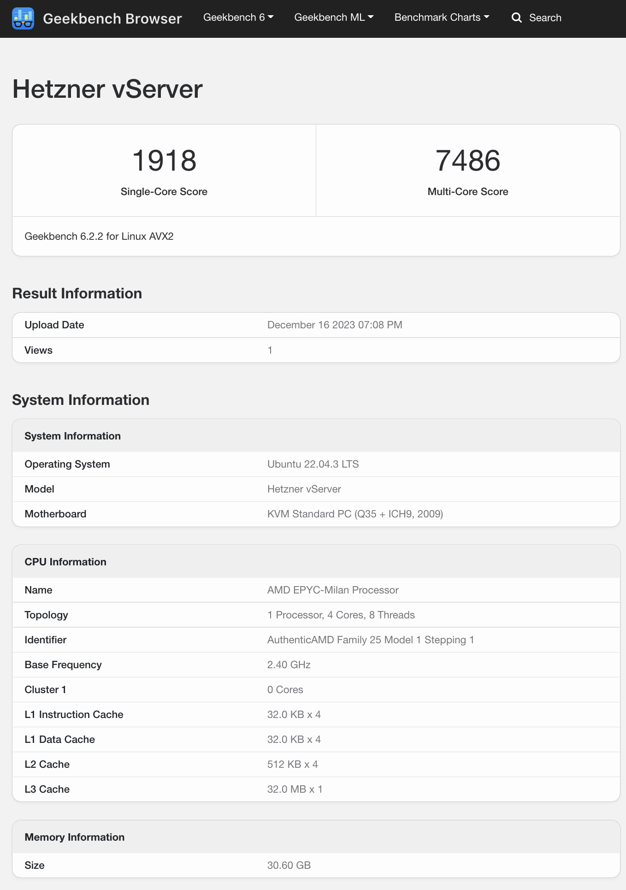
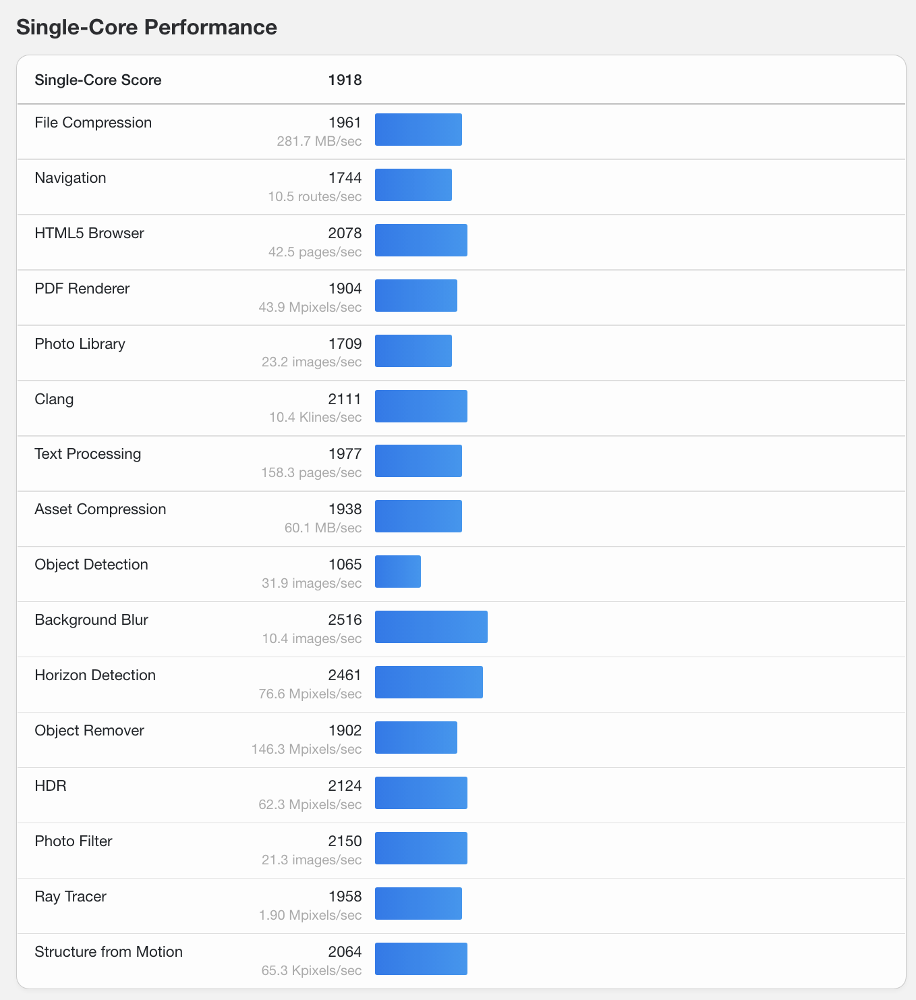
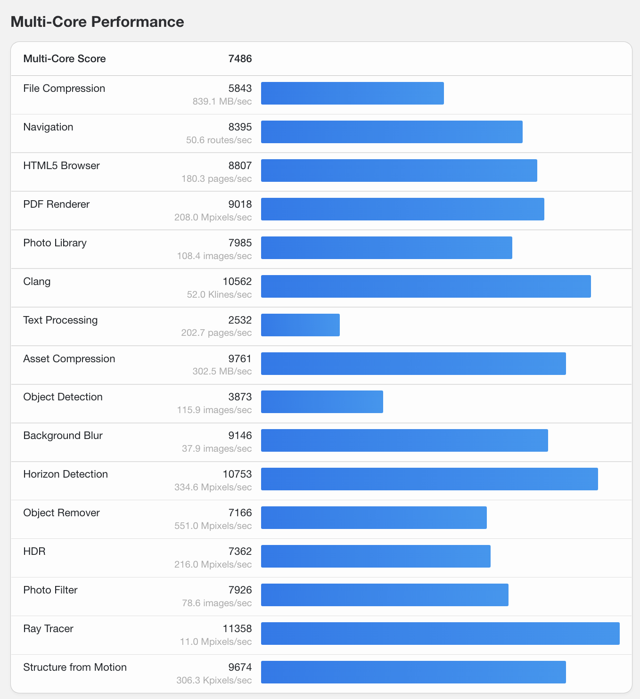

## Introduction

Benchmarking is a crucial activity for system administrators to understand the performance characteristics of their servers. It involves running a series of tests to measure the processing speed, memory efficiency, disk I/O, and network throughput. One of the tools that can be used for this purpose is YABS — Yet Another Bench Script. This tutorial will guide you through the process of using YABS to benchmark your Linux server.

**Prerequisites**

Before you begin, ensure you have the following:

- A Linux server with a standard distribution like Ubuntu, CentOS, Debian, etc.
- Root or sudo privileges to install dependencies and run benchmarks.
- Basic familiarity with the Linux command line interface (CLI).
- Internet connectivity for downloading the script and dependencies.

## Step 1 - Running YABS

YABS is a script that doesn't require installation. You can download and run it directly. However, you do need "curl" to run the script. To install curl and the YABS script, follow these steps:

1. Update your package index (on Debian/Ubuntu systems):
   ```bash
   sudo apt update
   ```
   On CentOS/RHEL systems, you would use:
   ```bash
   sudo yum update
   ```

2. Install curl:
   ```bash
   sudo apt install curl -y
   ```
   Or on CentOS/RHEL:
   ```bash
   sudo yum install curl -y
   ```

3. Download and run the YABS script:
   ```bash
   curl -sL yabs.sh | bash
   ```
   The `curl` command fetches the script and pipes it to `bash` for execution.

## Step 2 - Running YABS

Once the script is downloaded, it will automatically start the benchmarking process. YABS will perform several tests:

- **Basic System Information**: This will display your server hardware specification.
- **IPv4 Network Information**: This will display ISP's network information.
- **Disk Speed Test**: This measures the I/O performance of your disk.
- **CPU Benchmark**: This test will push your CPU to its limits and measure its computational performance.
- **Network Speed Test**: This will test your server's network bandwidth to different regions.

During the test, you will see live output in the terminal window detailing the progress of the benchmark. If you run YABS on a production server, remember to run benchmarks during off-peak hours to minimize the impact on your services and customers.

## Step 3 - Understanding the Results

When the tests are complete, YABS will present you with a report. Here's how to interpret the key sections:

| Section                      | Description                        |
| ---------------------------- | ---------------------------------- |
| **Basic System Information** | Your server specification summary. |
| **IPv4 Network Information** | Your ISP's network information.    |
| **Disk Speed**               | Measured in MB/s (Megabytes per second), this indicates how quickly data can be read from and written to your storage device. |
| **Network Speed**            | Presented in Gbit/s or Mbit/s (Gigabits or Megabits per second), indicating the speed at which data can be transferred to and from your server over the network. |
| **CPU Benchmark**            | The score here is an abstract number that represents the CPU's ability to perform calculations. Higher numbers are better. |

In the end of the result, you are given a link to view detailed information about CPU benchmark performed using Geekbench. If you open the link, it will show this information:

- System Information Summary
  
- Detailed Single-Core Performance Test
  
- Detailed Multi-Core Performance Test
  

## Step 4 - Taking Action Based on Results

The insights gained from YABS can guide you in optimizing or upgrading your server. Here's what you can do:

- **Optimize**: If performance is below expectations, investigate potential bottlenecks. This could involve tuning system parameters, adjusting configurations, or optimizing applications.
- **Upgrade**: If hardware limitations are impacting performance, consider upgrading components or migrating to a higher-tier server.

## Conclusion

Benchmarking with YABS provides a snapshot of your server's performance. Regular benchmarking can help you keep track of changes over time and ensure that your server continues to meet the demands placed upon it. For more detailed analysis, consider running YABS periodically and recording the results. This data can help you identify trends and make proactive decisions about your server infrastructure.

##### License: MIT

<!--
Contributor's Certificate of Origin
By making a contribution to this project, I certify that:
(a) The contribution was created in whole or in part by me and I have
    the right to submit it under the license indicated in the file; or
(b) The contribution is based upon previous work that, to the best of my
    knowledge, is covered under an appropriate license and I have the
    right under that license to submit that work with modifications,
    whether created in whole or in part by me, under the same license
    (unless I am permitted to submit under a different license), as
    indicated in the file; or
(c) The contribution was provided directly to me by some other person
    who certified (a), (b) or (c) and I have not modified it.
(d) I understand and agree that this project and the contribution are
    public and that a record of the contribution (including all personal
    information I submit with it, including my sign-off) is maintained
    indefinitely and may be redistributed consistent with this project
    or the license(s) involved.
Signed-off-by: Faleddo mail@faleddo.com
-->
