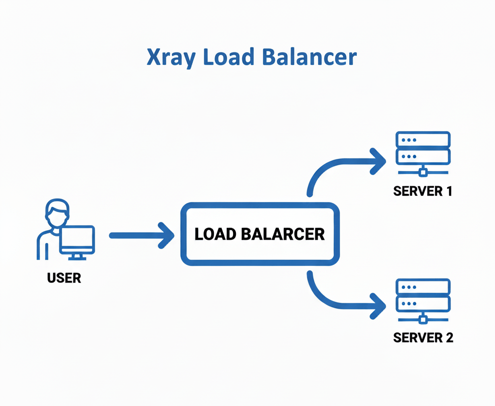
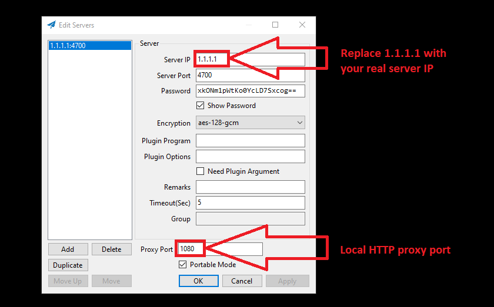

## Introduction

This tutorial helps you through setting up an [Xray][xray_gh] proxy server using the [Shadowsocks][shadow_gh] protocol, deployed on Rocky Linux via Docker.



<details>
<summary>What is Xray?</summary>

<ul>

[Xray][xray_gh] is a core engine that powers advanced proxy tools.
It is an alternative to the [V2Ray][v2ray_gh] core and supports multiple proxy protocols (such as Shadowsocks, VLESS, etc.).
It provides features such as **load balancing**, routing, obfuscation, and traffic encryption.

At the moment, it has over 30k stars on GitHub.

</ul>

----------------------------------

</details>

<details>
<summary>What is Shadowsocks?</summary>

<ul>

[Shadowsocks][shadow_gh] is an open-source proxy tool designed to help people bypass internet censorship and protect their online privacy.

Shadowsocks works by using a technique called **SOCKS5 proxying**, which allows internet traffic to be tunneled securely through a server.

</ul>

----------------------------------

</details>

I will configure a [load balancer][wiki_lb] setup with 3 servers.
One acting as the load balancer (`LB`) and two as backend servers.

Traffic from clients will hit the `LB` server, which routes it to the backends using Xray's built-in load balancer in the `routing` section.

**Prerequisites**

- Three Hetzner Cloud servers running Rocky Linux 10 (or later).
  - `LB` Server: Public IP for client access.
  - Backend Servers: Internal or public IPs accessible from `LB`.
- `root` or `sudo` access on all servers.
- [Shadowsocks client][shadow_win] on your local machine.
- Firewalls allow the necessary ports for Shadowsocks, e.g.:
  - `4700` for the `LB` server
  - `4800` for the backend servers

**Example terminology**

> Replace all example IPs with your actual Hetzner server IPs.

* `LB` Server: `203.0.113.1`
* Backend Servers: `10.0.0.2` and `10.0.0.3`

## Step 1 - Install Docker

I purchased three [Rocky Linux 10][rocky] VPS instances on [Hetzner Cloud][hetzner_cloud].

You need to install Docker on all of your Rocky Linux instances.
If you are using a different Linux distribution, follow the steps provided on the official [Docker website][docker_install].

```sh
# Update your instance
dnf -y update

# Install useful packages
dnf -y install \
	epel-release \
	bash-completion

# Reboot your Linux instance
reboot
```
```sh
# Add Docker repo
dnf config-manager \
	--add-repo \
	https://download.docker.com/linux/centos/docker-ce.repo

# Install Docker
dnf -y install \
	docker-ce \
	docker-ce-cli \
	containerd.io \
	docker-compose-plugin

# Enable and start Docker service
systemctl --now enable docker
```

## Step 2 - Setting Up the Servers

We will deploy Xray in Docker on each server.

Create a directory for the configs on each server:

```sh
mkdir -p /etc/xray
```

## Step 3 - Server Configuration files

Xray uses `JSON` configs. All files use the Shadowsocks protocol with the method `aes-128-gcm`.

Create the following file on all servers:

```
/etc/xray/config.json
```

The content of `config.json` on the `LB` server is different to the content on the backend servers.

* **Load Balancer Server Config**
  
  This config has a Shadowsocks inbound for clients, two outbounds to backends, and a balancer in `routing` to distribute traffic.
  
  Notes:
  - The `LB` uses `round-robin` strategy to distribute traffic between the backend servers.
  - Restart containers after config changes: `docker restart xray_lb` (or `xray_backend`).

  Add the following content in `/etc/xray/config.json` on the `LB` server:
  
  <details>
  <summary>Load Balancer config file</summary>
  
  > Replace `10.0.0.2` and `10.0.0.3` with the actual IPs of Server 1 and Server 2.
  
  ```json
  // vi /etc/xray/config.json
  
  {
      "log": {
          // https://xtls.github.io/en/config/log.html
          "loglevel": "none" // debug | info | warning | error | none
      },
      "inbounds": [
          {
              "tag": "shadow_in",
              "protocol": "shadowsocks",
              "listen": "0.0.0.0",
              "port": 4700,
              "settings": {

                  // https://xtls.github.io/en/config/inbounds/shadowsocks.html
                  "email": "c1",
                  "password": "xkONm1pWtKo0YcLD7Sxcog==", // openssl rand -base64 16
                  "method": "aes-128-gcm",
                  "network": "tcp"
              }
          }
      ],
      "outbounds": [
          // Server 1
          {
              "tag": "shadow_server_1",
              "protocol": "shadowsocks",
              "settings": {
                  // https://xtls.github.io/en/config/outbounds/shadowsocks.html
                  "servers": [
                      {
                          "email": "server_1",
                          "address": "10.0.0.2", // Server 1 IP
                          "port": 4800,
                          "password": "PMTXZ5mkJhC508za5dBqeQ==",
                          "method": "aes-128-gcm",
                          "uot": false
                      }
                  ]
              }
          },
          // Server 2
          {
              "tag": "shadow_server_2",
              "protocol": "shadowsocks",
              "settings": {
                  "servers": [
                      {
                          "email": "server_2",
                          "address": "10.0.0.3", // Server 2 IP
                          "port": 4800,
                          "password": "PMTXZ5mkJhC508za5dBqeQ==",
                          "method": "aes-128-gcm",
                          "uot": false
                      }
                  ]
              }
          }
      ],
      "routing": {
          // https://xtls.github.io/en/config/routing.html
          "domainStrategy": "AsIs", // AsIs | IPIfNonMatch | IPOnDemand
          "balancers": [
              {
                  "tag": "main_balancer",
                  "selector": ["shadow_server_"], // Will be matched shadow_server_1 and shadow_server_2
                  "strategy": {
                      "type": "roundRobin", // random | roundRobin | leastPing | leastLoad
                      "settings": {}
                  }
              }
          ],
          "rules": [
              {
                  "inboundTag": "shadow_in",
              "balancerTag": "main_balancer"
              }
          ]
      }
  }
  ```
  
  </details>

<br>

* **Backend Servers Config**  
  
  A simple inbound from `LB`, and an outbound to freedom (direct internet).

  Add the following content in `/etc/xray/config.json` on the backend servers:
  
  <details>
  <summary>Backend servers config file</summary>
  
  > Use this config on both backend servers. Set `"email": "server_1"` for Server 1 and `"email": "server_2"` for Server 2.
  
  ```json
  // vi /etc/xray/config.json
  
  {
      "log": {
          "loglevel": "none"
      },
      "inbounds": [
          {
              "tag": "shadow_in",
              "protocol": "shadowsocks",
              "listen": "0.0.0.0",
              "port": 4800,
              "settings": {
                  "email": "server_1", // server_1 and server_2
                  "password": "PMTXZ5mkJhC508za5dBqeQ==",
                  "method": "aes-128-gcm",
                  "network": "tcp"
              }
          }
      ],
      "outbounds": [
          {
              // https://xtls.github.io/en/config/outbounds/freedom.html
              "tag": "free",
              "protocol": "freedom",
              "settings": {}
          }
      ],
      "routing": {
          "domainStrategy": "AsIs",
          "rules": [
              {
                  "inboundTag": "shadow_in",
                  "outboundTag": "free"
              }
          ]
      }
  }
  ```
  
  </details>

## Step 4 - Setting Up the Servers

##### Load Balancer Server Setup

On the `LB` server (e.g., IP: `203.0.113.1`):

* Pull and run the Xray Docker container:
  ```bash
  docker pull teddysun/xray:25.9.11
  
  docker run -d \
    --name xray_lb \
    -p 4700:4700 \
    --restart always \
    -v /etc/xray:/etc/xray \
    teddysun/xray:25.9.11
  ```

* If you are using `firewall-cmd` package, don't forgot to open the Shadowsocks port.
  ```sh
  firewall-cmd --permanent --add-port=4700/tcp
  firewall-cmd --reload
  ```

##### Backend Servers Setup

Repeat these steps on both backend servers (e.g., IPs: `10.0.0.2` and `10.0.0.3`).
These will accept traffic from the `LB`.

* Run the Docker container.
  
  ```sh
  docker pull teddysun/xray:25.9.11
  
  docker run -d \
    --name xray_backend \
    -p 4800:4800 \
    --restart always \
    -v /etc/xray:/etc/xray \
    teddysun/xray:25.9.11
  ```

* Open the inbound port (e.g., `4800/tcp`) in the firewall, as above.

## Step 5 - Client Configuration

I will use `curl` to connect and test the connection via the Shadowsocks app on [Windows][shadow_win].

This picture shows you how to set up the config and test your load balancer via the Shadowsocks local `HTTP` proxy.



```sh
curl --proxy http://127.0.0.1:1080 https://ip.hetzner.com
```

## Conclusion

You have now set up a resilient Xray proxy with Shadowsocks and load balancing on Rocky Linux via Docker.
This allows you to scale your setup across Hetzner servers.

If you encounter issues, check Xray documentation [here][xray_doc].

##### License: MIT

[wiki_lb]: https://en.wikipedia.org/wiki/Load_balancing_(computing)
[v2ray_gh]: https://github.com/v2fly/v2ray-core
[xray_gh]: https://github.com/XTLS/Xray-core
[xray_doc]: https://xtls.github.io/en/config/
[shadow_gh]: https://github.com/shadowsocks
[shadow_win]: https://github.com/shadowsocks/shadowsocks-windows

[rocky]: https://rockylinux.org/
[hetzner_cloud]: https://www.hetzner.com/cloud/
[docker_install]: https://docs.docker.com/engine/install/

<!--

Contributor's Certificate of Origin

By making a contribution to this project, I certify that:

(a) The contribution was created in whole or in part by me and I have
    the right to submit it under the license indicated in the file; or

(b) The contribution is based upon previous work that, to the best of my
    knowledge, is covered under an appropriate license and I have the
    right under that license to submit that work with modifications,
    whether created in whole or in part by me, under the same license
    (unless I am permitted to submit under a different license), as
    indicated in the file; or

(c) The contribution was provided directly to me by some other person
    who certified (a), (b) or (c) and I have not modified it.

(d) I understand and agree that this project and the contribution are
    public and that a record of the contribution (including all personal
    information I submit with it, including my sign-off) is maintained
    indefinitely and may be redistributed consistent with this project
    or the license(s) involved.

Signed-off-by: Reza Gharabaghi oqabemail@gmail.com

-->
