## Introduction

Kubernetes has become the de facto standard for container orchestration, empowering countless applications worldwide with its flexibility, scalability, and robust community support. Among leading infrastructure providers, Hetzner stands out for its exceptional price-performance ratio, making it a top choice for businesses seeking cost-effective solutions.

In this tutorial, we’ll guide you through the simplest way to set up fully managed Kubernetes on Hetzner Cloud, enabling you to harness the power of Kubernetes with minimal setup effort using [Cloudfleet](https://cloudfleet.ai/).

## Step 1 - Set up permissions in your Hetzner Cloud account

This tutorial assumes you already have a Hetzner Cloud account and project. If not, you can create one [here](https://console.hetzner.cloud).

Cloudfleet automatically provisions new nodes based on current demand, so you don’t need to launch any instances in advance - Cloudfleet will handle it as needed via the Hetzner Cloud API. To allow Cloudfleet to manage your Hetzner Cloud resources, generate a new API token with **read and write permissions**, as explained in this getting started guide: [Generating an API token](https://docs.hetzner.com/cloud/api/getting-started/generating-api-token).

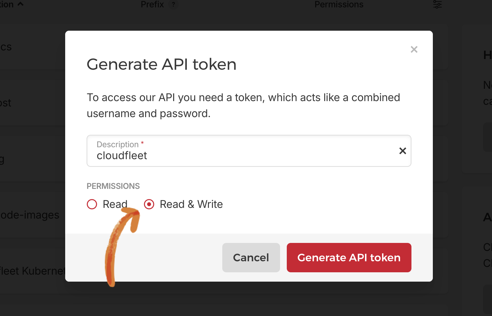

Copy and temporarily store the token while we configure Cloudfleet Kubernetes Engine. With this token, Cloudfleet will securely access your Hetzner Cloud account. Now, let’s move on to creating your Kubernetes cluster.

## Step 2 - Create a Kubernetes cluster with Cloudfleet

If you don’t have a Cloudfleet account yet, you can sign up [here](https://console.cloudfleet.ai/account/signup). The process takes only a few minutes and requires just an email address and password. New accounts receive €200 in free credit, valid for 30 days, so you can complete this tutorial without any upfront payment. For more information about Cloudfleet cluster plans, see the [Cloudfleet pricing](https://cloudfleet.ai/pricing/) page.

Once you have an account, log into the [Cloudfleet Console](https://console.cloudfleet.ai/), and click "**Create cluster**" to launch the cluster creation wizard:

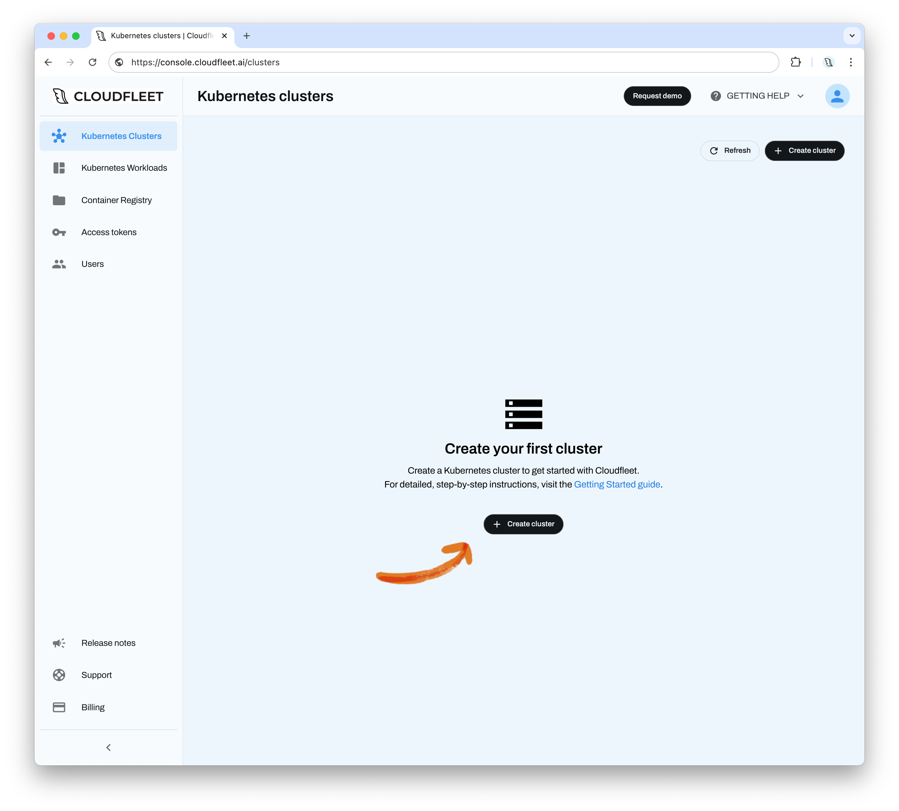

In the first step of the setup dialog, you choose the **control plane region** and the cluster type. The control plane region is the geographical location where your cluster's control plane runs. Importantly, it does not restrict where your worker nodes can run: a Cloudfleet cluster can span nodes across multiple regions, multiple cloud providers, and even on-premises hardware at the same time. Choose a region close to where most of your workloads will run, or one that satisfies your regulatory requirements. Keep in mind that the control plane region cannot be changed after the cluster is created. For this tutorial, we select `europe-central-1a`.

For the cluster type, Cloudfleet offers three tiers. Basic runs on a shared, single-zone control plane and is suitable for development, testing, and non-critical workloads. Pro provides a dedicated, highly available control plane with a 99.95% uptime SLA and technical support, making it the recommended choice for production. Enterprise adds a 99.99% SLA with custom terms, audit logging, and a named technical account manager. Review the options and select the tier that best fits your needs; the remaining steps of this tutorial are the same for every tier. Click "**Next**" to proceed.

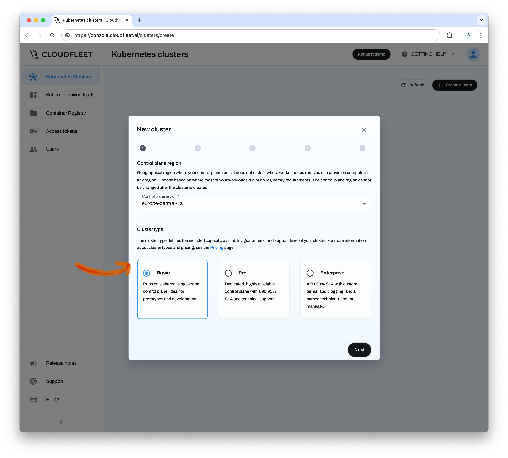

In the next step, you can adjust your cluster’s name and choose the Kubernetes version and release channel. We keep the default version, `1.x.x`, which always tracks the latest v1 release, and the `Rapid` release channel, which adopts new Kubernetes versions as soon as Cloudfleet publishes them. If you prefer slower, more conservative rollouts, choose the `Stable` or `Extended` channel instead. Click "**Next**" to proceed.

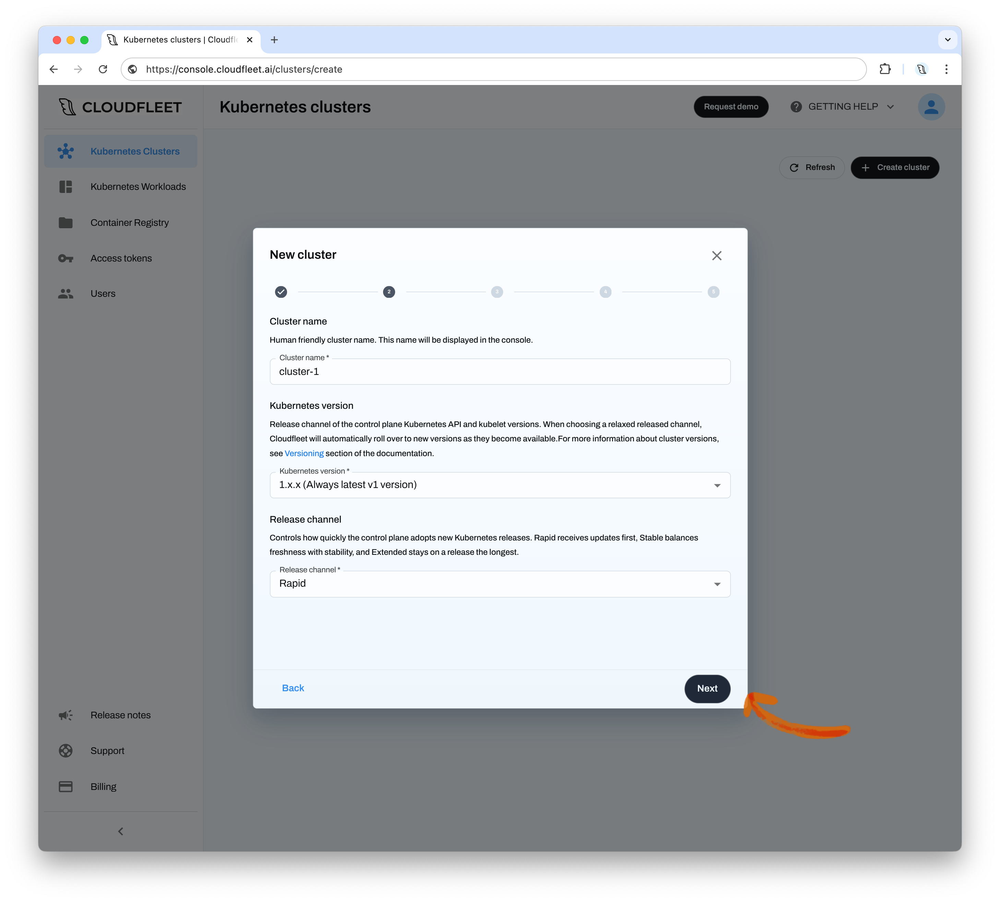

The following steps let you customize networking (available on Pro and Enterprise clusters) and GPU sharing options. The defaults are fine for this tutorial, so keep clicking "**Next**". The final step of the wizard displays your selected configuration options. Review your choices and click "**Create**" to start the cluster creation process. After a few moments, your cluster will be ready.

## Step 3 - Configure CLI

While the cluster is being provisioned, we will install the necessary tools to access it and deploy applications. We will use the official Kubernetes CLI, `kubectl`, to interact with the cluster and the Cloudfleet CLI to manage authentication and the cluster itself.

##### Install Cloudfleet CLI and kubectl

If you don’t have kubectl installed, follow the installation instructions [on its website](https://kubernetes.io/docs/tasks/tools/install-kubectl-linux/). On macOS, you can install kubectl with [Homebrew](https://brew.sh/): `brew install kubectl`. On Windows, you can use winget to install kubectl: `winget install kubectl`.

Now, install the Cloudfleet CLI. The binary is available for multiple platforms, including macOS, Linux, and Windows, with support for both Arm and AMD64 architectures. To see the installation instructions, click "**Configure kubectl**" on your cluster's card in the Cloudfleet Console.

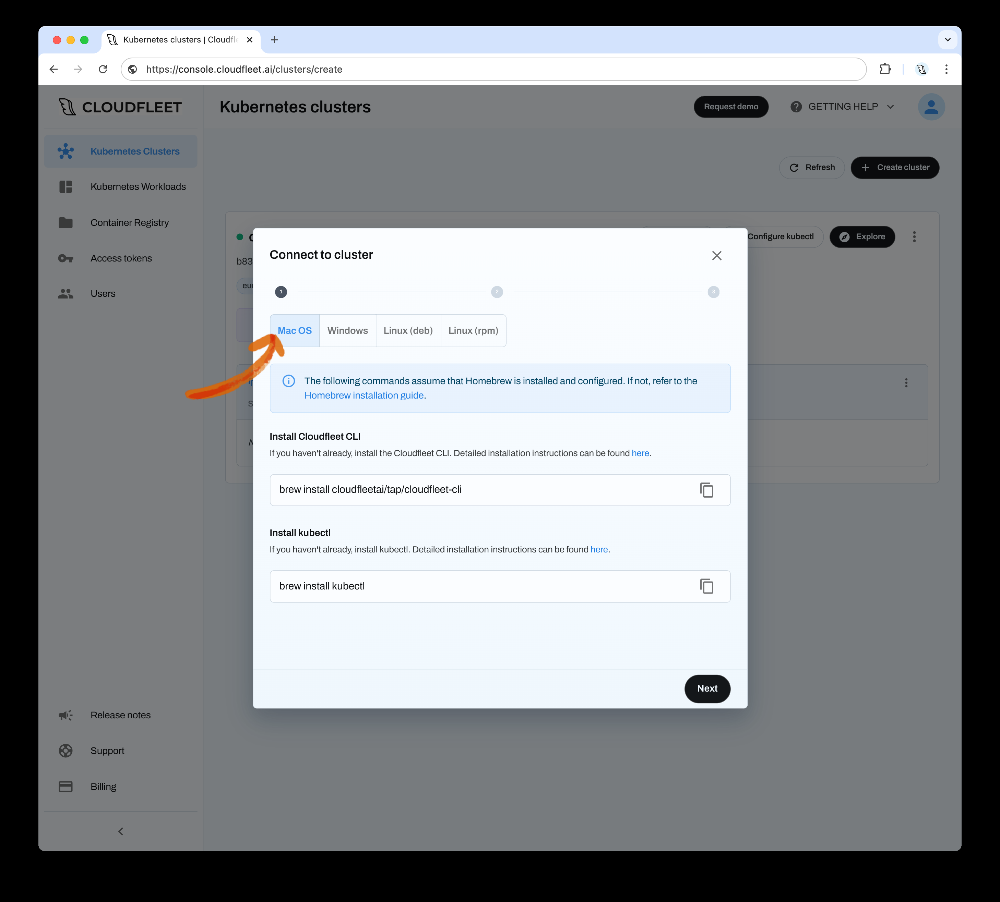

Make sure you select the correct operating system and follow the instructions in the Cloudfleet Console to install the CLI. To install the Cloudfleet CLI on macOS with Homebrew, run:

```bash
brew install cloudfleetai/tap/cloudfleet-cli
```

Windows users can install the Cloudfleet CLI with winget by running:

```bash
winget install Cloudfleet.CLI
```

For Linux users, please visit the [CLI documentation](https://cloudfleet.ai/docs/introduction/install-cloudfleet-cli/) for instructions on Debian- and "Red Hat"-based distributions. While installing via a package manager is the preferred method, you can also find links to the compiled binaries on the documentation page.

##### Authenticate and connect to your cluster

Now that we have the necessary tools installed, we can authenticate and connect to the cluster. To do this, we need to log in to our account and update the kubectl configuration.

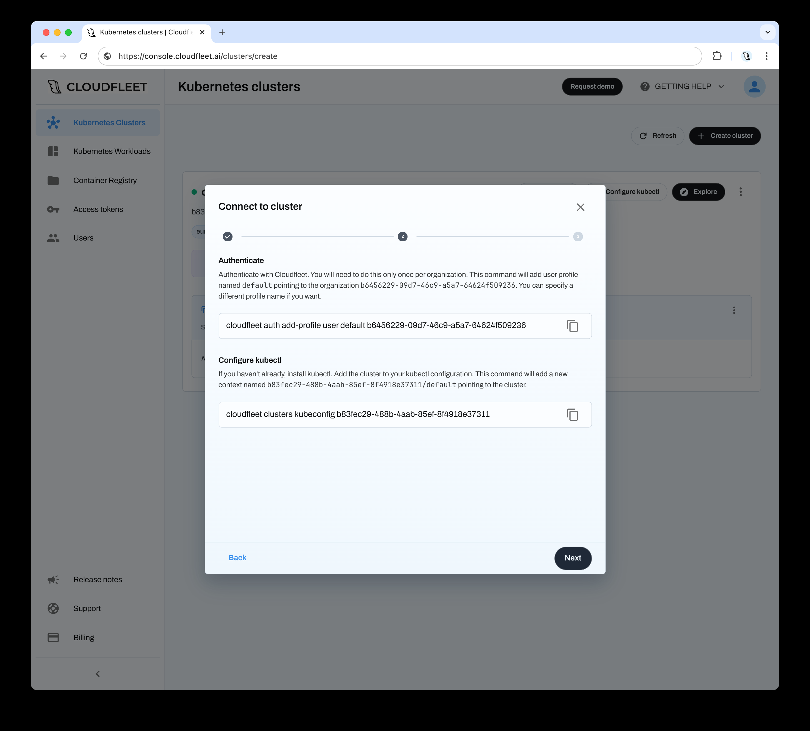

First, we need to inform the CLI which organization we are working with and create a new profile. Copy and execute the first command from the Cloudfleet Console, replacing `<cloudfleet_organization_id>` with your actual organization ID:

```bash
cloudfleet auth add-profile user default <cloudfleet_organization_id>
```

> Please note that, the User authentication requires a browser to complete the authentication process. The CLI will open a browser window to authenticate the user. If you are using the CLI in a headless environment (including WSL on Windows), please use the [token-based authentication](https://cloudfleet.ai/docs/introduction/install-cloudfleet-cli/#token-based-authentication) as a workaround.

After adding the profile, we can configure kubectl to use the Cloudfleet CLI as an authentication helper. This eliminates the need to manually configure certificates or manage passwords - the CLI handles it for you. Copy and execute the second command from the Cloudfleet Console, replacing `<cluster_id>` with your actual cluster ID:

```bash
cloudfleet clusters kubeconfig <cluster_id>
```

This final command updates your `~/.kube/config` file, allowing you to access your Cloudfleet cluster with a new context named `<cluster_id>/default`.

For convenience, you can set the current context to the newly created CFKE cluster profile:

```bash
kubectl config use-context <cluster_id>/default
```

Don’t forget to replace `<cluster_id>` in the command above with your actual cluster ID.

At this stage, the cluster control plane is fully operational, and you can connect to it and interact with Kubernetes objects. However, you may notice that there are no nodes in the cluster yet. This is because Cloudfleet provisions nodes on demand as soon as you deploy an application. Additionally, we need to specify which cloud provider CFKE should use for infrastructure provisioning.

In the next step, we will add Hetzner Cloud as the infrastructure provider for the cluster.

## Step 4 - Create a Hetzner fleet in your cluster

Cloudfleet Kubernetes Engine (CFKE) manages infrastructure provisioning based on the workloads deployed in your Kubernetes cluster. CFKE uses preferences defined in the workload manifest to determine where and how much infrastructure is needed, then provisions the required nodes via the cloud provider’s APIs. The node lifecycle is fully managed by CFKE, including scaling, upgrades, and deletions. This allows users to focus on their applications rather than the underlying infrastructure.

Provider configuration is managed through fleets in the Cloudfleet Console. A fleet represents a cloud account where Cloudfleet can provision nodes for your workloads. When you define a fleet, **you do not actually create nodes**; you only specify the cloud provider and provide the necessary authorization details. Once you deploy an application in Step 5, Cloudfleet evaluates your application’s requirements (e.g., CPU, memory, region) and provisions the appropriate number and size of nodes in the specified cloud provider account.

To create a new fleet for Hetzner Cloud, go to the Cloudfleet Console and click "**Add nodes**" on your cluster's card to start the process.

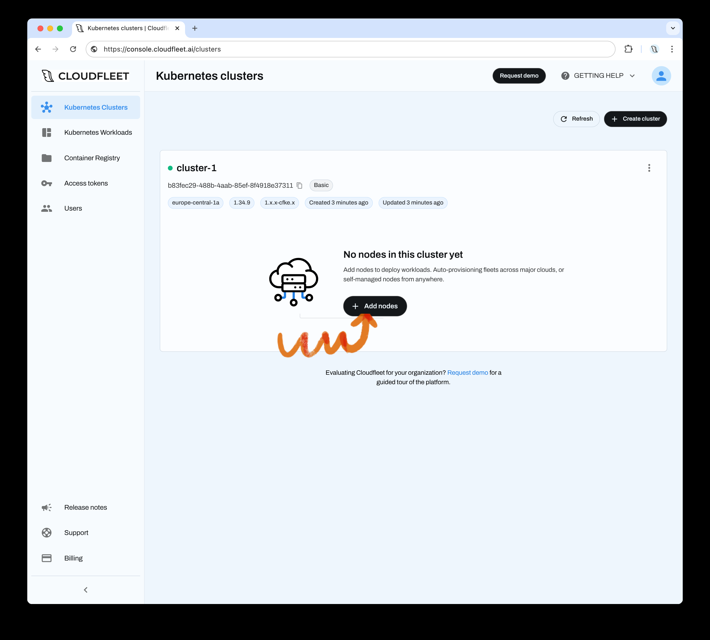

Cloudfleet supports two ways of adding nodes to a cluster: auto-provisioning fleets, where Cloudfleet creates and scales nodes for you automatically, and self-managed nodes, where you connect servers you manage yourself (for example, Hetzner dedicated servers). For this tutorial, select "**Auto-provisioning fleet**".

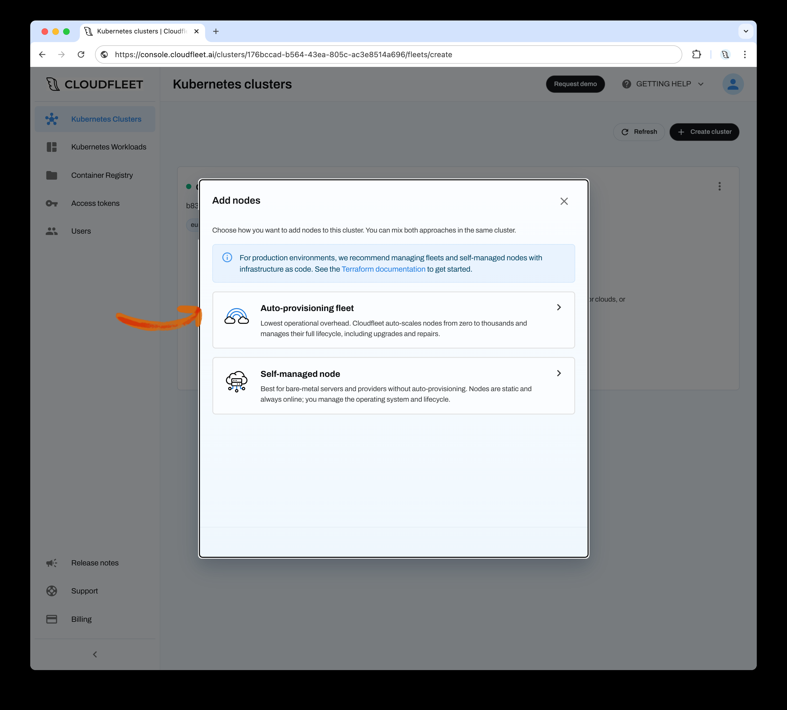

In the first step of the dialog, name your fleet and select the infrastructure providers it can use. A single fleet can span multiple providers and regions, allowing you to mix them within a single cluster. However, for this tutorial, we will use only Hetzner Cloud as the infrastructure provider. Enable "**Hetzner Cloud**" and click "**Next**" to proceed.

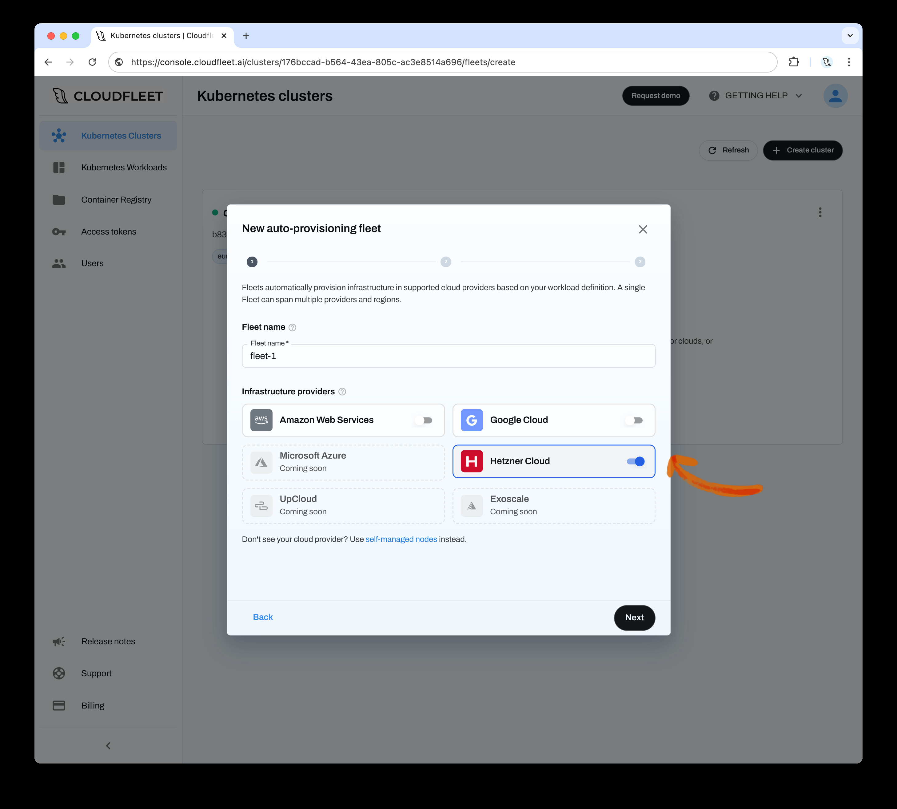

Now, **paste the Hetzner API token** you generated earlier. Cloudfleet will verify the token and use it to securely provision nodes in your Hetzner Cloud account. Click "**Next**" to proceed.

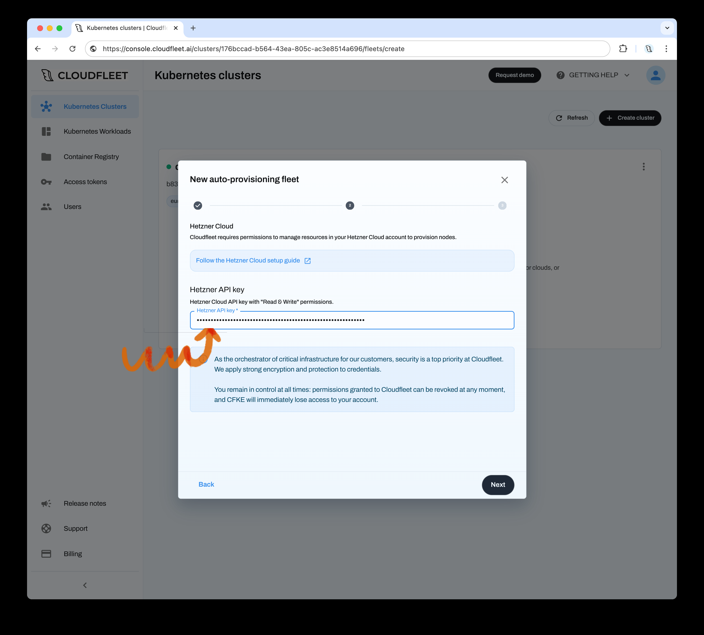

The next step lets you fine-tune how the fleet provisions nodes. Normally, the size, location, and type of each node are determined by your workload definitions: Cloudfleet reads the resource requests, node affinities, and selector labels of your pods and picks the most cost-effective matching server. The fleet configuration lets you narrow these choices if needed: you can choose a scaling profile, restrict the CPU architecture (amd64/arm64) and capacity type (on-demand or spot), cap the total vCPU count of the fleet as a cost control measure, or limit provisioning to specific cloud regions and server type families. The defaults are fine for this tutorial, so click "**Next**" to proceed.

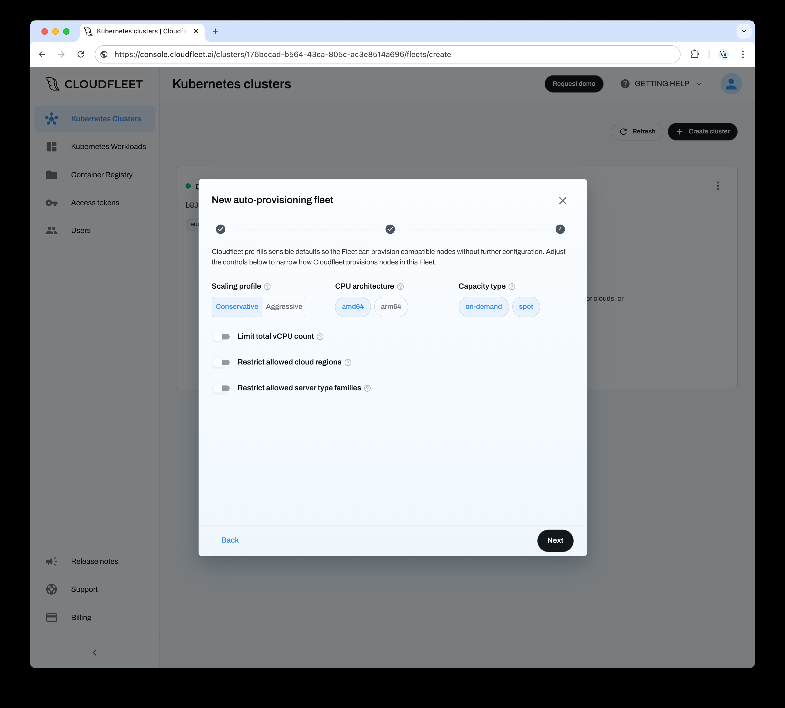

On the final step, review your fleet configuration and click "**Create**".

Your Kubernetes cluster is now ready to accept deployments. Cloudfleet will provision infrastructure on demand, automatically creating servers on Hetzner Cloud as needed.

## Step 5 - Deploy an application

With your Kubernetes cluster set up, you can now deploy an application. In this tutorial, we’ll deploy a single-container Nginx web server. This example is simplified for demonstration purposes and is not intended for production use.

To deploy the application, run the following command:

```bash
kubectl create deployment nginx-demo --image=nginx
```

Once deployed, Cloudfleet Kubernetes Engine will locate the most cost-effective Hetzner Cloud server that meets location and resource requirements (10% of one physical CPU core and 200 MiB RAM). In this example, the application fits into the smallest server type, CX23 (see [Hetzner prices](https://www.hetzner.com/cloud/#pricing)), which offers 2 vCPUs, 4 GB RAM, and 40 GB disk space, created in Hetzner's NBG1 datacenter in Nuremberg, Germany.

You can watch the node being provisioned on your cluster's card in the Cloudfleet Console:

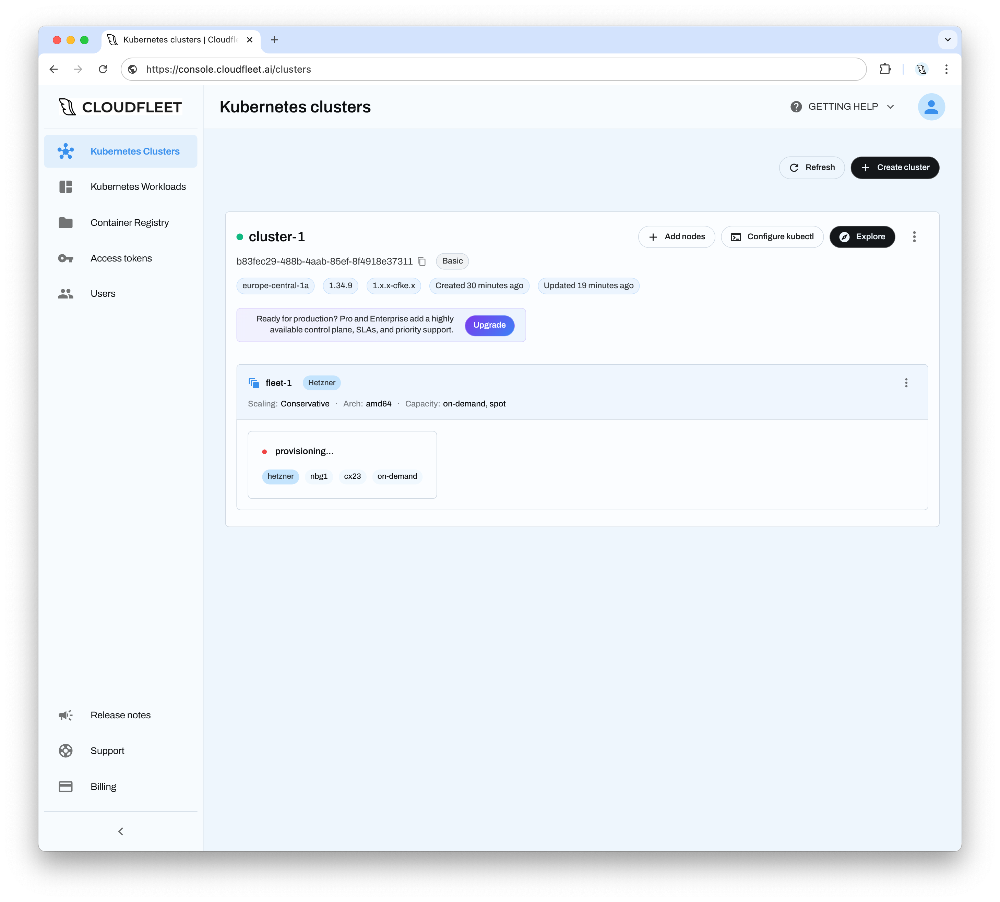

After a few moments, you can verify that the pods and nodes are running by using `kubectl get pods` and `kubectl get nodes`:

```bash
$  kubectl get pods
NAME                         READY   STATUS    RESTARTS   AGE
nginx-demo-98d9dcdf8-mdtwc   1/1     Running   0          5m48s

$  kubectl get nodeclaims -o wide
NAME            TYPE   CAPACITY    ZONE   NODE                       READY   AGE     IMAGEID        ID                                                NODEPOOL   NODECLASS   DRIFTED
fleet-1-d4p4t   cx23   on-demand   nbg1   inviting-bull-2768940197   True    5m44s   ubuntu-24.04   hetzner://fleet-1/nbg1/inviting-bull-2768940197   fleet-1    fleet-1

$  kubectl get nodes -o wide
NAME                       STATUS   ROLES    AGE     VERSION   INTERNAL-IP      EXTERNAL-IP   OS-IMAGE             KERNEL-VERSION      CONTAINER-RUNTIME
inviting-bull-2768940197   Ready    <none>   4m33s   v1.34.9   100.121.106.28   203.0.113.1   Ubuntu 24.04.4 LTS   6.8.0-117-generic   containerd://2.1.5
```

This node will also appear in your Hetzner Cloud Console as a new server. All servers created by Cloudfleet are tagged, making them easy to identify and monitor for cost tracking.

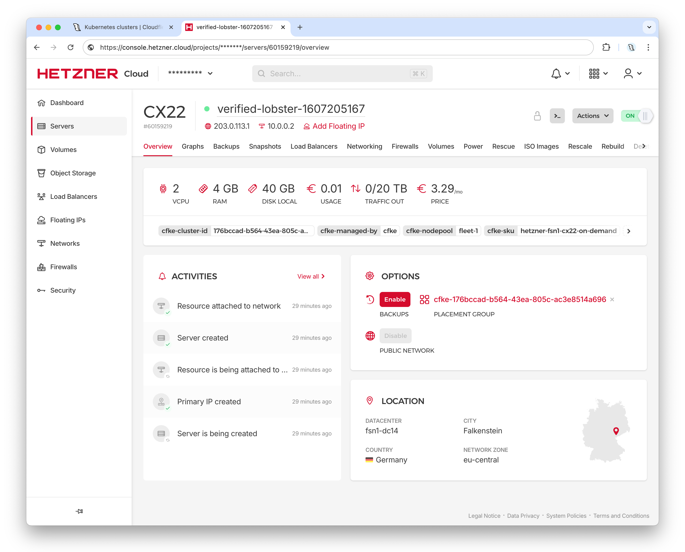

Kubernetes components generate events for all changes in the cluster. You can monitor these events using: `kubectl events`. Alternatively, you can use the **Events** tab in the Cloudfleet Console for an aggregated view of events across all your clusters. Here’s an example of my events screen, displaying the events generated by the deployment:

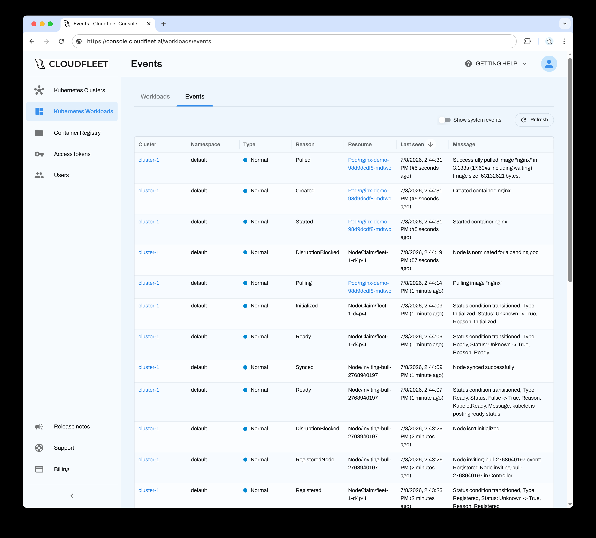

Once the node is ready and all pods are running, you can navigate to the **Workloads** tab in the Cloudfleet Console to view the current state of your pods.

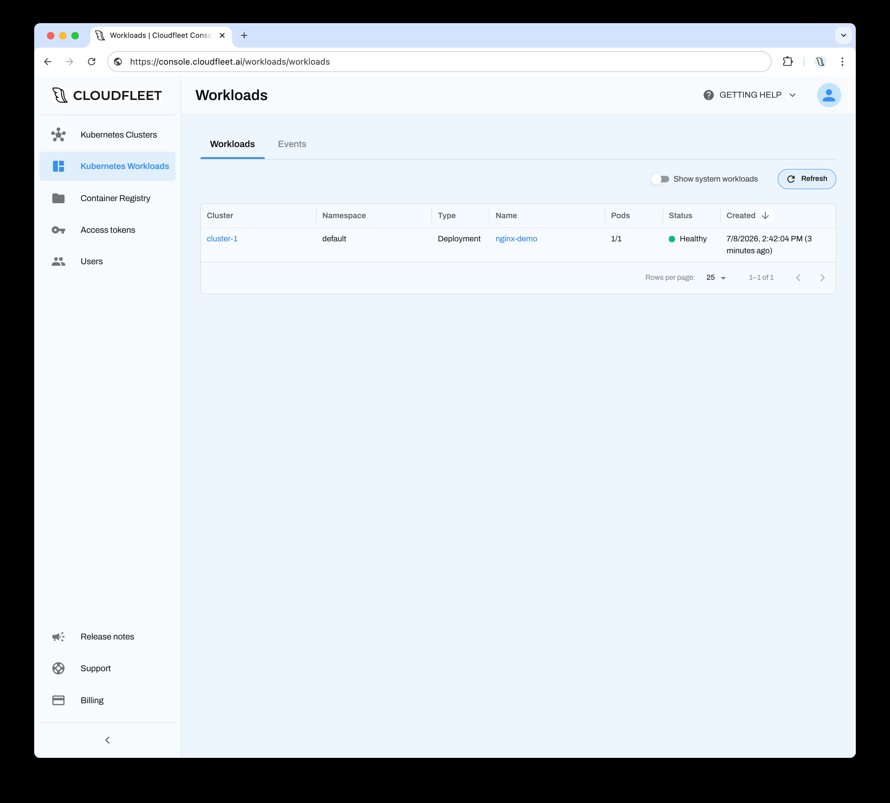

## Step 6 - Expose the application to the internet

In Kubernetes, deployments are exposed to the public internet using services. A service is a Kubernetes object that functions as a load balancer, directing traffic to the appropriate pods based on labels.

To expose our demo Nginx deployment, create a service using the following command:

```bash
kubectl expose deployment nginx-demo \
    --type=LoadBalancer --name=nginx-demo \
    --port=80 --target-port=80
```

When you create a Service object in CFKE, Cloudfleet detects your cloud provider and automatically provisions a load balancer within that provider’s network. In our case, a Hetzner Load Balancer in the `nbg1` region will route traffic to the appropriate pods in your cluster.

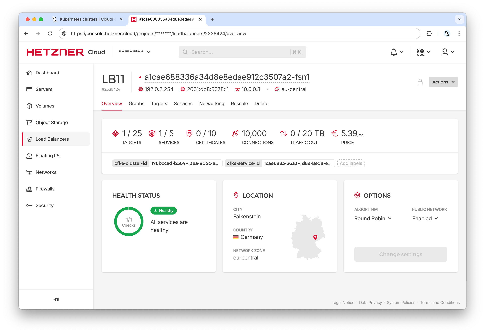

After the load balancer is provisioned, you can retrieve its IP address by running:

```bash
$  kubectl get svc nginx-demo

NAME         TYPE           CLUSTER-IP      EXTERNAL-IP                    PORT(S)        AGE
nginx-demo   LoadBalancer   10.111.186.87   192.0.2.254,2001:db8:5678::1   80:30239/TCP   96s
```

We can now access the Nginx web server by navigating to the load balancer’s external IP address in a web browser. The default Nginx welcome page should appear.

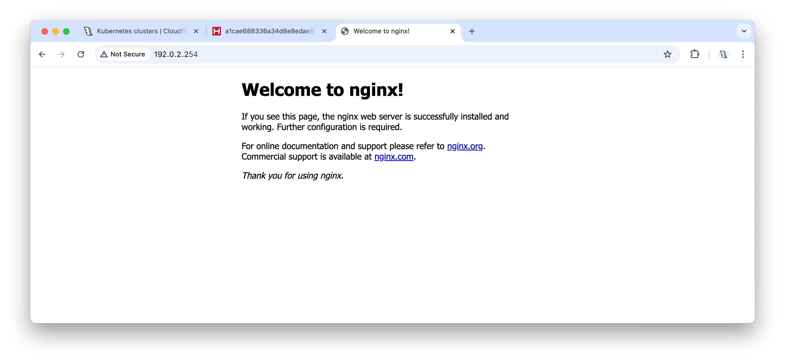

Congratulations! You have successfully deployed an Nginx web server on a Hetzner Cloud Kubernetes cluster using Cloudfleet.

## Step 7 - Cleanup

To stop all servers and delete the load balancer created by Cloudfleet, simply remove the deployment and service:

```bash
kubectl delete svc nginx-demo
kubectl delete deployment nginx-demo
```

After a short time, verify that the pods and nodes are no longer running by using `kubectl get pods` and `kubectl get nodes`:

```bash
$ kubectl get pods
No resources found in default namespace.

$  kubectl get nodes
No resources found
```

## Conclusion

In this tutorial, we covered the quickest way to set up a Kubernetes cluster on Hetzner Cloud. With Cloudfleet, you can create a Kubernetes cluster in minutes without manually managing infrastructure, allowing significant cloud savings using Hetzner servers known for their excellent price-performance ratio.

As a next step, if your applications need storage that survives pod restarts, follow the [Use persistent volumes with Cloudfleet on Hetzner](https://cloudfleet.ai/tutorials/cloud/use-persistent-volumes-with-cloudfleet-on-hetzner/) tutorial to install the Hetzner Cloud CSI driver and mount Hetzner Cloud Volumes as persistent volumes in your cluster.

To learn more about Cloudfleet, visit our website: [https://cloudfleet.ai/](https://cloudfleet.ai/)

##### License: MIT

<!--

Contributor's Certificate of Origin

By making a contribution to this project, I certify that:

(a) The contribution was created in whole or in part by me and I have
    the right to submit it under the license indicated in the file; or

(b) The contribution is based upon previous work that, to the best of my
    knowledge, is covered under an appropriate license and I have the
    right under that license to submit that work with modifications,
    whether created in whole or in part by me, under the same license
    (unless I am permitted to submit under a different license), as
    indicated in the file; or

(c) The contribution was provided directly to me by some other person
    who certified (a), (b) or (c) and I have not modified it.

(d) I understand and agree that this project and the contribution are
    public and that a record of the contribution (including all personal
    information I submit with it, including my sign-off) is maintained
    indefinitely and may be redistributed consistent with this project
    or the license(s) involved.

Signed-off-by: Alex Mervin alex@cloudfleet.ai

-->
