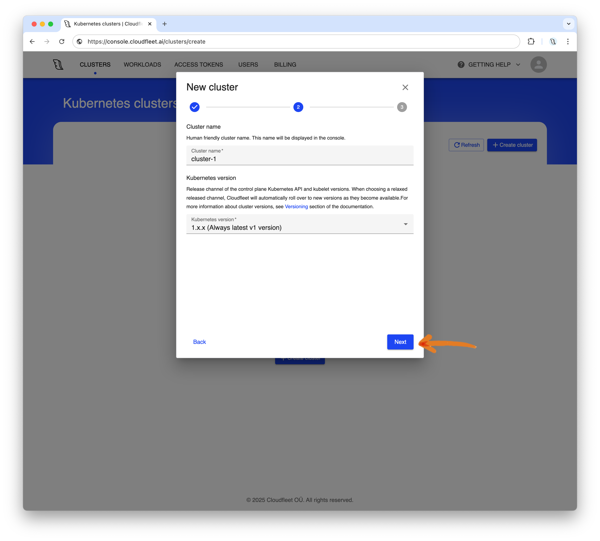

## Introduction

Kubernetes has become the de facto standard for container orchestration, empowering countless applications worldwide with its flexibility, scalability, and robust community support. Among leading infrastructure providers, Hetzner stands out for its exceptional price-performance ratio, making it a top choice for businesses seeking cost-effective solutions.

In this tutorial, we’ll guide you through the simplest way to set up fully managed Kubernetes on Hetzner Cloud, enabling you to harness the power of Kubernetes with minimal setup effort using [Cloudfleet](https://cloudfleet.ai/).

## Step 1 - Set up permissions in your Hetzner Cloud account

This tutorial assumes you already have a Hetzner Cloud account and project. If not, you can create one [here](https://console.hetzner.cloud).

Cloudfleet automatically provisions new nodes based on current demand, so you don’t need to launch any instances in advance - Cloudfleet will handle it as needed via the Hetzner Cloud API. To allow Cloudfleet to manage your Hetzner Cloud resources, generate a new API token with **read and write permissions**, as explained in this getting started guide: [Generating an API token](https://docs.hetzner.com/cloud/api/getting-started/generating-api-token).


Copy and temporarily store the token while we configure Cloudfleet Kubernetes Engine. With this token, Cloudfleet will securely access your Hetzner Cloud account. Now, let’s move on to creating your Kubernetes cluster.

## Step 2 - Create a Kubernetes cluster with Cloudfleet

If you don’t have a Cloudfleet account yet, you can sign up for free [here](https://console.cloudfleet.ai/account/signup). The process takes only a few minutes and requires just an email address and password. No credit card is required - Cloudfleet offers a free Kubernetes cluster on the Basic tier. Basic clusters are suitable for development, testing, or non-critical workloads. They are limited to 48 CPUs, which should be sufficient for this tutorial. For more information about Cloudfleet cluster plans, see the [Cloudfleet pricing](https://cloudfleet.ai/pricing/) page.

Once you have an account, log into the [Cloudfleet Console](https://console.cloudfleet.ai/), and click "**Create cluster**" to launch the cluster creation wizard:


In the first step of the setup dialog, select the **Basic** tier for the cluster type. For production workloads, you may want to use the Pro tier, which offers a high-availability configuration and higher CPU limits. However, the Basic tier is more than enough for this tutorial and hobby projects. Click "**Next**" to proceed.


In the next step, you can adjust your cluster’s name and choose the Kubernetes version. Basic clusters can only run the latest Kubernetes version and will automatically upgrade both nodes and the control plane. At the time of writing, the latest version available on Cloudfleet is 1.31.3. As soon as a new version is released, your cluster will be upgraded. Click "**Next**" to proceed.



The final step of the wizard displays your selected configuration options. Review your choices and click "**Create**" to start the cluster creation process. The wizard will then provide instructions on configuring your terminal, and after a few moments, your cluster will be ready.

## Step 3 - Configure CLI

While the cluster is being provisioned, we will install the necessary tools to access it and deploy applications. We will use the official Kubernetes CLI, `kubectl`, to interact with the cluster and the Cloudfleet CLI to manage authentication and the cluster itself.

##### Install Cloudfleet CLI and kubectl

If you don’t have kubectl installed, follow the installation instructions [on its website](https://kubernetes.io/docs/tasks/tools/install-kubectl-linux/). On macOS, you can install kubectl with [Homebrew](https://brew.sh/): `brew install kubectl`. On Windows, you can use winget to install kubectl: `winget install kubectl`.

Now, install the Cloudfleet CLI. The binary is available for multiple platforms, including macOS, Linux, and Windows, with support for both Arm and AMD64 architectures.


Make sure you select the correct operating system and follow the instructions in the Cloudfleet Console to install the CLI. To install the Cloudfleet CLI on macOS with Homebrew, run:

```bash
brew install cloudfleetai/tap/cloudfleet-cli
```

Windows users can install the Cloudfleet CLI with winget by running:

```bash
winget install Cloudfleet.CLI
```

For Linux users, please visit the [CLI documentation](https://cloudfleet.ai/docs/introduction/install-cloudfleet-cli/) for instructions on Debian- and "Red Hat"-based distributions. While installing via a package manager is the preferred method, you can also find links to the compiled binaries on the documentation page.

##### Authenticate and connect to your cluster

Now that we have the necessary tools installed, we can authenticate and connect to the cluster. To do this, we need to log in to our account and update the kubectl configuration.


First, we need to inform the CLI which organization we are working with and create a new profile. Copy and execute the first command from the Cloudfleet Console, replacing `<cloudfleet_organization_id>` with your actual organization ID:

```bash
cloudfleet auth add-profile user default <cloudfleet_organization_id>
```

> Please note that, the User authentication requires a browser to complete the authentication process. The CLI will open a browser window to authenticate the user. If you are using the CLI in a headless environment (including WSL on Windows), please use the [token-based authentication](https://cloudfleet.ai/docs/introduction/install-cloudfleet-cli/#token-based-authentication) as a workaround.

After adding the profile, we can configure kubectl to use the Cloudfleet CLI as an authentication helper. This eliminates the need to manually configure certificates or manage passwords - the CLI handles it for you. Copy and execute the second command from the Cloudfleet Console, replacing `<cluster_id>` with your actual cluster ID:

```bash
cloudfleet clusters kubeconfig <cluster_id>
```

This final command updates your `~/.kube/config` file, allowing you to access your Cloudfleet cluster with a new context named `<cluster_id>/default`.

For convenience, you can set the current context to the newly created CFKE cluster profile:

```bash
kubectl config use-context <cluster_id>/default
```

Don’t forget to replace `<cluster_id>` in the command above with your actual cluster ID.

At this stage, the cluster control plane is fully operational, and you can connect to it and interact with Kubernetes objects. However, you may notice that there are no nodes in the cluster yet. This is because Cloudfleet provisions nodes on demand as soon as you deploy an application. Additionally, we need to specify which cloud provider CFKE should use for infrastructure provisioning.

In the next step, we will add Hetzner Cloud as the infrastructure provider for the cluster.

## Step 4 - Create a Hetzner fleet in your cluster

Cloudfleet Kubernetes Engine (CFKE) manages infrastructure provisioning based on the workloads deployed in your Kubernetes cluster. CFKE uses preferences defined in the workload manifest to determine where and how much infrastructure is needed, then provisions the required nodes via the cloud provider’s APIs. The node lifecycle is fully managed by CFKE, including scaling, upgrades, and deletions. This allows users to focus on their applications rather than the underlying infrastructure.

Provider configuration is managed through fleets in the Cloudfleet Console. A fleet represents a cloud account where Cloudfleet can provision nodes for your workloads. When you define a fleet, **you do not actually create nodes**; you only specify the cloud provider and provide the necessary authorization details. Once you deploy an application in Step 5, Cloudfleet evaluates your application’s requirements (e.g., CPU, memory, region) and provisions the appropriate number and size of nodes in the specified cloud provider account.

To create a new fleet for Hetzner Cloud, go to the Cloudfleet Console and click "**Create new fleet**" or "**Add cloud infrastructure**" to start the process.


In the first step of the dialog, name your fleet and select its type. CFKE supports two fleet types: managed and connected.

- Managed fleets are fully controlled by Cloudfleet and use Cloudfleet’s own cloud provider accounts. However, this requires additional account verification.
- Connected fleets use your own cloud provider account and are available to all new users without additional verification.

For this tutorial, we will use a connected fleet with our own Hetzner Cloud account. Select "**Connected**" and click "**Next**" to proceed.


In the next step, you can define the CPU limit for your fleet. This sets the maximum number of CPUs the fleet can use, acting as a cost control measure. It does not mean that Cloudfleet will immediately provision nodes with this capacity - it simply ensures that CFKE will not exceed the limit you specify.

For this tutorial, we will set the limit to 48 CPUs, which is the maximum allowed for the Basic tier. Click "**Next**" to proceed.


Cloudfleet supports multiple cloud providers, allowing you to mix them within a single cluster. However, for this tutorial, we will use Hetzner Cloud as the infrastructure provider. Enable "**Hetzner Cloud**" and click "**Next**" to proceed.


Now, **paste the Hetzner API token** you generated earlier. Cloudfleet will verify the token and use it to securely provision nodes in your Hetzner Cloud account. Click "**Next**" to proceed.


On the final step, review your fleet configuration and click "**Create**".

Your Kubernetes cluster is now ready to accept deployments. Cloudfleet will provision infrastructure on demand, automatically creating servers on Hetzner Cloud as needed.

## Step 5 - Deploy an application

With your Kubernetes cluster set up, you can now deploy an application. In this tutorial, we’ll deploy a single-container Nginx web server. This example is simplified for demonstration purposes and is not intended for production use.

To deploy the application, run the following command:

```bash
kubectl create deployment nginx-demo --image=nginx
```

Once deployed, Cloudfleet Kubernetes Engine will locate the most cost-effective Hetzner Cloud server that meets location and resource requirements (10% of a one physical CPU core and 200 MiB RAM). In this example, the application fits into the smallest server type, CX23 (see [Hetzner prices](https://www.hetzner.com/cloud/#pricing)), which offers 2 vCPUs, 4 GB RAM, and 40 GB disk space, created in Hetzner's FSN1 datacenter in Falkenstein, Germany.

After a few moments, you can verify that the pods and nodes are running by using `kubectl get pods` and `kubectl get nodes`:

```bash
$  kubectl get pods
NAME                          READY   STATUS    RESTARTS   AGE
nginx-demo-7545d7cb85-zxk97   1/1     Running   0          6m39s

$  kubectl get nodeclaims -o wide
NAME                 TYPE                          CAPACITY    ZONE      NODE                          READY   AGE     ID                                                        NODEPOOL       NODECLASS
fleet-1-rghkc        HETZNER-FSN1-CX23-ON-DEMAND   on-demand   central   verified-lobster-1607205167   True    7m28s   HETZNER://fleet-1/fsn1/verified-lobster-1607205167        fleet-1        fleet-1

$  kubectl get nodes -o wide
NAME                          STATUS   ROLES    AGE     VERSION   INTERNAL-IP    EXTERNAL-IP      OS-IMAGE             KERNEL-VERSION       CONTAINER-RUNTIME
verified-lobster-1607205167   Ready    <none>   6m53s   v1.29.3   100.97.239.8   203.0.113.1      Ubuntu 22.04.5 LTS   5.15.0-124-generic   containerd://1.7.19
```

This node will also appear in your Hetzner Cloud Console as a new server. All servers created by Cloudfleet are tagged, making them easy to identify and monitor for cost tracking.


Kubernetes components generate events for all changes in the cluster. You can monitor these events using: `kubectl events`. Alternatively, you can use the **Events** tab in the Cloudfleet Console for an aggregated view of events across all your clusters. Here’s an example of my events screen, displaying the events generated by the deployment:


Once the node is ready and all pods are running, you can navigate to the **Workloads** tab in the Cloudfleet Console to view the current state of your pods.


## Step 6 - Expose the application to the internet

In Kubernetes, deployments are exposed to the public internet using services. A service is a Kubernetes object that functions as a load balancer, directing traffic to the appropriate pods based on labels.

To expose our demo Nginx deployment, create a service using the following command:

```bash
kubectl expose deployment nginx-demo \
    --type=LoadBalancer --name=nginx-demo \
    --port=80 --target-port=80
```

When you create a Service object in CFKE, Cloudfleet detects your cloud provider and automatically provisions a load balancer within that provider’s network. In our case, a Hetzner Load Balancer in the `fsn1` region will route traffic to the appropriate pods in your cluster.


After the load balancer is provisioned, you can retrieve its IP address by running:

```bash
$  kubectl get svc nginx-demo

NAME         TYPE           CLUSTER-IP      EXTERNAL-IP                    PORT(S)        AGE
nginx-demo   LoadBalancer   10.111.186.87   192.0.2.254,2001:db8:5678::1   80:30239/TCP   96s
```

We can now access the Nginx web server by navigating to the load balancer’s external IP address in a web browser. The default Nginx welcome page should appear.


Congratulations! You have successfully deployed an Nginx web server on a Hetzner Cloud Kubernetes cluster using Cloudfleet.

## Step 7 - Cleanup

To stop all servers and delete the load balancer created by Cloudfleet, simply remove the deployment and service:

```bash
kubectl delete svc nginx-demo
kubectl delete deployment nginx-demo
```

After a short time, verify that the pods and nodes are no longer running by using `kubectl get pods` and `kubectl get nodes`:

```bash
$ kubectl get pods
No resources found in default namespace.

$  kubectl get nodes
No resources found
```

## Conclusion

In this tutorial, we covered the quickest way to set up a Kubernetes cluster on Hetzner Cloud. With Cloudfleet, you can create a free Kubernetes cluster in minutes without manually managing infrastructure, allowing significant cloud savings using Hetzner servers known for their excellent price-performance ratio.

To learn more about Cloudfleet, visit our website: [https://cloudfleet.ai/](https://cloudfleet.ai/)

##### License: MIT

<!--

Contributor's Certificate of Origin

By making a contribution to this project, I certify that:

(a) The contribution was created in whole or in part by me and I have
    the right to submit it under the license indicated in the file; or

(b) The contribution is based upon previous work that, to the best of my
    knowledge, is covered under an appropriate license and I have the
    right under that license to submit that work with modifications,
    whether created in whole or in part by me, under the same license
    (unless I am permitted to submit under a different license), as
    indicated in the file; or

(c) The contribution was provided directly to me by some other person
    who certified (a), (b) or (c) and I have not modified it.

(d) I understand and agree that this project and the contribution are
    public and that a record of the contribution (including all personal
    information I submit with it, including my sign-off) is maintained
    indefinitely and may be redistributed consistent with this project
    or the license(s) involved.

Signed-off-by: Alex Mervin alex@cloudfleet.ai

-->
