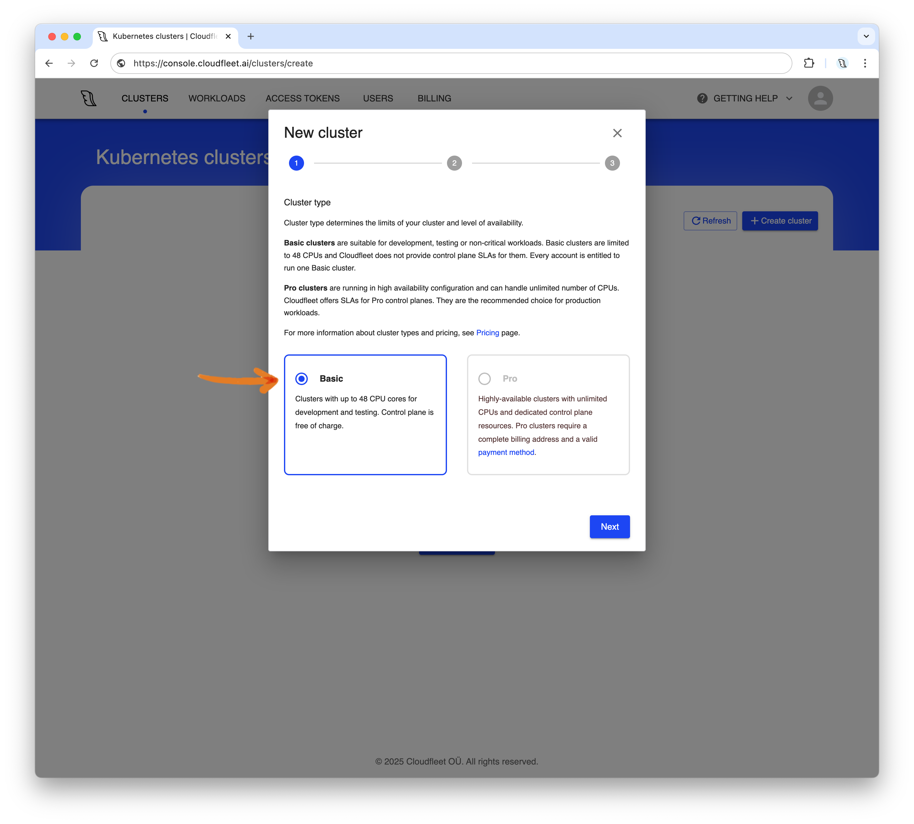

## Introduction

Kubernetes has become the de facto standard for container orchestration, empowering countless applications worldwide with its flexibility, scalability, and robust community support. Among leading infrastructure providers, Hetzner stands out for its exceptional price-performance ratio, making it a top choice for businesses seeking cost-effective solutions.

In this tutorial, we’ll guide you through the simplest way to set up fully managed Kubernetes on Hetzner Cloud, enabling you to harness the power of Kubernetes with minimal setup effort using [Cloudfleet](https://cloudfleet.ai/).

## Step 1 - Set up permissions in your Hetzner Cloud account

Cloudfleet automatically provisions new nodes based on current demand, so you don’t need to launch any instances in advance — Cloudfleet will handle it as needed via the Hetzner Cloud API. This tutorial assumes you already have a Hetzner Cloud account and project. If not, you can create one now [here](https://console.hetzner.cloud).

To allow Cloudfleet to manage your Hetzner Cloud resources, generate a new API token with read & write permissions as explained in this getting started:

* [Generating an API token](https://docs.hetzner.com/cloud/api/getting-started/generating-api-token)

Copy and securely store the token.

With this token, Cloudfleet can now access your Hetzner Cloud account. Let’s move on to creating your Kubernetes cluster.

## Step 2 - Create a Kubernetes cluster with Cloudfleet

If you don’t have a Cloudfleet account yet, you can sign up for free [here](https://console.cloudfleet.ai/account/signup). The process takes only a few minutes and requires just an email address and password. Cloudfleet offers a free tier, allowing you to create a Kubernetes cluster with up to 20 CPUs — enough for this tutorial. For more information about the free plan, see "[Pricing](https://cloudfleet.ai/pricing/)".

Once you have an account, log into the [Cloudfleet Console](https://console.cloudfleet.ai/), and click "Create cluster" on the homepage:

   

In the setup dialog, name your cluster and choose a region for the Kubernetes control plane. It’s recommended to select a region close to your location to minimize latency. Click "Save" to proceed.

   

After a few moments, your cluster will be ready. Now, create a node pool of Hetzner Cloud servers by clicking "Create new node pool":

   

In the node pool dialog, name your node pool (using lowercase alphanumeric characters only). Set the infrastructure type to "Connected" and the CPU limit to 20. Enable "Hetzner Cloud" as the provider, and paste the API token generated earlier. Click "Save" to finalize the setup.

   

Your new Kubernetes cluster is now ready, with instances automatically created on Hetzner Cloud as needed.


## Step 3 - Configure CLI access with kubectl

To deploy applications, configure the `kubectl` tool to access your new Cloudfleet cluster. If you don’t have `kubectl` installed, follow the installation instructions [on its website](https://kubernetes.io/docs/tasks/tools/install-kubectl-linux/). After installing `kubectl`, return to the Cloudfleet Console and click "Connect" next to your cluster. This will open a dialog with the necessary commands for authenticating with Cloudfleet.


1. Install Cloudfleet CLI with [Homebrew](https://brew.sh/):
   ```bash
   brew install cloudfleetai/tap/cloudfleet-cli
   ```
2. Authenticate your account:
   ```bash
   cloudfleet auth add-profile user default <cloudfleet_organization_id>
   ```
3. Update `kubectl` configuration:
   ```bash
   cloudfleet clusters kubeconfig <cluster_id>
   ```

This last command updates your `~/.kube/config` file to access your Cloudfleet cluster with a new context named `<cluster_id>/default`.

## Step 4 - Deploy an application

With your Kubernetes cluster set up, you can now deploy an application. For this tutorial, we’ll deploy a simple Nginx web server (see [downloads.cloudfleet.ai/examples](https://downloads.cloudfleet.ai/examples/nginx-demo.yaml)). This example is simplified and intended for demonstration only, not production use. The manifest will deploy two containers (TLS termination and Nginx).

```yaml
apiVersion: v1
kind: Service
metadata:
  name: nginx-demo
spec:
  type: NodePort
  selector:
    app: nginx-demo
  ports:
    - name: https
      port: 8443
      targetPort: 8443
      protocol: TCP
      nodePort: 30099
  externalTrafficPolicy: Local
---
apiVersion: apps/v1
kind: Deployment
metadata:
  name: nginx-demo
spec:
  selector:
    matchLabels:
      app: nginx-demo
  template:
    metadata:
      labels:
        app: nginx-demo
    spec:
      nodeSelector:
        kubernetes.io/arch: amd64
      containers:
        - name: tls-termination
          image: eknert/nginx-tls-terminator:1.0.1
          ports:
            - containerPort: 8443
          volumeMounts:
            - mountPath: /etc/nginx/ssl
              name: tls-terminator-cert
              readOnly: true
            - mountPath: /tmp
              name: tmp
          securityContext:
            allowPrivilegeEscalation: false
            runAsNonRoot: true
            runAsUser: 2000
            runAsGroup: 2000
            readOnlyRootFilesystem: true
            capabilities:
              drop:
                - all
          resources:
            limits:
              cpu: 50m
              memory: 100Mi
            requests:
              cpu: 10m
              memory: 15Mi
        - name: webserver
          image: nginx
          ports:
            - containerPort: 8080
          resources:
            limits:
              cpu: 50m
              memory: 100Mi
            requests:
              cpu: 10m
              memory: 15Mi
      volumes:
        - name: tls-terminator-cert
          secret:
            secretName: ingress # Secret with TLS certificate. Automatically created by CFKE.
        - name: tmp
          emptyDir: {}
```

To deploy the application, run the following command:

```bash
curl https://downloads.cloudfleet.ai/examples/nginx-demo.yaml | kubectl --context <cluster_id>/default apply -f -
```

In my case, the ID of the cluster is `a8bcca1c-8057-496d-87f8-968d9fa3cc61`, and the context is `default`. Don't forget to replace the cluster ID in the command above with your own.


Once deployed, Cloudfleet Kubernetes Engine will locate the most cost-effective Hetzner Cloud server that meets location and resource requirements (100m CPU and 200Mi RAM). In this example, the application fits into the smallest server type, CX22 (see [prices](https://www.hetzner.com/cloud/#pricing)), which offers 2 vCPUs, 4 GB RAM, and 40 GB disk space, created in Hetzner's FSN1 datacenter in Falkenstein, Germany.

After a few moments, you can verify that the pods and nodes are running by using `kubectl get pods` and `kubectl get nodes`:

```bash
$  kubectl --context <cluster_id>/default get pods
NAME                          READY   STATUS    RESTARTS   AGE
nginx-demo-84867bdf78-mf6br   2/2     Running   0          6m39s

$  kubectl --context <cluster_id>/default get nodeclaims -o wide
NAME                 TYPE                          CAPACITY    ZONE      NODE                          READY   AGE     ID                                                        NODEPOOL       NODECLASS
hetznernodes-zwpwz   HETZNER-FSN1-CX22-ON-DEMAND   on-demand   central   lenient-bluebird-3265447277   True    7m28s   HETZNER://hetznernodes/fsn1/lenient-bluebird-3265447277   hetznernodes   hetznernodes

$  kubectl --context <cluster_id>/default get nodes -o wide
NAME                          STATUS   ROLES    AGE     VERSION   INTERNAL-IP    EXTERNAL-IP      OS-IMAGE             KERNEL-VERSION       CONTAINER-RUNTIME
lenient-bluebird-3265447277   Ready    <none>   6m53s   v1.29.3   100.97.239.8   203.0.113.1      Ubuntu 22.04.5 LTS   5.15.0-124-generic   containerd://1.7.19
```

Cloudfleet also generates a DNS entry for the service, enabling access via a URL similar to `https://nginx-demo.<cluster_id>.northamerica-east-1.cloudfleet.dev:30099/`.


## Step 5 - Cleanup

To stop all servers created by Cloudfleet, remove the deployment:

```curl
https://downloads.cloudfleet.ai/examples/nginx-demo.yaml | kubectl --context <cluster_id>/default delete -f -
```

After a short time, verify that the pods and nodes are no longer running by using `kubectl get pods` and `kubectl get nodes`:

```bash
$  kubectl --context <cluster_id>/default get pods
No resources found in default namespace.

$  kubectl --context <cluster_id>/default get nodes
No resources found
```

## Conclusion

In this tutorial, we covered the quickest way to set up a Kubernetes cluster on Hetzner Cloud. With Cloudfleet, you can create a free Kubernetes cluster in minutes without manually managing infrastructure, allowing significant cloud savings using Hetzner servers known for their excellent price-performance ratio. To learn more about Cloudfleet, visit our website: [https://cloudfleet.ai/lp/managed-hetzner-kubernetes/](https://cloudfleet.ai/lp/managed-hetzner-kubernetes/)

##### License: MIT

<!--

Contributor's Certificate of Origin

By making a contribution to this project, I certify that:

(a) The contribution was created in whole or in part by me and I have
    the right to submit it under the license indicated in the file; or

(b) The contribution is based upon previous work that, to the best of my
    knowledge, is covered under an appropriate license and I have the
    right under that license to submit that work with modifications,
    whether created in whole or in part by me, under the same license
    (unless I am permitted to submit under a different license), as
    indicated in the file; or

(c) The contribution was provided directly to me by some other person
    who certified (a), (b) or (c) and I have not modified it.

(d) I understand and agree that this project and the contribution are
    public and that a record of the contribution (including all personal
    information I submit with it, including my sign-off) is maintained
    indefinitely and may be redistributed consistent with this project
    or the license(s) involved.

Signed-off-by: Alex Mervin alex@cloudfleet.ai

-->
