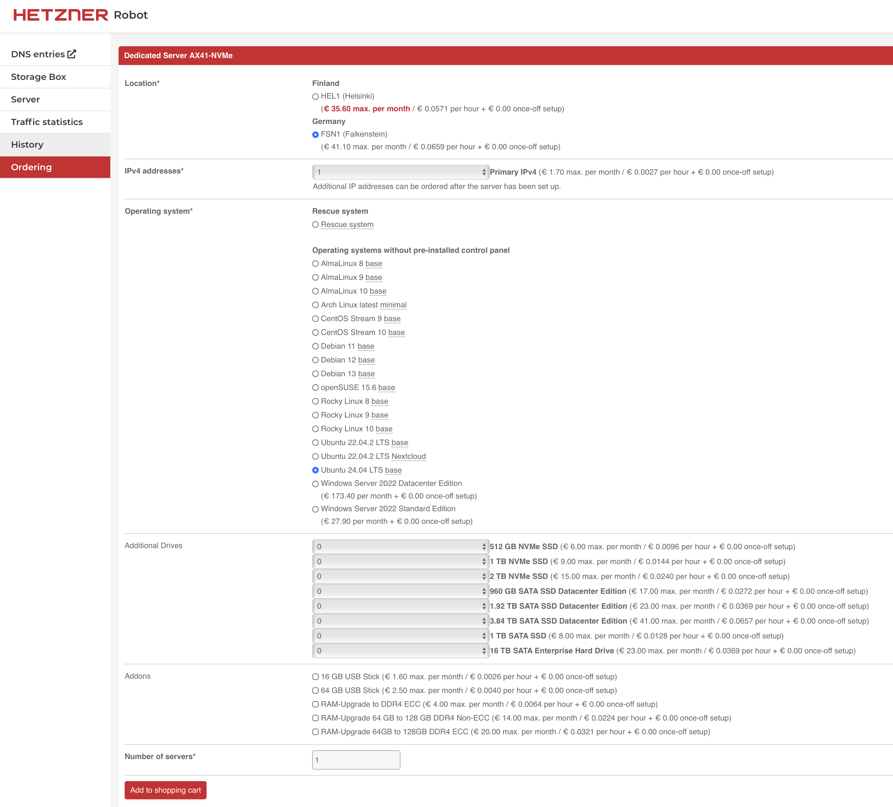
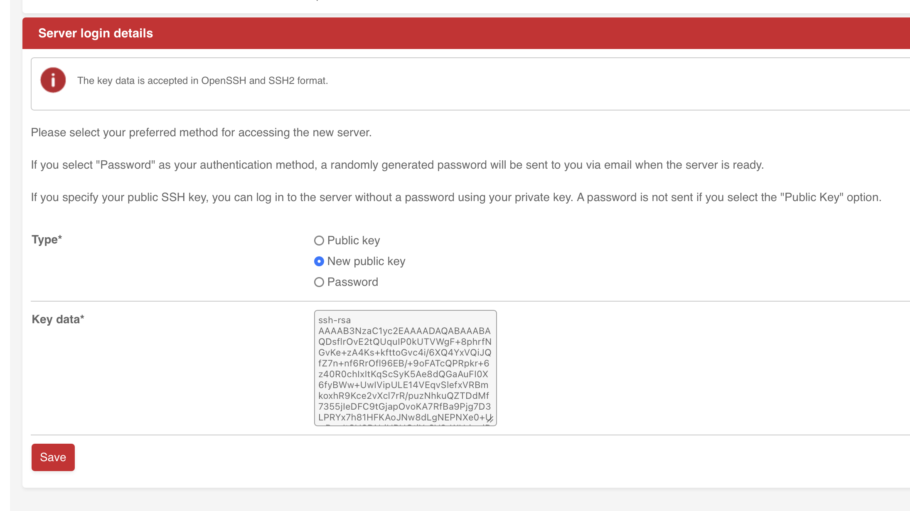
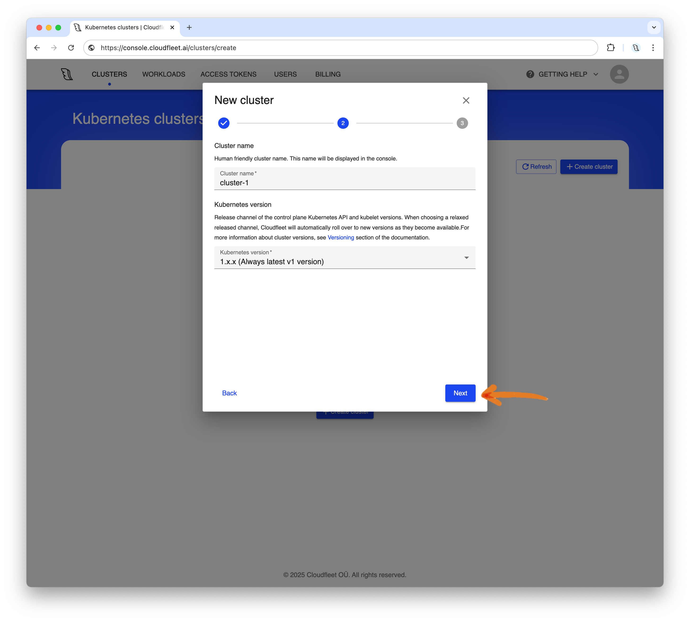
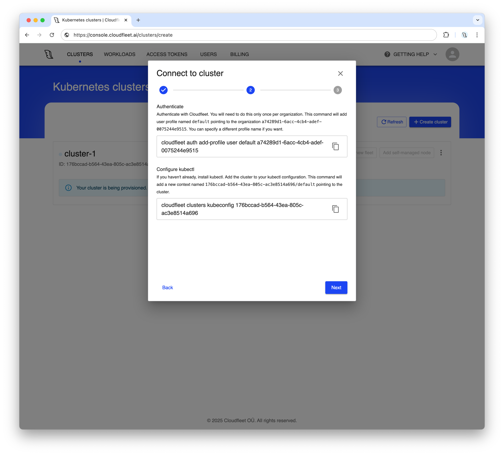
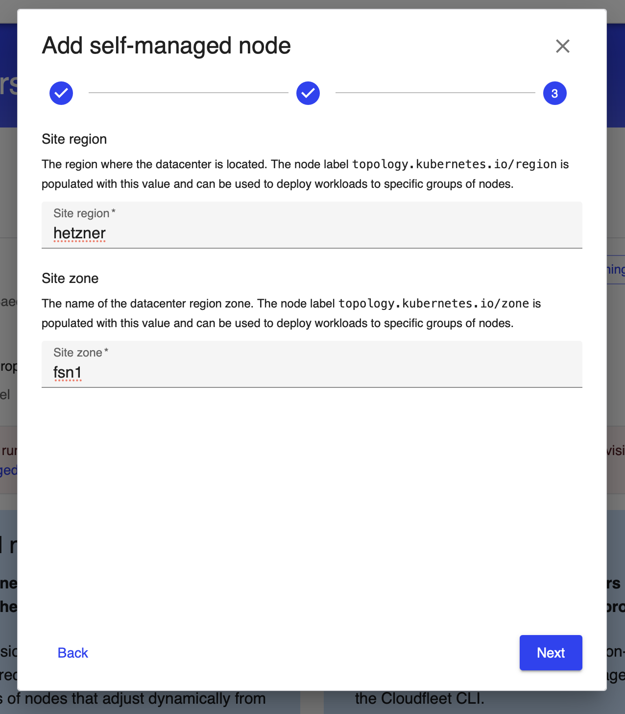
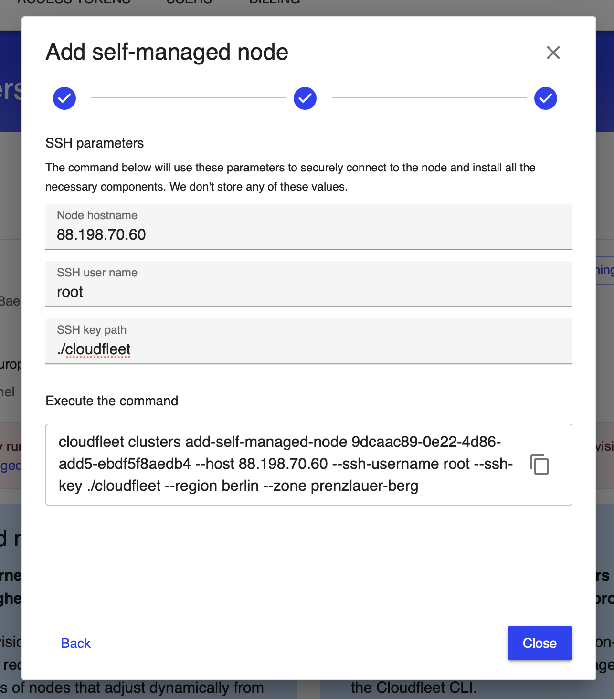
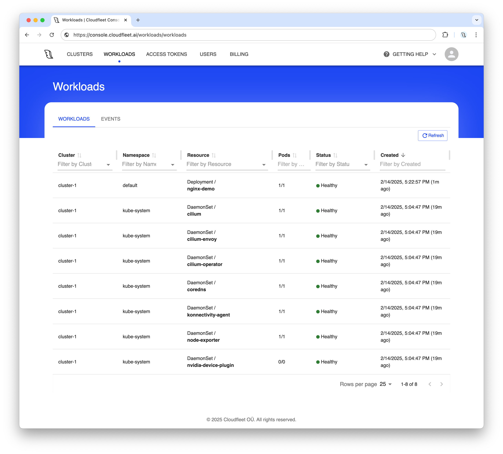
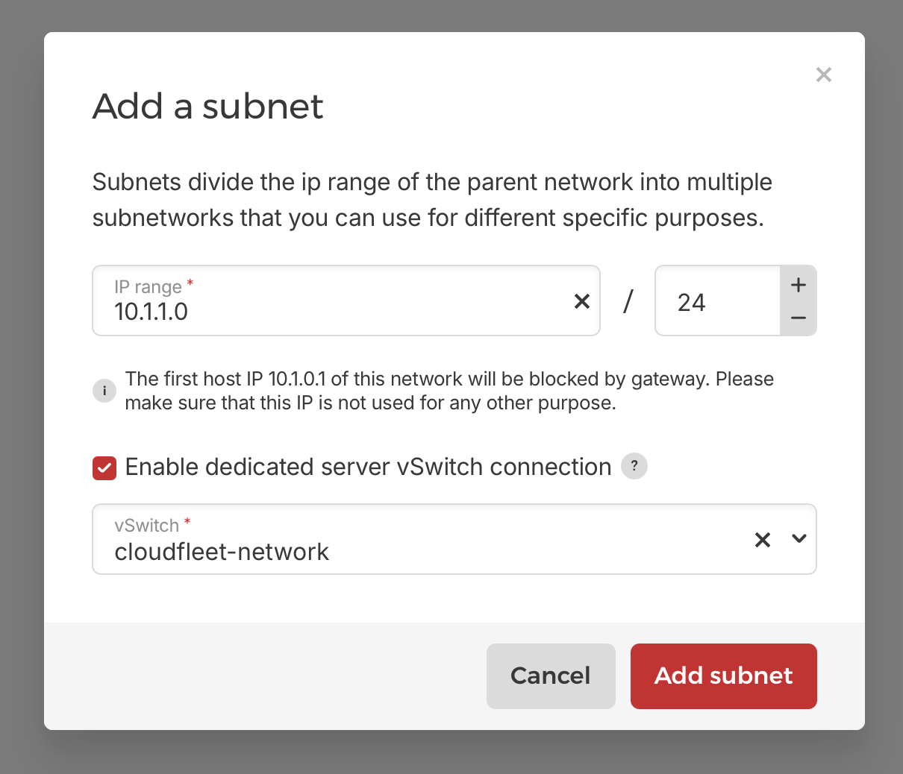

## Introduction

Hetzner Cloud is a great way to start and scale your infrastructure, offering excellent price-performance ratios and a wide selection of resources. They also offer a great selection of dedicated servers with powerful hardware configurations for more demanding workloads, including [GPU enabled servers](https://www.hetzner.com/dedicated-rootserver/matrix-gpu/).

Kubernetes is a great way to orchestrate workloads on Hetzner dedicated servers, but installing and managing it can be quite an undertaking. Kubernetes typically requires running separate control plane nodes, and if you own a limited number of dedicated servers, dedicating resources to control plane nodes becomes a challenge. In this tutorial, we will demonstrate how to run a Kubernetes cluster in the easiest way without requiring dedicated control plane nodes.

The [Hetzner Kubernetes with Cloudfleet tutorial](https://community.hetzner.com/tutorials/managed-hetzner-kubernetes-with-cloudfleet) explores setting up a managed Kubernetes cluster on Hetzner Cloud using [Cloudfleet](https://cloudfleet.ai)'s managed Kubernetes service. With Hetzner Cloud, Cloudfleet provisions the necessary instances automatically, allowing you to focus on deploying and managing your applications without worrying about the underlying infrastructure. On the other hand, this tutorial focuses on using Hetzner dedicated servers with Cloudfleet through the Cloudfleet Kubernetes Engine (CFKE) in another method that Cloudfleet supports to manage compute capacity.

Cloudfleet supports Hetzner dedicated servers through the [self-managed nodes](https://cloudfleet.ai/docs/hybrid-and-on-premises/self-managed-nodes/) feature. This feature allows you to add servers running Linux (see the list of supported distributions [here](https://cloudfleet.ai/docs/hybrid-and-on-premises/self-managed-nodes/#requirements)) to your Cloudfleet Kubernetes cluster. There are two ways to add self-managed nodes to a Cloudfleet cluster, either by the Cloudfleet CLI or by the [Terraform provider](https://cloudfleet.ai/docs/terraform/introduction/). In this tutorial, we are going to use the Cloudfleet CLI as we are only adding a single server to the cluster. However, if you plan to add multiple servers and prefer using Terraform, you may want to check out the [self-managed node resource](https://cloudfleet.ai/docs/terraform/resources/#cloudfleet_cfke_self_managed_node) in the Cloudfleet Terraform provider documentation.

In this tutorial, we are going to learn the following.

1. How to create a Cloudfleet Kubernetes cluster and add a Hetzner Dedicated Server as a self-managed node.
2. How to connect our dedicated server to Hetzner Cloud to use Hetzner Load Balancers to expose our applications to the internet.
3. How to set up a firewall on the dedicated server to restrict access to only necessary services.

## Cluster setup

### Step 1 - Purchase a Hetzner Dedicated Server

To start with, let us purchase a new Hetzner Dedicated Server. Of course, you can also use an existing server if you have one. In this case, please reinstall Ubuntu 24.04 on it and skip to the next step.

This tutorial assumes you already have a Hetzner account. If not, you can create one [here](https://accounts.hetzner.com/signUp).

To get started, log into the [Hetzner Robot Console](https://robot.hetzner.com) and navigate to the "**Ordering**" section. Choose a server that you like and click on "**Order product**" button to start the provisioning process.

We select an AX41-NVMe server for this tutorial, we can leave all the default options except the operating system. We will select "**Ubuntu 24.04 LTS**" as the operating system. After selecting the OS, click on "**Add to shopping cart**" to skip to the next step.



On the next page, we need to add a SSH key to the server. If you don't have a SSH key yet, here's how you create it:

1. Open PowerShell on Windows, a Terminal window on Linux. In macOS, find Terminal in the Dock or in the Utilities folder.

2. Enter the following command: `ssh-keygen -b 2048 -t rsa -C "your_username"`.

    1. The length, determined by -b, should be at least 2048, but ideally 4096.
    2. Update your_username and filename values.
    3. Example: `ssh-keygen -b 2048 -t rsa -C "cfkeuser" `.


3. Select enter and follow prompts.

4. A passphrase isn't required.

5. When successfully generated, you see these messages:

    1. Your identification has been saved in **id_rsa**.
    2. Your public key has been saved in **id_rsa.pub**.


6. Search for the public and private key files in Finder.

7. The two key files `id_rsa` and `id_rsa.pub` will appear on your working directory.

8. Open the .pub file (the SSH public key) in a text editor (like TextEdit) and copy the contents.

Now, go back to the Hetzner Robot Console, select **New public key** and paste the copied public key into the **Key data** field. Click the **Save** button.



Finally, review your order and click on "**Order now**" to complete the purchase. In a few minutes, your server will be ready and you will receive an email with the server's IP address and login credentials.

While you are waiting for the server to be ready, you can proceed to the next step and create a Cloudfleet Kubernetes cluster.

### Step 2 - Create a Kubernetes cluster with Cloudfleet

If you don’t have a Cloudfleet account yet, you can sign up for free [here](https://console.cloudfleet.ai/account/signup). The process takes only a few minutes and requires just an email address and password. No credit card is required - Cloudfleet offers a free Kubernetes cluster on the Basic tier. Basic clusters are suitable for development, testing, or non-critical workloads. They are limited to 24 CPUs, which should be sufficient for this tutorial. For more information about Cloudfleet cluster plans, see the [Cloudfleet pricing](https://cloudfleet.ai/pricing/) page.

Once you have an account, log into the [Cloudfleet Console](https://console.cloudfleet.ai/), and click "**Create cluster**" to launch the cluster creation wizard:


In the first step of the setup dialog, select the **Basic** tier for the cluster type. For production workloads, you may want to use the Pro tier, which offers a high-availability configuration and higher CPU limits. However, the Basic tier is more than enough for this tutorial and hobby projects. Click "**Next**" to proceed.


In the next step, you can adjust your cluster’s name and choose the Kubernetes version. Basic clusters can only run the latest Kubernetes version and will automatically upgrade both nodes and the control plane. At the time of writing, the latest version available on Cloudfleet is 1.33.3. As soon as a new version is released, your cluster will be upgraded. Click "**Next**" to proceed.



The final step of the wizard displays your selected configuration options. Review your choices and click "**Create**" to start the cluster creation process. The wizard will then provide instructions on configuring your terminal, and after a few moments, your cluster will be ready.

### Step 3 - Configure CLI

While the cluster is being provisioned, we will install the necessary tools to access it and deploy applications. We will use the official Kubernetes CLI, `kubectl`, to interact with the cluster and the Cloudfleet CLI to manage authentication and the cluster itself.

##### Install Cloudfleet CLI and kubectl

If you don’t have kubectl installed, follow the installation instructions [on its website](https://kubernetes.io/docs/tasks/tools/install-kubectl-linux/). On macOS, you can install kubectl with [Homebrew](https://brew.sh/): `brew install kubectl`. On Windows, you can use winget to install kubectl: `winget install kubectl`.

Now, install the Cloudfleet CLI. The binary is available for multiple platforms, including macOS, Linux, and Windows, with support for both Arm and AMD64 architectures.


Make sure you select the correct operating system and follow the instructions in the Cloudfleet Console to install the CLI. To install the Cloudfleet CLI on macOS with Homebrew, run:

```bash
brew install cloudfleetai/tap/cloudfleet-cli
```

Windows users can install the Cloudfleet CLI with winget by running:

```bash
winget install Cloudfleet.CLI
```

For Linux users, please visit the [CLI documentation](https://cloudfleet.ai/docs/introduction/install-cloudfleet-cli/) for instructions on Debian- and "Red Hat"-based distributions. While installing via a package manager is the preferred method, you can also find links to the compiled binaries on the documentation page.

##### Authenticate and connect to your cluster

Now that we have the necessary tools installed, we can authenticate and connect to the cluster. To do this, we need to log in to our account and update the kubectl configuration.



First, we need to inform the CLI which organization we are working with and create a new profile. Copy and execute the first command from the Cloudfleet Console, replacing `<cloudfleet_organization_id>` with your actual organization ID:

```bash
cloudfleet auth add-profile user default <cloudfleet_organization_id>
```

> Please note that the User authentication requires a browser to complete the authentication process. The CLI will open a browser window to authenticate the user. If you are using the CLI in a headless environment (including WSL on Windows), please use the [token-based authentication](https://cloudfleet.ai/docs/introduction/install-cloudfleet-cli/#token-based-authentication) as a workaround.

After adding the profile, we can configure kubectl to use the Cloudfleet CLI as an authentication helper. This eliminates the need to manually configure certificates or manage passwords - the CLI handles it for you. Copy and execute the second command from the Cloudfleet Console, replacing `<cluster_id>` with your actual cluster ID:

```bash
cloudfleet clusters kubeconfig <cluster_id>
```

This final command updates your `~/.kube/config` file, allowing you to access your Cloudfleet cluster with a new context named `<cluster_id>/default`.

For convenience, you can set the current context to the newly created CFKE cluster profile:

```bash
kubectl config use-context <cluster_id>/default
```

Don’t forget to replace `<cluster_id>` in the command above with your actual cluster ID.

At this stage, the cluster control plane is fully operational, and you can connect to it and interact with Kubernetes objects. However, you may notice that there are no nodes in the cluster yet. This is because Cloudfleet provisions nodes on demand as soon as you deploy an application.

To check if your cluster has any nodes, run:

```bash
kubectl get nodes
```

and you are going to see an empty result.

In the next step, we will add the Hetzner Dedicated Server to the cluster.

## Step 4 - Add the Hetzner Dedicated Server as a self-managed node

Before we add the dedicated server to the cluster, let us ensure we can access it via SSH. Navigate to the Robot Console, find your server in the **Server** section and copy its IP address. Then, open a terminal or PowerShell window and run the following command, replacing `<server_ip>` with your server's actual IP address:

```bash
ssh root@<server_ip> -i .\id_rsa
```

Please note that the SSH key filename might be different if you customized it during the key generation process (for example, "cloudfleet" if you used that as the filename). While we are connected to the server, let us also give it a unique hostname. As an example, let us call it "my-dedicated-server-<random_number>". This is just as an example and you can name your server as you wish. Run the following command, replacing `<random_number>` with a random number of your choice:

```bash
hostnamectl set-hostname my-dedicated-server-<random_number>
```

We need to use a random number in this example because two nodes cannot have the same hostname in a Kubernetes cluster and using a random number helps to avoid conflicts.

Before proceeding, we need to disable swap to prevent issues after node restarts. Kubernetes requires swap to be disabled on all nodes, but Hetzner's default setup unfortunately enables swap. Comment out the swap line in `/etc/fstab`:

```bash
sudo sed -i '/ swap / s/^\(.*\)$/#\1/g' /etc/fstab
```

You can verify that swap is commented out by checking the file:

```bash
cat /etc/fstab
```

Now, let us exit the SSH session by running `exit` and return to our local terminal.

Cloudfleet Console provides an easy way to generate the CLI command needed to add the dedicated server to the cluster. Navigate to the Cloudfleet Console, and on the top right corner of the cluster details page, click on the **Add self-managed node** button. This will open a dialog to help you to configure your CLI again. Since you already have the Cloudfleet CLI installed and configured, you can skip the first two steps and proceed to the third one.

On the third step, please enter "Site region" and a "Site zone" values. These are arbitrary values that are going to be used as `topology.kubernetes.io/region` and `topology.kubernetes.io/zone` labels on the node. It makes sense for us here to use "hetzner" as the region and "fsn1" as the zone, which corresponds to Hetzner's Falkenstein datacenter.



On the next step, let us enter the IP address of our dedicated server in the "Node hostname" field. As the SSH user, let us use "root" and for the SSH private key path let use "./id_rsa". Please note that the SSH key filename might be different if you customized it during the key generation process (for example, "./cloudfleet" if you used that as the filename).



Once we have filled all the fields, we are going to see the command we need to execute on our local terminal to start the node addition process. For our example, the resulting command looked like this:

```bash
cloudfleet clusters add-self-managed-node 9dcaac89-0e22-4d86-add5-ebdf5f8aedb4 --host 88.198.70.60 --ssh-username root --ssh-key ./id_rsa --region hetzner --zone fsn1
```

When we run the command, the Cloudfleet CLI will connect to the dedicated server via SSH, install all the necessary packages and node configuration files and finally add the server to the cluster. The entire process should complete in less than a minute.

Once the command completes, we can verify that the node has been successfully added to the cluster by running:

```bash
 kubectl get nodes
NAME                       STATUS   ROLES    AGE   VERSION
my-dedicated-server-3123   Ready    <none>   58s   v1.33.3
```

For all the available options, including adding GPU drivers, please refer to the [self-managed nodes documentation](https://cloudfleet.ai/docs/hybrid-and-on-premises/self-managed-nodes/).

### Step 5 - Deploy an application

With your Kubernetes cluster set up, we can now deploy an application. In this tutorial, we’ll deploy a single-container Nginx web server. This example is simplified for demonstration purposes and is not intended for production use.

To deploy the application, run the following command:

```bash
kubectl create deployment nginx-demo --image=nginx
```

Once deployed, the application will be scheduled on the dedicated server we added to the cluster. The pod will use a small portion of the server's resources (10% of a CPU core and 200 MiB RAM), leaving plenty of capacity for additional workloads.

After a few moments, you can verify that the pod is running by using `kubectl get pods`:

```bash
$ kubectl get pods -o wide
NAME                         READY   STATUS    RESTARTS   AGE   IP             NODE                       NOMINATED NODE   READINESS GATES
nginx-demo-87cd4cbb7-t9vl9   1/1     Running   0          28s   10.244.0.179   my-dedicated-server-3123   <none>           <none>
```

The pod was scheduled automatically on the dedicated server we added since it is the only node in the cluster.

We can also view the used and available capacity of the node by running:

```bash
$ kubectl top node
NAME                       CPU(cores)   CPU(%)   MEMORY(bytes)   MEMORY(%)
my-dedicated-server-3123   110m         0%       511Mi           0%
```

Once the node is ready and all pods are running, you can also navigate to the **Workloads** tab in the Cloudfleet Console to view the current state of your pods.



Congratulations! Now you have a fully functional Kubernetes cluster running on a Hetzner Dedicated Server, and you have successfully deployed an Nginx web server on it. Let us now proceed to expose the application to the internet using a Hetzner Load Balancer.

## Using Hetzner Load Balancers with Hetzner Dedicated Servers

Before we begin the setup, let's understand how we'll connect our dedicated server to Hetzner Cloud Load Balancers:

1. **NodePort Service**: First, we'll expose our Nginx application using a NodePort service, which opens a specific port (e.g., 31234) on our dedicated server that routes traffic to our application pods.

2. **vSwitch Connection**: We'll create a private network connection between our dedicated server and Hetzner Cloud using vSwitch technology. This gives our dedicated server a private IP address (e.g., 10.0.1.10) that can communicate with Hetzner Cloud resources.

3. **Load Balancer**: Finally, we'll create a Hetzner Cloud Load Balancer that routes incoming internet traffic to our dedicated server's private IP address and NodePort.

Traffic will arrive first Hetzner Load Balancer, and be routed to the Dedicated Server using the private IP via NodePort we open, and finally arrive to the Nginx Kubernetes Pod we previously created.

### Step 1 - Expose the Nginx deployment as a NodePort service

The first step is to expose our Nginx application so that external load balancers can access it. We'll use a NodePort service for this. This type of service exposes a Kubernetes pod on a specific port (typically in the range 30000-32767) on every node in a cluster. The Load Balancer can then route traffic to this port.

Let us create the NodePort service by running the following command:

```bash
kubectl create service nodeport nginx-demo --tcp=80:80 --node-port=30080
kubectl set selector service nginx-demo app=nginx-demo
```

These two commands should open the port `30080` on the dedicated server and forward all incoming traffic to port `80` of the Nginx pod. Let us verify that we can now access the Nginx pod by running:

```bash
$ curl 88.198.70.60:30080
```

Change the IP address with your own server's IP and you should see the default Nginx welcome page HTML.

In fact, you can technically use this NodePort service and its port to access your applications from outside the cluster. However, this approach is not very production-ready as we are going to apply firewall rules to the dedicated servers's IP address, and port `30080` is not a "friendly" port. Also, you might have multiple dedicated servers in the cluster, remove and add new servers. Using a Load Balancer as an entry point to your cluster is a more scalable solution in this case since your users will always connect to the Load Balancer's IP address, and you can change the backend servers as needed. As a last benefit, Hetzner Load Balancers also provide SSL termination that you can use to secure your applications instead of managing the TLS encryption in the cluster pods.

### Step 2 - Connect Hetzner Cloud to your Hetzner Dedicated Server using a vSwitch

Now that we have the NodePort service ready, we need to establish a private network connection between Hetzner Cloud and your dedicated server. This is accomplished using Hetzner's [vSwitch](https://docs.hetzner.com/robot/dedicated-server/network/vswitch) technology, which creates a virtual Layer 2 network between your dedicated server as well as Hetzner Cloud resources. This allows us to assign a private IP address to the dedicated server, which can then be used by the Hetzner Cloud Load Balancer to route traffic to it. If you add more dedicated servers to your clusters, you can also add them to the same vSwitch and then the Load Balancer can distribute traffic across all of them, and the Kubernetes nodes would be using the private IPs for inter-node communication.

#### Create a vSwitch in Robot Console

First, log into the [Hetzner Robot Console](https://robot.hetzner.com) and navigate to **Server** → **vSwitches**.


You create a new vSwitch under **Create vSwitch** section:

1. Assign a name to your vSwitch (e.g., "cloudfleet-network")
2. Choose a VLAN ID between 4000-4091 (e.g., 4032)
3. Click **Create vSwitch**

After creating the vSwitch, add your dedicated server to it:

1. Click on your newly created vSwitch
2. Under **Add servers to vSwitch** section, select your dedicated server from the list and click on **Add servers** button.

#### Create a Hetzner Cloud Network

If you previously used CFKE with Hetzner Cloud, CFKE might have already created a private network for you. You will recognise it by its name, which starts with "cfke-". If you don't have a network yet, you can create one in the Hetzner Cloud Console.

Now, log into the [Hetzner Cloud Console](https://console.hetzner.com/) and create a private network:

1. Select a project (or create one if you haven't created one yet)
2. Navigate to **Networks** in the left sidebar
3. Click **Create Network**
4. Choose a name (e.g., "cloudfleet-network")
5. Set the IP range to `10.1.0.0/16` (or your preferred private range)
6. Select the same region as your dedicated server (e.g., `eu-central`)
7. Click **Create Network**

Now, let us establish a connection between your newly created cloud network and the vSwitch:

1. In the Cloud Console, go to your network details
2. Click on the **Add vSwitch** button
3. Set the IP range to a subnet within your network range (e.g., `10.1.1.0/24`)
4. Make sure "Enable dedicated server vSwitch connection" is checked and select the vSwitch you created earlier from the dropdown
5. Click **Add subnet**



#### Configure the vSwitch on your Dedicated Server

Although the vSwitch connection is now established, we still need to configure the dedicated server to use it. We will create a VLAN interface on the dedicated server and assign it a private IP address from the subnet we created in the previous step.

After logging in to the dedicated server, first, identify your main network interface:

```bash
ip link show
```

Look for the main interface (usually `enp9s0`, `eth0`, or similar). Then create the VLAN interface:

```bash
# Replace enp9s0 with your actual interface name and 4032 with your VLAN ID
ip link add link enp9s0 name enp9s0.4032 type vlan id 4032
ip link set enp9s0.4032 mtu 1400
ip link set dev enp9s0.4032 up
```

Assign a private IP address to the VLAN interface:

```bash
# Use an IP from your chosen subnet
ip addr add 10.1.1.10/24 dev enp9s0.4032
```

And finally add a route to the private network:

```bash
ip route add 10.1.0.0/16 via 10.1.1.1
```

To make this configuration persistent across reboots, create a netplan configuration file:

```bash
nano /etc/netplan/01-netcfg.yaml
```

Add the VLAN configuration to your existing netplan file:

```yaml
network:
  version: 2
  renderer: networkd
  ethernets:
     enp9s0:  # Your main interface
      addresses:
        # Your existing configuration
  vlans:
     enp9s0.4032:
      id: 4032
      link: enp9s0
      mtu: 1400
      addresses:
      - 10.1.1.10/24
      routes:
      - to: 10.1.0.0/16
        via: 10.1.1.1
```

Apply the configuration:

```bash
netplan apply
```

Your dedicated server now has a private IP address (`10.1.1.10`) that can communicate with Hetzner Cloud resources on the same network.

### Step 3 - Create a Hetzner Cloud Load Balancer

Now that we have the application exposed via NodePort and the dedicated server connected to Hetzner Cloud via vSwitch, we can create a Load Balancer to route external traffic to the application.

Log into the [Hetzner Cloud Console](https://console.hetzner.cloud) and navigate to **Load Balancers**:

1. Click **Create Load Balancer**

2. Configure the Load Balancer:

    - **Location**: Choose the same location as your dedicated server (e.g., `Falkenstein`)
    - **Type**: Start with `lb11` (smallest type)
    - **Network**: Select the network you created earlier (`cloudfleet-network`)
    - **Name**: `nginx-demo-lb`
    - **Targets**: Click on "Add target" button and select "Dedicated Server" option. Enter the private IP address of your dedicated server (`10.1.1.10` in our case) Click on "Add 1 target" button to save.
    - **Services**: Create a new service with `http` protocol, `80` as Source port and `30080` as destination port (the NodePort we created earlier).
    - **Algorithm**: Leave with `Round Robin` (default)

Review your configuration and click **Create & Buy Now**. The Load Balancer will be created and assigned a public IP address.

Once the Load Balancer is ready, you can find its public IP address in the Load Balancer details page. Test the setup:

```bash
# Replace with your Load Balancer's public IP
curl http://<load-balancer-ip>
```

You should see the Nginx welcome page, confirming that traffic is flowing from the Load Balancer to your dedicated server and then to the Nginx pod.

## Setting up a firewall on the Dedicated Server

Now that we have the load balancer working, we can secure our dedicated server by setting up a firewall that only allows incoming traffic from the Load Balancer's IP address. We should also allow a few ports to ensure Cloudfleet can establish a secure tunnel to your dedicated server for management purposes.

To set up a firewall, navigate to your dedicated server on Robot Console and click on the **Firewall** tab. Then create the following firewall rules:

**Incoming rules:**

| Name           | Version | Protocol | Source IP     | Destination IP | Source port | Destination port | TCP flags               | Action |
|----------------|---------|----------|---------------|----------------|-------------|------------------|-------------------------|--------|
| #1 Internal    | ipv4    | tcp      | 10.1.0.0/16   | 0.0.0.0        | 0-65535     | 0-65535          | syn,ack,fin,rst,psh,urg | accept |
| #2 Internal    | ipv4    | tcp      | 100.64.0.0/10 | 0.0.0.0        | 0-65535     | 0-65535          | syn,ack,fin,rst,psh,urg | accept |
| #3 Established | *       | *        | 0.0.0.0       | 0.0.0.0        | 0-65535     | 32768-65535      | ack                     | accept |
| #7 Wireguard   | *       | udp      | 0.0.0.0       | 0.0.0.0        | 0-65535     | 41641            | syn,ack,fin,rst,psh,urg | accept |


**Outgoing rules:**

| Name                | Version | Protocol | Source IP | Destination IP | Source port | Destination port | TCP flags               | Action  |
|---------------------|---------|----------|-----------|----------------|-------------|------------------|-------------------------|---------|
| #1 Block mail ports | ipv4    | tcp      | 0.0.0.0   | 0.0.0.0        | 0-65535     | 25,465           | syn,ack,fin,rst,psh,urg | discard |
| #2 Block mail ports | ipv6    | tcp      | 0.0.0.0   | 0.0.0.0        | 0-65535     | 25,465           | syn,ack,fin,rst,psh,urg | discard |
| #3 All              | *       | *        | 0.0.0.0   | 0.0.0.0        | 0-65535     | 0-65535          | syn,ack,fin,rst,psh,urg | accept  |

And apply the firewall rules. Please note that these rules are also going to disconnect your SSH session. You ideally will not need to access the dedicated server via SSH anymore since Cloudfleet will manage it for you. However, if you do need to access it, you can temporarily add a firewall rule to allow port 22 as destination port and TCP as protocol from the Robot Console.

## Next Steps

It is a wrap! You have now successfully set up a fully managed Kubernetes cluster on a Hetzner Dedicated Server using Cloudfleet. You have also connected your dedicated server to Hetzner Cloud using a vSwitch and exposed an application using a Hetzner Load Balancer.

As you continue to develop your cluster, consider these enhancements:

- **Storage**: Integrate [local-path-provisioner](https://github.com/rancher/local-path-provisioner) to make the local disks of the dedicated server available as persistent volumes in the cluster
- **High Availability**: Add another dedicated server to the cluster to increase its capacity and create a high-availability setup
- **Hybrid Architecture**: Add Hetzner Cloud nodes or other self-managed nodes to the same cluster to create a multi-cloud or hybrid-cloud setup (Check out [Fleets](https://cloudfleet.ai/docs/cloud-infrastructure/fleet-configuration/#hetzner-cloud))
- **GPU Workloads**: Take advantage of Hetzner's GPU-enabled dedicated servers for machine learning and AI workloads (Check out the [GPU support documentation](https://cloudfleet.ai/docs/workload-management/gpu-based-workloads/))

To learn more about Cloudfleet and explore advanced features like GPU support, multi-cloud, multi-region clusters, and enterprise integrations, visit the Cloudfleet website: [https://cloudfleet.ai/](https://cloudfleet.ai/)

##### License: MIT

<!--

Contributor's Certificate of Origin

By making a contribution to this project, I certify that:

(a) The contribution was created in whole or in part by me and I have
    the right to submit it under the license indicated in the file; or

(b) The contribution is based upon previous work that, to the best of my
    knowledge, is covered under an appropriate license and I have the
    right under that license to submit that work with modifications,
    whether created in whole or in part by me, under the same license
    (unless I am permitted to submit under a different license), as
    indicated in the file; or

(c) The contribution was provided directly to me by some other person
    who certified (a), (b) or (c) and I have not modified it.

(d) I understand and agree that this project and the contribution are
    public and that a record of the contribution (including all personal
    information I submit with it, including my sign-off) is maintained
    indefinitely and may be redistributed consistent with this project
    or the license(s) involved.

Signed-off-by: Alex Mervin alex@cloudfleet.ai

-->
