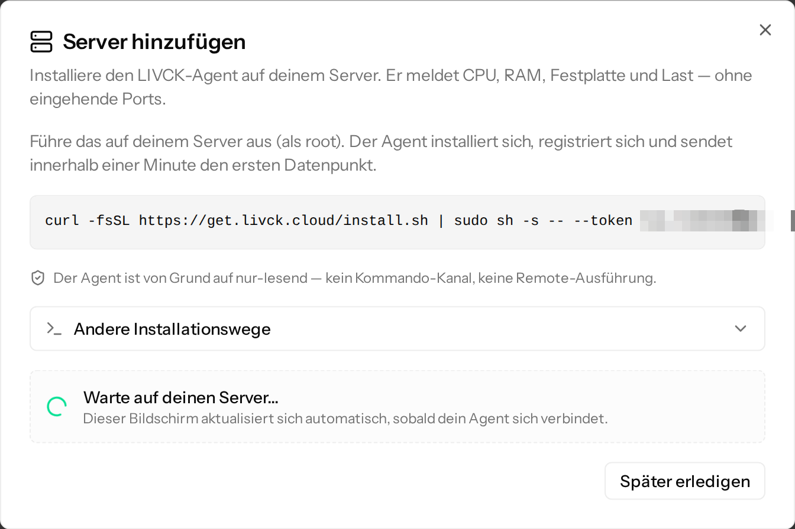
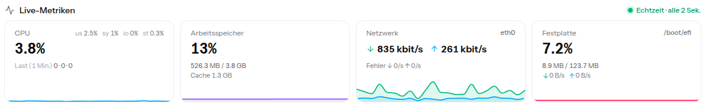
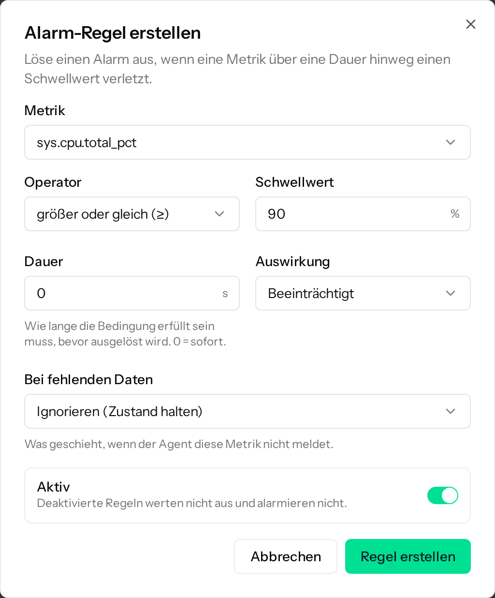
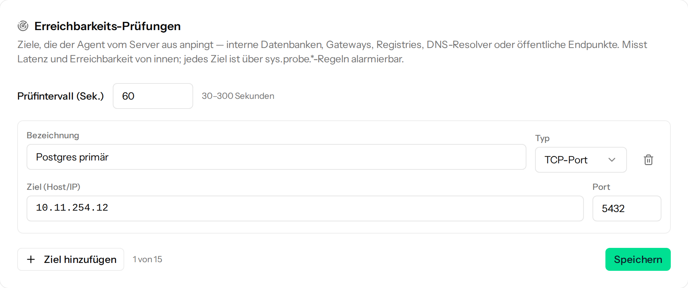

## Einführung

In diesem Tutorial installierst du den LIVCK-Agenten auf einem Cloud Server. Der Agent schickt Messwerte zu CPU, Arbeitsspeicher, Festplatten und Netzwerk an [LIVCK Cloud](https://livck.cloud), wo du sie als Diagramme ansehen kannst. Meldet sich der Server nicht mehr oder überschreitet ein Messwert einen Schwellwert, bekommst du eine E-Mail. Außerdem kann der Agent vom Server aus prüfen, ob Dienste in deinem privaten Netzwerk antworten.

Weil der Agent nur ausgehende Verbindungen aufbaut, musst du an deiner [Hetzner Cloud Firewall](https://docs.hetzner.com/de/cloud/firewalls/overview) nichts ändern. Der Quellcode liegt unter der MIT-Lizenz auf [GitHub](https://github.com/LIVCK/agent).

**Voraussetzungen**

* Ein Cloud Server mit Ubuntu oder Debian
* Root-Zugang per SSH
* Eine E-Mail-Adresse. Der kostenlose Plan reicht für zwei Server und kommt ohne Zahlungsdaten aus.

## Schritt 1 - Konto bei LIVCK Cloud anlegen

Registriere dich unter [app.livck.cloud/register](https://app.livck.cloud/register) und bestätige deine E-Mail-Adresse. Im Onboarding legst du eine Organisation an und klickst bei der Planauswahl auf **Kostenlos starten**. Die übrigen Onboarding-Schritte kannst du überspringen.

## Schritt 2 - Installationsbefehl erzeugen

Öffne in der Seitenleiste **Überwachung** > **Server** und klicke auf **Server hinzufügen**. Wähle **Einen Server** und klicke auf **Weiter**. Der Dialog zeigt einen Installationsbefehl mit einem Einmal-Token, der nach einem Tag abläuft.



Lass den Dialog offen. Er aktualisiert sich, sobald sich dein Server meldet.

## Schritt 3 - Agent installieren

Melde dich per SSH als root auf deinem Server an und führe den Befehl aus dem Dialog aus. Der Installer lädt das passende Paket herunter, vergleicht die Prüfsumme und startet den Agenten.

Wenn du das Skript vorher lesen willst, lade es zuerst herunter:

```bash
curl -fsSLO https://get.livck.cloud/install.sh
less install.sh
sh install.sh --token <your_token>
```

Ersetze `<your_token>` durch den Token aus dem Dialog.

Der Agent läuft unter einem eigenen Systembenutzer ohne Root-Rechte und liest seine Daten überwiegend aus `/proc` und `/sys`. Logdateien und den Inhalt deiner Dateien liest er nicht, und LIVCK Cloud kann keine Befehle auf dem Server ausführen. Neue Versionen installiert der Agent nachts selbst, nachdem er ihre Signatur geprüft hat. Auf der Seite des Servers unter **Bearbeiten** > **Updates** kannst du das Zeitfenster ändern oder automatische Updates abschalten.

## Schritt 4 - Ergebnis prüfen

Wenige Sekunden später zeigt der Dialog **Dein Server ist verbunden!** und öffnet die Seite des Servers. Die Live-Metriken dort aktualisieren sich alle zwei Sekunden, solange die Seite offen ist.



Auf dem Server sollte `systemctl status livck-agent` den Zustand `active (running)` zeigen.

Jeder neue Server bekommt drei Alarm-Regeln: CPU und Arbeitsspeicher jeweils zehn Minuten lang bei mindestens 90 % sowie die Root-Partition ab 85 % Belegung. Löst eine davon aus, bekommst du eine E-Mail. Ändern kannst du die Regeln auf der Seite des Servers unter **Bearbeiten** > **Alarm-Regeln**.

## Schritt 5 - Alarm testen

Stoppe den Agenten:

```bash
systemctl stop livck-agent
```

Im kostenlosen Plan meldet sich der Agent alle zwei Minuten. Drei bis fünf Minuten nach dem Stoppen steht der Server auf **Offline**, und du bekommst eine E-Mail.

Starte den Agenten wieder:

```bash
systemctl start livck-agent
```

Mit der nächsten Meldung ist der Server wieder **Online**, und du bekommst eine zweite E-Mail. Ein normaler Neustart löst keinen Alarm aus, solange der Server innerhalb von etwa drei Minuten wieder läuft.

## Schritt 6 - Überwachung erweitern (optional)

### Schritt 6.1 - Eigene Alarm-Regel anlegen

Für jeden anderen Messwert, den der Agent meldet, kannst du eigene Regeln anlegen, zum Beispiel für ein [Hetzner Cloud Volume](https://docs.hetzner.com/de/cloud/volumes/overview). Öffne auf der Seite des Servers **Bearbeiten** > **Alarm-Regeln**, klicke auf **Regel hinzufügen** und fülle den Dialog aus:

* **Metrik**: `sys.disk.{mount}.used_pct`
* **Einhängepunkt**: der Einhängepunkt des Volumes, zum Beispiel `/mnt/HC_Volume_12345678`
* **Operator**: **größer oder gleich (≥)**
* **Schwellwert**: `85`
* **Dauer**: `0`, damit die Regel sofort auslöst

Speichere die Regel mit **Regel erstellen**.



### Schritt 6.2 - Dienste im privaten Netzwerk prüfen

Um eine Datenbank in einem [Hetzner Cloud Netzwerk](https://docs.hetzner.com/de/cloud/networks/overview) zu prüfen, öffne **Bearbeiten** > **Erreichbarkeit** und klicke auf **Ziel hinzufügen**. Gib eine **Bezeichnung** ein, wähle **TCP-Port** und trage die private IP-Adresse unter **Ziel (Host/IP)** und `5432` unter **Port** ein. Klicke auf **Speichern**. Nach ein paar Minuten erscheint das Ergebnis auf der Seite des Servers.



Der Typ **DNS** mit einer Domain wie `example.com` als Ziel prüft, ob der auf dem Server eingestellte DNS-Resolver antwortet. Um einen bestimmten DNS-Server zu prüfen, trägst du seine IP-Adresse unter **Resolver** ein.

Damit du eine E-Mail bekommst, wenn ein Ziel nicht erreichbar ist, legst du wie in Schritt 6.1 eine Regel mit der Metrik `sys.probe.{target}.up` an, wählst dein Ziel aus und stellst unter **Alarm auslösen wenn** den Eintrag **Wert = 0** ein.

## Schritt 7 - Neue Server per cloud-init verbinden (optional)

Damit sich neue Server selbst anmelden, öffne erneut **Überwachung** > **Server** > **Server hinzufügen** und wähle **Mehrere Server**. Der Token, der dann erscheint, gilt 90 Tage lang für bis zu 50 Server. Beim Erstellen eines Servers in der [Hetzner Console](https://console.hetzner.com/) fügst du Folgendes in das Feld **Cloud config** ein:

```yaml
#cloud-config
runcmd:
  - curl -fsSL https://get.livck.cloud/install.sh | sh -s -- --token <your_token>
```

Die Cloud config bleibt auf dem Server lesbar. Widerrufe den Token deshalb unter **Einstellungen** > **Enrollment-Tokens**, sobald alle Server verbunden sind.

## Ergebnis

Dein Server meldet seine Werte jetzt an LIVCK Cloud, und du bekommst eine E-Mail, wenn er ausfällt oder eine Alarm-Regel auslöst. Willst du die Überwachung entfernen, lösche zuerst den Server in LIVCK Cloud und führe dann `livck-agent uninstall` auf dem Server aus.

**Nächste Schritte:**

* Zeige den Zustand deines Servers auf einer öffentlichen Statuspage. Statuspages laufen auf [statuspage.de](https://statuspage.de) unter `<name>.statuspage.de` oder auf deiner eigenen Domain.
* [Dokumentation zum Server-Monitoring](https://docs.livck.cloud/server-monitoring/overview)
* [Quellcode des LIVCK-Agenten](https://github.com/LIVCK/agent)
* [Grundlegende Cloud-Konfiguration](https://community.hetzner.com/tutorials/basic-cloud-config/de) für weitere Möglichkeiten im Feld **Cloud config**

##### License: MIT

<!--

Contributor's Certificate of Origin

By making a contribution to this project, I certify that:

(a) The contribution was created in whole or in part by me and I have
    the right to submit it under the license indicated in the file; or

(b) The contribution is based upon previous work that, to the best of my
    knowledge, is covered under an appropriate license and I have the
    right under that license to submit that work with modifications,
    whether created in whole or in part by me, under the same license
    (unless I am permitted to submit under a different license), as
    indicated in the file; or

(c) The contribution was provided directly to me by some other person
    who certified (a), (b) or (c) and I have not modified it.

(d) I understand and agree that this project and the contribution are
    public and that a record of the contribution (including all personal
    information I submit with it, including my sign-off) is maintained
    indefinitely and may be redistributed consistent with this project
    or the license(s) involved.

Signed-off-by: René Roscher <r.roscher@r-services.eu>

-->
