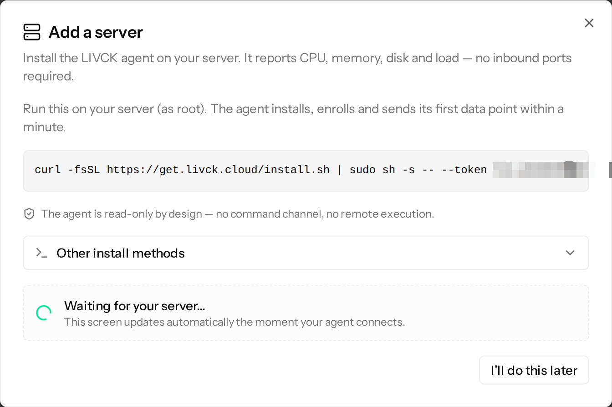
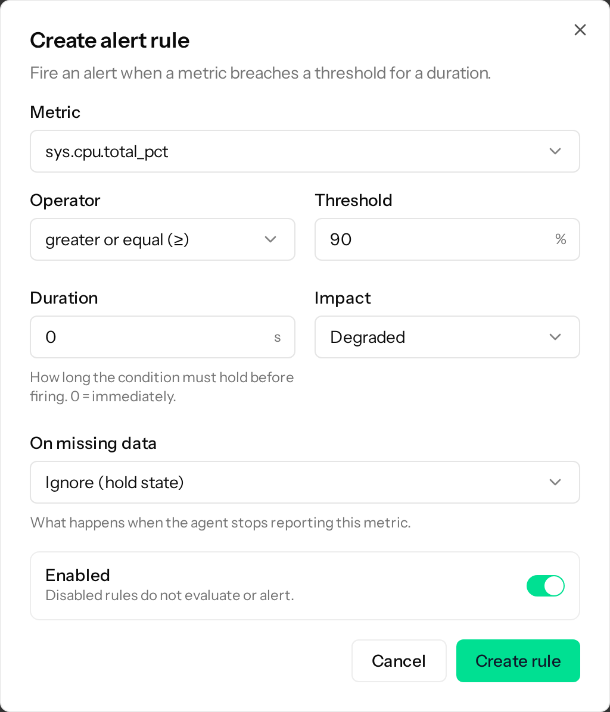
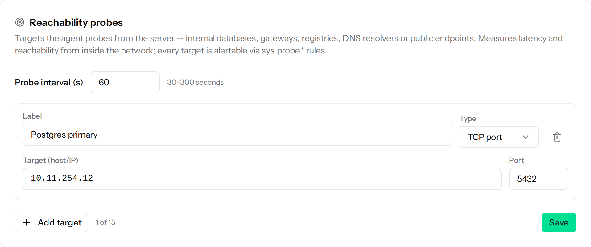

## Introduction

In this tutorial, you install the LIVCK agent on a cloud server. The agent sends CPU, memory, disk and network metrics to [LIVCK Cloud](https://livck.cloud), where you can view them as charts. If the server stops reporting or a metric crosses a threshold, you get an email. The agent can also check from the server whether services in your private network respond.

Because the agent only opens outgoing connections, you do not have to change anything in your [Hetzner Cloud Firewall](https://docs.hetzner.com/cloud/firewalls/overview). The source code is available on [GitHub](https://github.com/LIVCK/agent) under the MIT license.

**Prerequisites**

* A cloud server with Ubuntu or Debian
* Root access via SSH
* An email address. The free plan covers two servers and does not require payment details.

## Step 1 - Create a LIVCK Cloud account

Sign up at [app.livck.cloud/register](https://app.livck.cloud/register) and confirm your email address. In the onboarding, create an organization and click **Start Free** to choose the free plan. You can skip the remaining onboarding steps.

## Step 2 - Create the install command

In the sidebar, open **Monitoring** > **Servers** and click **Add server**. Select **One server** and click **Continue**. The dialog shows an install command with a one-time token that expires after one day.



Leave the dialog open. It updates as soon as your server connects.

## Step 3 - Install the agent

Log in to your server as root via SSH and run the command from the dialog. The installer downloads the matching package, verifies its checksum and starts the agent.

To read the script before running it, download it first:

```bash
curl -fsSLO https://get.livck.cloud/install.sh
less install.sh
sh install.sh --token <your_token>
```

Replace `<your_token>` with the token from the dialog.

The agent runs as its own system user without root privileges and reads its data mainly from `/proc` and `/sys`. It does not read log files or the contents of your files, and LIVCK Cloud cannot run commands on the server. At night, the agent installs new versions of itself after checking their signature. On the server page under **Edit** > **Updates**, you can change the time window or turn automatic updates off.

## Step 4 - Check the result

A few seconds later, the dialog shows **Your server is connected!** and opens the server page. The live metrics there refresh every two seconds while the page is open.

On the server, `systemctl status livck-agent` should show `active (running)`.

Every new server gets three alert rules: CPU and memory each at 90% or more for ten minutes, and the root partition at 85% or more. If one of them fires, you get an email. You can change the rules on the server page under **Edit** > **Alert rules**.

## Step 5 - Test the alert

Stop the agent:

```bash
systemctl stop livck-agent
```

On the free plan, the agent reports every two minutes. Three to five minutes after you stop it, the server is shown as **Offline** and you get an email.

Start the agent again:

```bash
systemctl start livck-agent
```

With the next report, the server is **Online** again and you get a second email. A normal reboot does not cause an alert as long as the server is back within about three minutes.

## Step 6 - Extend the monitoring (optional)

### Step 6.1 - Add your own alert rule

You can add rules for any other metric the agent reports, for example for a [Hetzner Cloud Volume](https://docs.hetzner.com/cloud/volumes/overview). On the server page, open **Edit** > **Alert rules**, click **Add rule** and fill in the dialog:

* **Metric**: `sys.disk.{mount}.used_pct`
* **Mount point**: the mount point of the volume, for example `/mnt/HC_Volume_12345678`
* **Operator**: **greater or equal (≥)**
* **Threshold**: `85`
* **Duration**: `0`, so the rule fires immediately

Save the rule with **Create rule**.



### Step 6.2 - Check services in your private network

To check a database in a [Hetzner Cloud Network](https://docs.hetzner.com/cloud/networks/overview), open **Edit** > **Reachability** and click **Add target**. Enter a **Label**, choose **TCP port** and enter the private IP address under **Target (host/IP)** and `5432` under **Port**. Click **Save**. After a few minutes, the result appears on the server page.



The type **DNS** with a domain such as `example.com` as the target checks whether the DNS resolver configured on the server answers. To test a specific DNS server, enter its IP address under **Resolver**.

To get an email when a target is unreachable, add a rule as in step 6.1 with the metric `sys.probe.{target}.up`, select your target and choose **Value = 0** under **Trigger alarm when**.

## Step 7 - Connect new servers with cloud-init (optional)

To connect new servers automatically, open **Monitoring** > **Servers** > **Add server** again and select **Multiple servers**. The token shown there works for up to 50 servers within 90 days. When you create a server in the [Hetzner Console](https://console.hetzner.com/), paste the following into the **Cloud config** field:

```yaml
#cloud-config
runcmd:
  - curl -fsSL https://get.livck.cloud/install.sh | sh -s -- --token <your_token>
```

The cloud config stays readable on the server, so revoke the token under **Settings** > **Enrollment tokens** once all servers are connected.

## Conclusion

Your server now reports to LIVCK Cloud, and you get an email when it goes offline or an alert rule fires. To remove the monitoring, first delete the server in LIVCK Cloud and then run `livck-agent uninstall` on the server.

**Next steps:**

* Show the state of your server on a public status page. Status pages run on [statuspage.de](https://statuspage.de) under `<name>.statuspage.de` or on your own domain.
* [Source code and documentation of the LIVCK agent](https://github.com/LIVCK/agent)
* [Basic Cloud Config](https://community.hetzner.com/tutorials/basic-cloud-config) for more options in the **Cloud config** field

##### License: MIT

<!--

Contributor's Certificate of Origin

By making a contribution to this project, I certify that:

(a) The contribution was created in whole or in part by me and I have
    the right to submit it under the license indicated in the file; or

(b) The contribution is based upon previous work that, to the best of my
    knowledge, is covered under an appropriate license and I have the
    right under that license to submit that work with modifications,
    whether created in whole or in part by me, under the same license
    (unless I am permitted to submit under a different license), as
    indicated in the file; or

(c) The contribution was provided directly to me by some other person
    who certified (a), (b) or (c) and I have not modified it.

(d) I understand and agree that this project and the contribution are
    public and that a record of the contribution (including all personal
    information I submit with it, including my sign-off) is maintained
    indefinitely and may be redistributed consistent with this project
    or the license(s) involved.

Signed-off-by: René Roscher <r.roscher@r-services.eu>

-->
