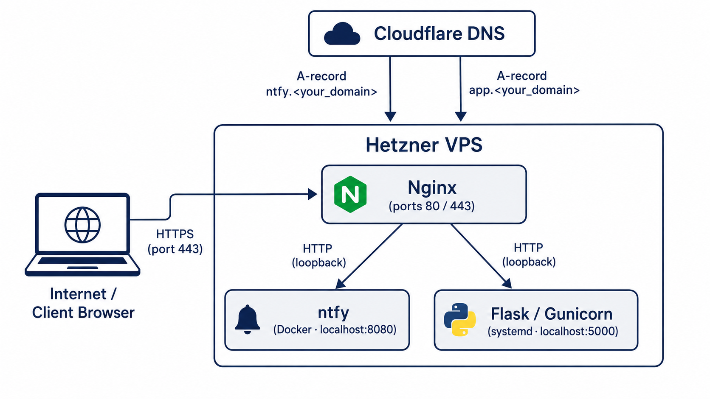
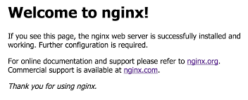
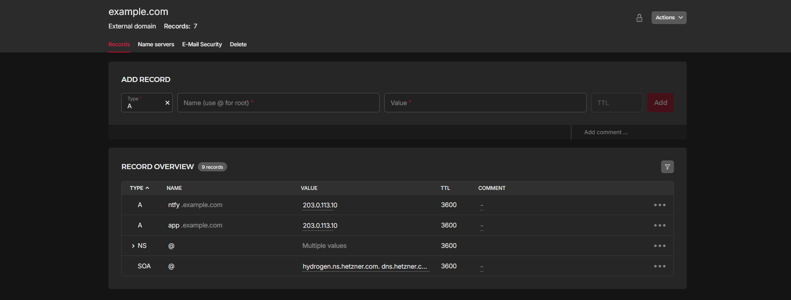
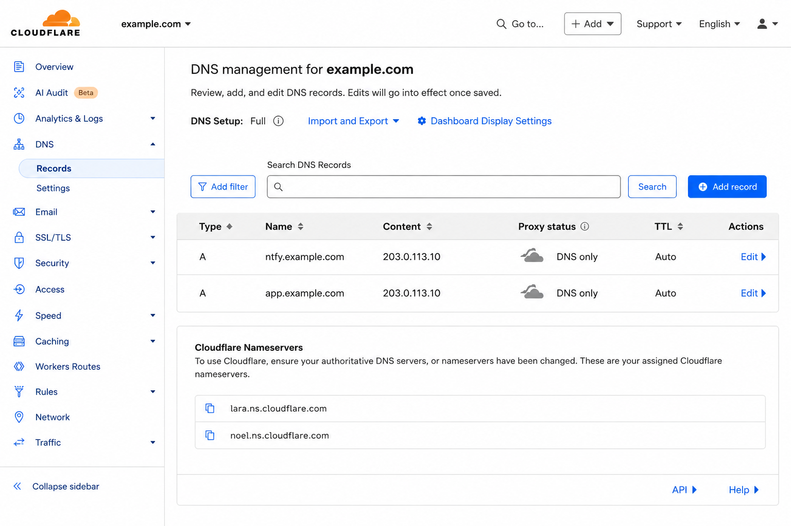

## Introduction

Nginx is one of those tools that does a lot more than most people use it for. Most folks
set it up to serve static files and leave it at that, but it's also a really solid
reverse proxy, and that's what we're using it for here.

The problem it solves is pretty simple. If you've ever tried running two or three
self-hosted services on the same VPS, you've already hit the wall: only one process can
bind to port 80 or 443 at a time. So what do you do with the rest? You put Nginx in
front of all of them. It sits on port 443, reads the hostname on each incoming request,
and forwards it to whichever app owns that subdomain, all on the same machine, all over HTTPS.

By the end of this tutorial you'll have:

- A self-hosted [ntfy](https://github.com/binwiederhier/ntfy) push-notification server running in Docker,
  reachable at `ntfy.<your_domain>`
- A Python Flask API managed as a systemd service, reachable at `app.<your_domain>`
- Both apps served over HTTPS with Let's Encrypt certificates that renew automatically
- A reusable pattern: adding a third or fourth app only takes about five minutes once this is in place

The reason I'm doing this with native Nginx **server blocks** rather than a tool like
Nginx Proxy Manager is because you get full control over the config. Everything lives in
plain text files that you can read, edit, put in version control, and actually
understand. There's no GUI to babysit and no extra layer that can silently break at
3 AM.



**Prerequisites**

- A server with:
  * **Ubuntu 22.04, 24.04 or 26.04**
  * 2 vCPU, 4 GB RAM (e.g. CX23 with Hetzner) is more than enough for this whole setup
- A **domain name**
  * DNS (e.g. with **Hetzner** or **Cloudflare**).
  * This tutorial uses `<your_domain>` as a placeholder; swap in your real domain everywhere you see it.
- Basic comfort with the Linux terminal:
  * SSH, `sudo`, and editing files with `nano` or `vim`

**Example terminology**

- Username: `holu`
- Domain: `<your_domain>`
- Server IP: `<your_server_ip>`

## Step 1 - Initial Server Setup

### Step 1.1 - Connect and update the system

Log in over SSH as root:

```bash
ssh root@<your_server_ip>
```

Update the package index and apply any pending upgrades:

```bash
apt update && apt upgrade -y
```

Always do this on a fresh server before installing anything. You want to start from
current security patches, not whatever version happened to ship in the base image.

### Step 1.2 - Create a non-root user

Running everything as root is asking for trouble. Create a regular user with `sudo`
access:

```bash
adduser holu
usermod -aG sudo holu
```

Copy your SSH key across so you can log in as `holu` without a password:

```bash
rsync --archive --chown=holu:holu ~/.ssh /home/holu
```

Now log out and reconnect as `holu`. Everything from here on is done as `holu`:

```bash
ssh holu@<your_server_ip>
```

### Step 1.3 - Configure the firewall (UFW)

Ubuntu ships with UFW but it's disabled by default. The critical thing here is to allow
SSH **before** you enable the firewall — skipping that step will lock you out of the
server immediately:

```bash
sudo ufw allow OpenSSH
sudo ufw allow 80/tcp
sudo ufw allow 443/tcp
sudo ufw enable
sudo ufw status
```

Expected output:

```
Status: active

To                         Action      From
--                         ------      ----
OpenSSH                    ALLOW       Anywhere
80/tcp                     ALLOW       Anywhere
443/tcp                    ALLOW       Anywhere
OpenSSH (v6)               ALLOW       Anywhere (v6)
80/tcp (v6)                ALLOW       Anywhere (v6)
443/tcp (v6)               ALLOW       Anywhere (v6)
```

Everything else is blocked. Ports 80 and 443 are open for web traffic; everything else
gets dropped silently.

## Step 2 - Installing Nginx

Install Nginx and set it to start automatically on boot:

```bash
sudo apt install -y nginx
sudo systemctl enable --now nginx
sudo systemctl status nginx
```

`enable --now` does both at once: registers Nginx as a boot service and starts it
right now. Once it's up, hit your server's IP in a browser and you should see the
default Nginx welcome page.



### Step 2.1 - Remove the default server block

This is a step which a lot of tutorials skip and then wonder why Certbot fails later.
Nginx ships with a catch-all default server block that listens on port 80 for any
hostname that doesn't match your own configs. If you leave it in place, it'll intercept
requests (including Let's Encrypt's HTTP domain verification challenge) before your own
server blocks even get a look in.

Remove the symlink that activates it:

```bash
sudo rm /etc/nginx/sites-enabled/default
```

The actual file in `sites-available/` is untouched — you're only removing the symlink
that loads it. You can re-enable it any time with a single `ln -s` if you need it.

### Step 2.2 - Understanding the config layout

Two directories in `/etc/nginx/` which you'll be using throughout this tutorial:

- **`sites-available/`**: where you write your server block configs, one file per app
- **`sites-enabled/`**: symlinks to the configs that Nginx actually loads

The workflow is: write in `sites-available/`, symlink into `sites-enabled/` to
activate. To disable an app, just delete the symlink; the config is still there for
when you want it back.

## Step 3 - Setting Up App 1: ntfy (Docker)

[ntfy](https://github.com/binwiederhier/ntfy) is a self-hosted push notification service. You POST a message
to a topic over plain HTTP, and any subscribed clients get it in real time. It's useful
for things like build alerts, cron job results, monitoring events — basically anywhere
you want a lightweight notification without a third-party service involved. It's also a
good first example here because it needs WebSocket support in the Nginx config, which
is slightly more involved than a standard `proxy_pass`.

### Step 3.1 - Install Docker

Ubuntu's default repositories have a `docker.io` package but it's usually pretty far
behind upstream; use Docker's official apt repository instead. Follow the official Docker documentation to install it:

* [Install Docker using the `apt` repository](https://docs.docker.com/engine/install/ubuntu/#install-using-the-repository)

<br>

Allow `holu` to run Docker commands without `sudo`:

```bash
sudo usermod -aG docker holu
```

> **Note:** Group membership only kicks in after your next login. You'll need to either
> log out and back in now, or prefix the Docker commands below with `sudo` until you do.

### Step 3.2 - Create the ntfy configuration

ntfy needs to know its public URL so it can build correct notification links and
attachment URLs. Create the config and cache directories, then write the config file:

```bash
sudo mkdir -p /etc/ntfy /var/cache/ntfy
sudo nano /etc/ntfy/server.yml
```

Add the following content in `/etc/ntfy/server.yml`:

```yaml
base-url: "https://ntfy.<your_domain>"
cache-file: "/var/cache/ntfy/cache.db"
```

|              | Description |
| ------------ | ----------- |
| base-url   | The public HTTPS address ntfy uses when constructing links. Put your real subdomain here; ntfy embeds this URL in notification payloads, so it needs to match what clients actually reach. |
| cache&#x2011;file | Turns on message persistence. Clients that briefly go offline won't miss notifications that were published while they were disconnected. |

Save and close (`Ctrl+O`, `Enter`, `Ctrl+X`).

### Step 3.3 - Run ntfy with Docker

```bash
docker run -d \
  --name ntfy \
  --restart unless-stopped \
  -p 127.0.0.1:8080:80 \
  -v /etc/ntfy:/etc/ntfy \
  -v /var/cache/ntfy:/var/cache/ntfy \
  binwiederhier/ntfy \
  serve
```

What each flag does:

| Flag | Purpose |
|---|---|
| `-d` | Run in the background (detached) |
| `--restart unless-stopped` | Restart automatically on crash or server reboot |
| `-p 127.0.0.1:8080:80` | Bind ntfy's port 80 to `localhost:8080` on the host (not reachable from the internet directly) |
| `-v /etc/ntfy:/etc/ntfy` | Mount the config file into the container |
| `-v /var/cache/ntfy:/var/cache/ntfy` | Persist the message cache on the host so it survives container restarts |

The `127.0.0.1:` prefix on the port binding is the important part. It means only
processes on this machine (specifically Nginx) can reach ntfy on port 8080. Without
it, Docker would expose the port on all interfaces, making ntfy directly reachable from
the internet and completely bypassing Nginx.

Verify the container is running:

```bash
docker ps
```

Example:

```shellsession
holu@example-server:~$ docker ps
CONTAINER ID   IMAGE                COMMAND        CREATED         STATUS         PORTS                    NAMES
d0ecec01563b   binwiederhier/ntfy   "ntfy serve"   3 minutes ago   Up 3 minutes   127.0.0.1:8080->80/tcp   ntfy
```

Do a quick health check from the server itself:

```bash
curl -s http://127.0.0.1:8080/v1/health
```

Expected response: `{"healthy":true}`

## Step 4 - Setting Up App 2: A Flask API with Gunicorn

The second app is a small Python Flask application served by Gunicorn and managed as a
systemd service — no Docker involved. This is probably the most portable pattern for
deploying custom Python apps: Gunicorn handles concurrency, systemd handles the process
lifecycle, and the two together work pretty much identical to how any other native
service runs on the machine.

### Step 4.1 - Create a dedicated user and directory

Each service should run under its own system account. Running everything as your main
user is a bad habit. If the app is ever compromised, running as a dedicated account
limits what an attacker can get to:

```bash
sudo useradd --system --no-create-home --shell /bin/false statusapi
sudo mkdir -p /opt/statusapi
sudo chown statusapi:statusapi /opt/statusapi
```

|            | Description |
| ---------- | ----------- |
| `--system` | Creates a service account with no login shell. |
| `--shell /bin/false` | Prevents interactive login entirely, even if someone manages to switch to that user. |

### Step 4.2 - Set up the Python virtual environment

Create a virtualenv owned by the `statusapi` user, then install the dependencies into
it:

```bash
sudo -u statusapi python3 -m venv /opt/statusapi/venv
sudo -u statusapi /opt/statusapi/venv/bin/pip install flask gunicorn
```

Running both commands as `statusapi` via `sudo -u` means every file in the virtualenv
is owned by the service user from the start — less permission headaches down the line.

### Step 4.3 - Write the Flask application

```bash
sudo -u statusapi nano /opt/statusapi/app.py
```

```python
from flask import Flask, jsonify

app = Flask(__name__)


@app.route("/")
def index():
    return "<p>Status API is running.</p>"


@app.route("/status")
def status():
    return jsonify({"status": "ok", "service": "statusapi", "version": "1.0"})
```

| Two&nbsp;routes: |             |
| ----------- | ----------- |
| `/`         | A plain HTML response confirming the service is alive. |
| `/status`   | A JSON health endpoint, useful for uptime monitors or other services that need to poll for availability. |

Now create the WSGI entry point. Gunicorn uses this file to find and load the Flask app:

```bash
sudo -u statusapi nano /opt/statusapi/wsgi.py
```

```python
from app import app

if __name__ == "__main__":
    app.run()
```

### Step 4.4 - Create the systemd service

```bash
sudo nano /etc/systemd/system/statusapi.service
```

```ini
[Unit]
Description=Status API (Gunicorn)
After=network.target

[Service]
User=statusapi
Group=statusapi
WorkingDirectory=/opt/statusapi
Environment="PATH=/opt/statusapi/venv/bin"
ExecStart=/opt/statusapi/venv/bin/gunicorn --workers 5 --bind 127.0.0.1:5000 wsgi:app
Restart=on-failure
RestartSec=5

[Install]
WantedBy=multi-user.target
```

| Key&nbsp;settings&nbsp;worth&nbsp;explaining: | |
| ----------- | ----------- |
| `User` / `Group` | The process runs as `statusapi`, not as root or `holu`. |
| `WorkingDirectory` | Gunicorn looks here for `wsgi.py` at startup. |
| `Environment="PATH=..."` | Puts the virtualenv's `bin/` on `$PATH` so Gunicorn picks up the right Python, not the system one. |
| `--workers 5` | Gunicorn's own docs recommend `(2 × CPUs) + 1` as a starting point. On a CX23 with 2 vCPUs that works out to 5. Each worker is a separate process that handles one request at a time, so more workers means more concurrency but also more memory. If you're running a lot of services on the same box, tune this down a bit. |
|`--bind 127.0.0.1:5000`  | Same deal as ntfy — localhost only, Nginx handles the public side. |
| `Restart=on-failure` with `RestartSec=5` | If the process crashes, systemd will restart it after 5 seconds, which stops it from hammering itself in a crash loop. |

Enable and start the service:

```bash
sudo systemctl daemon-reload
sudo systemctl enable statusapi
sudo systemctl start statusapi
sudo systemctl status statusapi
```

Example output:

```shellsession
holu@example-server:~$ sudo systemctl status statusapi
● statusapi.service - Status API (Gunicorn)
     Loaded: loaded (/etc/systemd/system/statusapi.service; enabled; preset: enabled)
     Active: active (running) since Fri 2026-05-29 09:32:00 UTC; 3s ago
   Main PID: 5737 (gunicorn)
      Tasks: 6 (limit: 3644)
     Memory: 118.8M (peak: 118.8M)
        CPU: 505ms
     CGroup: /system.slice/statusapi.service
             ├─23456 /opt/statusapi/venv/bin/python3 /opt/statusapi/venv/bin/gunicorn --workers 5 --bind 127.0.0.1:5000 wsgi:app
             ├─23457 /opt/statusapi/venv/bin/python3 /opt/statusapi/venv/bin/gunicorn --workers 5 --bind 127.0.0.1:5000 wsgi:app
             ├─23458 /opt/statusapi/venv/bin/python3 /opt/statusapi/venv/bin/gunicorn --workers 5 --bind 127.0.0.1:5000 wsgi:app
             └─23459 /opt/statusapi/venv/bin/python3 /opt/statusapi/venv/bin/gunicorn --workers 5 --bind 127.0.0.1:5000 wsgi:app

May 29 09:32:00 tutorial-wireguard systemd[1]: Started statusapi.service - Status API (Gunicorn).
May 29 09:32:01 tutorial-wireguard gunicorn[23456]: [2026-05-29 09:32:01 +0000] [23456] [INFO] Starting gunicorn 26.0.0
May 29 09:32:01 tutorial-wireguard gunicorn[23456]: [2026-05-29 09:32:01 +0000] [23456] [INFO] Listening at: http://127.0.0.1:5000 (23456)
May 29 09:32:01 tutorial-wireguard gunicorn[23456]: [2026-05-29 09:32:01 +0000] [23456] [INFO] Using worker: sync
May 29 09:32:01 tutorial-wireguard gunicorn[23457]: [2026-05-29 09:32:01 +0000] [23457] [INFO] Booting worker with pid: 23457
May 29 09:32:01 tutorial-wireguard gunicorn[23458]: [2026-05-29 09:32:01 +0000] [23458] [INFO] Booting worker with pid: 23458
May 29 09:32:01 tutorial-wireguard gunicorn[23459]: [2026-05-29 09:32:01 +0000] [23459] [INFO] Booting worker with pid: 23459
lines 1-26/26 (END)
```

Confirm the app is responding:

```bash
curl -s http://127.0.0.1:5000/status
```

Expected output: `{"service":"statusapi","status":"ok","version":"1.0"}`

## Step 5 - Configuring Nginx Server Blocks

Both apps are running and listening on localhost. Now you need an Nginx server block for
each subdomain so public requests get forwarded to the right app.

### Step 5.1 - Server block for ntfy

```bash
sudo nano /etc/nginx/sites-available/ntfy.<your_domain>
```

> Replace `<your_domain>` with your own domain.

```nginx
server {
    listen 80;
    server_name ntfy.<your_domain>;

    location / {
        proxy_pass http://127.0.0.1:8080;
        proxy_http_version 1.1;

        proxy_set_header Host              $http_host;
        proxy_set_header Upgrade           $http_upgrade;
        proxy_set_header Connection        "upgrade";
        proxy_set_header X-Forwarded-For   $proxy_add_x_forwarded_for;
        proxy_set_header X-Forwarded-Proto $scheme;

        proxy_connect_timeout 3m;
        proxy_send_timeout    3m;
        proxy_read_timeout    3m;
    }
}
```

There are three things here that differ from a standard proxy config, and each one has
a specific reason:

| Differences |    |
| ----------- | -- |
| **`proxy_http_version 1.1`** | Nginx defaults to HTTP/1.0 for upstream connections, which doesn't support the `Upgrade` header. WebSockets need HTTP/1.1, so this is required. |
| **`Upgrade` and `Connection "upgrade"` headers** | These tell Nginx to upgrade the HTTP connection to a WebSocket when the client asks for it. ntfy uses WebSockets for real-time delivery; without these the connection either falls back to polling or fails outright. |
| **Extended&nbsp;timeouts&nbsp;(3&nbsp;minutes)** | ntfy clients keep an open connection while waiting for messages. Nginx's default 60-second `proxy_read_timeout` would drop those idle connections before any messages arrive. Three minutes gives them enough room. |

### Step 5.2 - Server block for the Flask app

```bash
sudo nano /etc/nginx/sites-available/app.<your_domain>
```

> Replace `<your_domain>` with your own domain.

```nginx
server {
    listen 80;
    server_name app.<your_domain>;

    location / {
        proxy_pass http://127.0.0.1:5000;
        proxy_http_version 1.1;

        proxy_set_header Host              $host;
        proxy_set_header X-Real-IP         $remote_addr;
        proxy_set_header X-Forwarded-For   $proxy_add_x_forwarded_for;
        proxy_set_header X-Forwarded-Proto $scheme;
    }
}
```

`X-Real-IP` and `X-Forwarded-For` pass the visitor's real IP through to Flask. Without
them, every request in your app logs shows `127.0.0.1` as the client, because from
Gunicorn's perspective the request is coming from Nginx on the loopback interface. These
headers fix that so your logging and any rate-limiting middleware can see who's actually
making the request.

### Step 5.3 - Enable the configs and test

Create symlinks to activate both server blocks:

```bash
DOMAIN=<your_domain>
sudo ln -s /etc/nginx/sites-available/ntfy.$DOMAIN /etc/nginx/sites-enabled/
sudo ln -s /etc/nginx/sites-available/app.$DOMAIN /etc/nginx/sites-enabled/
```

Test for syntax errors:

```bash
sudo nginx -t
```

You should see:

```
nginx: the configuration file /etc/nginx/nginx.conf syntax is ok
nginx: configuration file /etc/nginx/nginx.conf test is successful
```

If the test passes, reload Nginx to pick up the new configs:

```bash
sudo systemctl reload nginx
```

Nginx is configured now. The subdomains aren't publicly reachable yet because DNS
doesn't point to your server — that's what the next step is for.

## Step 6 - Pointing Domains via DNS

You need an **A record** for each subdomain pointing at your server's public IP. Grab
your IP first:

```bash
curl -4 https://ip.hetzner.com
```

### Step 6.1 - Add DNS records

* **Hetzner**
  
  1. Open [Hetzner Console](https://console.hetzner.com/)
  2. Select the respective project and navigate to your DNS zone.
  3. Set the fields as follows:
     
     | Type | Name   | Value | TTL |
     | ---- | ------ | ----- | --- |
     | `A`  | `ntfy` | your server IP (from the command above) | |
  
  4. Click **Add**.
  5. Repeat for **Name:** `app`.

  

<br>

* **Cloudflare**
  
  1. Log in to [dash.cloudflare.com](https://dash.cloudflare.com) and select your domain.
  2. Go to **DNS → Records → Add record**.
  3. Set the fields as follows:
     
     | Type | Name   | IPv4 address | Proxy status |
     | ---- | ------ | ------------ | ------------ |
     | `A`  | `ntfy` | your server IP (from the command above) | **DNS only (grey cloud)** |
  
  4. Click **Save**.
  5. Repeat for **Name:** `app`.
  
  
  
  **Why the grey cloud matters:** If Cloudflare's proxy is on (orange cloud), Cloudflare
  intercepts all traffic before it reaches your server. Let's Encrypt's HTTP domain
  verification challenge in the next step needs a direct connection to your server on
  port 80. With the proxy active, Cloudflare answers instead and the challenge fails.
  Set it to DNS only for now. You can switch the proxy back on after SSL is working if you
  want Cloudflare's CDN and DDoS features.

<br>

DNS propagation usually takes a few minutes, sometimes up to an hour in practice. Verify
each subdomain resolves before you continue:

```bash
dig +short ntfy.<your_domain>
dig +short app.<your_domain>
```

Both should return your server's IP. If they return nothing, wait a few minutes and try
again.

## Step 7 - SSL with Certbot

Certbot's `--nginx` plugin reads your existing server blocks, proves to Let's Encrypt
that you control the domain, gets the certificate, and then modifies your Nginx config
to enable HTTPS and redirect HTTP — all automatically.

### Step 7.1 - Install Certbot

On Ubuntu, the recommended way to [install Certbot](https://certbot.eff.org/instructions?ws=nginx&os=snap)
is the official Snap package; it stays more current
than the apt version:

```bash
sudo snap install --classic certbot
sudo ln -s /snap/bin/certbot /usr/bin/certbot
```

The `ln -s` creates a symlink so you can call `certbot` directly without the full Snap
path.

### Step 7.2 - Obtain certificates

Run Certbot once per subdomain:

```bash
sudo certbot --nginx -d ntfy.<your_domain>
sudo certbot --nginx -d app.<your_domain>
```

On first run Certbot will ask for:
- An email address (for expiry reminders and urgent security notices from Let's Encrypt)
- Agreement to the Let's Encrypt Terms of Service

After each command, Certbot modifies the Nginx server block for that subdomain, adding
the SSL certificate paths, enabling HTTPS, and inserting an HTTP → HTTPS redirect, then
reloads Nginx automatically.

```shell
Successfully received certificate.
Certificate is saved at: /etc/letsencrypt/live/ntfy.example.com/fullchain.pem
Key is saved at:         /etc/letsencrypt/live/ntfy.example.com/privkey.pem
This certificate expires on 2026-08-27.
These files will be updated when the certificate renews.
Certbot has set up a scheduled task to automatically renew this certificate in the background.

Deploying certificate
Successfully deployed certificate for ntfy.example.com to /etc/nginx/sites-enabled/ntfy.example.com
Congratulations! You have successfully enabled HTTPS on https://ntfy.example.com

- - - - - - - - - - - - - - - - - - - - - - - - - - - - - - - - - - - - - - - -
If you like Certbot, please consider supporting our work by:
 * Donating to ISRG / Let's Encrypt:   https://letsencrypt.org/donate
 * Donating to EFF:                    https://eff.org/donate-le
- - - - - - - - - - - - - - - - - - - - - - - - - - - - - - - - - - - - - - - -
```

Verify both apps are reachable over HTTPS:

```bash
curl -I https://ntfy.<your_domain>/v1/health
curl -I https://app.<your_domain>/status
```

Both should return `HTTP/2 200`.

## Step 8 - Automating Certificate Renewal

Let's Encrypt certificates expire after 90 days. Certbot takes care of renewal
automatically — you just need to confirm the renewal mechanism is actually set up and
working.

### Step 8.1 - Check the systemd timer

When installed via Snap, Certbot registers a systemd timer that runs renewal checks
twice a day. Check its status:

```bash
sudo systemctl status snap.certbot.renew.timer
```

Look for `Active: active (waiting)`. That means the timer is registered and will fire on
schedule — it's not failing silently somewhere.

### Step 8.2 - Run a dry run

Before you rely on automatic renewal, confirm the full flow works end-to-end without
actually issuing a new certificate:

```bash
sudo certbot renew --dry-run
```

A successful run ends with: `Congratulations, all simulated renewals succeeded.`

If it fails, the error message will tell you what's wrong — usually something like a DNS
issue or a firewall problem — and you can fix it now rather than discovering the problem
when a certificate has actually expired.

Certbot only renews certificates that are within 30 days of expiry, so the twice-daily
checks are safe. They do nothing most of the time.

> **Cron fallback:** If you'd rather use a cron job than the systemd timer, add this to
> root's crontab with `sudo crontab -e`:
>
> ```
> 0 3 * * * /usr/bin/certbot renew --quiet
> ```
>
> This runs at 3 AM daily. The `--quiet` flag suppresses output unless there's an error,
> so it won't spam your mail spool.

## Step 9 - Adding a New App: Checklist (Optional)

Once this infrastructure is in place, adding another service is just repeating the same
five steps. Here's the full checklist:

1. **Run the app on a free localhost port**
   
   Check which ports are currently in use:
   
   ```bash
   sudo ss -tlnp | grep LISTEN
   ```
   
   Then start your app bound to an unused port:
   - Docker: add `-p 127.0.0.1:<port>:<container_port>` to your `docker run` command
   - systemd service: set `--bind 127.0.0.1:<port>` in the `ExecStart` line

<br>

2. **Create an Nginx server block**
   
   ```bash
   sudo nano /etc/nginx/sites-available/<subdomain>.<your_domain>
   ```
   
   Minimal template:
   
   > If the app uses WebSockets (like ntfy does), also add the `Upgrade`,
   > `Connection "upgrade"`, and extended timeout headers from Step 5.
   
   ```nginx
   server {
       listen 80;
       server_name <subdomain>.<your_domain>;
   
       location / {
           proxy_pass http://127.0.0.1:<port>;
           proxy_http_version 1.1;
   
           proxy_set_header Host              $host;
           proxy_set_header X-Forwarded-For   $proxy_add_x_forwarded_for;
           proxy_set_header X-Forwarded-Proto $scheme;
       }
   }
   ```

<br>

3. **Enable and test**
   
   ```bash
   sudo ln -s /etc/nginx/sites-available/<subdomain>.<your_domain> /etc/nginx/sites-enabled/
   sudo nginx -t && sudo systemctl reload nginx
   ```

<br>

4. **Add a DNS A record**
   
   Same as Step 6: `<subdomain>` → your server IP. Wait for propagation, then confirm with
   `dig +short <subdomain>.<your_domain>`.

<br>

5. **Obtain an SSL certificate**
   
   ```bash
   sudo certbot --nginx -d <subdomain>.<your_domain>
   ```
   
   That's the whole thing. Bind to localhost, write a server block, add a DNS record,
   run Certbot.

## Conclusion

I set this up originally just to run ntfy (push notifications for my own projects, build
alerts, cron job results, that kind of thing) and honestly it's been running on a single
CX22 without any intervention since. The Certbot timer just does its job, `sudo nginx -t`
catches any typos before they cause an outage, and adding a new service genuinely does
take about five minutes once you've done it once.

Everything in this setup is plain text. When something breaks (and something always
eventually does), the config files are exactly where you left them and `sudo nginx -t`
usually tells you what's wrong straight away.

##### License: MIT

<!--

Contributor's Certificate of Origin

By making a contribution to this project, I certify that:

(a) The contribution was created in whole or in part by me and I have
    the right to submit it under the license indicated in the file; or

(b) The contribution is based upon previous work that, to the best of my
    knowledge, is covered under an appropriate license and I have the
    right under that license to submit that work with modifications,
    whether created in whole or in part by me, under the same license
    (unless I am permitted to submit under a different license), as
    indicated in the file; or

(c) The contribution was provided directly to me by some other person
    who certified (a), (b) or (c) and I have not modified it.

(d) I understand and agree that this project and the contribution are
    public and that a record of the contribution (including all personal
    information I submit with it, including my sign-off) is maintained
    indefinitely and may be redistributed consistent with this project
    or the license(s) involved.

Signed-off-by: David Zachariah <contact [at] davezach [dot] xyz>

-->
