## Introduction

WireGuard can be used to set up a secure network or to access blocked websites and apps i.e. to route all your traffic through VPN. The problem is that it's relatively easy to block. In some places it can be blocked temporarily or permanently. How to circumvent the blocking of WireGuard protocol? Websockets to the rescue! We will use Wstunnel to wrap all networking activity of WireGuard in the Websockets, which will prevent blocking of the WireGuard protocol. This tutorial contains instructions on how to configure Wstunnel on your WireGuard server and on the various client operating systems, namely Android, Windows and Linux.

**Prerequisites**

* An Ubuntu OS is [installed and configured](https://community.hetzner.com/tutorials/howto-initial-setup-ubuntu).

  It's assumed that your WireGuard server and your Linux clients (if you have one) are using Ubuntu. Some commands may need to be adjusted if it's not the case.

* WireGuard is configured on your server and clients.

  You can read this [WireGuard tutorial](https://community.hetzner.com/tutorials/install-and-configure-wireguard-vpn).

**Example terminology**

* Public IP of your server: `203.0.113.1`

  You must change it with your own IP.

## Step 1 - Installing Wstunnel on server

Connect to your server via SSH.

Open the latest [Wstunnel release on GitHub](https://github.com/erebe/wstunnel/releases/latest) in your browser. Copy the link to the desired architecture, most of the time you need `linux_amd64.tar.gz` tar file.

Run the command below and replace the link with the one that you copied from GitHub:

```bash
cd ~ && curl -fLo wstunnel.tar.gz https://github.com/erebe/wstunnel/releases/download/v10.1.9/wstunnel_10.1.9_linux_amd64.tar.gz
```

<details>

<summary>If you want to fetch the latest release automatically</summary>

Run the command below to fetch the latest release of Wstunnel for AMD64 architecture:

```bash
latest="$(curl -sI https://github.com/erebe/wstunnel/releases/latest | tr -d '\r' | grep '^location:')" \
&& latest="${latest##*/v}" \
&& curl -fLo wstunnel.tar.gz "https://github.com/erebe/wstunnel/releases/download/v${latest}/wstunnel_${latest}_linux_amd64.tar.gz"
```

You can replace `amd64` in the command with a desired architecture.

</details>

You need to extract `wstunnel` from the tar file:

```bash
tar -xzf wstunnel.tar.gz wstunnel
```

Add execute permissions to the file:

```bash
chmod +x wstunnel
```

Now, you can install `wstunnel` system-wide:

```bash
sudo mv wstunnel /usr/local/bin
```

Run the following command to check that `wstunnel` is installed properly:

```bash
wstunnel --version
```

Run the command below to be able to bind the `443` (https) port without root privileges.

```bash
sudo setcap cap_net_bind_service=+ep /usr/local/bin/wstunnel
```

If you need to update `wstunnel`, repeat [step 1](#step-1---installing-wstunnel-on-server) again.

## Step 2 - Server configuration

You don't need to change anything in the WireGuard configuration on your server. You just need to additionally spawn `wstunnel` that will listen for incoming traffic, and will redirect it to WireGuard.

The command to start `wstunnel` on your server looks like this:

* You need to replace `<secret>` with your own secret, which is used to protect the server.

  You can generate it using the following command:

  ```bash
  read -r -n 64 path_prefix < <(LC_ALL=C tr -dc "[:alnum:]" < /dev/urandom); echo $path_prefix
  ```

* You need to replace `51820` with a port on which the WireGuard server listens.

  You can check the listen port with the following command: `sudo wg show all listen-port`.

```bash
wstunnel server --restrict-http-upgrade-path-prefix "<secret>" --restrict-to localhost:51820 wss://0.0.0.0:443
```

This command will run `wstunnel` server in foreground and print logs to your terminal. You can terminate it as usual by pressing `Ctrl + C`.

The `--restrict-to` option specifies the destination to which requests are accepted.

This server will listen on port `443` on all IPv4 addresses. If you have a web server running that listens on port `443 (https)` already, you need to choose another port for `wstunnel`.

Running the `wstunnel` server in foreground in your terminal is impractical. If you close the terminal, it will die. We will create a systemd service to run it in the background.

First, create a separate unprivileged user for the `wstunnel` service:

```bash
sudo useradd --system --shell /usr/sbin/nologin wstunnel
```

Now, create a file for the service:

```bash
sudo nano /etc/systemd/system/wstunnel.service
```

Past the following content:

* `ExecStart` directive specifies the same `wstunnel` command above. Adjust it accordingly.
* `Restart` is used to restart the server if `wstunnel` exits unexpectedly.
* `[Install]` section is used to automatically start the service on system boot.

```ini
[Unit]
Description=Wstunnel for WireGuard
After=network-online.target
Wants=network-online.target

[Service]
User=wstunnel
Type=exec
ExecStart=/usr/local/bin/wstunnel server --restrict-http-upgrade-path-prefix "<secret>" --restrict-to localhost:51820 wss://0.0.0.0:443
Restart=on-failure

[Install]
WantedBy=multi-user.target
```

Now you can start up `wstunnel` and configure it to always start up on system boot:

```bash
sudo systemctl start wstunnel && sudo systemctl enable wstunnel
```

## Step 3 - Client configuration

On each WireGuard client device you need to start a `wstunnel` client that will act as a local WireGuard server and will tunnel the traffic to the real server.
How to do it depends on the OS of the client device. I will provide instructions for Android, Windows and Linux devices. But the basic command to start `wstunnel` client is the same:

* `<secret>` is the secret you used to start the `wstunnel` server.
* `51820` is the port of your WireGuard server, check it with `sudo wg show all listen-port`.
* `203.0.113.1` is the IP of your server, replace it with your own IP.

```bash
wstunnel client --http-upgrade-path-prefix "<secret>" -L "udp://51820:localhost:51820?timeout_sec=0" wss://203.0.113.1:443
```

Continue with the steps for your client:

* [Android client](#step-31---android-client)
* [Windows client](#step-32---windows-client)
* [Linux client](#step-33---linux-client)

### Step 3.1 - Android client

> **Note:** This method doesn't require root on your device.

This step will show you how to configure WireGuard with Wstunnel on an Android device. You need a terminal emulator on your Android device to run Wstunnel.

You can choose between the two terminals below:

<details>

<summary>Set up Wstunnel using Termux terminal</summary>

Download and install [the latest Termux apk](https://github.com/termux/termux-app/releases) on your Android device.

Open Termux and execute the commands below to download and extract Wstunnel:

* You need to download the `wstunnel` binary for Android, i.e. `android_arm64.tar.gz`.
* Replace the link with the [latest version of Wstunnel](https://github.com/erebe/wstunnel/releases/latest).

```bash
cd ~ \
&& curl -fLo wstunnel.tar.gz https://github.com/erebe/wstunnel/releases/download/v10.1.9/wstunnel_10.1.9_android_arm64.tar.gz \
&& tar -xzf wstunnel.tar.gz wstunnel
```

---

</details>

<details>

<summary>Set up Wstunnel using TermOne Plus terminal</summary>

Install the terminal [TermOne Plus](https://play.google.com/store/apps/details?id=com.termoneplus) on your Android device.
It's needed to execute the `wstunnel` command.

There are two methods to install `wstunnel` binary on your Android device, which one to choose depends on which Linux commands are preinstalled on your device.

Check if `curl` and `tar` are available on your device. On my Xiaomi phone they are preinstalled.

Open the TermOne app installed before, and try to execute the following commands:

```bash
curl
tar
```

You can get errors:

```
/system/bin/sh: curl: not found
or
/system/bin/sh: tar: not found
```

<details>

<summary><b>Read this if you don't have curl or tar.</b></summary>

Use the `curl` command below, but run it on your PC, not on your Android device. Read the explanation below how to choose the binary to download. Then you need to copy the `wstunnel` binary to your device. Copy it to the root of the device storage, i.e. alongside directories like Android, DCIM, Downloads.

Open TermOne and give it file storage permissions. Now you need to copy `wstunnel` to internal storage of the TermOne app, run the following command to do this:

> **Note:** You can't execute files directly in `/sdcard`, because of Android restrictions. This is why you need to copy it.

```bash
cd ~ && cp /sdcard/wstunnel .
```

You can revoke file storage permissions now. They are not needed anymore.

Now scroll to the `chmod` command below, and run it to give execute permissions to `wstunnel`.

---

</details>

If both commands are available, you can proceed further.

You need to download the [`wstunnel` binary](https://github.com/erebe/wstunnel/releases/latest) for Linux and ARM64 architecture, i.e. `linux_arm64.tar.gz` to your Android device.

To do this, open TermOne and execute the `curl` and `tar` commands below. You may need to replace the link in the `curl` command with one for the newer version of `wstunnel`.

```bash
cd ~ \
&& curl -Lo wstunnel.tar.gz https://github.com/erebe/wstunnel/releases/download/v10.1.9/wstunnel_10.1.9_linux_arm64.tar.gz \
&& tar -xzf wstunnel.tar.gz wstunnel
```

If you get an error: "tar: chown 1001:127 'wstunnel': Operation not permitted", ignore it.

<details>

<summary>If you get an error: "tar: exec gunzip: Permission denied" read this.</summary>

> **Note:** On my older phone when I execute the command above, I get errors:
> ```
> tar: exec gunzip: Permission denied
> tar: read error
> ```
> This is because `tar` tries to call `gunzip` which is not present on my phone. I have found a workaround like this:
> ```bash
> gzip -d wstunnel.tar.gz
> tar -xf wstunnel.tar wstunnel
> ```

</details>

---

</details>

<br>

You downloaded Wstunnel and extracted it using your terminal of choice. Let's look what we have now:

```bash
ls -lh
```

Output should be similar to this, which means `wstunnel` successfully downloaded and extracted.

```
total 13M
-rw------- 1 u0_a488 u0_a488 8.8M 2024-08-27 11:53 wstunnel
-rw------- 1 u0_a488 u0_a488 4.4M 2024-08-29 13:31 wstunnel.tar.gz
```

Run the following command to be able to execute `wstunnel`:

```bash
chmod 777 wstunnel
```

Now, you should be able to run `wstunnel`:

```bash
./wstunnel
```

The command to start `wstunnel` client is long, we will put it in the script. Run the following command:

* Adjust the `wstunnel` command as described in [step 3](#step-3---client-configuration).

```bash
echo './wstunnel client --http-upgrade-path-prefix "<secret>" -L "udp://51820:localhost:51820?timeout_sec=0" wss://203.0.113.1:443' > tunnel
```

You can run the script by executing:

```bash
sh tunnel
```

You should get output similar to this:

```
2024-08-29 INFO wstunnel::protocols::udp::server: Starting UDP server listening cnx on 127.0.0.1:51820 with cnx timeout of 0s
```

<details>

<summary>If you're using TermOne, you can run the <code>tunnel</code> script automatically.</summary>

For additional convenience you can run the `tunnel` script automatically right after you open the new terminal window.

1. Open the TermOne menu:

   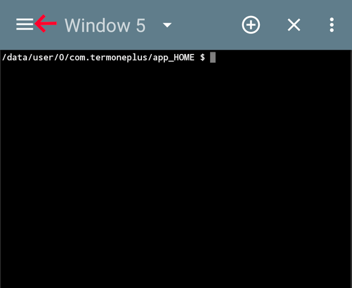

2. Go to the Preferences / Shell / Initial command.

   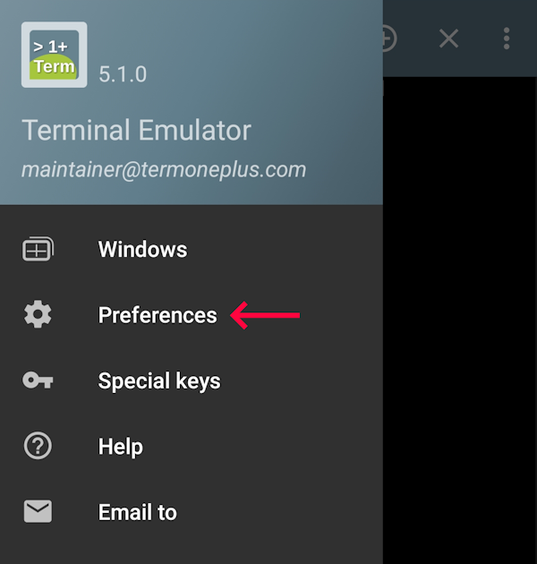

   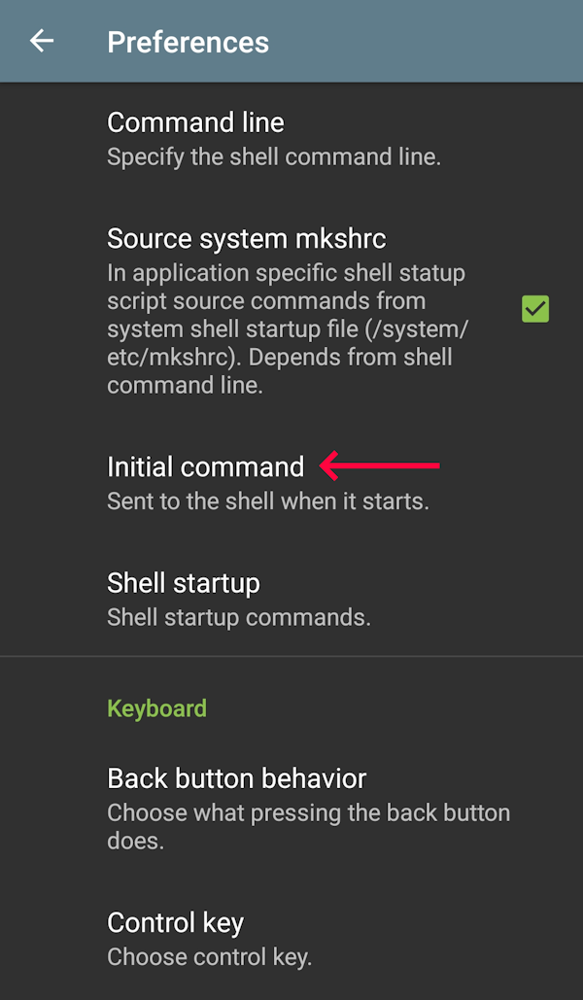

3. Change `cd ~` to `cd ~ && sh tunnel`.

   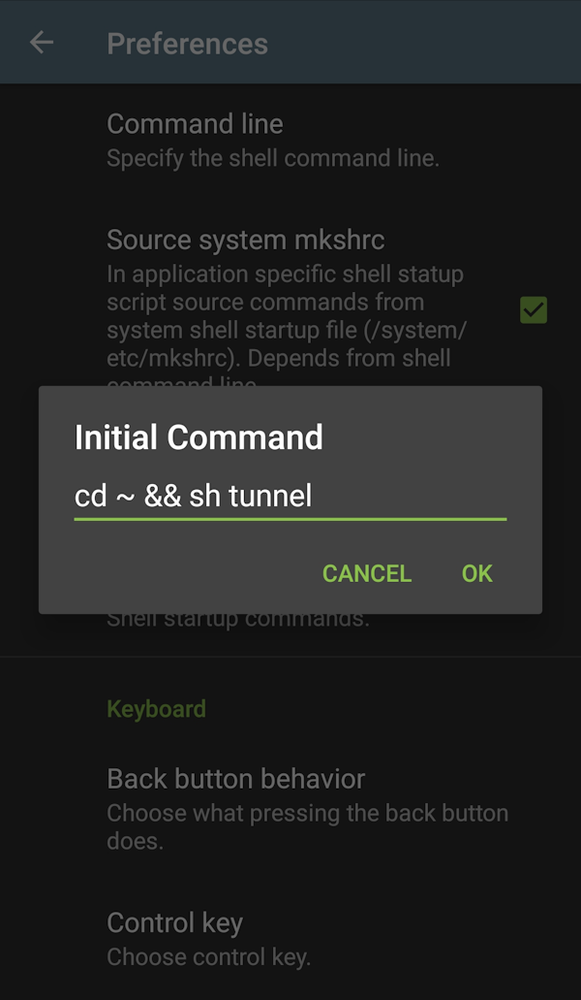

Now if you try to open the TermOne app, `wstunnel` should be started automatically.

Screenshot:

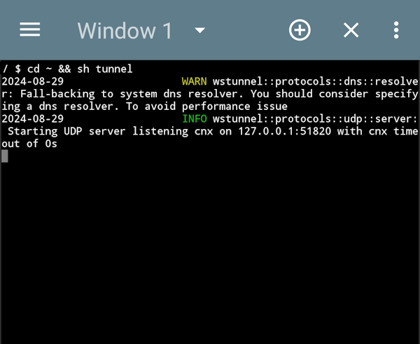

</details>

Now that `wstunnel` is fully working, it's time to change the settings in the WireGuard app on your device. You need to configure it to use the `wstunnel` client on your device as a WireGuard server instead of a remote WireGuard server directly.

1. Open WireGuard and choose your VPN profile:

   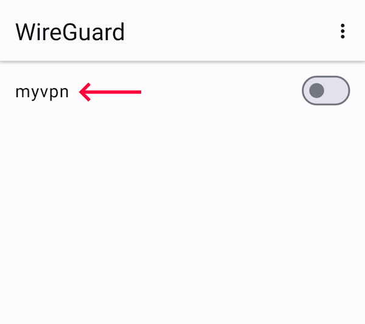

2. Tap the pencil to edit it:

   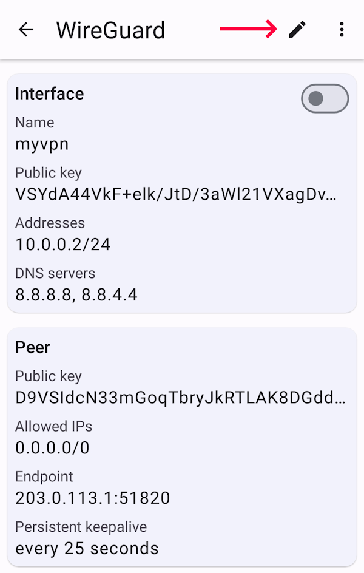

3. Scroll down to peer's _Endpoint_ and change it to `127.0.0.1:51820`, where `51820` is your WireGuard port. Don't close the WireGuard app.

   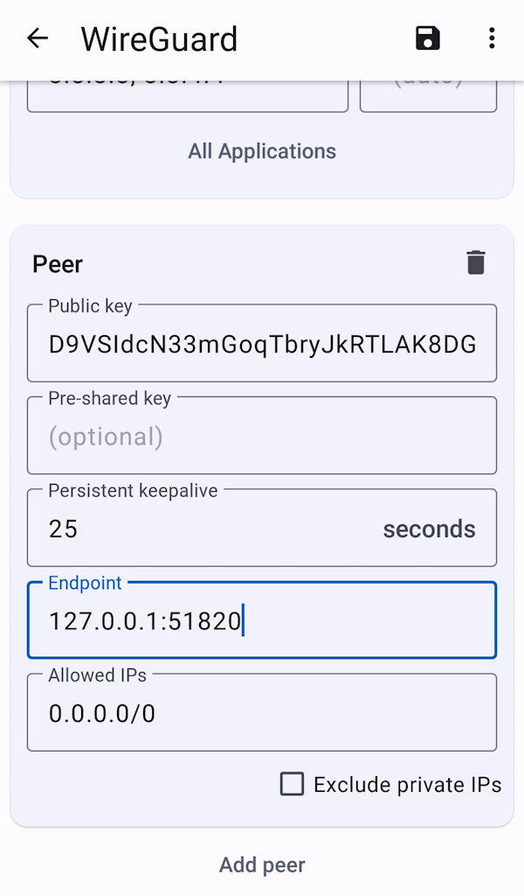

4. Open [`AllowedIPs` calculator](https://www.procustodibus.com/blog/2021/03/wireguard-allowedips-calculator/) in your browser. For _Allowed IPs_, enter `0.0.0.0/0`. For _Disallowed IPs_, enter the IP address of your server.

   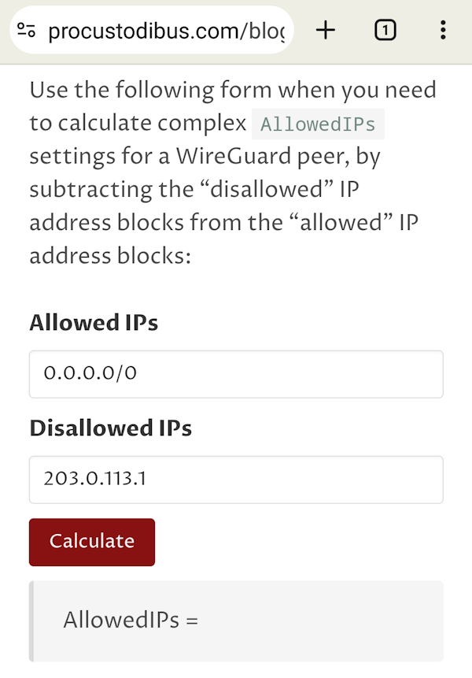

5. Click _Calculate_ and copy the resulting IPs without the `AllowedIPs =` part.

   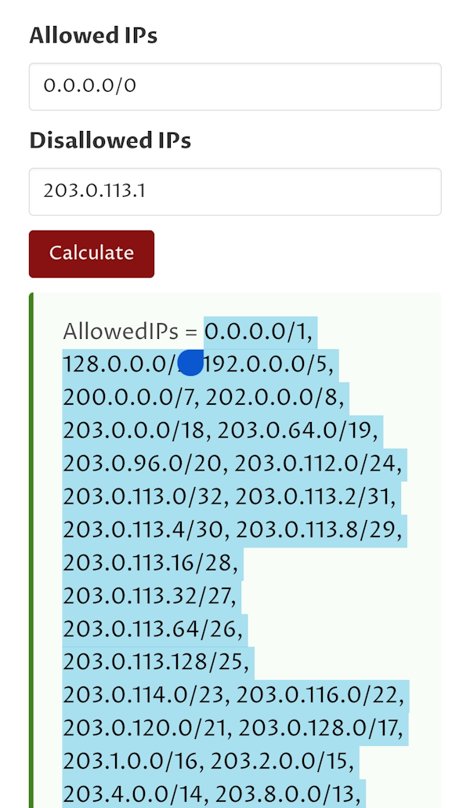

6. Go back to WireGuard and delete `0.0.0.0/0` from the _Allowed IPs_ field, paste the copied IP addresses, and tap save.

   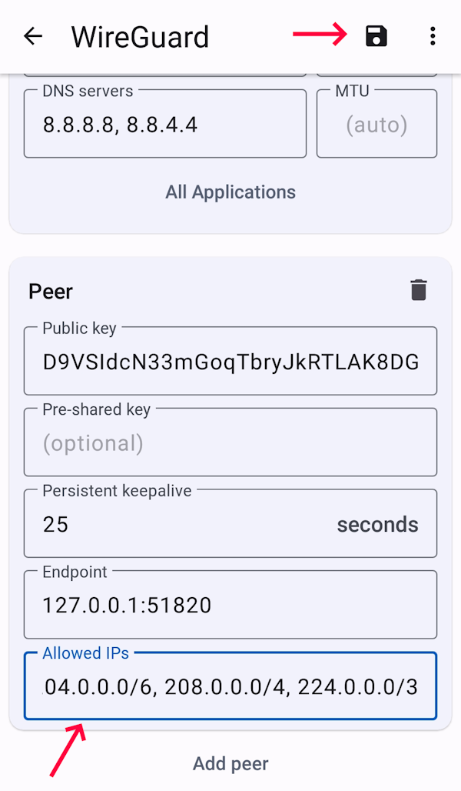

Enable your WireGuard VPN profile to test it. Go back to your terminal. The output should be similar to this:

* where `203.0.113.1` is the IP address of your server.

```
2024-08-29 INFO wstunnel::protocols::udp::server: New UDP connection from 127.0.0.1:59571
2024-08-29 INFO wstunnel::protocols::tcp::server: Opening TCP connection to 203.0.113.1:443
2024-08-29 INFO wstunnel::protocols::tls::server: Doing TLS handshake using SNI IpAddress(V4(Ipv4Addr([203, 0, 113, 1]))) with the server 203.0.113.1:443
2024-08-29 INFO tunnel{id="..." remote="localhost:51820"}: wstunnel::tunnel::transport::websocket: received frame Ping
2024-08-29 INFO tunnel{id="..." remote="localhost:51820"}: wstunnel::tunnel::transport::websocket: received frame Pong
```

Try to access the Internet, everything should work.

### Step 3.2 - Windows client

You need to download the [`wstunnel` binary](https://github.com/erebe/wstunnel/releases/latest) for Windows.

Execute the following commands in PowerShell to download it into the `~\wstunnel` directory. You may need to replace the link in the `curl` command with one for the newer version of `wstunnel`.

```powershell
mkdir ~\wstunnel
cd ~\wstunnel
curl.exe -fLo wstunnel.tar.gz https://github.com/erebe/wstunnel/releases/download/v10.1.9/wstunnel_10.1.9_windows_amd64.tar.gz
tar -xzf wstunnel.tar.gz wstunnel.exe
```

Execute `pwd` and copy the path, which needs to be added into the system PATH environment variable.

To add the `wstunnel` directory into the system PATH, perform the steps below:

1. Type _Environment_ into the Windows search bar and click _Edit the system environment variables_:

   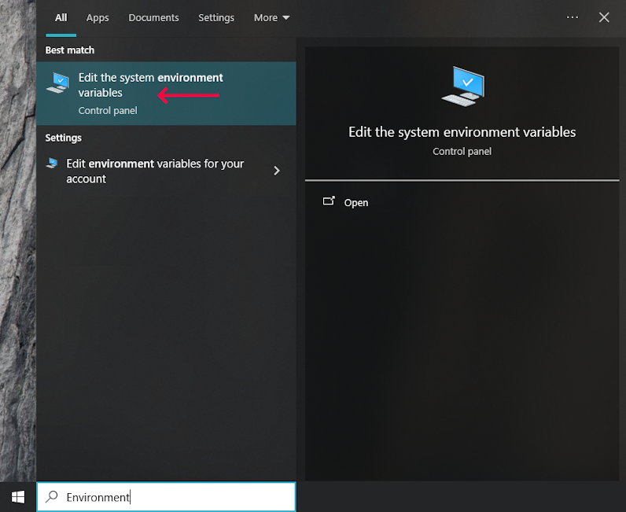

2. Click _Environment Variables_:

   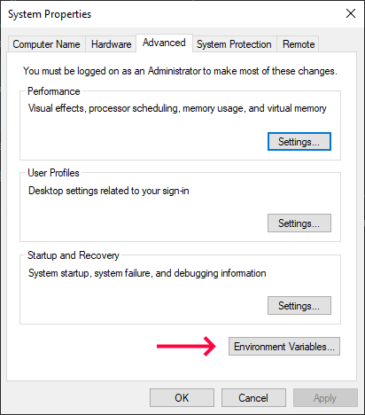

3. Edit _Path_ in the _System variables_ section:

   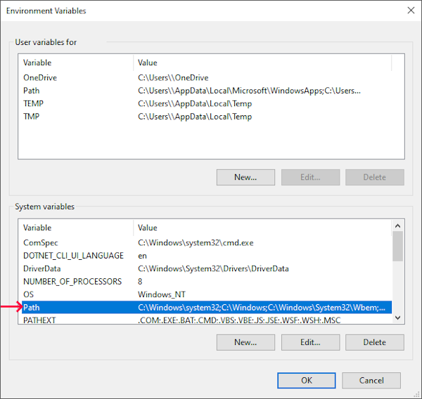

4. Click _New_, paste the copied path to the `wstunnel` directory and click _OK_.

   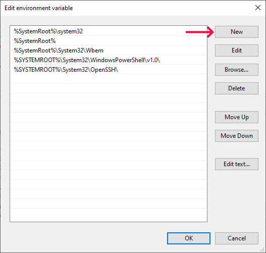

5. Open a new PowerShell window and test if that PATH environment variable updated properly:

   ```powershell
   wstunnel --version
   ```

You need to adjust a setting in the registry to enable script execution inside the WireGuard configuration.
Open PowerShell _as an Administrator_ and execute the following command:

```powershell
reg add HKLM\Software\WireGuard /v DangerousScriptExecution /t REG_DWORD /d 1 /f
```

Now, it's time to change your WireGuard configuration.

1. Open WireGuard and select the tunnel you want to edit, click _Edit_:

   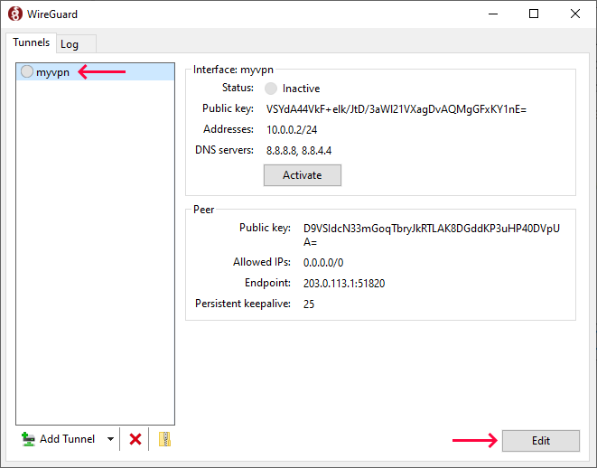

2. Change `Endpoint` IP address to `127.0.0.1`:

   * where `51820` is your WireGuard port.

   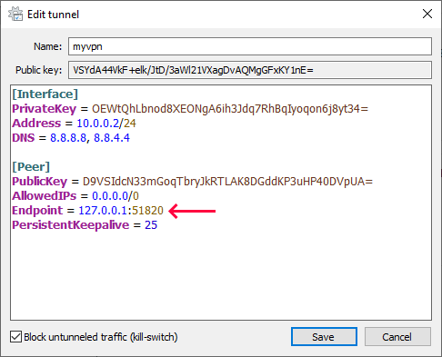

3. Add the `PreUp` and `PostDown` command to your `[Interface]` section: <a id="postcmd"></a>

   They are needed to start `wstunnel client` when the WireGuard VPN is activated and stop it when the VPN is deactivated.

   * change `203.0.113.1` to your server IP address.
   * change `192.168.1.1` to your router IP address.
   * Update the `wstunnel client` command as described in [step 3](#step-3---client-configuration).

   ```ini
   PreUp = route add 203.0.113.1 mask 255.255.255.255 192.168.1.1 && start "" wstunnel client --http-upgrade-path-prefix "<secret>" -L "udp://51820:localhost:51820?timeout_sec=0" wss://203.0.113.1:443
   PostDown = route delete 203.0.113.1 mask 255.255.255.255 192.168.1.1 && powershell -command "(Get-Process -Name wstunnel).Kill()"
   ```

4. Uncheck _Block untunneled traffic_ and click _Save_:

   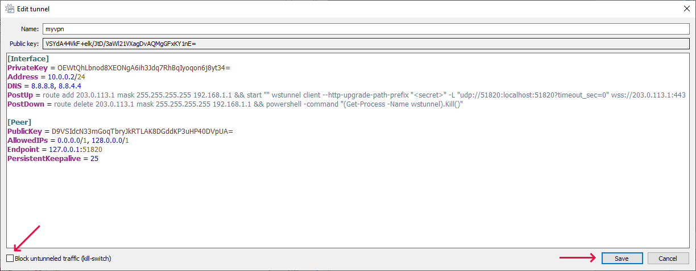

Activate your VPN and test your Internet connection, it should be working now.

### Step 3.3 - Linux client

You need to install `wstunnel` on your Linux client, how to do it is described in [step 1](#step-1---installing-wstunnel-on-server).

Now, you need to modify the WireGuard configuration of your client. If your interface name is `wg0`, the command to edit it will look like this:

```bash
sudo nano /etc/wireguard/wg0.conf
```

Change the `Endpoint` field in the `[Peer]` section. The peer here is the WireGuard server.

* Where `51820` is the listen port of your WireGuard server.

```ini
Endpoint = 127.0.0.1:51820
```

Add `PreUp` and `PostDown` commands to your `[Interface]` section. Adjust them as described [for the Windows client](#postcmd).

```bash
PreUp = ip route add 203.0.113.1/32 via 192.168.1.1
PreUp = wstunnel client --http-upgrade-path-prefix "<secret>" -L "udp://51820:localhost:51820?timeout_sec=0" wss://203.0.113.1:443 &> /dev/null &
PostDown = ip route del 203.0.113.1/32 via 192.168.1.1
PostDown = killall wstunnel
```

Apply your changes:

* where `wg0` is your interface name.

```bash
wg-quick down wg0
wg-quick up wg0
```

Test your Internet connection:

```bash
curl -4 https://ip.hetzner.com
```

Output should be `203.0.113.1`, i.e. the IP address of your server.

## Conclusion

Blocking of the WireGuard protocol can make your VPN unusable. Hopefully you managed to overcome this with the help of Wstunnel and WebSockets. There are other options to do the same thing, for example [udp2raw](https://github.com/wangyu-/udp2raw), but they require root on your Android device.

##### License: MIT

<!--

Contributor's Certificate of Origin

By making a contribution to this project, I certify that:

(a) The contribution was created in whole or in part by me and I have
    the right to submit it under the license indicated in the file; or

(b) The contribution is based upon previous work that, to the best of my
    knowledge, is covered under an appropriate license and I have the
    right under that license to submit that work with modifications,
    whether created in whole or in part by me, under the same license
    (unless I am permitted to submit under a different license), as
    indicated in the file; or

(c) The contribution was provided directly to me by some other person
    who certified (a), (b) or (c) and I have not modified it.

(d) I understand and agree that this project and the contribution are
    public and that a record of the contribution (including all personal
    information I submit with it, including my sign-off) is maintained
    indefinitely and may be redistributed consistent with this project
    or the license(s) involved.

Signed-off-by: wpdevelopment11 wpdevelopment11@gmail.com

-->
