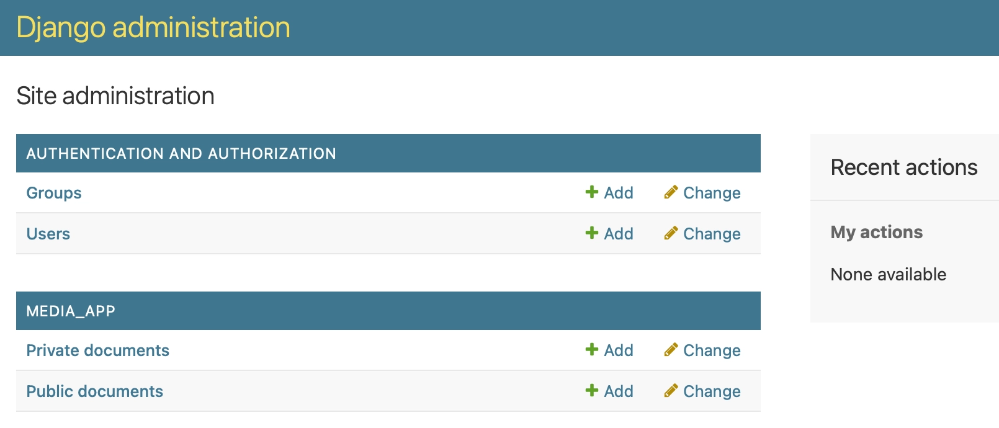
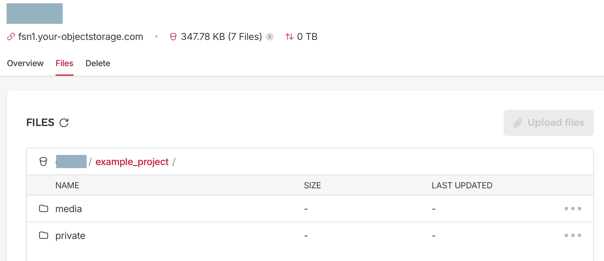

## Einführung

Hetzner Object Storage bietet S3-kompatiblen Objektspeicher. Die Vorteile gegenüber S3 sind:

- Keine Überraschungsrechnungen: Fester Preis für bis zu 1 TB Speicher und 1 TB Egress pro Monat.
- Günstiger zusätzlicher Speicher und Egress.

Obwohl Hetzner Object Storage S3-kompatibel ist, gibt es einige Unterschiede, die du kennen musst, um den Service mit Django und django-storages korrekt zu verwenden.

Dieses Tutorial zeigt, wie man Django und die django-storages-Bibliothek mit Hetzner Cloud Storage nutzt. Es behandelt folgende Themen:

- Einrichtung von Hetzner Cloud Storage
- Erstellen eines Django-Projekts und einer App
- Konfiguration der Django-Einstellungen
- Nutzung von Umgebungsvariablen für sensible Daten
- Implementierung von Storage-Backends in Django
- Erstellen von Django-Modellen mit File-Feldern, inklusive einer Methode zum Erzeugen von Pre-Signed URLs
- Erstellen einer Django-Admin-Oberfläche zum Testen von Datei-Uploads und -Downloads

Während dieses Tutorials erstellst du ein Beispielprojekt, das die Django-Admin-Oberfläche verwendet, um Dateien in Hetzner Object Storage hochzuladen. Du findest den Quellcode des Projekts im [Hetzner Community Content Repository](https://github.com/hetzneronline/community-content/tree/master/tutorials/object-storage-django-storages/example-project). 

So sieht die Admin-Oberfläche am Ende aus:



## Voraussetzungen

Du benötigst ein Hetzner Cloud Konto und einen Computer mit installiertem Python.

## Terminologie

### Storage Bucket

Ein Storage Bucket ist ein Container zum Speichern von Objekten in Hetzner Object Storage. Im Gegensatz zu S3 fügt Hetzner den Bucket-Namen nicht als Präfix zum Domainnamen hinzu. Alle Buckets in einer Region werden unter derselben Domain bereitgestellt. Das wichtiger Unterschied in Bezug auf die Sicherheit (CORS Header haben praktisch keinen Effekt, da sie alle Buckets in einer Region einschließen, auch von anderen Kunden). Außerdem muss es beim Konstruieren der URLs und Endpunkte beachtet werden.

### S3 Signature Version

Hetzner Object Storage ist nicht kompatibel mit der neuesten S3 Signature Version, die standardmäßig in der zugrundeliegenden boto3-Bibliothek verwendet wird. Das ist ein wesentlicher Unterschied zu S3 und muss bei der Nutzung von django-storages berücksichtigt werden.

### Vorgefertigte Access Control Lists (ACLs)

Hetzner Object Storage unterstützt die Standard-ACLs `private` und `public-read`. Dadurch können sowohl öffentliche als auch private Mediendateien bereitgestellt werden.

### boto3

boto3 ist die zugrundeliegende Bibliothek, die von django-storages verwendet wird, um mit S3-kompatiblen Diensten zu interagieren. Auch wenn du sie nicht direkt nutzen musst, ist sie nützlich für Fehlersuche und Debugging. Bei Problemen kannst du das boto3-Debug-Logging aktivieren, indem du folgenden Code in deine settings.py-Datei einfügst:

```python
import boto3
boto3.set_stream_logger(name='botocore')
```

Damit erscheinen detaillierte Logs in deiner Konsole – hilfreich zum Verstehen der Abläufe im Hintergrund. Bei Problemen lohnt sich auch ein Blick in die boto3-Dokumentation für S3, die wesentlich ausführlicher ist als die django-storages-Dokumentation.

## Schritt 1 – Erstellen eines Storage Buckets und S3-Zugangsdaten

### Schritt 1.1 – Erstellen eines Storage Bucket

Öffne in der [Hetzner Cloud Console](https://console.hetzner.cloud/) ein bestehendes Projekt oder erstelle ein neues.

Gehe im linken Menü deines Projekts auf den Tab `Object Storage` und erstelle einen neuen Storage Bucket mit folgenden Werten:

- `LOCATION`: Wähle einen Standort, z.B. "Falkenstein".
- `NAME/URL`: Wähle einen Namen/URL für deinen Bucket, z.B. `mybucket`. Achte darauf, dass der Name eindeutig im gesamten Hetzner Object Storage sein muss.
- `OBJECT LOCK`: Wähle `Disabled`.
- `VISIBILITY`: Wähle `Private`. Das ist wichtig für private Mediendateien.

Klicke auf `Create and Buy now`, um den Bucket zu erstellen.

Weitere Informationen findest du in der [Dokumentation zum Erstellen eines Buckets](https://docs.hetzner.com/storage/object-storage/getting-started/creating-a-bucket).

### Schritt 1.2 – Erstellen von S3-Zugangsdaten

Öffne im linken Menü deines Projekts den Tab `Security`, gehe dann auf `S3 credentials` und klicke auf `Generate credentials`.

Im Popup: Kopiere den `ACCESS KEY` und den `SECRET KEY` und speichere sie sicher ab. Du benötigst diese Werte später in deinem Django-Projekt.

Weitere Informationen findest du unter [S3-Schlüssel generieren](https://docs.hetzner.com/storage/object-storage/getting-started/generating-s3-keys).


## Schritt 2 – Erstellen eines Django-Projekts und einer App

Überprüfe auf deinem Computer, ob Python installiert ist, mit `python --version`. Ich empfehle Python `3.12`, aber das Tutorial sollte auch mit `3.10` oder neuer funktionieren. Falls deine Version älter ist als `3.10` oder Python nicht installiert ist, [lade es hier herunter und installiere es](https://www.python.org/downloads/).

Erstelle einen Ordner für dein Django-Projekt und initialisiere darin eine virtuelle Python-Umgebung. Du kannst dafür `virtualenv` oder `venv` verwenden.

Falls du `virtualenv` noch nicht installiert hast, kannst du es mit folgendem Befehl installieren:

```bash
pip install virtualenv
```

### Schritt 2.1 – Erstellen des Projektordners und der virtuellen Python Umgebung

Lege die Projektstruktur an:

```bash
mkdir example-project
cd example-project
python3 -m venv venv
```

Aktiviere die virtuelle Umgebung:

```bash
source venv/bin/activate
```

Unter Windows verwendest du stattdessen:

```bash
venv\Scripts\activate
```

### Schritt 2.2 – Installieren von Django und weiteren Paketen und Starten eines neuen Projekts

Installiere Django und die benötigten Pakete. Erstelle dazu eine `requirements.txt`-Datei mit folgendem Inhalt:

```ini
# requirements.txt
Django
django-environ
django-storages[boto3]
whitenoise[brotli]
```

Hinweise:

- [django-environ](https://django-environ.readthedocs.io/en/latest/) wird verwendet, um Konfigurationswerte aus der Umgebung zu laden – nach den Best Practices des [Twelve-Factor App](https://www.12factor.net)-Manifests.  
- Es unterstützt auch `.env`-Dateien für die lokale Entwicklung. Achte darauf, die `.env`-Datei in deine `.gitignore`-Datei aufzunehmen, damit sie nicht versehentlich ins Git-Repository gelangt.
- Das Beispielprojekt beinhaltet eine `.env.example` Datei, die die benötigten Variablen zeigt. Kopiere sie in eine `.env`-Datei und passe sie an deine Bedürfnisse an.
- [WhiteNoise](https://whitenoise.readthedocs.io/en/latest/) mit Brotli-Kompression wird verwendet, um statische Dateien in Produktionsumgebungen bereitzustellen. Brotli ist eine moderne Komprimierungsmethode, die bessere Ergebnisse als gzip liefert.

Installiere die Pakete und erstelle ein neues Django Projekt:

```bash
pip install -r requirements.txt
django-admin startproject example_project
```

### Schritt 2.3 – Erstellen einer Django App

Wechsle in das Projektverzeichnis und erstelle eine Django App:

```bash
cd example_project
python manage.py startapp media_app
```

Teste, ob alles funktioniert, indem du den Django Entwicklungsserver startest:

```bash
python manage.py runserver
```

Öffne deinen Browser und gehe auf `http://localhost:8000/`. Du solltest die Django-Willkommensseite sehen:


Beende den Server mit `CTRL+C`.


## Schritt 3 – Django-Einstellungen anpassen

### Schritt 3.1 – Importe und Umgebungsvariablen laden

Öffne die Datei `settings.py` in deinem Django-Projekt und füge ganz oben folgende Zeilen hinzu:

```python
# settings.py (am Anfang der Datei)
import os
from pathlib import Path
import environ

# Build paths inside the project like this: BASE_DIR / 'subdir'.
BASE_DIR = Path(__file__).resolve().parent.parent
PROJECT_NAME = os.path.basename(BASE_DIR)

env = environ.Env()
environ.Env.read_env(env_file=BASE_DIR.parent / '.env')
```

Hinweise:

- `environ` wird importiert und initialisiert, um die Umgebungsvariablen aus der `.env`-Datei zu laden.
- `PROJECT_NAME` wird auf den Namen des Projektordners gesetzt. Dieser wird verwendet, um Standardwerte zu erstellen.

### Schritt 3.2 – Object Storage Einstellungen hinzufügen

Jetzt füge die Object Storage Einstellungen **am Ende** der `settings.py` hinzu:

```python
# settings.py (am Ende der Datei)
# Standard-Storage-Backends, wenn Hetzner Object Storage nicht verwendet wird
# whitenoise wird genutzt, um statische Dateien in der Produktion auszuliefern
STORAGES = {
    "default": {
        "BACKEND": "django.core.files.storage.FileSystemStorage",
    },
    "staticfiles": {
        "BACKEND": "whitenoise.storage.CompressedStaticFilesStorage",
    },
}

LOCATION_PREFIX = ""
PUBLIC_MEDIA_LOCATION = f"{LOCATION_PREFIX}media"
PRIVATE_MEDIA_LOCATION = f"{LOCATION_PREFIX}private"

USE_S3_MEDIA = env.bool("USE_S3_MEDIA", default=False)

if USE_S3_MEDIA:
    AWS_ACCESS_KEY_ID = env("AWS_ACCESS_KEY_ID", default="")
    AWS_SECRET_ACCESS_KEY = env("AWS_SECRET_ACCESS_KEY")
    AWS_STORAGE_BUCKET_NAME = env("AWS_STORAGE_BUCKET_NAME", default=PROJECT_NAME)
    AWS_S3_ENDPOINT_URL = env(
        "AWS_S3_ENDPOINT_URL",
        default="https://fsn1.your-objectstorage.com"
    )
    AWS_DEFAULT_ACL = None  # Standardmäßig private Dateien
    LOCATION_PREFIX = env("LOCATION_PREFIX", default=f"{PROJECT_NAME}/")
    PUBLIC_MEDIA_LOCATION = f"{LOCATION_PREFIX}media"
    PRIVATE_MEDIA_LOCATION = f"{LOCATION_PREFIX}private"
    MEDIA_URL = f"{AWS_S3_ENDPOINT_URL}/{AWS_STORAGE_BUCKET_NAME}/{LOCATION_PREFIX}media/"
    STORAGES["default"] = {
        "BACKEND": "media_app.storage_backends.PublicMediaStorage"
    }
    PRESIGNED_URL_EXPIRATION = env.int("PRESIGNED_URL_EXPIRATION", default=600)
```

Hinweise:

- `LOCATION_PREFIX` wird verwendet, um Dateipfade im Bucket zu präfixen – praktisch, wenn du denselben Bucket für mehrere Projekte nutzen willst.
- `USE_S3_MEDIA` steuert, ob Hetzner Object Storage genutzt werden soll. Lokale Entwicklung kann den `FileSystemStorage` verwenden.
- `AWS_STORAGE_BUCKET_NAME` – Name deines Buckets (aus Schritt 1).
- `AWS_S3_ENDPOINT_URL` – URL des Endpunkts deines Object Storage aus Schritt 1 (z.B. für Falkenstein `https://fsn1.your-objectstorage.com`).
- `AWS_DEFAULT_ACL` ist `None`, damit Dateien standardmäßig privat sind (sicherer!).
- `MEDIA_URL` wird automatisch zusammengesetzt.
- `PRESIGNED_URL_EXPIRATION` definiert die Gültigkeitsdauer von Pre-Signed URLs (Standard: 600 Sekunden = 10 Minuten).

Tipp:

Wenn du denselben Namen für Bucket und Präfix belässt, kann es verwirrend wirken (z.B. `example_project/example_project/media/...`). Wenn du nur ein Projekt pro Bucket nutzt, kannst Du `LOCATION_PREFIX` leer lassen.

### Schritt 3.3 – Installed Apps und Middleware anpassen

Öffne wieder die `settings.py` und ergänze die `INSTALLED_APPS` und `MIDDLEWARE` wie folgt:

```python
# settings.py (in INSTALLED_APPS und MIDDLEWARE hinzufügen)
INSTALLED_APPS = [
    # ... (am ende der Liste hinzufügen)
    'whitenoise.runserver_nostatic',  # WhiteNoise für statische Dateien im Development
    'media_app',
]

MIDDLEWARE = [
    # Direkt nach der SecurityMiddleware:
    'whitenoise.middleware.WhiteNoiseMiddleware',
]
```

## Schritt 4 – Erstellen einer `.env`-Datei

Erstelle im Wurzelverzeichnis deines Django-Projekts eine Datei namens `.env`. Diese Datei enthält die sensiblen Konfigurationswerte für dein Projekt:

```ini
# .env
#DJANGO_SECRET_KEY=your_secret_key
USE_S3_MEDIA=True
AWS_ACCESS_KEY_ID=your_access_key
AWS_SECRET_ACCESS_KEY=your_secret_key
AWS_S3_ENDPOINT_URL=https://fsn1.your-objectstorage.com
AWS_STORAGE_BUCKET_NAME=your_bucket_name
#LOCATION_PREFIX=your_location_prefix (muss mit einem / enden)
AWS_REQUEST_CHECKSUM_CALCULATION="WHEN_REQUIRED"
AWS_RESPONSE_CHECKSUM_CALCULATION="WHEN_REQUIRED"
```

Hinweise:

- `DJANGO_SECRET_KEY` ist dein geheimer Schlüssel für das Django-Projekt. Ich habe ihn hier als Kommentar gelassen, da es eine gute Praxis ist, diesen Wert **nicht** direkt im Quellcode (`settings.py`) zu speichern.
- `USE_S3_MEDIA` wird auf `True` gesetzt, um Hetzner Object Storage zu verwenden.
- `AWS_ACCESS_KEY_ID` und `AWS_SECRET_ACCESS_KEY` sind die Zugangsdaten aus Schritt 1.
- `AWS_S3_ENDPOINT_URL` ist der Endpunkt deines Buckets (z.B. Falkenstein).
- `AWS_STORAGE_BUCKET_NAME` ist der Name deines Buckets.
- `LOCATION_PREFIX` ist optional und wird verwendet, wenn du mehrere Projekte in einem Bucket verwalten willst. (Muss mit `/` enden!)
- `AWS_REQUEST_CHECKSUM_CALCULATION` und `AWS_RESPONSE_CHECKSUM_CALCULATION` müssen auf `"WHEN_REQUIRED"` gesetzt sein.  
  Ansonsten gibt es Fehler beim Hochladen von Dateien zu Hetzner Object Storage.

Du kannst übrigens einen neuen `DJANGO_SECRET_KEY` generieren mit:

```bash
django-admin shell -c """
from django.core.management.utils import get_random_secret_key;
print(get_random_secret_key())
"""
```

**Wichtig:**  

Vergiss nicht, `.env` in deine `.gitignore` aufzunehmen, damit diese Datei nicht versehentlich in dein Repository gelangt.

## Schritt 5 – Implementieren der Storage-Backends

Erstelle nun Storage Backends für die app. Erstelle dazu die Datei `media_app/storage_backends.py` und füge folgenden Code ein:

```python
# media_app/storage_backends.py
from django.conf import settings
from django.core.files.storage import FileSystemStorage
from storages.backends.s3boto3 import S3Boto3Storage

settings.LOCATION_PREFIX

class BaseMediaStorage(S3Boto3Storage):
    signature_version = "s3"
    file_overwrite = False
    custom_domain = False


class PublicMediaStorage(BaseMediaStorage):
    location = settings.PUBLIC_MEDIA_LOCATION
    default_acl = "public-read"


class PrivateMediaStorage(S3Boto3Storage):
    location = settings.PRIVATE_MEDIA_LOCATION
    default_acl = "private"


def get_private_file_storage():
    if not settings.USE_S3_MEDIA:
        return FileSystemStorage()
    else:
        return PrivateMediaStorage()
```

Hinweise:

- **`BaseMediaStorage`** ist eine Basisklasse, die gemeinsame Einstellungen wie `signature_version = "s3"` enthält. (Sehr wichtig, da Hetzner **nicht** S3v4 unterstützt!)
- **`PublicMediaStorage`** ist für öffentliche Dateien gedacht (`default_acl = "public-read"`).
- **`PrivateMediaStorage`** ist für private Dateien gedacht (`default_acl = "private"`).
- **`get_private_file_storage`** ist eine Hilfsfunktion:  
  Sie entscheidet, ob lokale Speicherung (`FileSystemStorage`) oder Hetzner Object Storage (`PrivateMediaStorage`) verwendet wird – je nachdem, ob `USE_S3_MEDIA=True` gesetzt ist.

## Schritt 6 – Erstellen von Django-Modellen mit FileFields

Erstelle nun Django-Modelle, um Referenzen zu den Dateien in der Datenbank zu speichern. Öffne dazu die Datei `media_app/models.py` und füge folgenden Code ein:

```python
# media_app/models.py
import os
import uuid

from django.conf import settings
from django.db import models

from .storage_backends import get_private_file_storage, PrivateMediaStorage


def _get_random_filename(instance, filename):
    model_name = instance.__class__.__name__.lower()
    ext = filename.split('.')[-1]
    new_filename = f"{uuid.uuid4()}.{ext}"
    return os.path.join(model_name, new_filename)


class PublicDocument(models.Model):
    title = models.CharField(max_length=255)
    file = models.FileField(upload_to=_get_random_filename)


class PrivateDocument(models.Model):
    title = models.CharField(max_length=255)
    file = models.FileField(
        upload_to=_get_random_filename,
        storage=get_private_file_storage
    )

    def get_presigned_url(self):
        if settings.USE_S3_MEDIA:
            storage = PrivateMediaStorage()
            return storage.url(
                self.file.name, 
                expire=settings.PRESIGNED_URL_EXPIRATION
            )
        return None
```

**Was passiert hier?**

- `_get_random_filename(instance, filename)`:  
  - Diese Hilfsfunktion erstellt einen **zufälligen Dateinamen**. 
  - Damit verhinderst du Namenskollisionen und potenzielle Sicherheitsprobleme durch benutzerdefinierte Dateinamen.
- **PublicDocument**:
  - Ein einfaches Modell für **öffentliche Dateien**.
  - Nutzt implizit den **Default-Storage** (`PublicMediaStorage`, wenn `USE_S3_MEDIA=True` gesetzt ist).
- **PrivateDocument**:
  - Ein Modell für **private Dateien**.
  - Nutzt explizit `get_private_file_storage()`, um den korrekte Storage Backend zu verwenden.
- `get_presigned_url()`:
  - Erzeugt eine **Pre-Signed URL** für den privaten Download.
  - Gültig für die in `PRESIGNED_URL_EXPIRATION` definierte Zeit.

Damit Django die neuen Modelle in die Datenbank übernimmt, führe Folgendes aus, um die Migrationen zu erstellen und anzuwenden:

```bash
python manage.py makemigrations
python manage.py migrate
```

Wenn alles geklappt hat, siehst du keine Fehler in der Konsole.

## Schritt 7 – Erstellen einer Django-Admin-Oberfläche

Öffne die Datei `media_app/admin.py` und füge folgenden Code ein:

```python
# media_app/admin.py
from django.contrib import admin
from django.utils.html import format_html
from .models import PublicDocument, PrivateDocument


@admin.register(PublicDocument)
class PublicDocumentAdmin(admin.ModelAdmin):
    list_display = ('title', 'file_url')

    def file_url(self, obj):
        return format_html(
            '<a href="{}" target="_blank">Datei ansehen</a>',
            obj.file.url
        )
    file_url.short_description = 'Dateilink'


@admin.register(PrivateDocument)
class PrivateDocumentAdmin(admin.ModelAdmin):
    list_display = ('title', 'get_file_url')
    readonly_fields = ('get_file_url',)

    def get_file_url(self, obj):
        url = obj.get_presigned_url()
        return format_html(
            '<a href="{}" target="_blank">Datei herunterladen</a>',
            url
        )
    get_file_url.short_description = 'Download-Link'
```

**Was passiert hier?**

- **PublicDocumentAdmin**:
  - Fügt eine Spalte hinzu, die **einen Link zur Datei** anzeigt.
  - Beim Klicken wird die Datei im neuen Tab geöffnet.

- **PrivateDocumentAdmin**:
  - Zeigt ebenfalls einen Link zur Datei an.
  - Hier wird allerdings eine **Pre-Signed URL** erzeugt, die nur zeitlich begrenzt gültig ist.
  - Private Dateien sind nicht direkt zugänglich, sondern nur über Pre-Signed URLs.


## Schritt 8 – Testen der Implementierung

Jetzt kannst Du prüfen, ob alles wie geplant funktioniert!

### Schritt 8.1 – Superuser erstellen und Server starten

Erzeuge zuerst einen Superuser, damit du dich im Django-Admin anmelden kannst:

```bash
python manage.py createsuperuser
```

Folge den Anweisungen und gib Benutzername, E-Mail und Passwort ein.

Starte dann den Django-Entwicklungsserver:

```bash
python manage.py runserver
```

Öffne deinen Browser und gehe zu `http://localhost:8000/admin/`

Melde dich mit deinen Superuser-Zugangsdaten an.  
Du solltest jetzt die beiden Modelle sehen:

- **PublicDocument**
- **PrivateDocument**

### Schritt 8.2 – Öffentliche Dateien testen

- Klicke im Admin auf **PublicDocument** und erstelle ein neues Dokument.
- Lade eine Datei hoch und speichere sie.
- In der Listenansicht siehst du jetzt eine Spalte mit einem Link: **"Datei ansehen"**.
- Klicke auf den Link – die Datei öffnet sich in einem neuen Tab.  
- Kopiere die URL und öffne sie in einem privaten/incognito Browserfenster – die Datei sollte **öffentlich** erreichbar sein.
- Schau Dir die URL an – sie sollte den zufälligen Dateinamen direkt enthalten. Über diese URL ist die Datei immer abrufbar.


### Schritt 8.3 – Private Dateien testen

- Klicke auf **PrivateDocument** und erstelle ein neues Dokument.
- Lade wieder eine Datei hoch und speichere sie.
- In der Listenansicht siehst du einen **"Download-Link"**.
- Klicke auf den Link – die Datei wird geöffnet oder heruntergeladen.
- Kopiere die Pre-Signed URL.
- Öffne sie in einem privaten Browserfenster **innerhalb von 10 Minuten**. Die Datei sollte abrufbar sein.
- Warte länger als die eingestellte Ablaufzeit (`PRESIGNED_URL_EXPIRATION`, z.B. 600 Sekunden, bzw. 10 Minuten) und versuche es erneut. Jetzt solltest du eine Fehlermeldung sehen.

### Schritt 8.4 – Kontrolle im Hetzner Object Storage

- Logge dich in die [Hetzner Cloud Console](https://console.hetzner.cloud/) ein.
- Gehe zu deinem Object Storage Bucket.
- Du solltest die hochgeladenen Dateien dort sehen – aufgeteilt in die Ordner `media` und `private`.



## Fazit

In diesem Tutorial hast du gelernt:

- Wie du Hetzner Object Storage mit Django und `django-storages` kombinierst,
- Wie du sowohl **öffentliche** als auch **private** Dateien speicherst,
- Wie du **Pre-Signed URLs** für sichere Downloads nutzt.

Du hast jetzt eine solide Grundlage geschaffen – und dabei wichtige Dinge wie `signature_version`, ACLs, Environment-Handling und Sicherheit berücksichtigt.

### Checkliste

Zusammengefasst musst du sieben Punkte beachten, wenn du Hetzner Object Storage mit Django verwendest:

1. Verwende einen privaten Bucket, wenn du private Dateien speichern möchtest.
2. Nutze die korrekte S3-Signaturversion (`s3`).
3. Verwende die korrekte Endpunkt-URL und den richtigen Bucket-Pfad für Hetzner Object Storage.
4. Setze Access Control Lists (ACLs) gezielt ein, um den Zugriff auf Dateien zu steuern.
5. Verwende Pre-Signed URLs, um private Dateien sicher bereitzustellen.
6. Setze `AWS_REQUEST_CHECKSUM_CALCULATION` und `AWS_RESPONSE_CHECKSUM_CALCULATION` auf `"WHEN_REQUIRED"`, um Upload-Fehler bei Hetzner Object Storage zu vermeiden.
7. Optional: Verwende Location Prefixes, um einen Bucket für mehrere Projekte zu nutzen.

Wie du vielleicht bemerkt hast, behandelt dieses Tutorial **nicht** die Verwendung von Object Storage für **statische Medien-Dateien** (wie CSS, JS, Bilder). Der Grund dafür ist, dass Hetzner Object Storage alle Buckets einer Region über dieselbe Domain bedient. Dadurch sind sichere CORS-Einstellungen (Cross-Origin Resource Sharing) nicht möglich: Man müsste pauschal allen Buckets auf dieser Domain vertrauen – was ein Sicherheitsrisiko darstellt (z.B. XSS-Angriffe).

Daher der Rat:
- Für statische Dateien lieber ein CDN (Content Delivery Network) verwenden, **oder** wie in diesem Tutorial beschrieben
- `whitenoise` einsetzen, um statische Dateien direkt von deiner App auszuliefern.

### Weitere Ressourcen

- [Hetzner Object Storage Dokumentation](https://docs.hetzner.com/storage/object-storage/)
- [django-storages Dokumentation](https://django-storages.readthedocs.io/en/latest/)
- [boto3 Dokumentation für S3](https://boto3.amazonaws.com/v1/documentation/api/latest/reference/services/s3.html)

### Sicherheitshinweis

Dieses Tutorial bietet ein funktionierendes Grundgerüst, **aber** für einen produktiven Einsatz solltest du unbedingt noch weitere Sicherheitsmaßnahmen einbauen, etwa:

- Validierung von Dateinamen (nur erlaubte Zeichen zulassen),
- Einschränkung auf erlaubte Dateitypen (z.B. nur Bilder, PDFs),
- Begrenzung der maximalen Dateigröße.

Außerdem solltest du sicherstellen, dass nur berechtigte Benutzer Zugriff auf Pre-Signed URLs erhalten. In diesem Beispiel geschieht das implizit, weil nur Admins Zugriff über die Django-Admin-Oberfläche haben.


##### License: MIT

<!--

Contributor's Certificate of Origin

By making a contribution to this project, I certify that:

(a) The contribution was created in whole or in part by me and I have
    the right to submit it under the license indicated in the file; or

(b) The contribution is based upon previous work that, to the best of my
    knowledge, is covered under an appropriate license and I have the
    right under that license to submit that work with modifications,
    whether created in whole or in part by me, under the same license
    (unless I am permitted to submit under a different license), as
    indicated in the file; or

(c) The contribution was provided directly to me by some other person
    who certified (a), (b) or (c) and I have not modified it.

(d) I understand and agree that this project and the contribution are
    public and that a record of the contribution (including all personal
    information I submit with it, including my sign-off) is maintained
    indefinitely and may be redistributed consistent with this project
    or the license(s) involved.

Signed-off-by: Mitja Martini <hi@mitjamartini.com>

-->
