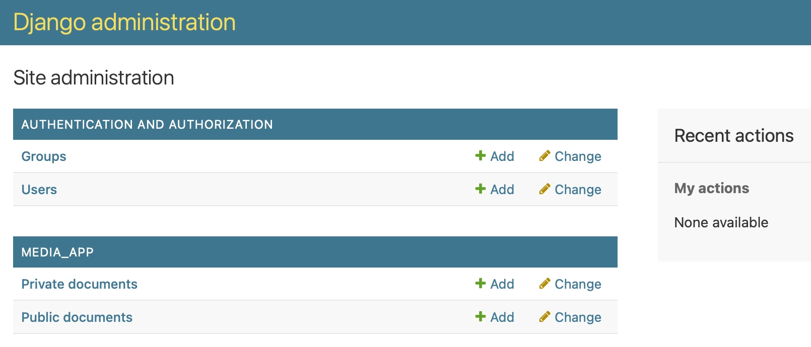
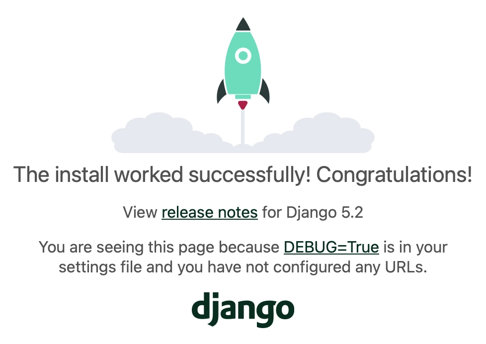
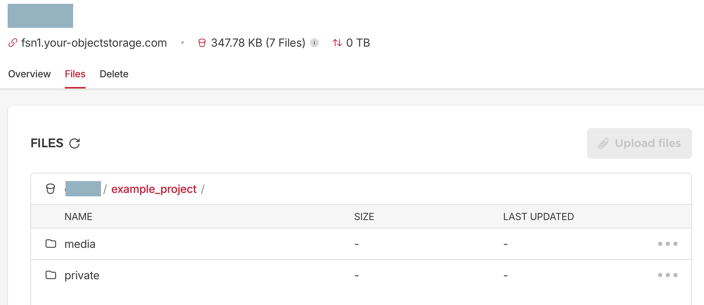

## Introduction

Hetzner Object Storage provides S3-compatible object storage. It's benefits compared to S3 are:

- No surprise bills: Fixed price up to 1 TB storage and 1 TB egress per month.
- Inexpensive additional storage and egress.

Although Hetzner Object Storage is S3-compatible, there are some differences you need to be aware of to make it work with Django and django-storages. 

This tutorial shows how to use Django and the `django-storages` library with Hetzner Cloud Storage. It covers the following topics:

- Setup Hetzner Cloud Storage
- Create a Django project and app
- Configure Django settings
- Use environment variables for sensitive data
- Implement storage backends in django
- Create Django models with file fields, including a method to generate pre-signed URLs
- Create a Django admin interface to test the file up- and downloads

During this tutorial, you'll create an example Django project that uses the Django admin interface to upload files to Hetzner Object Storage. [Hetzner Community Content Repository](https://github.com/hetzneronline/community-content/tree/master/tutorials/object-storage-django-storages/example-project). 

This is how the admin interface looks like, when you are done:



## Prerequisites

You need to have a Hetzner Cloud account and a computer with Python installed.

## Terminology

### Storage Bucket

A storage bucket is a container for storing objects in Hetzner Object Storage. In contrast to S3, Hetzner Object Storage does not add the bucket name as a prefix to the domain name. All buckets in a region are served on the same domain. This is important to know for security and for constructing the URLs and endpoints.

### S3 signature version

Hetzner Object Storage is not compatible with the latest S3 signature version, which is the default in the underlying boto library. This is a major difference to S3 and needs to be taken care of when using Hetzner Object Storage with django-storages.

### Pre-built Access Control Lists (ACLs)

Hetzner Object Storage supports the standard `private` and `public-read` pre-built Access Control Lists (ACLs). This makes it possible to serve both public and private media files.

### boto3

`boto3` is the underlying library used by django-storages to interact with S3-compatible storage services. Even if you don't need to interact with it directly, you can use it for troubleshooting. If you see errors, you can activate boto3 debug logging by placing the following code in your `settings.py` file:

```python
import boto3
boto3.set_stream_logger(name='botocore')
```

Now you should see detailed logs in your console. This is useful for debugging and understanding what is happening behind the scenes. If you have issues, it's also a good idea to check the [boto3 documentation for S3](https://boto3.amazonaws.com/v1/documentation/api/latest/reference/services/s3.html) as it's much more detailed than the django-storages documentation.

Let's get started!

## Step 1 - Create a Storage Bucket and S3 Credentials

On the [Hetzner Cloud Console](https://console.hetzner.cloud/), open an existing project or create a new project.

### Step 1.1 - Create a Storage Bucket

Open the `Object Storage` tab in the left menu of your project, and create a new storage bucket using the following values:

- `LOCATION`: Choose a location, eg. "Falkenstein".
- `NAME/URL`: Choose a name/url for your bucket, like `mybucket`. Choose your own bucket name, as it must be unique across Hetzner Object Storage.
- `OBJECT LOCK`: Select `Disabled`.
- `VISIBILITY`: Select `Private`. This is important for serving private media.

Hit `Create and Buy now` to create the bucket. 

See [Creating a Bucket](https://docs.hetzner.com/storage/object-storage/getting-started/creating-a-bucket) documentation for more information on how to create an Object Storage bucket.

### Step 1.2 - Generate S3 Credentials

Open the `Security` tab in the left menu of your project, then open the `S3 credentials` tab, and click `Generate credentials`.

On the popup: Copy the `ACCESS KEY` and the `SECRET KEY` and store it in a safe place. You will need these values later in your Django project.

See [Generating S3 keys](https://docs.hetzner.com/storage/object-storage/getting-started/generating-s3-keys) for more information on how to generate S3 credentials.

## Step 2 - Create a Django Project and App

On your computer, check if you have Python installed with `python --version`. I recommend Python `3.12` at this point, but the tutorial should work with Python `3.10` or later. 

If your version is older than `3.10`, or if you don't have Python installed, please [download and install Python](https://www.python.org/downloads/), first.

### Step 2.1 - Create Project Directory and Python Virtual Environment

Create a folder for your Django project, and initialize a virtual Python environment in this directory. You can use `virtualenv` or `venv` for this.

If you don't have `virtualenv` installed, you can install it with ```pip install virtualenv```.

```bash
mkdir example-project
cd example-project
python3 -m venv venv
```

Activate the virtual environment:

```bash
source venv/bin/activate
```

If you are using Windows, use `venv\Scripts\activate` instead.

### Step 2.2 - Install Django, and required packages, and Create a New Django Project

Install Django and the required packages. Create a `requirements.txt` file with the following content:

```ini
# requirements.txt
Django
django-environ
django-storages[boto3]
whitenoise[brotli]
```

[django-environ](https://django-environ.readthedocs.io/en/latest/) is used to load configuration values from the environment following best practices from [The Twelve-Factor App](https://www.12factor.net) manifesto. This also supports using a `.env` file to store configuration variables and credentials. Make sure to add the `.env` file to your `.gitignore` file, so that it won't be pushed to your git repository. 

The example code provides a `.env.example` file to show the required variables. Copy it to `.env` and fill in the values. In production environments, the platform (eg. Docker, Kubernetes) can inject the environment variables.

[WhiteNoise](https://whitenoise.readthedocs.io/en/latest/) with Brotli compression is used to serve static files in production.

Now, install the packages and create a new Django project:

```bash
pip install -r requirements.txt
django-admin startproject example_project
```

### Step 2.3 - Create a Django App

Change into the Django project directory and start a Django app:

```bash
cd example_project
python manage.py startapp media_app
```

Test if that works by running the Django development server:

```bash
python manage.py runserver
```

Open your browser and go to `http://localhost:8000/`. You should see the Django welcome page:




## Step 3 - Change Django Settings

### Step 3.1 - Configure Imports and Load Environment Variables

Open the `settings.py` file in your Django project and add the following imports at the top of the file:

```python
# settings.py (top of the file)
import os
from pathlib import Path
import environ

# Build paths inside the project like this: BASE_DIR / 'subdir'.
BASE_DIR = Path(__file__).resolve().parent.parent
PROJECT_NAME = os.path.basename(BASE_DIR)

env = environ.Env()
environ.Env.read_env(env_file=BASE_DIR.parent / '.env')
```

Notes:

-  `environ` is imported and initialized to load the environment variables from the `.env` file.
- The `PROJECT_NAME` is set to the name of the project folder. This is used to construct default values.

### Step 3.2 - Configure Object Storage Settings

Now, add the Object Storage settings at the bottom of the `settings.py` file:

```python
# settings.py (bottom of the file)
# default storage backends when not using Hetzner Object Storage
# whitenoise is used to serve static files in production
STORAGES = {
    "default": {
        "BACKEND": "django.core.files.storage.FileSystemStorage",
    },
    "staticfiles": {
        "BACKEND": "whitenoise.storage.CompressedStaticFilesStorage",
    },
}

LOCATION_PREFIX = ""
PUBLIC_MEDIA_LOCATION = f"{LOCATION_PREFIX}media"
PRIVATE_MEDIA_LOCATION = f"{LOCATION_PREFIX}private"

USE_S3_MEDIA = env.bool("USE_S3_MEDIA", default=False)

if USE_S3_MEDIA:
    AWS_ACCESS_KEY_ID = env("AWS_ACCESS_KEY_ID", default="")
    AWS_SECRET_ACCESS_KEY = env("AWS_SECRET_ACCESS_KEY")
    AWS_STORAGE_BUCKET_NAME = env("AWS_STORAGE_BUCKET_NAME", default=PROJECT_NAME)
    AWS_S3_ENDPOINT_URL = env(
        "AWS_S3_ENDPOINT_URL", 
        default="https://fsn1.your-objectstorage.com"
    )
    AWS_DEFAULT_ACL = None # private by default
    # prefix for this project's files on the bucket, "" to disable
    LOCATION_PREFIX = env("LOCATION_PREFIX", default=f"{PROJECT_NAME}/")
    PUBLIC_MEDIA_LOCATION = f"{LOCATION_PREFIX}media"
    PRIVATE_MEDIA_LOCATION = f"{LOCATION_PREFIX}private"
    MEDIA_URL = f"{AWS_S3_ENDPOINT_URL}/{AWS_STORAGE_BUCKET_NAME}/{LOCATION_PREFIX}media/"
    STORAGES["default"] = {
        "BACKEND": "media_app.storage_backends.PublicMediaStorage"
    }
    PRESIGNED_URL_EXPIRATION = env.int("PRESIGNED_URL_EXPIRATION", default=600)
```

Notes:

- `LOCATION_PREFIX` is used to prefix the files in the bucket. This is useful if you want to use the same bucket for multiple projects. You can set it to an empty string to disable it.
- `USE_S3_MEDIA` is a boolean value that determines if the project should use Hetzner Object Storage or not. This is useful for local development, where you may not want to use Hetzner Object Storage.
- `AWS_STORAGE_BUCKET_NAME` is the name of the bucket you created in step 1. You can set it to the name of your bucket, or leave it empty to use the project name as the bucket name.
- `AWS_S3_ENDPOINT_URL` is the endpoint URL for Hetzner Object Storage. You can find it in the Hetzner Cloud Console. The default value is `https://fsn1.your-objectstorage.com`, but you can change it to the endpoint URL of your bucket.
- `AWS_DEFAULT_ACL` is set to `None` to use the default ACL for private files. This is important for security reasons.
- `MEDIA_URL` is the URL for accessing the media files. This is constructed using the endpoint URL and the bucket name.
- `STORAGES["default"]` is set to use the `PublicMediaStorage` backend if `USE_S3_MEDIA` is `True`, otherwise, it's using the `FileSystemStorage`. This is the default storage backend for Django, and it will be used for all file fields that don't specify a storage backend.
- `PRESIGNED_URL_EXPIRATION` is the expiration time for the pre-signed URLs. This is set to 600 seconds (10 minutes) by default, but you can change it to your needs.
- `PUBLIC_MEDIA_LOCATION` and `PRIVATE_MEDIA_LOCATION` are the locations for the public and private files. These are used to construct the URLs for the files.
- `MEDIA_URL` is the URL for accessing the media files. This is constructed using the endpoint URL and the bucket name.

When you leave the bucket name and the location prefix at their default values, the project will use the project name both as the bucket name and the location prefix. This might be a bit confusing, as you see the same name repeated. Thus, if you share a bucket across projects, you might want to set the bucket name to a different name, and if you use a bucket exclusively for a single project, you might want to set the `LOCATION_PREFIX` to an empty string. 

As Hetzner Object Storage buckets have a fixed base cost per month, you can save some money if you share the bucket across projects.

### Step 3.3 - Add Installed Apps and Middleware

Finally, add the required apps and middleware to the `settings.py` file:

```python
# settings.py (add to the existing INSTALLED_APPS and MIDDLEWARE)
INSTALLED_APPS = [
    #...
    'whitenoise.runserver_nostatic',  # whitenoise runserver
    'media_app',
]
MIDDLEWARE = [
    # after the security middleware
    'whitenoise.middleware.WhiteNoiseMiddleware',  # whitenoise middleware
]
```

## Step 4 - Create a `.env` file

Create a `.env` file in the root directory of your Django project. This file will contain the sensitive configuration values for your project. 

```ini
# .env
#DJANGO_SECRET_KEY=your_secret_key
USE_S3_MEDIA=True
AWS_ACCESS_KEY_ID=your_access_key
AWS_SECRET_ACCESS_KEY=your_secret_key
AWS_S3_ENDPOINT_URL=https://fsn1.your-objectstorage.com
AWS_STORAGE_BUCKET_NAME=your_bucket_name
#LOCATION_PREFIX=your_location_prefix (must end with a /)
AWS_REQUEST_CHECKSUM_CALCULATION="WHEN_REQUIRED"
AWS_RESPONSE_CHECKSUM_CALCULATION="WHEN_REQUIRED"
```

Notes:

- `DJANGO_SECRET_KEY` is the secret key for your Django project. I left it here, as it's basically required for security reasons to not store this value in source code (`settings.py`) and commit it to git.
- `USE_S3_MEDIA` is set to `True` to use Hetzner Object Storage. You can set it to `False` to use the default storage backend (FileSystemStorage) for local development.
- `AWS_ACCESS_KEY_ID` and `AWS_SECRET_ACCESS_KEY` are the access key and secret key you generated in step 1.
- `AWS_S3_ENDPOINT_URL` is the endpoint URL for Hetzner Object Storage. You can find it in the Hetzner Cloud Console. The default value is `https://fsn1.your-objectstorage.com` for the Falkenstein data center, but you can change it to the endpoint URL of your bucket.
- `AWS_STORAGE_BUCKET_NAME` is the name of the bucket you created in step 1. You can set it to the name of your bucket, or leave it empty to use the project name as the bucket name.
- `LOCATION_PREFIX` is the prefix for the files in the bucket. This is useful if you want to use the same bucket for multiple projects. You can set it to an empty string to disable it. Note that it must end with `/`.
- `AWS_REQUEST_CHECKSUM_CALCULATION` and `AWS_RESPONSE_CHECKSUM_CALCULATION` are set to `WHEN_REQUIRED` as this is needed for Hetzner Object Storage. This is important for security reasons. If you set it to `ALWAYS`, you will get an error when uploading files to Hetzner Object Storage.

By the way: You can generate a new secret key using the `django-admin` command: 

```bash
django-admin shell -c """
from django.core.management.utils import get_random_secret_key; 
print(get_random_secret_key())
"""
```

## Step 5 - Implement Storage Backends

Now, implement Django file storage backends for public, and private media files. This is how the `media_app/storage_backends.py` file should look like:

```python
#media_app/storage_backends.py
from django.conf import settings
from django.core.files.storage import FileSystemStorage
from storages.backends.s3boto3 import S3Boto3Storage

settings.LOCATION_PREFIX

class BaseMediaStorage(S3Boto3Storage):
    signature_version = "s3"
    file_overwrite = False
    custom_domain = False


class PublicMediaStorage(BaseMediaStorage):
    location = settings.PUBLIC_MEDIA_LOCATION
    default_acl = "public-read"


class PrivateMediaStorage(S3Boto3Storage):
    location = settings.PRIVATE_MEDIA_LOCATION
    default_acl = "private"


def get_private_file_storage():
    if not settings.USE_S3_MEDIA:
        return FileSystemStorage()
    else:
        return PrivateMediaStorage()
```

Notes:

- The implementation can be based on `S3BotoStorage` from the `django-storages` package.
- Common settings are defined in a base class.
- The `signature_version` to `s3` to make it work with Hetzner Object Storage. The default is `s3v4`, which is not compatible with Hetzner Object Storage.
- The `default_acl` must be set to `private` for the private storage backend and `public-read` for the public storage backend.
- A helper function returns a storage backend dependent on the `USE_S3_MEDIA` setting. This way, you can develop locally without using the Cloud Storage.


## Step 6 - Create Django Models with File Fields

Now, open the `media_app/models.py` file, and implement Django models to hold references to the public and private files.

```python
#media_app/models.py
import os
import uuid

from django.conf import settings
from django.core.exceptions import ValidationError
from django.db import models

from .storage_backends import get_private_file_storage, PrivateMediaStorage


def _get_random_filename(instance, filename):
    model_name = instance.__class__.__name__.lower()
    ext = filename.split('.')[-1]
    new_filename = f"{uuid.uuid4()}.{ext}"
    return os.path.join(model_name, new_filename)


class PublicDocument(models.Model):
    title = models.CharField(max_length=255)
    file = models.FileField(upload_to=_get_random_filename)


class PrivateDocument(models.Model):
    title = models.CharField(max_length=255)
    file = models.FileField(
        upload_to=_get_random_filename,
        storage=get_private_file_storage
    )

    def get_presigned_url(self):
        if settings.USE_S3_MEDIA:
            storage = PrivateMediaStorage()
            return storage.url(
                self.file.name, 
                expire=settings.PRESIGNED_URL_EXPIRATION
            )
        return None
```

Notes:

- The `_get_random_filename` function generates a random filename for the uploaded file. This is useful to avoid filename collisions, and prevents using potentially insecure user provided filenames.
- The `PublicDocument` model is used to store public files. It implicitely uses the default storage backend, which is set to `PublicMediaStorage` in the settings, if `USE_S3_MEDIA` is `True`.
- The `PrivateDocument` model is used to store private files. It uses the `get_private_file_storage` function to get the storage backend for private files. 
- `get_presigned_url` generates a pre-signed URL for the file. This URL allows the user to download the file from Object Storage for a limited amount of time.

Create migrations and migrate the database to create the tables needed for the models:

```bash
python manage.py makemigrations
python manage.py migrate
```

If everything works as expected, you should see no errors in the console.


## Step 7 - Create a Django Admin Interface

Open the `media_app/admin.py` file and implement a django admin class for the `PublicDocument` and `PrivateDocument` models:

```python
#media_app/admin.py
from django.contrib import admin
from django.utils.html import format_html
from .models import PublicDocument, PrivateDocument


@admin.register(PublicDocument)
class PublicDocumentAdmin(admin.ModelAdmin):
    list_display = ('title', 'file_url')
    
    def file_url(self, obj):
        return format_html(
            '<a href="{}" target="_blank">View File</a>', 
            obj.file.url
        )
    file_url.short_description = 'File Link'


@admin.register(PrivateDocument)
class PrivateDocumentAdmin(admin.ModelAdmin):
    list_display = ('title', 'get_file_url')
    readonly_fields = ('get_file_url',)
    
    def get_file_url(self, obj):
        url = obj.get_presigned_url()
        return format_html(
            '<a href="{}" target="_blank"> Download File</a>',
            url
        )
    get_file_url.short_description = 'Download Link'

    def get_fields(self, request, obj=None):
        fields = list(super().get_fields(request, obj))
        # Only show the URL when editing an existing object
        if obj:
            fields.append('get_file_url')
        return fields
```

Notes:

- The `PublicDocumentAdmin` just adds a computed field to display a link to the file in the list view.
- The `PrivateDocumentAdmin` adds a computed field to display a link to the file in the list view.
- The `get_file_url` method generates a pre-signed URL for the private file.
- The `get_fields` method is overridden to show the `get_file_url` field only when editing an existing object. This way, the link is not shown when creating a new object as this would not work yet.

## Step 8 - Test the Implementation

To test the implementation, create a superuser, run the Django development server again, and open the Django admin interface to test the file uploads and downloads:

```bash
python manage.py createsuperuser
python manage.py runserver
```

Open your browser and go to `http://localhost:8000/admin/`. Log in with the superuser credentials you just created. You should see the Django admin interface with the `PublicDocument` and `PrivateDocument` models listed.

### Step 8.1 - Testing Public Files

Create a new `PublicDocument` object. Upload a file and save the object. You should see a link to the file in the list view. Click on the link to open the file in a new tab. The file should be publicly accessible.

Copy the URL and open it in a new private browser window. You should still be able to access the file without logging in.

### Step 8.2 - Testing Private Files

Create a new `PrivateDocument` object. Upload a file and save the object. You should see a link to the file in the list view. Click on the link to open the file in a new tab. The file should be accessible.

Copy the URL, wait 15 minutes, and open it in a new private browser window. You should see an error message saying that the file is not accessible. This is because the file is private and requires authentication to access it.

### Step 8.3 - Check Hetzner Object Storage Contents

Open the Object Storage bucket in the Hetzner Cloud Console. You should see the files uploaded to the `media` and `private` folders.



## Conclusion

In this tutorial, you've learned 

- how to use Hetzner Object Storage with Django Storages to serve public and private media files, and
- how to use pre-signed URLs to securely serve private files.

### Checklist

In summary, you need to get the following seven aspects right when using Hetzner Object Storage with Django:

1. Use a private bucket if you want to store private files.
2. Use the correct S3 signature version (`s3`).
3. Use the correct endpoint URL and bucket path for Hetzner Object Storage.
4. Use ACLs to control access to the files.
5. Use pre-signed URLs to securely serve private files.
6. Set the `AWS_REQUEST_CHECKSUM_CALCULATION` and `AWS_RESPONSE_CHECKSUM_CALCULATION` to `WHEN_REQUIRED` to avoid errors when uploading files to Hetzner Object Storage.
7. Optionally, use location prefixes to share a bucket across multiple projects.

As you may have noticed, the tutorial does not cover the use of Object Storage for static media files. This is because Hetzner Object Storage serves files for all buckets in a region on the same domain. This renders CORS security settings unusable. You need to allow the whole domain with all buckets even if you cannot trust the files coming from this domain. This means your site may become vulnerable to cross site scripting attacks. You can serve static media using a CDN or use `whitenoise` to serve static files in production from your app itself. 

### Further Reading

For more information, please refer to the following resources: 

- [Hetzner Object Storage documentation](https://docs.hetzner.com/storage/object-storage/)
- [django-storages documentation](https://django-storages.readthedocs.io/en/latest/)
- [boto3 documentation for S3](https://boto3.amazonaws.com/v1/documentation/api/latest/reference/services/s3.html)

### Security Notice

Please note that this is just an example implementation. You may need to adapt it to your specific use case, and you should add **security measures** to your implementation, such as:

- file name validation
- limit valid file types
- limit maximum file size

Also, make sure to check permissions on views that return pre-signed URLs. In this example, this is implicitly done by using the Django admin interface.

##### License: MIT

<!--

Contributor's Certificate of Origin

By making a contribution to this project, I certify that:

(a) The contribution was created in whole or in part by me and I have
    the right to submit it under the license indicated in the file; or

(b) The contribution is based upon previous work that, to the best of my
    knowledge, is covered under an appropriate license and I have the
    right under that license to submit that work with modifications,
    whether created in whole or in part by me, under the same license
    (unless I am permitted to submit under a different license), as
    indicated in the file; or

(c) The contribution was provided directly to me by some other person
    who certified (a), (b) or (c) and I have not modified it.

(d) I understand and agree that this project and the contribution are
    public and that a record of the contribution (including all personal
    information I submit with it, including my sign-off) is maintained
    indefinitely and may be redistributed consistent with this project
    or the license(s) involved.

Signed-off-by: Mitja Martini <hi@mitjamartini.com>

-->
