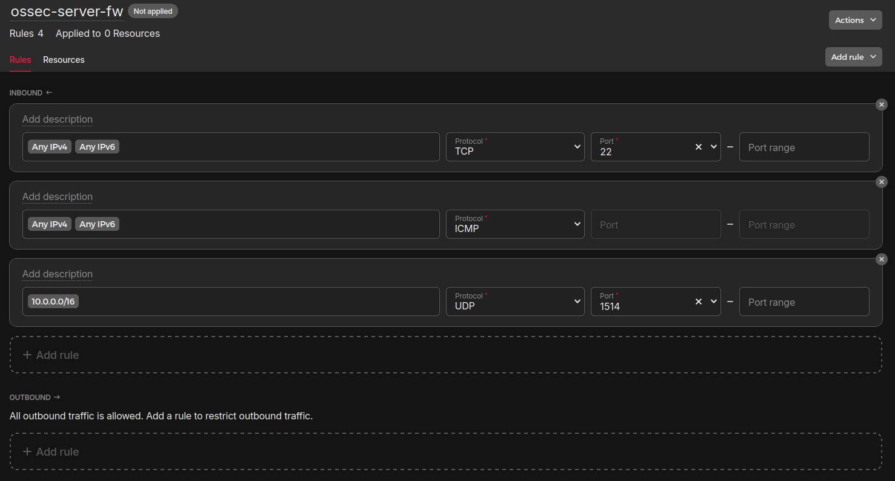

## Introduction

This tutorial will provide you with instructions on how to setup the host intrusion detection system "[OSSEC](https://www.ossec.net/)" on Ubuntu. It will scan your servers for vulnerabilities and suspicious activities using techniques like file integrity checks and log file analyzation.

OSSEC uses an agent-server architecture where the agent runs on the to-be-secured server and reports its scans to a central server. This tutorial will show you how the communication between agent and server can be encapsulated within a private network connection.

For more in-depth details to OSSECs architecture and possible different approaches, refer to the ["OSSEC Architecture" documentation](https://www.ossec.net/docs/docs/manual/ossec-architecture.html).

**Prerequisites**

* 2 `x86` servers with Ubuntu 24.04 as operating system in the same network zone
* A private network 
* A firewall

**Example terminology**

* Server name to install "OSSEC server" on: `<ossec-server>`
  * Public IP: `<203.0.113.1>`
  * Private IP: `<10.0.0.3>`
* Server name to install "OSSEC agent" on: `<ossec-agent>`
  * Public IP: `<203.0.113.2>`
  * Private IP: `<10.0.0.2>`
* Private network:
  * Name: `<ossec-net>`
  * IP range: `<10.0.0.0/16>`
* Firewall name: `<ossec-server-fw>`
* OSSEC agent settings
  * Agent name: `<agent1>`
  * Agent ID: `<001>`
  * Agent key: `<abcde...>`

Please replace the IPs with the ones from your setup. You can name all resources to your liking; this tutorial will stick to the names above for simplicity.

## Step 1 - Setup the basic infrastructure

### Step 1.1 - Setup the private network

Add the `<ossec-server>` and `<ossec-agent>` servers to the `<ossec-net>` private network. The tutorial will assume the following private IPs got assigned:

* `<10.0.0.2>` for `<ossec-agent>`
* `<10.0.0.3>` for `<ossec-server>` 


### Step 1.2 - Setup the firewall

Add the following inbound rules to the firewall `<ossec-server-fw>`:

| Incoming traffic                     | Protocol | Port |
| ------------------------------------ | -------- | ---- |
| <kbd>0.0.0.0/0</kbd> <kbd>::/0</kbd> | TCP      | 22   |
| <kbd>0.0.0.0/0</kbd> <kbd>::/0</kbd> | ICMP     |      |
| <kbd>10.0.0.0/16</kbd>               | UDP      | 1514 |

The final rule will allow for incoming traffic from the private network `<ossec-net>` on port `1514`. The OSSEC agent will attempt to connect to the OSSEC server via this connection.



## Step 2 - Install the OSSEC server

Open a remote shell to `<ossec-server>` using its public IP `<203.0.113.1>` with the following command:

```bash
$ ssh root@<203.0.113.1>
```

Update the apt package lists of the server with:

```bash
$ apt update
```

Make sure the required packages for OSSEC server are installed:

```bash
$ apt install build-essential make zlib1g-dev libpcre2-dev libevent-dev libssl-dev libz-dev libsqlite3-dev -y
```

Using the installer script [provided by OSSEC](https://www.ossec.net/download-ossec/), add the OSSEC apt repository to your server:

```bash
$ wget -q -O - https://updates.atomicorp.com/installers/atomic | bash
```

During this process, you will be asked to confirm the OSSEC license. Read it carefully and accept it by typing `yes` and hitting enter.

Update the apt package lists once more:

```bash
$ apt update
```

Install OSSEC server using the apt repository just added:

```bash
$ apt install ossec-hids-server -y
```

## Step 3 - Configure the OSSEC server

In order for the OSSEC server to accept incoming data from the agent, the IP addresses used by the agents need to be whitelisted in the servers configuration file.

Using `nano` or any other command-line-based file editor, open the OSSEC servers configuration file:

```bash
$ nano /var/ossec/etc/ossec.conf
```

Navigate to the email settings:

```xml
  <global>
    <email_notification>yes</email_notification>
    ...
  </global>
```

and change the `yes` to a `no`. Using email notifications required setting up a SMTP server which this tutorial will not do.

Continue by navigating to the following section:

```xml
  <remote>
    <connection>secure</connection>
  </remote>
```

and change it to the following:

```xml
  <remote>
    <connection>secure</connection>
    <allowed-ips>10.0.0.0/16</allowed-ips>
  </remote>
```

Make sure to replace `<10.0.0.0/16>` with the IP range of your `<ossec-net>` network. This will let the OSSEC server accept incoming connections from agents from those IPs.

## Step 4 - Adding an OSSEC agent to the server

Each OSSEC agent reporting to the server needs to be registered with the OSSEC server first.

Using the remote shell on `<ossec-server>`, run the `manage_agents` binary installed with the OSSEC server:

```bash
$ /var/ossec/bin/manage_agents
```

An interactive guide will now be started looking like this:

```plaintext
****************************************
* OSSEC HIDS v3.7.0 Agent manager.     *
* The following options are available: *
****************************************
   (A)dd an agent (A).
   (E)xtract key for an agent (E).
   (L)ist already added agents (L).
   (R)emove an agent (R).
   (Q)uit.
Choose your action: A,E,L,R or Q:
```

### Step 4.1 - Adding the agent

Press `A` and enter in order to add a new agent. Follow the guide step by step:

1. Provide a name for the agent, the tutorial will assume the name is set to `<agent1>`.
2. Provide the IP address of the agent (`<10.0.0.2>`), this needs to be the IP address the agent will connect to the OSSEC server from. 
3. Provide an ID for the agent. The tutorial assumes the default ID `<001>` is set.
4. Confirm adding the agent with the provided values by entering `y` and hitting enter.

The interactive guide will show the start page again, do not close it yet. 

### Step 4.2 - Extracting the agent key

The OSSEC agent will need a key to authenticate against the OSSEC server. This key needs to be exported from the OSSEC server.

Choose the "extract key for an agent" option by pressing `E` and hitting enter. Follow the guide step by step:

1. Enter the agents ID `<001>`.
2. The agent key will be printed to your terminal right after the `Agent key information for '001' is:` line: 
    ```plaintext
    Available agents: 
    ID: <001>, Name: <agent1>, IP: <10.0.0.2>
    Provide the ID of the agent to extract the key (or '\q' to quit): <001>

    Agent key information for '<001>' is: 
    <abcde...>

    ** Press ENTER to return to the main menu.

    ```
3. Store this key for later use. The tutorial will assume the key to be `<abcde...>` from now on.
4. Hit enter to get to the start page of the interactive guide.
5. Enter `Q` to close the interactive guide.

## Step 5 - Start the OSSEC server

Start the OSSEC server now with the following command:

```bash
$ /var/ossec/bin/ossec-control restart
```

Verify that all the server components are running:

```bash
$ /var/ossec/bin/ossec-control status
ossec-monitord is running...
ossec-logcollector is running...
ossec-remoted is running...
ossec-syscheckd is running...
ossec-analysisd is running...
ossec-execd is running...
```

### Step 5.1 Verify the intrusion detection is working

OSSEC server will produce alerts in case it detects suspicious activities. Those alerts are written to `/var/ossec/logs/alerts/alerts.log`.

As the server is scanning itself as well, depending on your setup, you might already encounter some alerts:

```bash
$ tail -f /var/ossec/logs/alerts/alerts.log
```

Keep this command running in your terminal and open a separate terminal window. In this new window, attempt to login to your OSSEC server with wrong credentials:

```bash
$ ssh test@<203.0.113.1>
```

When prompted for a password, just enter some gibberish.

Switch to the terminal running the `tail` command. You should see an alert popping up looking something like this:

```plaintext
** Alert 1724484444.4973: - syslog,sshd,invalid_login,authentication_failed,
2024 Aug 24 07:27:24 ossec-server->/var/log/auth.log
Rule: 5710 (level 5) -> 'Attempt to login using a non-existent user'
Src IP: XX.XX.XX.XX
2024-08-24T07:27:23.282997+00:00 ossec-server sshd[4938]: Failed none for invalid user test from XX.XX.XX.XX port 59850 ssh2
```

You have setup the OSSEC server successfully and confirmed the intrusion detection to be working! You can close all terminals/remote shells now.

## Step 6 - Install the OSSEC agent

Open a remote shell to `<ossec-agent>` using its public IP `<203.0.113.2>` with the following command:

```bash
$ ssh root@<203.0.113.2>
```

Update the apt package lists of the server with:

```bash
$ apt update
```

Make sure the required packages for OSSEC agent are installed:

```bash
$ apt install build-essential make zlib1g-dev libpcre2-dev libevent-dev libssl-dev libz-dev libsqlite3-dev -y
```

Using the installer script [provided by OSSEC](https://www.ossec.net/download-ossec/), add the OSSEC apt repository to your server:

```bash
$ wget -q -O - https://updates.atomicorp.com/installers/atomic | bash
```

During this process you will be asked to confirm the OSSEC license. Read it carefully and accept it by typing `yes` and hitting enter.

Update the apt package lists once more:

```bash
$ apt update
```

Install OSSEC agent using the apt repository just added:

```bash
$ apt install ossec-hids-agent -y
```

## Step 7 - Configure the OSSEC agent

The OSSEC agent has to be configured with the agent key we extracted previously and needs to know the OSSEC servers address. 

Using `nano` or any other command-line-based file editor, open the OSSEC agents configuration file:

```bash
$ nano /var/ossec/etc/ossec.conf
```

Navigate to the following section:

```xml
  <client>
    <server-ip>192.168.10.100</server-ip>
  </client>
```

and change it to the following:

```xml
  <client>
    <server-ip><10.0.0.3></server-ip>
  </client>
```

This IP is where the agent sends its reports to. Using the OSSEC servers private IP from the `<ossec-net>` network, the agent will send the reports via this private network, adding an additional layer of security encapsulating the traffic into a private network.

In order to set the agents key, start the `manage_agents` binary via the OSSEC agents remote shell:

```bash
$ /var/ossec/bin/manage_agents
```

An interactive guide, similar to the OSSEC servers one, will start, looking like the following:

```bash
****************************************
* OSSEC HIDS v3.7.0 Agent manager.     *
* The following options are available: *
****************************************
   (I)mport key from the server (I).
   (Q)uit.
```

Press `I` and hit enter to import the agents key, follow the guide step by step:

1. When prompted for the key, enter the key `<abcde...>`.
2. Confirm adding the key by pressing `y` and enter.
3. As stated, press enter once more to get back to the main menu of the interactive guide.
4. Enter `Q` to quit the interactive guide.

## Step 8 - Start the OSSEC agent

Start the agent with the following command:

```bash
$ /var/ossec/bin/ossec-control restart
```

Verify all agent components are running:

```bash
$ /var/ossec/bin/ossec-control status
ossec-logcollector is running...
ossec-syscheckd is running...
ossec-agentd is running...
ossec-execd is running...
```

### Step 8.1 - Verify the agent reports to the server

Close your remote shell to the OSSEC agent. Open a remote shell to the OSSEC server:

```bash
$ ssh root@<203.0.113.1>
```

Run the following command to print the OSSEC servers alerts to your terminal:

```bash
$ tail -f /var/ossec/logs/alerts/alerts.log
```

Open a second terminal window and attempt to login to the OSSEC agent via SSH with invalid credentials:

```bash
$ ssh test@<203.0.113.2>
```

When prompted for a password, just enter some gibberish.

Observe the `tail` command on your other terminal window. You should see an alert popping up looking something like this:

```plaintext
** Alert 1724502744.159256: - syslog,sshd,invalid_login,authentication_failed,
2024 Aug 24 12:32:24 (agent1) 10.0.0.2->/var/log/auth.log
Rule: 5710 (level 5) -> 'Attempt to login using a non-existent user'
Src IP: XX.XX.XX.XX
2024-08-24T12:32:23.220660+00:00 ossec-agent sshd[6334]: Failed password for invalid user test from XX.XX.XX.XX port 40070 ssh2
```

This looks very similar to the alert received in step 5.1, when testing if the OSSEC server works properly. Note, though, how this alert is shown `(<agent1>) <10.0.0.2>->/var/log/auth.log`, indicating the alert originates from `<agent1>` with IP `<10.0.0.2>` and its `auth.log` file that got scanned.

## Conclusion

You are now running 2 servers. The OSSEC server scans itself and listens on `<10.0.0.3>:1514` for reports from agents. The OSSEC agent will scan itself and send the reports to the OSSEC server via the private network `<ossec-net>`.

The firewall `<ossec-server-fw>` blocks any incoming connections to your OSSEC server, except for `ssh` (for the remote shell) and `ICMP` (for pinging) traffic as well as reports coming in via the private network `<10.0.0.0/16>` on port `1514`.

The OSSEC agent usually is the server where your workload/software is running on. The agent will continuously monitor the server and report any suspicious activities to the OSSEC server.

Consult the [OSSEC documentation](https://www.ossec.net/docs/) for further steps like setting up alerting options or configuring file and process monitoring.

##### License: MIT

<!--

Contributor's Certificate of Origin

By making a contribution to this project, I certify that:

(a) The contribution was created in whole or in part by me and I have
    the right to submit it under the license indicated in the file; or

(b) The contribution is based upon previous work that, to the best of my
    knowledge, is covered under an appropriate license and I have the
    right under that license to submit that work with modifications,
    whether created in whole or in part by me, under the same license
    (unless I am permitted to submit under a different license), as
    indicated in the file; or

(c) The contribution was provided directly to me by some other person
    who certified (a), (b) or (c) and I have not modified it.

(d) I understand and agree that this project and the contribution are
    public and that a record of the contribution (including all personal
    information I submit with it, including my sign-off) is maintained
    indefinitely and may be redistributed consistent with this project
    or the license(s) involved.

Signed-off-by: cubicroot github@cubicroot.xyz

-->
