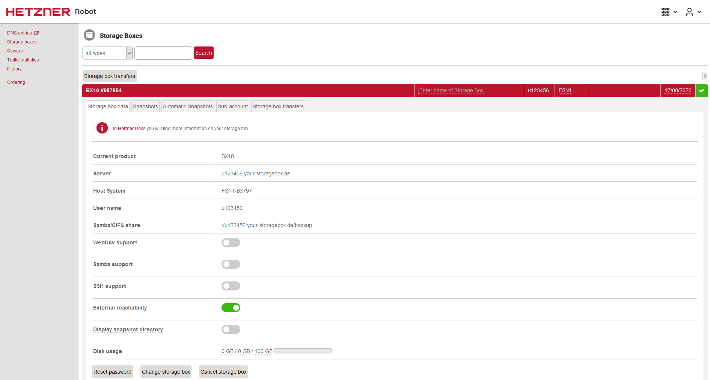
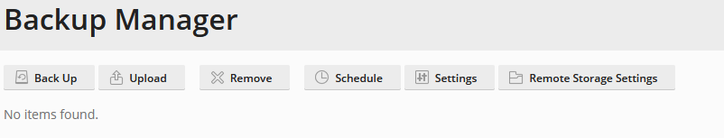
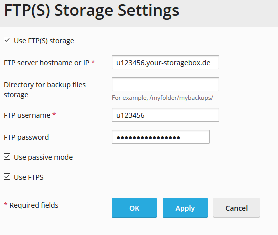
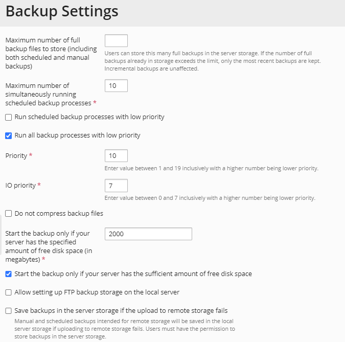
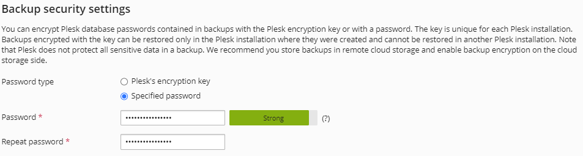
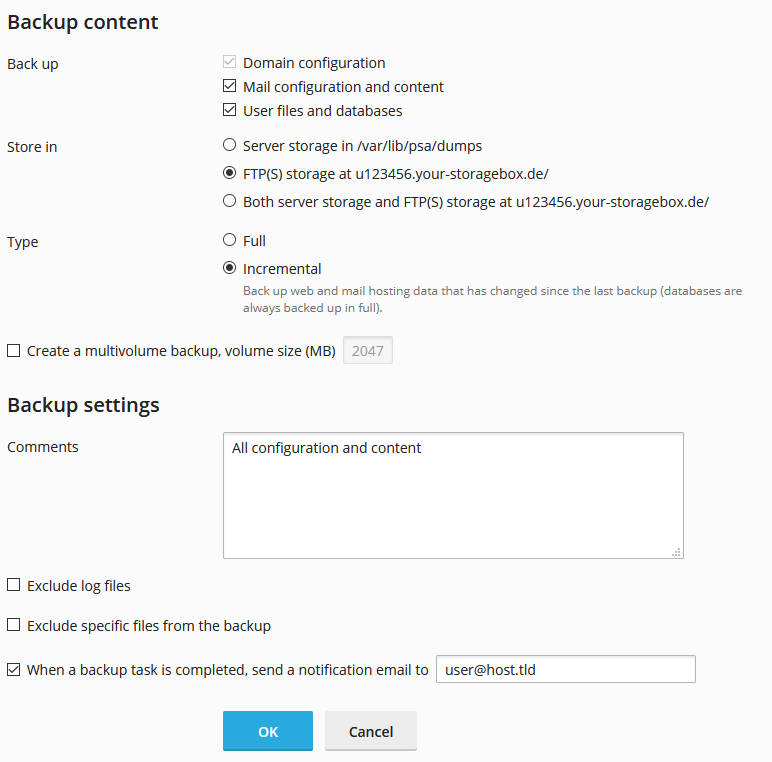
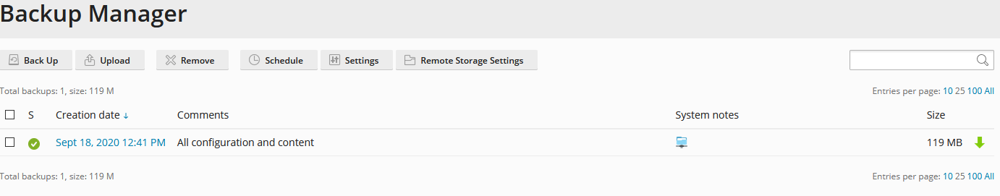

## Introduction

When it comes to storing data, the question is never if something bad will happen, but when. This is why backups should always be at the top of the priorities list. In addition to the backup itself, it's always recommended to have different versions of your backup, so that you are able to restore a version from some days or weeks ago.

In this tutorial I will clarify how to set up backups in Plesk using the storage box of Hetzner.

## Step 1 - Order Storage Box

Via the [Hetzner website](https://www.hetzner.com/storage/storage-box) you can directly order a storage box fitting your needs.

As you can change your storage box at any time, I'd recommend to start with the smallest package.

For the location of your storage box, I´d say there are two different approaches. Either you say "I want the backup to be close to my source data, so that the backup itself and possible restores are quick, too" or you prefer to choose a different location from that of your server, so you "do not put all your eggs in the same basket".

After your order, you´ll receive a confirmation of your order and some minutes later you´ll receive a message that your order is completed.

Now you have to login to the [Robot administrator interface](https://robot.your-server.de) and click on the menu item "Storage boxes". After clicking on the new Storage Box, you will see the access details and you can set an initial password.

A Quick Start Guide for storage boxes with helpful information can be found in the [Hetzner Docs](https://docs.hetzner.com/robot/storage-box)

## Step 2 - Setup the Backup in Plesk

After you have ordered your Storage Box and created an account, it is time to set up the backups in Plesk. After you logged in to Plesk, go to "Tools & Settings", "Tools & Resources" and choose the "Backup Manager". The Backup Manager itself normally stores all backups locally on your server. In order to have it saved in the Hetzner Storage Box, it needs to be configured to do so.

Click on "Remote Storage Settings" within the Backup Manager. Now click on "FTP(S)" and enter your credentials.

I´d recommend checking both "passive mode" and "FTPS".

Confirm with OK. If all data is correct, you should see a confirmation. I recommend you also set a password protection for this backup in the next step.

After you have done so, go back to the Backup Manager and click on "Settings". Please take some time to check and adjust it to your needs.

How many backups should be the maximum to store? How many simultaneous backup processes should run? Should the backup files be compressed? How much free space should be on the server before Plesk even starts the backup? You should at least have a look at those options and change them to best fit your needs!

It is essential that you change the Backup security settings.

By default, Plesk database passwords are encrypted with a unique server identifier. If you stick to that, you are only able to restore the data with the passwords on the source server only. By specifying a password, you are able to restore the backup with the specified passwords on any Plesk server.

After you changed the settings to your needs, the next step is to set up a backup.

## Step 3 - Create Backup

In the Backup Manager screen, click on "Back Up". Here you can change the backup content, the storage destination and the type.

When it comes to Type, the Plesk Backup Manager has two options: Full and Incremental.
If you want to perform the backup only once, this setting is not important.
However, if you would like to set up a backup that you can run whenever you want to, I'd recommend to use Incremental. In that case, the full backup only runs the first time. Any other times, only the changes are backed up. You can exclude log files or any specific files, as well.

As backups should not be a one time task, I´d recommend you to schedule regular backups. Therefore, click on "Schedule" in the Backup Manager. You´ll see almost the same settings as in the previous setup from Step 3. In addition, you can choose the interval and time for the backup. If you select incremental backup, you can also change the interval for the full backups.

In order for outdated backups to be deleted after some time, you can define a maximum number of full backup files to store.

After clicking on OK, your backups are scheduled.

## Step 4 - Restore a Backup

You can restore a backup in your Backup Manager, too. As soon as you have created a Backup, you´ll see it in the corresponding list.

You can now either download it (by clicking on the green arrow on the right) or - if you click on the date of the given backup - restore it. Either complete or just a specific subscription.
Please keep in mind that even if you are using incremental backups, you should choose the latest backup date, if you want to restore data from it. No need to restore the last full backup first.

In addition, I highly recommend to test the full backup on a new server (e.g. another cloud server). By doing so, you will already know the steps you have to do in case you need it, as well as test the viability of the resulted backup file.

## Conclusion

You have now configured a complete external backup of your Plesk data including your website, database and mailboxes. Make sure that you test the backup and restores from time to time, so that you know a) your backup is healthy and b) you know how to restore it.

##### License: MIT

<!--

Contributor's Certificate of Origin

By making a contribution to this project, I certify that:

(a) The contribution was created in whole or in part by me and I have
    the right to submit it under the license indicated in the file; or

(b) The contribution is based upon previous work that, to the best of my
    knowledge, is covered under an appropriate license and I have the
    right under that license to submit that work with modifications,
    whether created in whole or in part by me, under the same license
    (unless I am permitted to submit under a different license), as
    indicated in the file; or

(c) The contribution was provided directly to me by some other person
    who certified (a), (b) or (c) and I have not modified it.

(d) I understand and agree that this project and the contribution are
    public and that a record of the contribution (including all personal
    information I submit with it, including my sign-off) is maintained
    indefinitely and may be redistributed consistent with this project
    or the license(s) involved.

Signed-off-by: Christian Hillenkötter

-->
