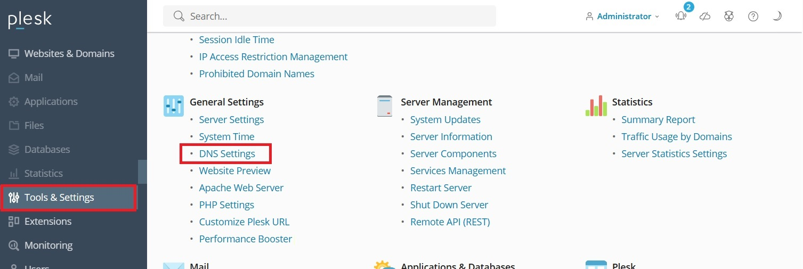
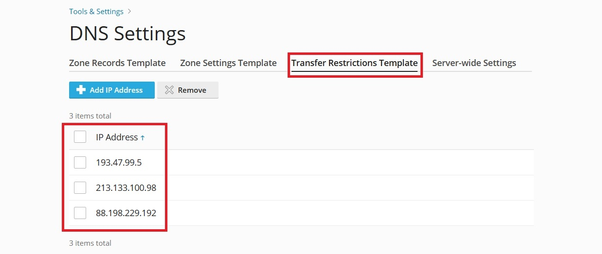
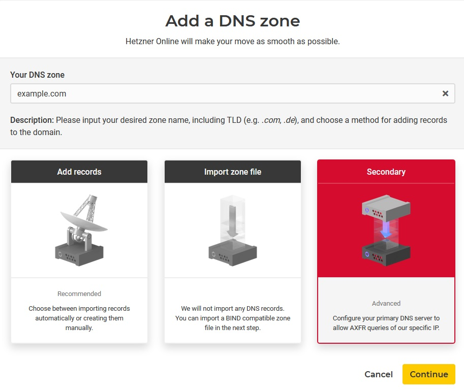
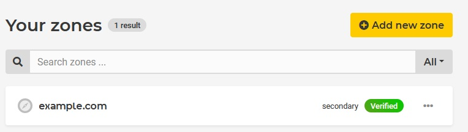

## Introduction

This tutorial describes how to connect the Hetzner DNS Management to a Plesk Server using Bind and AXFR for zone transfer.

## Step 1 - Make changes in Plesk

First, you have to allow the zone transfer to the Hetzner DNS servers and adjust your DNS template on the Plesk server.

To do so, log into your Plesk server and go to "Tools & Settings", "General Settings" ➔ "DNS Settings".



There, you need to click on the tab "Transfer Restrictions Template" and add the following 3 IPs:

* 193.47.99.5
* 213.133.100.98
* 88.198.229.192



After doing so, you need to go back to the tab "Zone Records Template" under "Tools & Settings", "General Settings" ➔ "DNS Settings".

Here, you have to click on "Add Record".

As Record Type, you have to select "NS" and as nameserver, you have to enter the 3 nameservers of Hetzner:

* helium.ns.hetzner.de
* hydrogen.ns.hetzner.com
* oxygen.ns.hetzner.com


When returning  to the main overview, make sure that you delete the 2 default NS Records. After doing so, click on "Apply the changes to all hosted domains".

Next, you need to go to the tab "Zone Settings Template" under "Tools & Settings", "General Settings" ➔ "DNS Settings".

Make sure "Use the serial number format recommended by IETF and RIPE" is checked so that DNS replication works.


## Step 2 - Add the domain to Hetzner

Sign into the [Hetzner DNS Console](https://dns.hetzner.com/).

Click on "Add new zone", type in your domain, choose "Secondary" and click on "Continue".



On the next page, select your Plesk Server in the given dropdown and confirm with "Add server" and "Continue". After this, you should be able to see that the domain was added successfully.



## Step 3 - Update your Domain

If your domain is already registered and you are using it on different nameservers, you need to update your domain at your registrar.

I highly recommend you first check that the Hetzner nameservers are answering correctly. You can check this by querying them:

```dig
> dig @oxygen.ns.hetzner.com example.com -t NS

> dig @helium.ns.hetzner.de example.com -t NS

> dig @hydrogen.ns.hetzner.com example.com -t NS
```

In all 3 cases, you should see the NS records with the nameservers of Hetzner.

```console
;; ANSWER SECTION:
example.com.     86400   IN      NS      hydrogen.ns.hetzner.com.
example.com.     86400   IN      NS      helium.ns.hetzner.de.
example.com.     86400   IN      NS      oxygen.ns.hetzner.com.
```

After you are certain all data is correct, you can update your domain at your registrar and point them to the 3 Hetzner nameservers oxygen, helium and hydrogen.

## Conclusion

You've now connected the Hetzner DNS Management to a Plesk Server.

##### License: MIT

<!--

Contributor's Certificate of Origin

By making a contribution to this project, I certify that:

(a) The contribution was created in whole or in part by me and I have
    the right to submit it under the license indicated in the file; or

(b) The contribution is based upon previous work that, to the best of my
    knowledge, is covered under an appropriate license and I have the
    right under that license to submit that work with modifications,
    whether created in whole or in part by me, under the same license
    (unless I am permitted to submit under a different license), as
    indicated in the file; or

(c) The contribution was provided directly to me by some other person
    who certified (a), (b) or (c) and I have not modified it.

(d) I understand and agree that this project and the contribution are
    public and that a record of the contribution (including all personal
    information I submit with it, including my sign-off) is maintained
    indefinitely and may be redistributed consistent with this project
    or the license(s) involved.

Signed-off-by: Christian Hillenkötter

-->
