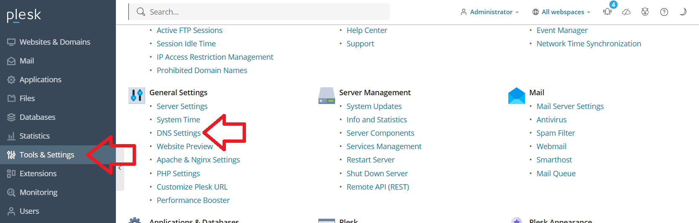
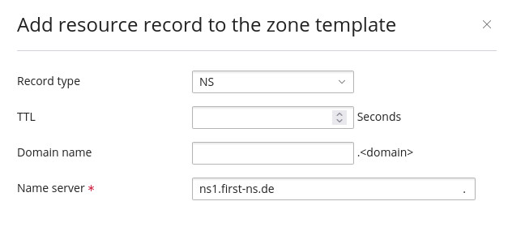

## Introduction

This tutorial describes how to connect the DNS in Hetzner Console to a Plesk Server using Bind and AXFR for zone transfer. This means, your Plesk server will act as a "hidden primary" zone. Hetzner DNS will act as a secondary DNS zone. For more information, see [this article](https://docs.hetzner.com/networking/dns/howto-secondary-zones/dns-software/).

By the end of this tutorial, your DNS setup should look like this:

<div style="display: flex; justify-content: space-between;">
<!--- First cards -->
<div class="card" style="font-size:1rem; min-width: 16rem; max-width: 16rem; width: 32%;">
     <div>
     <div class="card-header" style="font-size:1rem; text-align: left;">
     Records with domain registrar</div>
     </div>
     <div class="card-body shadow-sm" style="font-size:1rem;">
         <div class="card-header" style="font-size:1rem; text-align:center; margin-bottom: 1em;">
         <b>Delegated zone</b>
         <small><div style="display: flex; justify-content: left; text-align: left;">
         <div style="width: 20%;">NS<br></div>
         <div style="width: 20%;">@</div>
         <div style="width: 60%;"><kbd style="background-color:#e2e2e2!important;color:#000;border-radius:6px;">&lt;hetzner-1&gt;</kbd></div>
         </div></small>
         <small><div style="display: flex; justify-content: left; text-align: left;">
         <div style="width: 20%;">NS</div>
         <div style="width: 20%;">@</div>
         <div style="width: 60%;"><kbd style="background-color:#e2e2e2!important;color:#000;border-radius:6px;">&lt;hetzner-2&gt;</kbd></div>
         </div></small>
         <small><div style="display: flex; justify-content: left; text-align: left;">
         <div style="width: 20%;">NS</div>
         <div style="width: 20%;">@</div>
         <div style="width: 60%;"><kbd style="background-color:#e2e2e2!important;color:#000;border-radius:6px;">&lt;hetzner-3&gt;</kbd></div>
         </div></small>
         </div>
     </div>
     </div>
<!--- Space between both cards -->
<div style="min-width: 1rem; width: 2%;"></div>
<!--- Second cards -->
<div class="card" style="font-size:1rem; min-width: 14.5rem; max-width: 14.5rem; width: 32%;">
     <div>
     <div class="card-header" style="font-size:1rem; text-align: left;">
      Records with Plesk</div>
     </div>
     <div class="card-body shadow-sm" style="font-size:1rem;">
         <div class="card-header" style="font-size:1rem; text-align:center; margin-bottom: 1em;">
         <b>Primary zone</b>
         <small><div style="display: flex; justify-content: left; text-align: left;">
         <div style="width: 20%;">NS<br></div>
         <div style="width: 20%;">@</div>
         <div style="width: 60%;"><kbd style="background-color:#e2e2e2!important;color:#000;border-radius:6px;">&lt;hetzner-1&gt;</kbd></div>
         </div></small>
         <small><div style="display: flex; justify-content: left; text-align: left;">
         <div style="width: 20%;">NS</div>
         <div style="width: 20%;">@</div>
         <div style="width: 60%;"><kbd style="background-color:#e2e2e2!important;color:#000;border-radius:6px;">&lt;hetzner-2&gt;</kbd></div>
         </div></small>
         <small><div style="display: flex; justify-content: left; text-align: left;">
         <div style="width: 20%;">NS</div>
         <div style="width: 20%;">@</div>
         <div style="width: 60%;"><kbd style="background-color:#e2e2e2!important;color:#000;border-radius:6px;">&lt;hetzner-3&gt;</kbd></div>
         </div></small>
         <br>
         <small><div style="display: flex; justify-content: left; text-align: left;">
         <div style="width: 20%;">A</div>
         <div style="width: 20%;">@</div>
         <div style="width: 60%;">203.0.113.1</div>
         </div></small>
         <small><div style="display: flex; justify-content: left; text-align: left;">
         <div style="width: 20%;">A</div>
         <div style="width: 20%;">blog</div>
         <div style="width: 60%;">172.16.3.9</div>
         </div></small>
         <br>
         <small><div style="line-height: 1.45;display: flex; justify-content: left; text-align: left;">
         <div>All records (e.g. A, MX, etc.) are stored on the Plesk server.</div>
         </div></small>
         </div>
     </div>
     </div>
<!--- Space between both cards -->
<div style="min-width: 1rem; width: 2%;"></div>
<!--- Second cards -->
<div class="card" style="font-size:1rem; min-width: 14.5rem; max-width: 14.5rem; width: 32%;">
     <div>
     <div class="card-header" style="font-size:1rem; text-align: left;">
      Records with Hetzner</div>
     </div>
     <div class="card-body shadow-sm" style="font-size:1rem;">
         <div class="card-header" style="font-size:1rem; text-align:center; margin-bottom: 1em;">
         <b>Secondary zone</b>
         <small><div style="display: flex; justify-content: left; text-align: left;">
         <div style="width: 20%;">NS<br></div>
         <div style="width: 20%;">@</div>
         <div style="width: 60%;"><kbd style="background-color:#e2e2e2!important;color:#000;border-radius:6px;">&lt;hetzner-1&gt;</kbd></div>
         </div></small>
         <small><div style="display: flex; justify-content: left; text-align: left;">
         <div style="width: 20%;">NS</div>
         <div style="width: 20%;">@</div>
         <div style="width: 60%;"><kbd style="background-color:#e2e2e2!important;color:#000;border-radius:6px;">&lt;hetzner-2&gt;</kbd></div>
         </div></small>
         <small><div style="display: flex; justify-content: left; text-align: left;">
         <div style="width: 20%;">NS</div>
         <div style="width: 20%;">@</div>
         <div style="width: 60%;"><kbd style="background-color:#e2e2e2!important;color:#000;border-radius:6px;">&lt;hetzner-3&gt;</kbd></div>
         </div></small>
         <br>
         <small><div style="line-height: 1.45;display: flex; justify-content: left; text-align: left;">
         <div>All other records (e.g. A, MX, etc.) are transferred via AXFR from the Plesk server (primary zone) to this secondary 
              zone.</div>
         </div></small>
         </div>
     </div>
     </div>
</div>

<br>

If the Plesk installation was done via Hetzner's Robot administration interface, it is very likely, that this configuration has already been applied.

## Step 1 - Make changes in Plesk

First, you have to allow the zone transfer to the Hetzner DNS servers and adjust your DNS template on the Plesk server.

To do so, log into your Plesk server and go to "Tools & Settings" » "General Settings" » "DNS Settings".



There, you need to click on the tab "Transfer Restrictions Template". It controls which IPs can request a zone transfer (AXFR). Add the following IPv4s. If you like to use IPv6 for zone transfer, you should also add the following IP6s. Those are the IPs of Hetzner's [secondary name servers](https://docs.hetzner.com/networking/dns/overview#authoritative-name-servers).

| Name server             | IPv4 address    | IPv6 address          |
| ----------------------- | --------------- | --------------------- |
| ns1.first-ns.de.        | 213.239.242.238 | 2a01:4f8:0:a101::a:1  |
| robotns2.second-ns.de.  | 213.133.100.103 | 2a01:4f8:0:1::5ddc:2  |
| robotns3.second-ns.com. | 193.47.99.3     | 2001:67c:192c::add:a3 |


After doing so, stay in "Tools & Settings" » "General Settings" » "DNS Settings" but switch back to the tab "Zone Records Template".

Here, you have to click on "Add Record".

As Record Type, you have to select "NS" and as nameserver, you have to enter Hetzner's 3 secondary name servers:

* ns1.first-ns.de
* robotns2.second-ns.de
* robotns3.second-ns.com



When returning  to the main overview, make sure that you delete the 2 default NS Records. After doing so, click on "Apply the changes to all hosted domains".

Next, stay in "Tools & Settings" » "General Settings" » "DNS Settings" again but switch to the tab "Zone Settings Template".

Make sure "Use the serial number format recommended by IETF and RIPE" is checked so that DNS replication works.


## Step 2 - Add the domain to Hetzner

Sign into the [Hetzner Console](https://console.hetzner.com/).

Select your project and click on "DNS" in the left menu bar. 

* Click "Add DNS zone"
* Enter your domain
* Select `Secondary` and click on "Continue".


On the next page, enter the IP address of your Plesk Server. Confirm with "Add". When the IP is listed in "PRIMARY NAMESERVERS", click on "Add DNS zone". After this, you should be able to see that the domain was added successfully.


## Step 3 - Update your Domain

If your domain is already registered and you are using it on different nameservers, you need to update your domain at your registrar.

I highly recommend you first check that the Hetzner nameservers are answering correctly. You can check this by querying them:

```bash
dig @ns1.first-ns.de example.com -t NS
dig @robotns2.second-ns.de example.com -t NS
dig @robotns3.second-ns.com example.com -t NS
```

In all 3 cases, you should see the NS records with the nameservers of Hetzner.

```shellsession
;; ANSWER SECTION:
example.com.     86400   IN      NS      ns1.first-ns.de.
example.com.     86400   IN      NS      robotns2.second-ns.de.
example.com.     86400   IN      NS      robotns3.second-ns.com.
```

After you are certain all data is correct, you can update your domain at your registrar and point them to Hetzner's 3 secondary name servers `ns1.first-ns.de`, `robotns2.second-ns.de` and `robotns3.second-ns.com`.

## Conclusion

You've now connected DNS in Hetzner Console to a Plesk Server.

Additional links to Hetzner's official documentation:

* [Hetzner autoritative Nameserver » Secondary DNS servers](https://docs.hetzner.com/networking/dns/overview#authoritative-name-servers)
* [Plesk » Using the Hetzner name servers](https://docs.hetzner.com/robot/dedicated-server/operating-systems/plesk/#using-the-hetzner-name-servers)
* [Secondary DNS (general documentation)](https://docs.hetzner.com/networking/dns/howto-secondary-zones/dns-software)

##### License: MIT

<!--

Contributor's Certificate of Origin

By making a contribution to this project, I certify that:

(a) The contribution was created in whole or in part by me and I have
    the right to submit it under the license indicated in the file; or

(b) The contribution is based upon previous work that, to the best of my
    knowledge, is covered under an appropriate license and I have the
    right under that license to submit that work with modifications,
    whether created in whole or in part by me, under the same license
    (unless I am permitted to submit under a different license), as
    indicated in the file; or

(c) The contribution was provided directly to me by some other person
    who certified (a), (b) or (c) and I have not modified it.

(d) I understand and agree that this project and the contribution are
    public and that a record of the contribution (including all personal
    information I submit with it, including my sign-off) is maintained
    indefinitely and may be redistributed consistent with this project
    or the license(s) involved.

Signed-off-by: Christian Hillenkötter

-->
