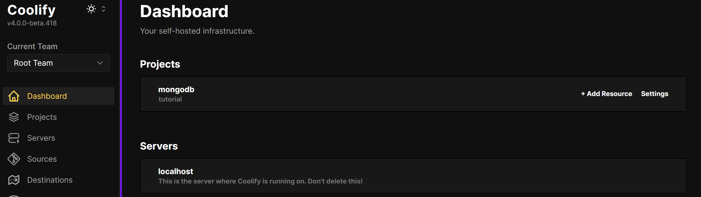
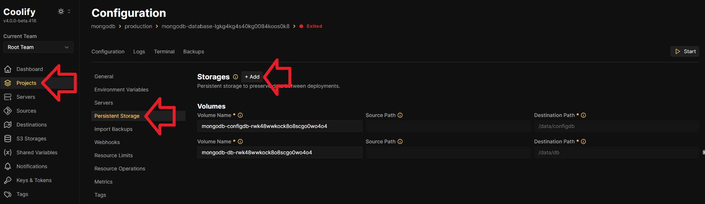
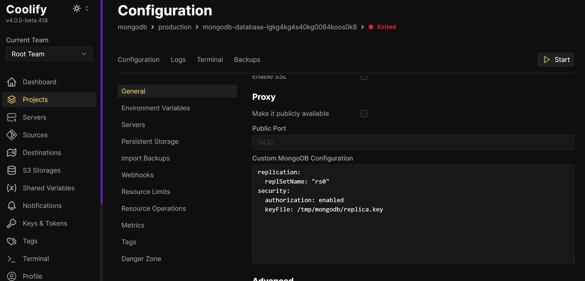

## Introduction

If you're using **Prisma ORM** with **MongoDB**, you may encounter an unexpected blocker: Prisma **requires MongoDB to be part of a replica set** — even if you're only running a single-node deployment. This requirement is non-negotiable, and without a replica set, Prisma simply won't work with MongoDB.

In this article, we’ll walk you through how to **enable a single-node replica set** on a MongoDB instance hosted via **Coolify** on your VPS. This is the simplest workaround for Prisma’s replica set dependency when you're not running a full production-ready MongoDB cluster.

**Why Prisma Requires a Replica Set**

Prisma uses features like transactions and change streams, which require MongoDB to be deployed as a replica set — even if you’re using just one node. This doesn’t mean you have to set up multiple MongoDB instances; you can configure a **replica set on a single-node** MongoDB server to satisfy Prisma’s requirements.

**Prerequisites**

* Coolify is already installed (see [this tutorial](https://community.hetzner.com/tutorials/install-and-configure-coolify-on-linux))
* You've deployed a [MongoDB](https://coolify.io/docs/databases/#deploy-a-database) database
* Your app uses [Prisma](https://www.prisma.io/)

## Step 1 - Access Your Coolify Dashboard

Log into your Coolify instance.

You should have a project with a MongoDB resource and a server where Coolify is running on.



## Step 2 - Generate a Secure Keyfile

The replica set requires a shared keyfile for internal authentication, even if it's just one node.

1. In the dashboard, select the server **where Coolify itself is running**.
2. Switch to the terminal tab.
3. Run the following command to generate a 741-byte base64 key:

   ```bash
   openssl rand -base64 741
   ```

4. Create a new file:

   ```bash
   nano keyfile-mongo
   ```

5. Paste the generated key and save the file.
6. Secure the keyfile with proper permissions:

   ```bash
   chmod 400 keyfile-mongo
   chown 999:999 keyfile-mongo
   ```

7. Create a directory to store the keyfile and move it there:

   ```bash
   mkdir -p /root/replica
   mv keyfile-mongo /root/replica/replica.key
   ```

## Step 3 - Mount the Keyfile in Your MongoDB Instance

1. In the Coolify dashboard, select the project with MongoDB and open your MongoDB instance.
2. Go to **Persistent Storage**.
3. Click **+ Add** to add a new volume:

   - **Name**: `replica`
   - **Source Path**: `/root/replica`
   - **Destination Path**: `/tmp/mongodb`

This mounts your keyfile inside the MongoDB container.



## Step 4 - Update the MongoDB Configuration

1. Go to the **General** tab for your MongoDB instance.
2. Scroll down to **Custom MongoDB Configuration**, and enter:

   ```yaml
   replication:
     replSetName: "rs0"
   security:
     authorization: enabled
     keyFile: /tmp/mongodb/replica.key
   ```
   
   

## Step 5 - Enable Replica Set Initialization

1. Start your MongoDB instance.
1. Go to the **Terminal** tab for your MongoDB instance.
3. Connect to the MongoDB server:
   ```bash
   mongosh -u root -p <mongodb_password> --authenticationDatabase admin
   ```
4. Now run:
   
   > Replace `27017` with the port of your MongoDB instance.
   
   ```js
   rs.initiate({
     _id: "rs0",
     members: [{ _id: 0, host: "localhost:27017" }],
   });
   ```

3. Save and restart your MongoDB service.

## Step 6 - Testing the Setup

After restarting MongoDB:

1. Connect to the MongoDB server:
   ```bash
   mongosh -u root -p <mongodb_password> --authenticationDatabase admin
   ```

2. Run:
   ```js
   rs.status();
   ```

3. Confirm that the replica set is active.
4. Test your Prisma application to ensure the connection works.

## Step 7 - Production Considerations (Optional)

This tutorial sets up a **single-node replica set** to satisfy Prisma’s requirements. For high availability and production-grade environments, consider setting up a **three-node replica set** across separate containers or servers.

## Conclusion

You've now configured MongoDB with a **single-node replica set** in Coolify, ensuring full compatibility with Prisma ORM — without the complexity of managing multiple MongoDB instances. This setup is ideal for local development, staging, or lightweight production use cases.

When you're ready to scale, transitioning to a true multi-node replica set will be straightforward.

##### License: MIT

<!--

Contributor's Certificate of Origin

By making a contribution to this project, I certify that:

(a) The contribution was created in whole or in part by me and I have
    the right to submit it under the license indicated in the file; or

(b) The contribution is based upon previous work that, to the best of my
    knowledge, is covered under an appropriate license and I have the
    right under that license to submit that work with modifications,
    whether created in whole or in part by me, under the same license
    (unless I am permitted to submit under a different license), as
    indicated in the file; or

(c) The contribution was provided directly to me by some other person
    who certified (a), (b) or (c) and I have not modified it.

(d) I understand and agree that this project and the contribution are
    public and that a record of the contribution (including all personal
    information I submit with it, including my sign-off) is maintained
    indefinitely and may be redistributed consistent with this project
    or the license(s) involved.

Signed-off-by: [Satish <satish@technotip.org>]

-->
